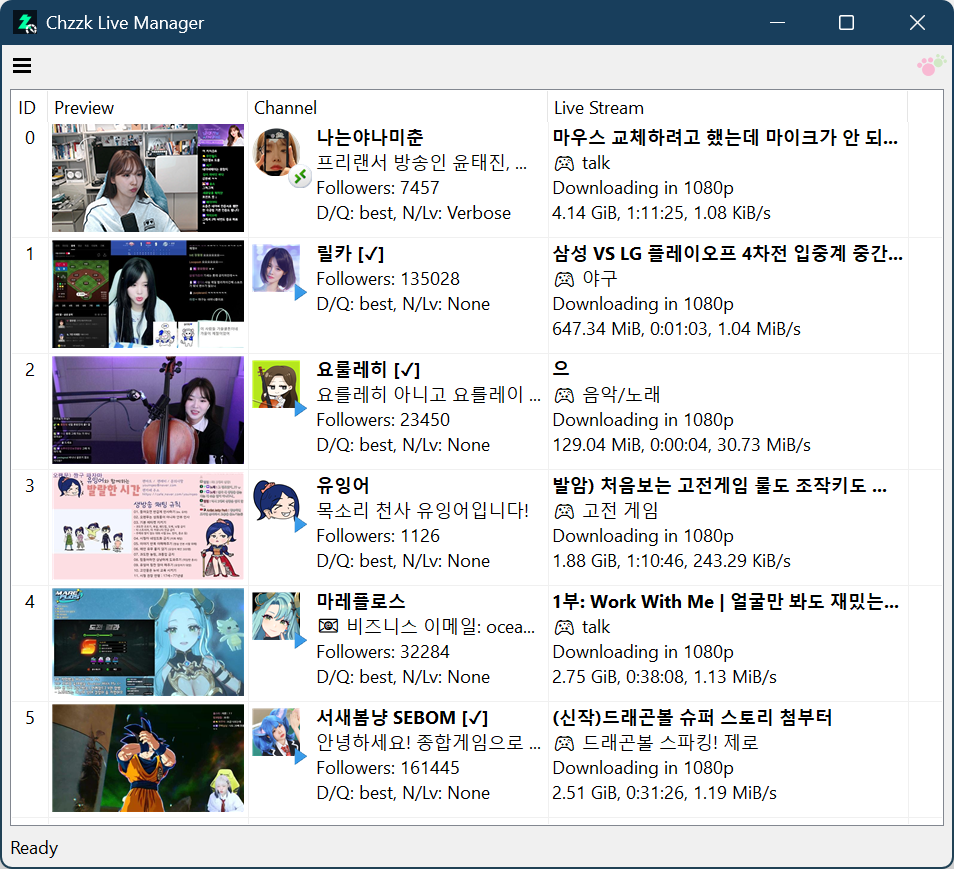
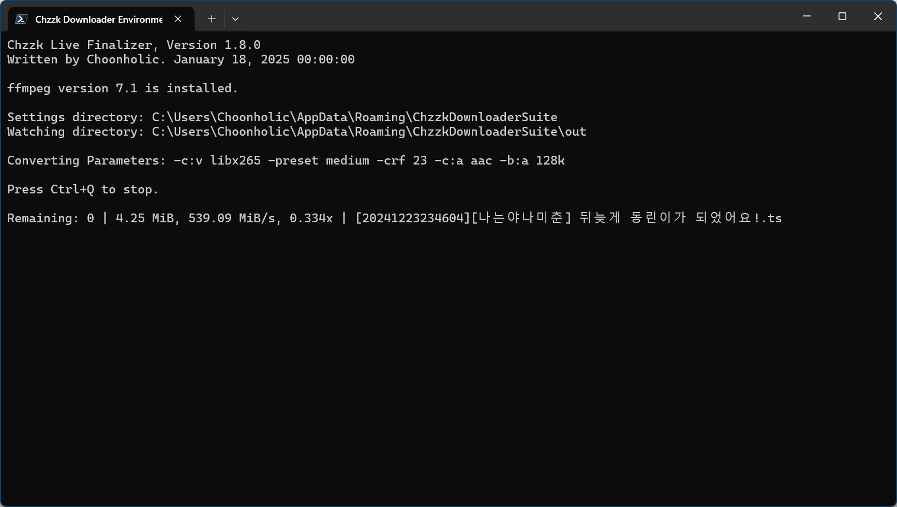
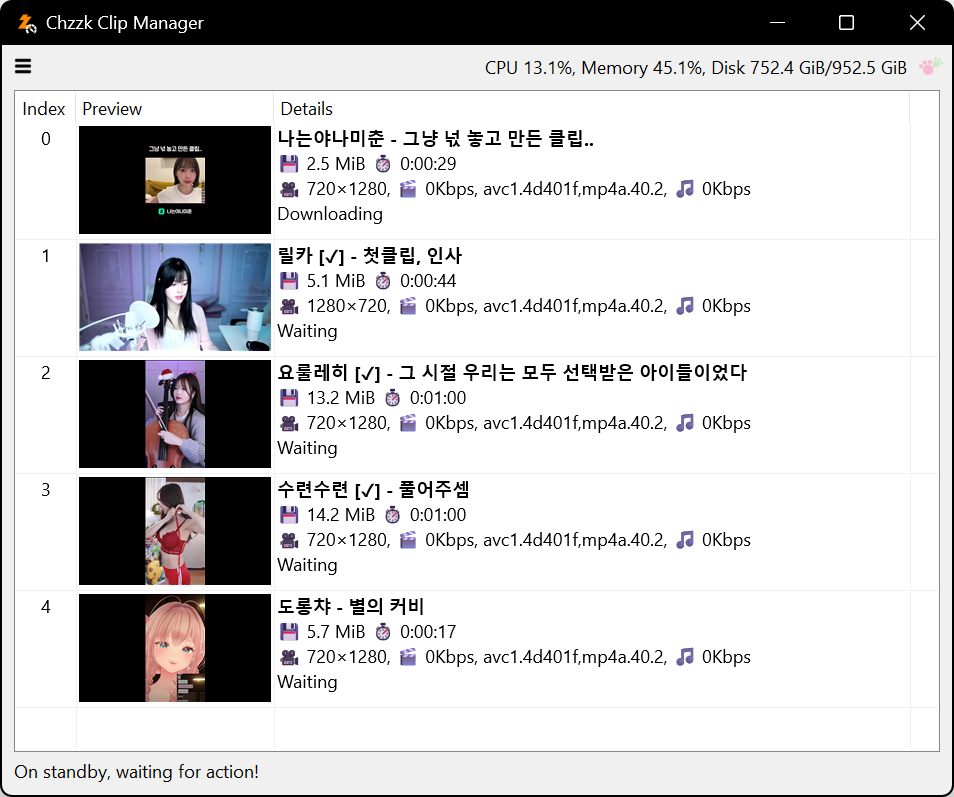

# Chzzk Downloader Suite
Downloader for live streams, replay videos and clips of Chzzk.

## Downloads
* https://github.com/Choonholic/ChzzkDownloader/releases/latest
* https://blog.choonholic.com/downloads

## Chzzk Live Downloader
Downloader for Chzzk live streams

<div style='text-align: center'>

<p><i>(This image may not reflect the latest information.)</i></p>
</div>

## Version
Version 1.6.0, January 03, 2025 10:00:00

### Prerequisites For Executables
* **[Mandatory]** Latest version of FFmpeg. (Requires FFmpeg 7.0 or higher)
* **[Mandatory]** Latest version of Streamlink. (Requires Streamlink 6.7.3 or higher)

### Usage
```powershell
ChzzkLiveDownloader [-h] [--version] [-i ID] [-u [UID]] [-a [AUTH]] [--authaut AUTHAUT]
                    [--authses AUTHSES] [--adult [ADULT]] [-y] [-q [QUALITY]] [-d [DISPLAY]]
                    [--once ONCE] [--stream [STREAM]] [--final [FINAL]] [--custom [CUSTOM]]
                    [--offset OFFSET] [--duration DURATION] [--detect [DETECT]] [--name [NAME]]
                    [--work [WORK]] [--work-user [WORK_USER]] [--work-pass [WORK_PASS]]
                    [--out [OUT]] [--out-user [OUT_USER]] [--out-pass [OUT_PASS]] [--temp [TEMP]]
                    [--temp-user [TEMP_USER]] [--temp-pass [TEMP_PASS]] [--category [CATEGORY]]
                    [--exist [EXIST]] [--threshold [THRESHOLD]] [--rpcbaseport [RPCPORT]]
                    [--snapshot SNAPSHOT] [--thumb [THUMB]] [--startup [STARTUP]]
                    [--settings [SETTINGS]] [--reset]
```

### Options
```
-h, --help              Show this help message
--version               Show version information
-i, --id ID             Set streamer configuration id (default: 0)
-u, --uid [UID]         Set streamer unique identifier
-a, --auth [AUTH]       Set Chzzk authentication credential control method (reuse|reissue|ignore)
--authaut AUTHAUT       Set auth key of Chzzk authentication credential
--authses AUTHSES       Set session key of Chzzk authentication credential
--adult [ADULT]         Set the process method for adult contents when credentials are invalid (ask|skip)
-y, --yes               Set any confirmation values to 'yes' automatically
-q, --quality [QUALITY] Set target quality to download (e.g. 1080p)
-d, --display [DISPLAY] Set download status display mode (quiet|simple|fluent|all)
--once ONCE             Download a live stream only once
--stream [STREAM]       Set stream retrieving method (standard|timemachine)
--final [FINAL]         Set finalization method (bypass|convert|cleanup|cconvert|ccleanup)
--custom [CUSTOM]       Set custom finalize options (applicable only to cconvert|ccleanup)
--offset OFFSET         Set amount of time to skip from the beginning of the stream
--duration DURATION     Set the maximum stream duration to download
--detect [DETECT]       Set detection interval (default: 60, 1-600)
--name [NAME]           Set output filename format
--work [WORK]           Set working directory
--work-user [WORK_USER] Set username to use when working directory is on remote network
--work-pass [WORK_PASS] Set password to use when working directory is on remote network
--out [OUT]             Set output directory
--out-user [OUT_USER]   Set username to use when output directory is on remote network
--out-pass [OUT_PASS]   Set password to use when output directory is on remote network
--temp [TEMP]           Set temporary directory
--temp-user [TEMP_USER] Set username to use when temporary directory is on remote network
--temp-pass [TEMP_PASS] Set password to use when temporary directory is on remote network
--category [CATEGORY]   Set output categorize method (none|streamer)
--exist [EXIST]         Set how to save when the target file already exists (rename|skip|overwrite)
--threshold [THRESHOLD] Set the threshold % for stopping downloads when disk space is low (disable: -, default: 10, 3-30)
--rpcbaseport [RPCPORT] Set base port of JSON-RPC server (default: 62000, 49152-65300)
--snapshot SNAPSHOT     Save snapshot to a JSON file whenever changing status
--thumb [THUMB]         Save thumbnail image or skip (save|skip)
--startup [STARTUP]     Set startup method (normal|fast)
--settings [SETTINGS]   Set action when saving settings (default|skip|quit)
--reset                 Reset all settings
```

### Example
```powershell
ChzzkLiveDownloader -i 2 --thumb save --detect 30 --work work --out out --temp temp
```

## Chzzk Live Finalizer
Finalizer for Chzzk live streams

<div style='text-align: center'>

<p><i>(This image may not reflect the latest information.)</i></p>
</div>

## Version
Version 1.6.0, January 03, 2025 10:00:00

### Usage
```powershell
ChzzkLiveFinalizer [-h] [--version] [-d [DISPLAY]] [--work [WORK]] [--work-user [WORK_USER]]
                   [--work-pass [WORK_PASS]] [--watch [WATCH]] [--watch-user [WATCH_USER]]
                   [--watch-pass [WATCH_PASS]] [--convert [CONVERT]] [--exist [EXIST]]
                   [--threshold [THRESHOLD]] [--rpcid [RPCID]] [--rpcport [RPCPORT]]
                   [--snapshot SNAPSHOT] [--startup [STARTUP]] [--settings [SETTINGS]] [--reset]
```

### Options
```
-h, --help                Show this help message
--version                 Show version information
-d, --display [DISPLAY]   Set process status display mode (quiet|simple|fluent|all)
--work [WORK]             Set working directory
--work-user [WORK_USER]   Set username to use when working directory is on remote network
--work-pass [WORK_PASS]   Set password to use when working directory is on remote network
--watch [WATCH]           Set watching directory
--watch-user [WATCH_USER] Set username to use when watching directory is on remote network
--watch-pass [WATCH_PASS] Set password to use when watching directory is on remote network
--convert [CONVERT]       Set convert parameters
--exist [EXIST]           Set how to save when the target file already exists (rename|skip|overwrite)
--threshold [THRESHOLD]   Set the threshold % for stopping downloads when disk space is low (disable: -, default: 10, 3-30)
--rpcid [RPCID]           Set ID of JSON-RPC server (default: 70)
--rpcport [RPCPORT]       Set port of JSON-RPC server (default: 65000, 49152-65300)
--snapshot SNAPSHOT       Save snapshot to a JSON file whenever changing status
--startup [STARTUP]       Set startup method (normal|fast)
--settings [SETTINGS]     Set action when saving settings (default|skip|quit)
--reset                   Reset all settings
```

### Example
```powershell
ChzzkLiveFinalizer --work work --watch out
```

## Chzzk Video Downloader
Downloader for Chzzk replay videos

<div style='text-align: center'>

<p><i>(This image may not reflect the latest information.)</i></p>
</div>

## Version
Version 1.6.0, January 03, 2025 10:00:00

### Usage
```powershell
ChzzkVideoDownloader [-h] [--version] [-i INPUT] [-a [AUTH]] [--authaut AUTHAUT] [--authses AUTHSES]
                     [--adult [ADULT]] [-y] [-q [QUALITY]] [-d [DISPLAY]] [--info INFO]
                     [--name [NAME]] [--work [WORK]] [--work-user [WORK_USER]]
                     [--work-pass [WORK_PASS]] [--out [OUT]] [--out-user [OUT_USER]]
                     [--out-pass [OUT_PASS]] [--temp [TEMP]] [--temp-user [TEMP_USER]]
                     [--temp-pass [TEMP_PASS]] [--category [CATEGORY]] [--exist [EXIST]]
                     [--threshold [THRESHOLD]] [--rpcid [RPCID]] [--rpcport [RPCPORT]]
                     [--snapshot SNAPSHOT] [--download [DOWNLOAD]] [--thumb [THUMB]]
                     [--startup [STARTUP]] [--settings [SETTINGS]] [--reset]
                     [video]
```

### Positional Arguments
```
video                   Video number or URL to download
```

### Options
```
-h, --help              Show this help message
--version               Show version information
-i, --input INPUT       Set the download list file
-a, --auth [AUTH]       Set Chzzk authentication credential control method (reuse|reissue|ignore)
--authaut AUTHAUT       Set auth key of Chzzk authentication credential
--authses AUTHSES       Set session key of Chzzk authentication credential
--adult [ADULT]         Set the process method for adult contents when credentials are invalid (ask|skip)
-y, --yes               Set any confirmation values to 'yes' automatically
-q, --quality [QUALITY] Set target quality to download (e.g. 1080p)
-d, --display [DISPLAY] Set download status display mode (quiet|simple|fluent|all)
--info INFO             Retrieve video information without downloading
--name [NAME]           Set output filename format
--work [WORK]           Set working directory
--work-user [WORK_USER] Set username to use when working directory is on remote network
--work-pass [WORK_PASS] Set password to use when working directory is on remote network
--out [OUT]             Set output directory
--out-user [OUT_USER]   Set username to use when output directory is on remote network
--out-pass [OUT_PASS]   Set password to use when output directory is on remote network
--temp [TEMP]           Set temporary directory
--temp-user [TEMP_USER] Set username to use when temporary directory is on remote network
--temp-pass [TEMP_PASS] Set password to use when temporary directory is on remote network
--category [CATEGORY]   Set output categorize method (none|streamer)
--exist [EXIST]         Set how to save when the target file already exists (rename|skip|overwrite)
--threshold [THRESHOLD] Set the threshold % for stopping downloads when disk space is low (disable: -, default: 10, 3-30)
--rpcid [RPCID]         Set ID of JSON-RPC server (default: 30)
--rpcport [RPCPORT]     Set port of JSON-RPC server (default: 63000, 49152-65300)
--snapshot SNAPSHOT     Save snapshot to a JSON file whenever changing status
--download [DOWNLOAD]   Set download method (default|atxc|alter)
--thumb [THUMB]         Save thumbnail image or skip (save|skip)
--startup [STARTUP]     Set startup method (normal|fast)
--settings [SETTINGS]   Set action when saving settings (default|skip|quit)
--reset                 Reset all settings
```

### Example
```powershell
ChzzkVideoDownloader 1602969 --thumb save --work work --out out --temp temp
```

## Chzzk Clip Downloader
Downloader for Chzzk clips

<div style='text-align: center'>

<p><i>(This image may not reflect the latest information.)</i></p>
</div>

## Version
Version 1.6.0, January 03, 2025 10:00:00

### Usage
```powershell
ChzzkClipDownloader [-h] [--version] [-i INPUT] [-a [AUTH]] [--authaut AUTHAUT] [--authses AUTHSES]
                    [--adult [ADULT]] [-y] [-d [DISPLAY]] [--info INFO] [--name [NAME]]
                    [--work [WORK]] [--work-user [WORK_USER]] [--work-pass [WORK_PASS]]
                    [--out [OUT]] [--out-user [OUT_USER]] [--out-pass [OUT_PASS]] [--temp [TEMP]]
                    [--temp-user [TEMP_USER]] [--temp-pass [TEMP_PASS]] [--category [CATEGORY]]
                    [--exist [EXIST]] [--threshold [THRESHOLD]] [--rpcid [RPCID]]
                    [--rpcport [RPCPORT]] [--snapshot SNAPSHOT] [--download [DOWNLOAD]]
                    [--thumb [THUMB]] [--startup [STARTUP]] [--settings [SETTINGS]] [--reset]
                    [clip]
```

### Positional Arguments
```
clip                    Clip UID or URL to download
```

### Options
```
-h, --help              Show this help message
--version               Show version information
-i, --input INPUT       Set the download list file
-a, --auth [AUTH]       Set Chzzk authentication credential control method (reuse|reissue|ignore)
--authaut AUTHAUT       Set auth key of Chzzk authentication credential
--authses AUTHSES       Set session key of Chzzk authentication credential
--adult [ADULT]         Set the process method for adult contents when credentials are invalid (ask|skip)
-y, --yes               Set any confirmation values to 'yes' automatically
-d, --display [DISPLAY] Set download status display mode (quiet|simple|fluent|all)
--info INFO             Retrieve clip information without downloading
--name [NAME]           Set output filename format
--work [WORK]           Set working directory
--work-user [WORK_USER] Set username to use when working directory is on remote network
--work-pass [WORK_PASS] Set password to use when working directory is on remote network
--out [OUT]             Set output directory
--out-user [OUT_USER]   Set username to use when output directory is on remote network
--out-pass [OUT_PASS]   Set password to use when output directory is on remote network
--temp [TEMP]           Set temporary directory
--temp-user [TEMP_USER] Set username to use when temporary directory is on remote network
--temp-pass [TEMP_PASS] Set password to use when temporary directory is on remote network
--category [CATEGORY]   Set output categorize method (none|streamer)
--exist [EXIST]         Set how to save when the target file already exists (rename|skip|overwrite)
--threshold [THRESHOLD] Set the threshold % for stopping downloads when disk space is low (disable: -, default: 10, 3-30)
--rpcid [RPCID]         Set ID of JSON-RPC server (default: 50)
--rpcport [RPCPORT]     Set port of JSON-RPC server (default: 64000, 49152-65300)
--snapshot SNAPSHOT     Save snapshot to a JSON file whenever changing status
--download [DOWNLOAD]   Set download method (default|atxc|alter)
--thumb [THUMB]         Save thumbnail image or skip (save|skip)
--startup [STARTUP]     Set startup method (normal|fast)
--settings [SETTINGS]   Set action when saving settings (default|skip|quit)
--reset                 Reset all settings
```

### Example
```powershell
ChzzkClipDownloader C46IcpG11p --thumb save --work work --out out --temp temp
```
## Changelogs
Please kindly read [Release Notes](https://blog.choonholic.com/archives/3216).

## Credits
Please kindly read [CREDITS](./CREDITS.md).

## Author
Please kindly read [AUTHORS](./AUTHORS.md).
