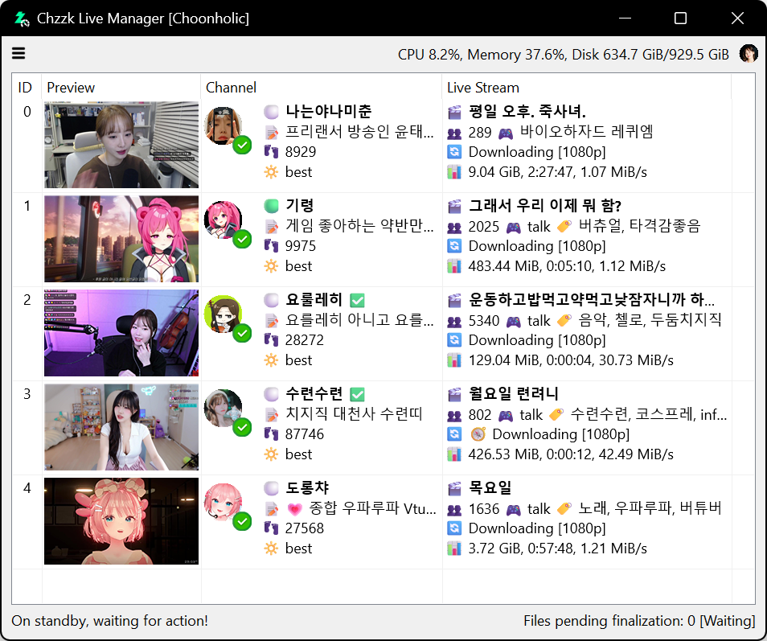
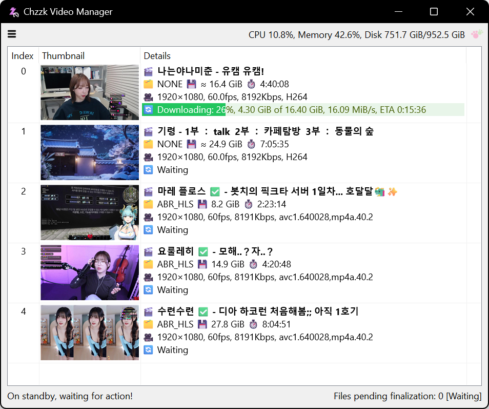
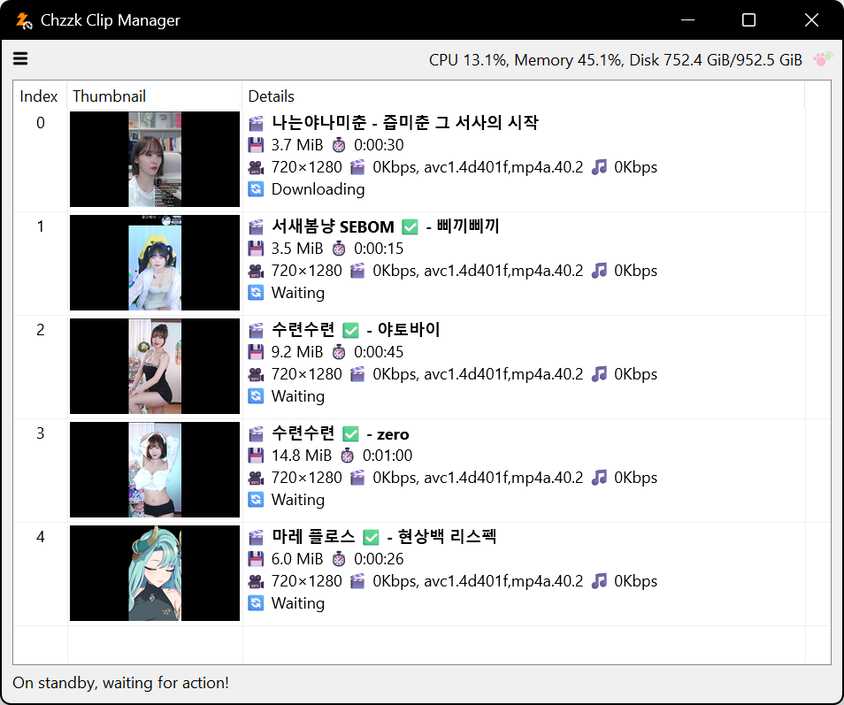
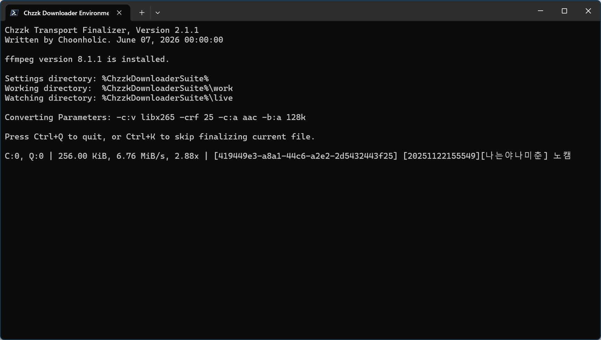

# Chzzk Downloader Suite
Downloader for live streams, replay videos and clips of Chzzk.

---

## Downloads
- https://github.com/Choonholic/ChzzkDownloader/releases/latest
- https://blog.choonholic.com/downloads

---

## Chzzk Live Downloader / Chzzk Live Manager
Downloader for Chzzk live streams

<div style='text-align: center'>

<p><i>(This image may not reflect the latest information.)</i></p>
</div>

## Version
Version 2.1.0, May 31, 2026 00:00:00

### Prerequisites For Executables
- **[Mandatory]** Streamlink (Requires Streamlink 7.0.0 or higher)
- **[Mandatory]** The official major versions of FFmpeg (Requires FFmpeg 7.0 or higher)

### Usage
```
ChzzkLiveDownloader [options]
```

### Options
Use `-h detailed` to show detailed help for all options.

#### Arguments
```
-i, --id ID             Set streamer configuration ID
-u, --uid [UID]         Set streamer unique identifier
```

#### General
```
-h, --help              Show help information
-v, --version           Show version information
-y, --yes               Answer all confirmations with 'yes' automatically
-d, --display [MODE]    Set display mode
```

#### Authentication
```
-a, --auth [AUTH]       Set authentication credential control method
--authaut AUTHAUT       Set auth key of authentication credential
--authses AUTHSES       Set session key of authentication credential
--authcookie COOKIE     Set Netscape cookie file of authentication credential
--adult [ADULT]         Set handling method for adult contents when credentials are invalid
```

#### Stream
```
-f, --filter [FILTER]   Set download filter
-q, --quality [QUALITY] Set target quality to download
--once URL              Download a live stream only once
--stream [STREAM]       Set stream retrieving method
--offset OFFSET         Set amount of time to skip from the beginning of the stream
--duration DURATION     Set maximum stream duration to download
--detect [DETECT]       Set detection interval
--partytag [TAG]        Set party tag for 'party' filter
```

#### Finalization
```
--final [FINAL]         Set finalization method
--custom [CUSTOM]       Set custom finalize options
--ext [EXT]             Set output file extension
```

### Directories
```
--work [WORK]           Set working directory
--work-user [USER]      Set username for remote working directory
--work-pass [PASS]      Set password for remote working directory
--out [OUT]             Set output directory
--out-user [USER]       Set username for remote output directory
--out-pass [PASS]       Set password for remote output directory
--temp [TEMP]           Set temporary directory
--temp-user [USER]      Set username for remote temporary directory
--temp-pass [PASS]      Set password for remote temporary directory
```

#### Output
```
--name [NAME]           Set output filename format
--category [CATEGORY]   Set output categorize method
--exist [EXIST]         Set save method when the target file already exists
--threshold [THRESHOLD] Set low disk space threshold
--thumb [THUMB]         Save thumbnail image or skip
```

#### Metadata
```
--metadata [METADATA]   Save metadata or skip
```

#### RPC
```
--rpc                   Activate JSON-RPC server
--rpcexpose [EXPOSE]    Set JSON-RPC server exposure method
--snapshot SNAPSHOT     Save snapshot to a JSON file whenever changing status
--rpcbaseport [PORT]    Set base port of JSON-RPC server
```

#### Plugin
```
--pnpath [PATH]         Set path to notification plugin
--pnlanguage [LANGUAGE] Set language used by notification plugin
--pnparams [PARAMS]     Set parameters for notification plugin
--pntexttype [TYPE]     Set text format used by notification plugin
```

#### Settings
```
--startup [STARTUP]     Set startup method
--settings [SETTINGS]   Set action when saving settings
--reset                 Reset all settings
```

### Example
```powershell
ChzzkLiveDownloader -i 2 --thumb save --detect 30 --work work --out out --temp temp
```

---

## Chzzk Video Downloader / Chzzk Video Manager
Downloader for Chzzk replay videos

<div style='text-align: center'>

<p><i>(This image may not reflect the latest information.)</i></p>
</div>

## Version
Version 2.1.0, May 31, 2026 00:00:00

### Prerequisites For Executables
- **[Mandatory]** Streamlink (Requires Streamlink 7.0.0 or higher)
- **[Mandatory]** The official major versions of FFmpeg (Requires FFmpeg 7.0 or higher)

### Usage
```
ChzzkVideoDownloader [options] video
```

### Options
Use `-h detailed` to show detailed help for all options.

#### Arguments
```
video                   Video number or URL to download
-i, --input INPUT       Set download list file
```

#### General
```
-h, --help              Show help information
-v, --version           Show version information
-y, --yes               Answer all confirmations with 'yes' automatically
-d, --display [MODE]    Set display mode
```

#### Authentication
```
-a, --auth [AUTH]       Set authentication credential control method
--authaut AUTHAUT       Set auth key of authentication credential
--authses AUTHSES       Set session key of authentication credential
--authcookie COOKIE     Set Netscape cookie file of authentication credential
--adult [ADULT]         Set handling method for adult contents when credentials are invalid
```

#### Download
```
-q, --quality [QUALITY] Set target quality to download
--final [FINAL]         Set finalization method
--custom [CUSTOM]       Set custom finalize options
--ext [EXT]             Set output file extension
--download [DOWNLOAD]   Set download method
--limit [LIMIT]         Set max download speed
```

#### Directories
```
--work [WORK]           Set working directory
--work-user [USER]      Set username for remote working directory
--work-pass [PASS]      Set password for remote working directory
--out [OUT]             Set output directory
--out-user [USER]       Set username for remote output directory
--out-pass [PASS]       Set password for remote output directory
--temp [TEMP]           Set temporary directory
--temp-user [USER]      Set username for remote temporary directory
--temp-pass [PASS]      Set password for remote temporary directory
```

#### Output
```
--name [NAME]           Set output filename format
--category [CATEGORY]   Set output categorize method
--exist [EXIST]         Set save method when the target file already exists
--threshold [THRESHOLD] Set low disk space threshold
--thumb [THUMB]         Save thumbnail image or skip
```

#### Metadata
```
--metadata [METADATA]   Save metadata or skip
```

#### RPC
```
--rpc                   Activate JSON-RPC server
--rpcexpose [EXPOSE]    Set JSON-RPC server exposure method
--snapshot SNAPSHOT     Save snapshot to a JSON file whenever changing status
--rpcport [PORT]        Set JSON-RPC server port
--rpcid [ID]            Set JSON-RPC server ID
```

#### Plugin
```
--pnpath [PATH]         Set path to notification plugin
--pnlanguage [LANGUAGE] Set language used by notification plugin
--pnparams [PARAMS]     Set parameters for notification plugin
--pntexttype [TYPE]     Set text format used by notification plugin
```

#### Settings
```
--startup [STARTUP]     Set startup method
--settings [SETTINGS]   Set action when saving settings
--reset                 Reset all settings
```

### Example
```powershell
ChzzkVideoDownloader 1602969 --thumb save --work work --out out --temp temp
```

---

## Chzzk Clip Downloader / Chzzk Clip Manager
Downloader for Chzzk clips

<div style='text-align: center'>

<p><i>(This image may not reflect the latest information.)</i></p>
</div>

## Version
Version 2.1.0, May 31, 2026 00:00:00

### Prerequisites For Executables
- **[Mandatory]** The official major versions of FFmpeg (Requires FFmpeg 7.0 or higher)

### Usage
```
ChzzkClipDownloader [options] clip
```

### Options
Use `-h detailed` to show detailed help for all options.

#### Arguments
```
clip                    Clip UID or URL to download
-i, --input INPUT       Set download list file
```

#### General
```
-h, --help              Show help information
-v, --version           Show version information
-y, --yes               Answer all confirmations with 'yes' automatically
-d, --display [MODE]    Set display mode
```

#### Authentication
```
-a, --auth [AUTH]       Set authentication credential control method
--authaut AUTHAUT       Set auth key of authentication credential
--authses AUTHSES       Set session key of authentication credential
--authcookie COOKIE     Set Netscape cookie file of authentication credential
--adult [ADULT]         Set handling method for adult contents when credentials are invalid
```

#### Download
```
--download [DOWNLOAD]   Set download method
--limit [LIMIT]         Set max download speed
```

#### Directories
```
--work [WORK]           Set working directory
--work-user [USER]      Set username for remote working directory
--work-pass [PASS]      Set password for remote working directory
--out [OUT]             Set output directory
--out-user [USER]       Set username for remote output directory
--out-pass [PASS]       Set password for remote output directory
--temp [TEMP]           Set temporary directory
--temp-user [USER]      Set username for remote temporary directory
--temp-pass [PASS]      Set password for remote temporary directory
```

#### Output
```
--name [NAME]           Set output filename format
--category [CATEGORY]   Set output categorize method
--exist [EXIST]         Set save method when the target file already exists
--threshold [THRESHOLD] Set low disk space threshold
--thumb [THUMB]         Save thumbnail image or skip
```

#### Metadata
```
--metadata [METADATA]   Save metadata or skip
```

#### RPC
```
--rpc                   Activate JSON-RPC server
--rpcexpose [EXPOSE]    Set JSON-RPC server exposure method
--snapshot SNAPSHOT     Save snapshot to a JSON file whenever changing status
--rpcport [PORT]        Set JSON-RPC server port
--rpcid [ID]            Set JSON-RPC server ID
```

#### Plugin
```
--pnpath [PATH]         Set path to notification plugin
--pnlanguage [LANGUAGE] Set language used by notification plugin
--pnparams [PARAMS]     Set parameters for notification plugin
--pntexttype [TYPE]     Set text format used by notification plugin
```

#### Settings
```
--startup [STARTUP]     Set startup method
--settings [SETTINGS]   Set action when saving settings
--reset                 Reset all settings
```

### Example
```powershell
ChzzkClipDownloader C46IcpG11p --thumb save --work work --out out --temp temp
```

---

## Chzzk Transport Finalizer
Finalizer for Chzzk transport streams

<div style='text-align: center'>

<p><i>(This image may not reflect the latest information.)</i></p>
</div>

## Version
Version 2.1.0, May 31, 2026 00:00:00

### Prerequisites For Executables
- **[Mandatory]** The official major versions of FFmpeg (Requires FFmpeg 7.0 or higher)

### Usage
```
ChzzkTransportFinalizer [options]
```

### Options
Use `-h detailed` to show detailed help for all options.

#### General
```
-h, --help              Show help information
-v, --version           Show version information
-d, --display [MODE]    Set display mode
```

#### Directories
```
--work [WORK]           Set working directory
--work-user [USER]      Set username for remote working directory
--work-pass [PASS]      Set password for remote working directory
--watch [WATCH]         Set watching directory
--watch-trav [TRAV]     Set traversal method for watching directory
--watch-user [USER]     Set username for remote watching directory
--watch-pass [PASS]     Set password for remote watching directory
--exclude [EXCLUDE]     Set directory excluded from watching
--exclude-trav [TRAV]   Set traversal method for excluded directory
--exclude-user [USER]   Set username for remote excluded directory
--exclude-pass [PASS]   Set password for remote excluded directory
```

#### Convert
```
--convert [CONVERT]     Set convert parameters
--ext [EXT]             Set output file extension
--exist [EXIST]         Set save method when the target file already exists
--threshold [THRESHOLD] Set low disk space threshold
```

#### RPC
```
--rpc                   Activate JSON-RPC server
--rpcexpose [EXPOSE]    Set JSON-RPC server exposure method
--snapshot SNAPSHOT     Save snapshot to a JSON file whenever changing status
--rpcport [PORT]        Set JSON-RPC server port
--rpcid [ID]            Set JSON-RPC server ID
```

#### Plugin
```
--pnpath [PATH]         Set path to notification plugin
--pnlanguage [LANGUAGE] Set language used by notification plugin
--pnparams [PARAMS]     Set parameters for notification plugin
--pntexttype [TYPE]     Set text format used by notification plugin
```

#### Settings
```
--startup [STARTUP]     Set startup method
--settings [SETTINGS]   Set action when saving settings
--reset                 Reset all settings
```

### Example
```powershell
ChzzkTransportFinalizer --work work --watch out
```

---

## Changelogs
Please kindly read [Release Notes](https://blog.choonholic.com/archives/3216).

## Credits
Please kindly read [CREDITS](./CREDITS.md).

## Author
Please kindly read [AUTHORS](./AUTHORS.md).
