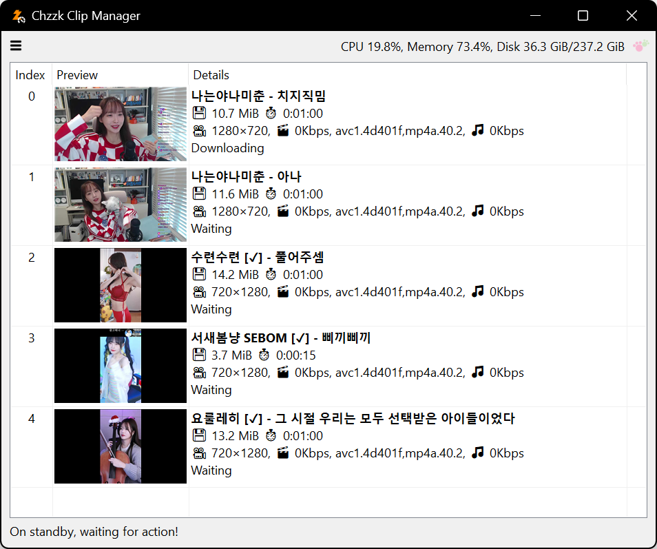
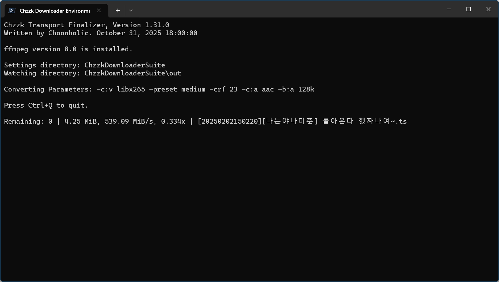

# Chzzk Downloader Suite
Downloader for live streams, replay videos and clips of Chzzk.

## Downloads
* https://github.com/Choonholic/ChzzkDownloader/releases/latest
* https://blog.choonholic.com/downloads

## Chzzk Live Downloader
Downloader for Chzzk live streams

<div style='text-align: center'>

<p><i>(This image may not reflect the latest information.)</i></p>
</div>

## Version
Version 1.38.0, January 31, 2026 00:00:00

### Prerequisites For Executables
* **[Mandatory]** Streamlink (Requires Streamlink 7.0.0 or higher)
* **[Mandatory]** The official major versions of FFmpeg (Requires FFmpeg 7.0 or higher)

### Usage
```
ChzzkLiveDownloader
  [-h] [--version] [-i ID] [-u [UID]] [-a [AUTH]] [--authaut AUTHAUT] [--authses AUTHSES]
  [--authcookie AUTHCOOKIE] [--adult [ADULT]] [-y] [-q [QUALITY]] [-d [DISPLAY]] [--once ONCE]
  [--stream [STREAM]] [--final [FINAL]] [--custom [CUSTOM]] [--ext [EXT]] [--offset OFFSET]
  [--duration DURATION] [--detect [DETECT]] [--name [NAME]] [--work [WORK]]
  [--work-user [WORK_USER]] [--work-pass [WORK_PASS]] [--out [OUT]] [--out-user [OUT_USER]]
  [--out-pass [OUT_PASS]] [--temp [TEMP]] [--temp-user [TEMP_USER]] [--temp-pass [TEMP_PASS]]
  [--category [CATEGORY]] [--exist [EXIST]] [--threshold [THRESHOLD]] [--rpc]
  [--rpcexpose [RPCEXPOSE]] [--rpcbaseport [RPCBASEPORT]] [--snapshot SNAPSHOT] [--thumb [THUMB]]
  [--metadata [METADATA]] [--startup [STARTUP]] [--pnpath [PNPATH]] [--pnlanguage [PNLANGUAGE]]
  [--pnparams [PNPARAMS]] [--pntexttype [PNTEXTTYPE]] [--settings [SETTINGS]] [--reset]
```

### Options
```
-h, --help                  Show this help message
--version                   Show version information
-i, --id ID                 Set streamer configuration id
-u, --uid [UID]             Set streamer unique identifier
-a, --auth [AUTH]           Set Chzzk authentication credential control method (reuse|reissue|ignore)
--authaut AUTHAUT           Set auth key of Chzzk authentication credential
--authses AUTHSES           Set session key of Chzzk authentication credential
--authcookie AUTHCOOKIE     Set Netscape cookie file of Chzzk authentication credential
--adult [ADULT]             Set the process method for adult contents when credentials are invalid (ask|skip)
-y, --yes                   Set any confirmation values to 'yes' automatically
-q, --quality [QUALITY]     Set target quality to download (e.g. 1080p)
-d, --display [DISPLAY]     Set display mode (quiet|simple|fluent|all)
--once ONCE                 Download a live stream only once
--stream [STREAM]           Set stream retrieving method (standard|request-timemachine|force-timemachine)
--final [FINAL]             Set finalization method (bypass|convert|cleanup|cconvert|ccleanup)
--custom [CUSTOM]           Set custom finalize options (applicable only with cconvert|ccleanup)
--ext [EXT]                 Set output file extension (applicable only with cconvert|ccleanup)
--offset OFFSET             Set amount of time to skip from the beginning of the stream
--duration DURATION         Set the maximum stream duration to download
--detect [DETECT]           Set detection interval (default: 60, 10-300)
--name [NAME]               Set output filename format
--work [WORK]               Set working directory
--work-user [WORK_USER]     Set username to use when working directory is on remote network
--work-pass [WORK_PASS]     Set password to use when working directory is on remote network
--out [OUT]                 Set output directory
--out-user [OUT_USER]       Set username to use when output directory is on remote network
--out-pass [OUT_PASS]       Set password to use when output directory is on remote network
--temp [TEMP]               Set temporary directory
--temp-user [TEMP_USER]     Set username to use when temporary directory is on remote network
--temp-pass [TEMP_PASS]     Set password to use when temporary directory is on remote network
--category [CATEGORY]       Set output categorize method (none|streamer)
--exist [EXIST]             Set how to save when the target file already exists (rename|skip|overwrite)
--threshold [THRESHOLD]     Set the threshold by size or percent for stopping downloads when disk space is low (disable: -, default: 5%, valid range: 1-50% of total disk space, even for size values)
--rpc                       Activate JSON-RPC server
--rpcexpose [RPCEXPOSE]     Set JSON-RPC server exposure method (close|open)
--rpcbaseport [RPCBASEPORT] Set base port of JSON-RPC server (default: 62000, 49152-65300)
--snapshot SNAPSHOT         Save snapshot to a JSON file whenever changing status
--thumb [THUMB]             Save thumbnail image or skip (save|skip)
--metadata [METADATA]       Save metadata or skip (save|skip)
--startup [STARTUP]         Set startup method (normal|fast)
--pnpath [PNPATH]           Set the path to the notification plugin
--pnlanguage [PNLANGUAGE]   Set the language used by the notification plugin
--pnparams [PNPARAMS]       Set the parameters for the notification plugin
--pntexttype [PNTEXTTYPE]   Set the text format used by the notification plugin (plain|markdown|html)
--settings [SETTINGS]       Set action when saving settings (default|update|show|skip|quit)
--reset                     Reset all settings
```

### Example
```powershell
ChzzkLiveDownloader -i 2 --thumb save --detect 30 --work work --out out --temp temp
```

## Chzzk Video Downloader
Downloader for Chzzk replay videos

<div style='text-align: center'>

<p><i>(This image may not reflect the latest information.)</i></p>
</div>

## Version
Version 1.38.0, January 31, 2026 00:00:00

### Prerequisites For Executables
* **[Mandatory]** Streamlink (Requires Streamlink 7.0.0 or higher)
* **[Mandatory]** The official major versions of FFmpeg (Requires FFmpeg 7.0 or higher)

### Usage
```
ChzzkVideoDownloader
  [-h] [--version] [-i INPUT] [-a [AUTH]] [--authaut AUTHAUT] [--authses AUTHSES]
  [--authcookie AUTHCOOKIE] [--adult [ADULT]] [-y] [-q [QUALITY]] [-d [DISPLAY]] [--final [FINAL]]
  [--custom [CUSTOM]] [--ext [EXT]] [--name [NAME]] [--work [WORK]] [--work-user [WORK_USER]]
  [--work-pass [WORK_PASS]] [--out [OUT]] [--out-user [OUT_USER]] [--out-pass [OUT_PASS]]
  [--temp [TEMP]] [--temp-user [TEMP_USER]] [--temp-pass [TEMP_PASS]] [--category [CATEGORY]]
  [--exist [EXIST]] [--threshold [THRESHOLD]] [--rpc] [--rpcexpose [RPCEXPOSE]]
  [--rpcport [RPCPORT]] [--rpcid [RPCID]] [--snapshot SNAPSHOT] [--download [DOWNLOAD]]
  [--limit [LIMIT]] [--thumb [THUMB]] [--metadata [METADATA]] [--startup [STARTUP]]
  [--pnpath [PNPATH]] [--pnlanguage [PNLANGUAGE]] [--pnparams [PNPARAMS]]
  [--pntexttype [PNTEXTTYPE]] [--settings [SETTINGS]] [--reset]
  [video]
```

### Positional Arguments
```
video                     Video number or URL to download
```

### Options
```
-h, --help                Show this help message
--version                 Show version information
-i, --input INPUT         Set the download list file
-a, --auth [AUTH]         Set Chzzk authentication credential control method (reuse|reissue|ignore)
--authaut AUTHAUT         Set auth key of Chzzk authentication credential
--authses AUTHSES         Set session key of Chzzk authentication credential
--authcookie AUTHCOOKIE   Set Netscape cookie file of Chzzk authentication credential
--adult [ADULT]           Set the process method for adult contents when credentials are invalid (ask|skip)
-y, --yes                 Set any confirmation values to 'yes' automatically
-q, --quality [QUALITY]   Set target quality to download (e.g. 1080p)
-d, --display [DISPLAY]   Set display mode (quiet|simple|fluent|all)
--final [FINAL]           Set finalization method (bypass|convert|cleanup|cconvert|ccleanup, applicable only when downloading UPLOAD type)
--custom [CUSTOM]         Set custom finalize options (applicable only with cconvert|ccleanup)
--ext [EXT]               Set output file extension (applicable only with cconvert|ccleanup)
--name [NAME]             Set output filename format
--work [WORK]             Set working directory
--work-user [WORK_USER]   Set username to use when working directory is on remote network
--work-pass [WORK_PASS]   Set password to use when working directory is on remote network
--out [OUT]               Set output directory
--out-user [OUT_USER]     Set username to use when output directory is on remote network
--out-pass [OUT_PASS]     Set password to use when output directory is on remote network
--temp [TEMP]             Set temporary directory
--temp-user [TEMP_USER]   Set username to use when temporary directory is on remote network
--temp-pass [TEMP_PASS]   Set password to use when temporary directory is on remote network
--category [CATEGORY]     Set output categorize method (none|streamer)
--exist [EXIST]           Set how to save when the target file already exists (rename|skip|overwrite)
--threshold [THRESHOLD]   Set the threshold by size or percent for stopping downloads when disk space is low (disable: -, default: 5%, valid range: 1-50% of total disk space, even for size values)
--rpc                     Activate JSON-RPC server
--rpcexpose [RPCEXPOSE]   Set JSON-RPC server exposure method (close|open)
--rpcport [RPCPORT]       Set JSON-RPC server port (default: 63000, 49152-65300)
--rpcid [RPCID]           Set JSON-RPC server ID (default: 30)
--snapshot SNAPSHOT       Save snapshot to a JSON file whenever changing status
--download [DOWNLOAD]     Set download method (default|atxc|alter)
--limit [LIMIT]           Set max download speed (e.g., 512K, 10M, 1G, default: 0)
--thumb [THUMB]           Save thumbnail image or skip (save|skip)
--metadata [METADATA]     Save metadata or skip (save|skip)
--startup [STARTUP]       Set startup method (normal|fast)
--pnpath [PNPATH]         Set the path to the notification plugin
--pnlanguage [PNLANGUAGE] Set the language used by the notification plugin
--pnparams [PNPARAMS]     Set the parameters for the notification plugin
--pntexttype [PNTEXTTYPE] Set the text format used by the notification plugin (plain|markdown|html)
--settings [SETTINGS]     Set action when saving settings (default|update|show|skip|quit)
--reset                   Reset all settings
```

### Example
```powershell
ChzzkVideoDownloader 1602969 --thumb save --work work --out out --temp temp
```

## Chzzk Clip Downloader
Downloader for Chzzk clips

<div style='text-align: center'>

<p><i>(This image may not reflect the latest information.)</i></p>
</div>

## Version
Version 1.38.0, January 31, 2026 00:00:00

### Usage
```
ChzzkClipDownloader
  [-h] [--version] [-i INPUT] [-a [AUTH]] [--authaut AUTHAUT] [--authses AUTHSES]
  [--authcookie AUTHCOOKIE] [--adult [ADULT]] [-y] [-d [DISPLAY]] [--name [NAME]] [--work [WORK]]
  [--work-user [WORK_USER]] [--work-pass [WORK_PASS]] [--out [OUT]] [--out-user [OUT_USER]]
  [--out-pass [OUT_PASS]] [--temp [TEMP]] [--temp-user [TEMP_USER]] [--temp-pass [TEMP_PASS]]
  [--category [CATEGORY]] [--exist [EXIST]] [--threshold [THRESHOLD]] [--rpc]
  [--rpcexpose [RPCEXPOSE]] [--rpcport [RPCPORT]] [--rpcid [RPCID]] [--snapshot SNAPSHOT]
  [--download [DOWNLOAD]] [--limit [LIMIT]] [--thumb [THUMB]] [--metadata [METADATA]]
  [--startup [STARTUP]] [--pnpath [PNPATH]] [--pnlanguage [PNLANGUAGE]] [--pnparams [PNPARAMS]]
  [--pntexttype [PNTEXTTYPE]] [--settings [SETTINGS]] [--reset]
  [clip]
```

### Positional Arguments
```
clip                      Clip UID or URL to download
```

### Options
```
-h, --help                Show this help message
--version                 Show version information
-i, --input INPUT         Set the download list file
-a, --auth [AUTH]         Set Chzzk authentication credential control method (reuse|reissue|ignore)
--authaut AUTHAUT         Set auth key of Chzzk authentication credential
--authses AUTHSES         Set session key of Chzzk authentication credential
--authcookie AUTHCOOKIE   Set Netscape cookie file of Chzzk authentication credential
--adult [ADULT]           Set the process method for adult contents when credentials are invalid (ask|skip)
-y, --yes                 Set any confirmation values to 'yes' automatically
-d, --display [DISPLAY]   Set display mode (quiet|simple|fluent|all)
--name [NAME]             Set output filename format
--work [WORK]             Set working directory
--work-user [WORK_USER]   Set username to use when working directory is on remote network
--work-pass [WORK_PASS]   Set password to use when working directory is on remote network
--out [OUT]               Set output directory
--out-user [OUT_USER]     Set username to use when output directory is on remote network
--out-pass [OUT_PASS]     Set password to use when output directory is on remote network
--temp [TEMP]             Set temporary directory
--temp-user [TEMP_USER]   Set username to use when temporary directory is on remote network
--temp-pass [TEMP_PASS]   Set password to use when temporary directory is on remote network
--category [CATEGORY]     Set output categorize method (none|streamer)
--exist [EXIST]           Set how to save when the target file already exists (rename|skip|overwrite)
--threshold [THRESHOLD]   Set the threshold by size or percent for stopping downloads when disk space is low (disable: -, default: 5%, valid range: 1-50% of total disk space, even for size values)
--rpc                     Activate JSON-RPC server
--rpcexpose [RPCEXPOSE]   Set JSON-RPC server exposure method (close|open)
--rpcport [RPCPORT]       Set JSON-RPC server port (default: 64000, 49152-65300)
--rpcid [RPCID]           Set JSON-RPC server ID (default: 50)
--snapshot SNAPSHOT       Save snapshot to a JSON file whenever changing status
--download [DOWNLOAD]     Set download method (default|atxc|alter)
--limit [LIMIT]           Set max download speed (e.g., 512K, 10M, 1G, default: 0)
--thumb [THUMB]           Save thumbnail image or skip (save|skip)
--metadata [METADATA]     Save metadata or skip (save|skip)
--startup [STARTUP]       Set startup method (normal|fast)
--pnpath [PNPATH]         Set the path to the notification plugin
--pnlanguage [PNLANGUAGE] Set the language used by the notification plugin
--pnparams [PNPARAMS]     Set the parameters for the notification plugin
--pntexttype [PNTEXTTYPE] Set the text format used by the notification plugin (plain|markdown|html)
--settings [SETTINGS]     Set action when saving settings (default|update|show|skip|quit)
--reset                   Reset all settings
```

### Example
```powershell
ChzzkClipDownloader C46IcpG11p --thumb save --work work --out out --temp temp
```

## Chzzk Transport Finalizer
Finalizer for Chzzk transport streams

<div style='text-align: center'>

<p><i>(This image may not reflect the latest information.)</i></p>
</div>

## Version
Version 1.38.0, January 31, 2026 00:00:00

### Prerequisites For Executables
* **[Mandatory]** The official major versions of FFmpeg (Requires FFmpeg 7.0 or higher)

### Usage
```
ChzzkTransportFinalizer
  [-h] [--version] [-d [DISPLAY]] [--work [WORK]] [--work-user [WORK_USER]]
  [--work-pass [WORK_PASS]] [--watch [WATCH]] [--watch-trav [WATCH_TRAV]]
  [--watch-user [WATCH_USER]] [--watch-pass [WATCH_PASS]] [--exclude [EXCLUDE]]
  [--exclude-trav [EXCLUDE_TRAV]] [--exclude-user [EXCLUDE_USER]] [--exclude-pass [EXCLUDE_PASS]]
  [--convert [CONVERT]] [--ext [EXT]] [--exist [EXIST]] [--threshold [THRESHOLD]] [--rpc]
  [--rpcexpose [RPCEXPOSE]] [--rpcport [RPCPORT]] [--rpcid [RPCID]] [--snapshot SNAPSHOT]
  [--metadata [METADATA]] [--startup [STARTUP]] [--pnpath [PNPATH]] [--pnlanguage [PNLANGUAGE]]
  [--pnparams [PNPARAMS]] [--pntexttype [PNTEXTTYPE]] [--settings [SETTINGS]] [--reset]
```

### Options
```
-h, --help                    Show this help message
--version                     Show version information
-d, --display [DISPLAY]       Set display mode (quiet|simple|fluent|all)
--work [WORK]                 Set working directory
--work-user [WORK_USER]       Set username to use when working directory is on remote network
--work-pass [WORK_PASS]       Set password to use when working directory is on remote network
--watch [WATCH]               Set watching directory
--watch-trav [WATCH_TRAV]     Set the traversal method for watching directory (direct|recursive)
--watch-user [WATCH_USER]     Set username to use when watching directory is on remote network
--watch-pass [WATCH_PASS]     Set password to use when watching directory is on remote network
--exclude [EXCLUDE]           Set the directory excluded from watching
--exclude-trav [EXCLUDE_TRAV] Set the traversal method for excluded directory (direct|recursive)
--exclude-user [EXCLUDE_USER] Set username to use when excluded directory is on remote network
--exclude-pass [EXCLUDE_PASS] Set password to use when excluded directory is on remote network
--convert [CONVERT]           Set convert parameters
--ext [EXT]                   Set output file extension
--exist [EXIST]               Set how to save when the target file already exists (rename|skip|overwrite)
--threshold [THRESHOLD]       Set the threshold by size or percent for stopping downloads when disk space is low (disable: -, default: 5%, valid range: 1-50% of total disk space, even for size values)
--rpc                         Activate JSON-RPC server
--rpcexpose [RPCEXPOSE]       Set JSON-RPC server exposure method (close|open)
--rpcport [RPCPORT]           Set JSON-RPC server port (default: 65000, 49152-65300)
--rpcid [RPCID]               Set JSON-RPC server ID (default: 70)
--snapshot SNAPSHOT           Save snapshot to a JSON file whenever changing status
--metadata [METADATA]         Save metadata or skip (save|skip)
--startup [STARTUP]           Set startup method (normal|fast)
--pnpath [PNPATH]             Set the path to the notification plugin
--pnlanguage [PNLANGUAGE]     Set the language used by the notification plugin
--pnparams [PNPARAMS]         Set the parameters for the notification plugin
--pntexttype [PNTEXTTYPE]     Set the text format used by the notification plugin (plain|markdown|html)
--settings [SETTINGS]         Set action when saving settings (default|update|show|skip|quit)
--reset                       Reset all settings
```

### Example
```powershell
ChzzkTransportFinalizer --work work --watch out
```

## Changelogs
Please kindly read [Release Notes](https://blog.choonholic.com/archives/3216).

## Credits
Please kindly read [CREDITS](./CREDITS.md).

## Author
Please kindly read [AUTHORS](./AUTHORS.md).
