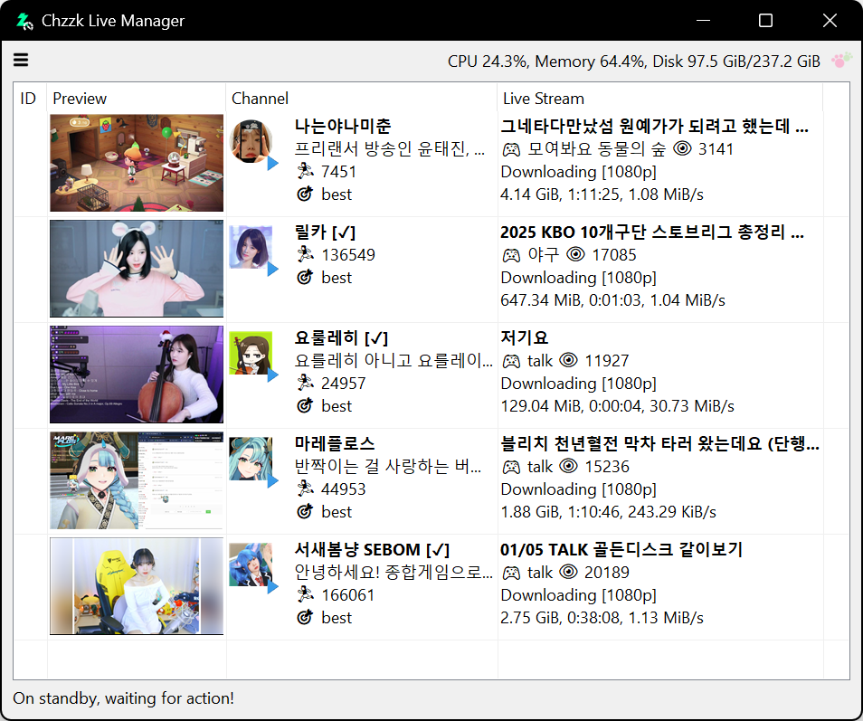
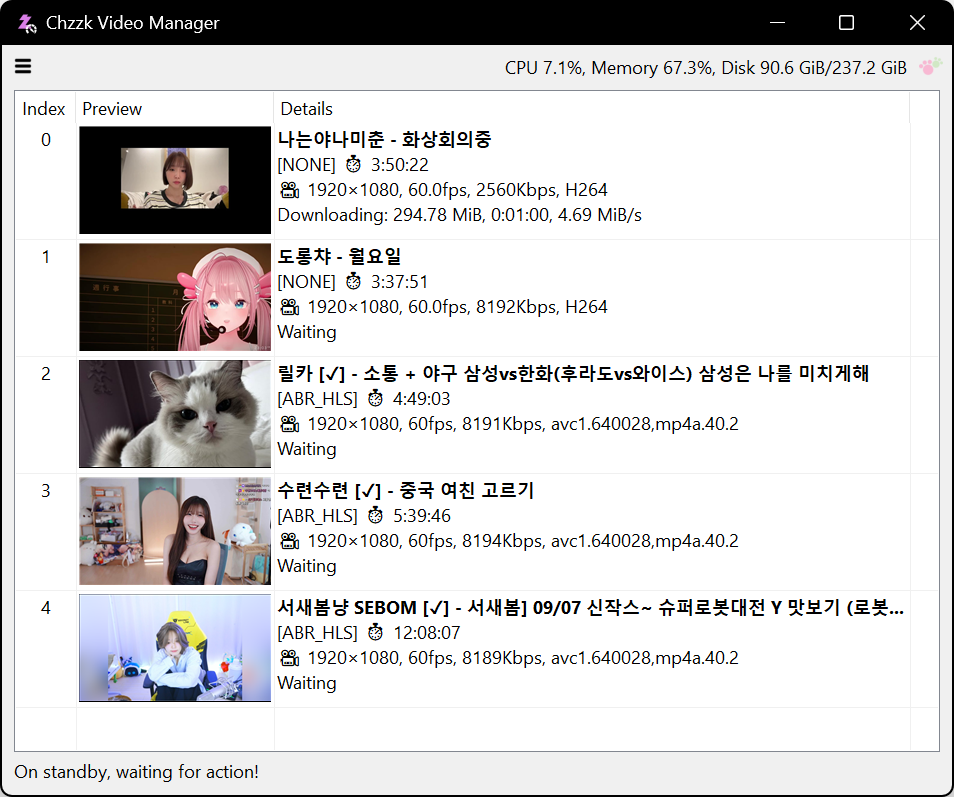

# Chzzk Downloader Suite
Downloader for live streams, replay videos and clips of Chzzk.

## Downloads
* https://github.com/Choonholic/ChzzkDownloader/releases/latest
* https://blog.choonholic.com/downloads

## Chzzk Live Downloader
Downloader for Chzzk live streams

<div style='text-align: center'>

<p><i>(This image may not reflect the latest information.)</i></p>
</div>

## Version
Version 0.99.1, November 26, 2024 00:00:00

### Prerequisites For Executables
* **[Mandatory]** Latest version of FFmpeg. (Requires FFmpeg 7.0 or higher)
* **[Mandatory]** Latest version of Streamlink. (Requires Streamlink 6.7.3 or higher)

### Usage
```powershell
ChzzkLiveDownloader [-h] [-i ID] [-u [UID]] [-a] [-q [QUALITY]] [-d [DISPLAY]] [-y]
                    [--version] [--once ONCE] [--stream [STREAM]] [--final [FINAL]]
                    [--custom [CUSTOM]] [--offset OFFSET] [--duration DURATION]
                    [--detect [DETECT]] [--adult [ADULT]] [--authaut AUTHAUT]
                    [--authses AUTHSES] [--name [NAME]] [--work [WORK]] [--out [OUT]]
                    [--temp [TEMP]] [--category [CATEGORY]] [--exist [EXIST]]
                    [--rpcbaseport [RPCPORT]] [--snapshot SNAPSHOT] [--thumb [THUMB]]
                    [--startup [STARTUP]] [--settings [SETTINGS]] [--reset]
```

### Options
```
-h, --help              Show this help message
-i, --id ID             Set streamer configuration id (default: 0)
-u, --uid [UID]         Set streamer unique identifier
-a, --auth              Set Chzzk authorized credential
-q, --quality [QUALITY] Set target quality to download (e.g. 1080p)
-d, --display [DISPLAY] Set download status display mode (quiet|simple|fluent|all)
-y, --yes               Set any confirmation values to 'yes' automatically
--version               Show version information
--once ONCE             Download a live stream only once
--stream [STREAM]       Set stream retrieving method (standard|timemachine)
--final [FINAL]         Set finalization method (bypass|convert|cleanup|cconvert|ccleanup)
--custom [CUSTOM]       Set custom finalize options (applicable only to cconvert|ccleanup)
--offset OFFSET         Set amount of time to skip from the beginning of the stream
--duration DURATION     Set limit the stream duration to download
--detect [DETECT]       Set detection interval (default: 60, 1-600)
--adult [ADULT]         Set the process method for adult contents when credentials are invalid (ask|skip)
--authaut AUTHAUT       Set auth key of Chzzk authorized credential
--authses AUTHSES       Set session key of Chzzk authorized credential
--name [NAME]           Set output filename format
--work [WORK]           Set working directory
--out [OUT]             Set output directory
--temp [TEMP]           Set temporary directory
--category [CATEGORY]   Set output categorize method (none|streamer)
--exist [EXIST]         Set whether to overwrite or rename the file if it already exists (overwrite|rename)
--rpcbaseport [RPCPORT] Set base port of JSON-RPC server (default: 62000, 49152-65300)
--snapshot SNAPSHOT     Save snapshot to a JSON file whenever changing status
--thumb [THUMB]         Save thumbnail image or skip (save|skip|keep)
--startup [STARTUP]     Set startup method (normal|fast)
--settings [SETTINGS]   Set action when saving settings (default|skip|quit)
--reset                 Reset all settings
```

### Example
```powershell
ChzzkLiveDownloader -i 2 --thumb --detect 30 --work work --out out --temp temp
```

## Chzzk Video Downloader
Downloader for Chzzk replay videos

<div style='text-align: center'>

<p><i>(This image may not reflect the latest information.)</i></p>
</div>

## Version
Version 0.99.1, November 26, 2024 00:00:00

### Usage
```powershell
ChzzkVideoDownloader [-h] [-i INPUT] [-a] [-q [QUALITY]] [-d [DISPLAY]] [-y] [--version]
                     [--adult [ADULT]] [--authaut AUTHAUT] [--authses AUTHSES]
                     [--name [NAME]] [--work [WORK]] [--out [OUT]] [--temp [TEMP]]
                     [--category [CATEGORY]] [--exist [EXIST]] [--rpcid [RPCID]]
                     [--rpcport [RPCPORT]] [--snapshot SNAPSHOT] [--download [DOWNLOAD]]
                     [--thumb [THUMB]] [--startup [STARTUP]] [--settings [SETTINGS]]
                     [--reset]
                     [video]
```

### Positional Arguments
```
video                   Video number or URL to download
```

### Options
```
-h, --help              Show this help message
-i, --input INPUT       Set the download list file
-a, --auth              Set Chzzk authorized credential
-q, --quality [QUALITY] Set target quality to download (e.g. 1080p)
-d, --display [DISPLAY] Set download status display mode (quiet|simple|fluent|all)
-y, --yes               Set any confirmation values to 'yes' automatically
--version               Show version information
--adult [ADULT]         Set the process method for adult contents when credentials are invalid (ask|skip)
--authaut AUTHAUT       Set auth key of Chzzk authorized credential
--authses AUTHSES       Set session key of Chzzk authorized credential
--name [NAME]           Set output filename format
--work [WORK]           Set working directory
--out [OUT]             Set output directory
--temp [TEMP]           Set temporary directory
--category [CATEGORY]   Set output categorize method (none|streamer)
--exist [EXIST]         Set whether to overwrite or rename the file if it already exists (overwrite|rename)
--rpcid [RPCID]         Set ID of JSON-RPC server (default: 30)
--rpcport [RPCPORT]     Set port of JSON-RPC server (default: 63000, 49152-65300)
--snapshot SNAPSHOT     Save snapshot to a JSON file whenever changing status
--download [DOWNLOAD]   Set download method (default|atxc|alter)
--thumb [THUMB]         Save thumbnail image or skip (save|skip|keep)
--startup [STARTUP]     Set startup method (normal|fast)
--settings [SETTINGS]   Set action when saving settings (default|skip|quit)
--reset                 Reset all settings
```

### Example
```powershell
ChzzkVideoDownloader 1602969 --thumb --work work --out out --temp temp
```

## Chzzk Clip Downloader
Downloader for Chzzk clips

<div style='text-align: center'>

<p><i>(This image may not reflect the latest information.)</i></p>
</div>

## Version
Version 0.99.1, November 26, 2024 00:00:00

### Usage
```powershell
ChzzkClipDownloader [-h] [-i INPUT] [-a] [-d [DISPLAY]] [-y] [--version]
                    [--adult [ADULT]] [--authaut AUTHAUT] [--authses AUTHSES]
                    [--name [NAME]] [--work [WORK]] [--out [OUT]] [--temp [TEMP]]
                    [--category [CATEGORY]] [--exist [EXIST]] [--rpcid [RPCID]]
                    [--rpcport [RPCPORT]] [--snapshot SNAPSHOT] [--download [DOWNLOAD]]
                    [--thumb [THUMB]] [--startup [STARTUP]] [--settings [SETTINGS]]
                    [--reset]
                    [clip]
```

### Positional Arguments
```
clip                    Clip UID or URL to download
```

### Options
```
-h, --help              Show this help message
-i, --input INPUT       Set the download list file
-a, --auth              Set Chzzk authorized credential
-d, --display [DISPLAY] Set download status display mode (quiet|simple|fluent|all)
-y, --yes               Set any confirmation values to 'yes' automatically
--version               Show version information
--adult [ADULT]         Set the process method for adult contents when credentials are invalid (ask|skip)
--authaut AUTHAUT       Set auth key of Chzzk authorized credential
--authses AUTHSES       Set session key of Chzzk authorized credential
--name [NAME]           Set output filename format
--work [WORK]           Set working directory
--out [OUT]             Set output directory
--temp [TEMP]           Set temporary directory
--category [CATEGORY]   Set output categorize method (none|streamer)
--exist [EXIST]         Set whether to overwrite or rename the file if it already exists (overwrite|rename)
--rpcid [RPCID]         Set ID of JSON-RPC server (default: 50)
--rpcport [RPCPORT]     Set port of JSON-RPC server (default: 64000, 49152-65300)
--snapshot SNAPSHOT     Save snapshot to a JSON file whenever changing status
--download [DOWNLOAD]   Set download method (default|atxc|alter)
--thumb [THUMB]         Save thumbnail image or skip (save|skip|keep)
--startup [STARTUP]     Set startup method (normal|fast)
--settings [SETTINGS]   Set action when saving settings (default|skip|quit)
--reset                 Reset all settings
```

### Example
```powershell
ChzzkClipDownloader C46IcpG11p --thumb --work work --out out --temp temp
```
## Changelogs
Please kindly read [Release Notes](https://blog.choonholic.com/archives/3216).

## Credits
Please kindly read [CREDITS](./CREDITS.md).

## Author
Please kindly read [AUTHORS](./AUTHORS.md).
