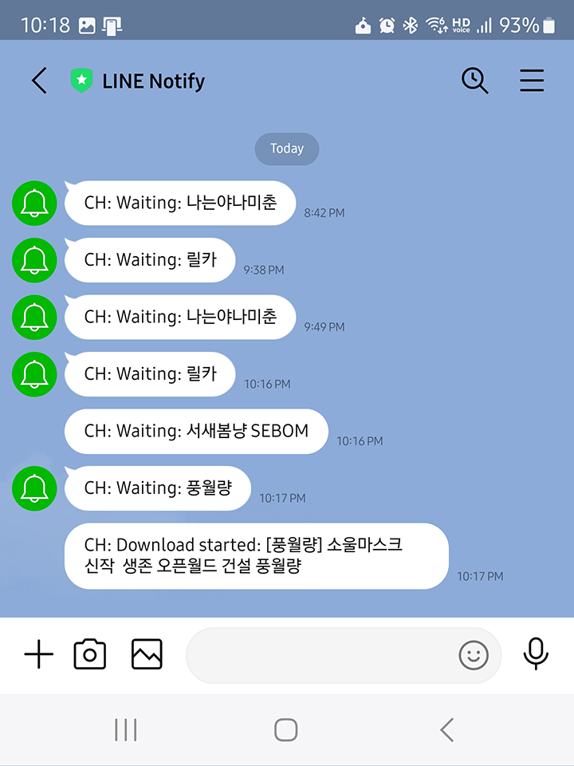

# Chzzk Live Downloader
Downloader for Chzzk live streams

<div style='text-align: center'>

<p><i>(This image may not reflect the latest information.)</i></p>
</div>

## Version
Version 0.91, October 24, 2024 00:00:00

## Prerequisites
* **[Mandatory]** Latest version of ffmpeg binary. (ffmpeg 7.1 is recommended.)
* **[Mandatory]** Latest version of streamlink. (streamlink 6.11.0 is recommended.)
* **[Optional]** Latest version of LINE messenger to get notification.

## Usage
```powershell
ChzzkLiveDownloader [-h] [-i ID] [-u [UID]] [-a] [-q [QUALITY]] [-d [DISPLAY]] [-y]
                    [--version] [--once ONCE] [--stream [STREAM]] [--final [FINAL]]
                    [--custom [CUSTOM]] [--offset OFFSET] [--duration DURATION]
                    [--detect [DETECT]] [--adult [ADULT]] [--authaut AUTHAUT]
                    [--authses AUTHSES] [--nlevel [NLEVEL]] [--ntoken NTOKEN]
                    [--name [NAME]] [--work [WORK]] [--out [OUT]] [--temp [TEMP]]
                    [--rpcbaseport [RPCPORT]] [--thumb [THUMB]]
                    [--startup [STARTUP]] [--settings [SETTINGS]] [--reset]
```

### Options
```
-h, --help               Show this help message
-i, --id ID              Set streamer configuration id (default: 0)
-u, --uid [UID]          Set streamer unique identifier
-a, --auth               Set Chzzk authorized credential
-q, --quality [QUALITY]  Set target quality to download (e.g. 1080p)
-d, --display [DISPLAY]  Set download status display mode (quiet|simple|fluent|all)
-y, --yes                Set any confirmation values to 'yes' automatically
--version                Show version information
--once ONCE              Download a live stream only once
--stream [STREAM]        Set stream retrieving method (standard|timemachine)
--final [FINAL]          Set finalization method (bypass|convert|cconvert|ccleanup|all)
--custom [CUSTOM]        Set custom finalize options (applicable only to cconvert|ccleanup)
--offset OFFSET          Set amount of time to skip from the beginning of the stream
--duration DURATION      Set limit the stream duration to download
--detect [DETECT]        Set detection interval (default: 60, 1-600)
--adult [ADULT]          Set the process method for adult contents when credentials are invalid (ask|skip)
--authaut AUTHAUT        Set auth key of Chzzk authorized credential
--authses AUTHSES        Set session key of Chzzk authorized credential
--nlevel [NLEVEL]        Set LINE notify level (none|reset|remove|info|error|verbose|all)
--ntoken NTOKEN          Set LINE notify access token
--name [NAME]            Set output filename format
--work [WORK]            Set working directory
--out [OUT]              Set output directory
--temp [TEMP]            Set temporary directory
--rpcbaseport [RPCPORT]  Set base port of JSON-RPC server (default: 62000, 49152-65300)
--thumb [THUMB]          Save thumbnail image or skip (save|skip)
--startup [STARTUP]      Set startup method (normal|fast)
--settings [SETTINGS]    Set action when saving settings (default|skip|quit)
--reset                  Reset all settings
```

## Initial Setup
For initial setup, the following items should be prepared.

* Creator Channel UID

Execute without parameters for the first use.

```powershell
ChzzkLiveDownloader
```

For recommended initial setings, see [Recommended Initial Settings](#recommended-initial-settings) section in later.

## Downloading Multiple Channels Simultaneously
To download multiple channels at the same time, you can open a new Command Prompt or PowerShell console and run ChzzkLiveDownloader. However, if you run without parameters, ChzzkLiveDownloader will always download the first UID you registered, so if you want to specify a new UID, you can specify a new configuration with the following commands.

```powershell
ChzzkLiveDownloader -i n
ChzzkLiveDownloader --id n
```

The specific UID will be used again when you set the same parameters the next time, and automatically search for and download live streams with the UID.

## Setting or Resetting UID of a Specific ID

### Setting UID
To set the UID assigned to a specific ID, use the following commands.

```powershell
ChzzkLiveDownloader -i n -u uid or url
ChzzkLiveDownloader --id n --uid uid or url
```

If you want to change the UID assigned to the default ID, you can do so by specifying `0` for the `-i` (or `--id`) parameter, or by specifying only the `-u` (or `--uid`) parameter, as follows:

```powershell
ChzzkLiveDownloader -u uid or url
ChzzkLiveDownloader --uid uid or url
```

### Resetting UID
To reset the UID assigned to a specific ID, use the following commands. This will work even if you have not previously assigned a UID to the ID.

For default ID:

```powershell
ChzzkLiveDownloader -u
ChzzkLiveDownloader --uid
```

For a specific ID:

```powershell
ChzzkLiveDownloader -i n -u
ChzzkLiveDownloader --id n --uid
```

## Downloading A Live Stream Only Once Without Saving Information
If you want to download a live stream with URL only once, rather than specifying and saving the streamer information, use the following command.

```powershell
ChzzkLiveDownloader --once uid or url
```

## Resetting Authorized Credential
To download a live stream that requires NAVER authorized credential, such as an adult-only live stream, you must specify the following information.

* NAVER ID Authorization Key from Chzzk cookie (`NID_AUT`)
* NAVER ID Session Key from Chzzk cookie (`NID_SES`)

When ChzzkLiveDownloader cannot find the authorized credential when downloading a stream that requires it, a prompt to enter your authorization will be activated.

If you enter these values, they will be set as defaults, and subsequent runs will use them without further input. For more information on how to get Chzzk authorized credential, please refer to `how_to_get_chzzk_credential.pdf`.

If your authorized credential has been changed, or if you need to reset them by logging in with a different ID, use the following commands.

```powershell
ChzzkLiveDownloader -a
ChzzkLiveDownloader --auth
```

With `-y` or `--yes` option, a prompt to enter the authorization will be activated automatically without any confirmation.

```powershell
ChzzkLiveDownloader -y
ChzzkLiveDownloader --yes
```

## Specifying Target Quality to Download
By default, all streams will be downloaded in the best quality possible. However, if you want to save them in a different quality for saving storage or other reasons, use the following commands. Also, if the stream is not using a standard resolution, the download will automatically choose the quality closest to the resolution you specify.

```powershell
ChzzkLiveDownloader -q 720p
ChzzkLiveDownloader --quality 720p
```

If you want to set this option to default, just use `-q` or `--quality` like below.

```powershell
ChzzkLiveDownloader -q
ChzzkLiveDownloader --quality
```

## Setting Output Filename Format
By default, the filename of videos and thumbnails to be saved will be `[{download_date}][{name}] {title}`. If you want to change this format, use the following command.

```powershell
ChzzkLiveDownloader --name "[{name}][{category}] {title}"
```

If you want to set this option to default, just use `--name` without format like below.

```powershell
ChzzkLiveDownloader --name
```

### Filename Format Tags
The following pre-defined tags can be used for filename format.

* `{name}` - Channel Name.
* `{verified}` - If channel is verified one, this tag will be `[✓]` or empty.
* `{title}` - Title of the stream.
* `{category}` - Category of the stream if set.
* `{live_date...}` - Date-related tags when the stream started.
* `{download_date...}` - Date-related tags when the downloading started.
* `{media...}` - Media information-related tags.

For the media-related tags, the following elements are available:

* `{media_quality}` - Media Quality. (e.g. `1080p`)
* `{media_encoding_track_id}` - Encoding track ID. (e.g. `1080p`)
* `{media_video_profile}` - Video profile. (e.g. `high`)
* `{media_audio_profile}` - Audio profile. (e.g. `LC`)
* `{media_video_codec}` - Video codec. (e.g. `H264`)
* `{media_video_bitrate}` - Video bitrate as bit-per-second. (e.g. `8000000`)
* `{media_audio_bitrate}` - Audio bitrate as bit-per-second. (e.g. `192000`)
* `{media_video_framerate}` - Video frame rate as frame-per-second. (e.g. `60.0`)
* `{media_video_width}` - Video width as pixels. (e.g. `1920`)
* `{media_video_height}` - Video height as pixels. (e.g. `1080`)
* `{media_audio_sampling_rate}` - Audio sampling rate as Hertz. (e.g. `48000`)
* `{media_audio_channel}` - Audio channels. (e.g. `2`)
* `{media_video_dynamic_range}` - Video dynamic range. (e.g. `SDR`)

For the date-related tags, the detailed elements can be expanded as below:

* `{..._date}` - Date with `%Y%m%d%H%M%S` format. (e.g. `20240607014327`)
* `{..._date_year}` or `{..._date_year_full}` - Year with century as a decimal number. (e.g. `2024`)
* `{..._date_year_short}` - Year without century as a zero-padded decimal number. (e.g. `24`)
* `{..._date_month}` - Month as a zero-padded decimal number. (`01`, `02`, ..., `12`)
* `{..._date_month_full}` - Month as full name. (`January`, `February`, ..., `December`)
* `{..._date_month_short}` - Month as abbreviated name. (`Jan`, `Feb`, ..., `Dec`)
* `{..._date_day}` - Day of the month as a zero-padded decimal number. (`01`, `02`, ..., `31`)
* `{..._date_hour}` - Hour (24-hour clock) as a zero-padded decimal number. (`00`, `01`, ..., `23`)
* `{..._date_minute}` - Minute as a zero-padded decimal number. (`00`, `01`, ..., `59`)
* `{..._date_second}` - Second as a zero-padded decimal number. (`00`, `01`, ..., `59`)

## Setting Live Stream Detection Interval
By default, the detection interval for live streams is set to 60 seconds. To change this, use the following command: `n` can be any value from `1` to `600`. Therefore, the detection interval can be set in seconds, from 1 second to 10 minutes.

```powershell
ChzzkLiveDownloader --detect n
```

If you want to set this option to default, just use `--detect` like below.

```powershell
ChzzkLiveDownloader --detect
```

## Setup LINE Notifications
The status of downloads or detections can be informed with LINE notifications. To get LINE Notifications, you need to issue an access token from [LINE Notify](https://notify-bot.line.me/). For the detailed information, please refer to `how_to_register_as_service_for_notification.pdf`.

Once you've been issued an access token, use the following command to register it.

```powershell
ChzzkLiveDownloader --ntoken ACCESSTOKEN
```

Once the access token is set, you can check the download status in real time via LINE, as shown in the following figure.

<div style='text-align: center'>

<p><i>(This image may not reflect the latest information.)</i></p>
</div>

### Set Notification Level
Amount of notification details can be set with options of `--nlevel` parameter.

* `reset` - Reset access token and set notification level to `brief`.
* `remove` - Remove access token and set notification level to `none`.
* `none` - Notification will be quiet. However, access token will not be removed if already set.
* `info` - Notifications of brief information and critical errors will be sent.
* `error` - Notifications of brief information and all errors will be sent.
* `verbose` - Notifications of verbose information and critical errors will be sent.
* `all` - Notifications of all information and all errors will be sent.

```powershell
ChzzkLiveDownloader --nlevel error
```

If you want to set this option to default, just use `--nlevel` like below.

```powershell
ChzzkLiveDownloader --nlevel
```

## Handling Thumbnail Images
To save thumbnail images separately, use the following command.

```powershell
ChzzkLiveDownloader --thumb
```

To turn off this feature, use the following command.

```powershell
ChzzkLiveDownloader --thumb skip
```

## Set How to Display Download Details
By default, fluent download details will be displayed. However, if you don't need the details, you can use the following command to prevent them from being displayed.

```powershell
ChzzkLiveDownloader -d quiet
ChzzkLiveDownloader --display quiet
```

The following display methods can be set with options of `--display` parameter.

* `quiet` - Suppress all download details.
* `fluent` - Show all fluent download details.
* `default` - This option is the same as `fluent`.

If you want to set this option to default, just use `-d` or `--display` like below.

```powershell
ChzzkLiveDownloader -d
ChzzkLiveDownloader --display
```

## Finalization
By default, ChzzkLiveDownloader downloads in MPEGTS format with a `.ts` extension during the live download stage and converts it to MPEG4 format with a `.mp4` extension in the finalization stage when the download is complete. However, the finalization methods can be set with `--final` option like below.

```powershell
ChzzkLiveDownloader --final all
```

The following finalization methods can be set with options of `--final` parameter.

* `none` - Just downloads `.ts` intermediate file and bypass converting stage. The intermediate file must be converted with the external converters for playing properly.
* `convert` - Converts `.ts` file to `.mp4` file, but don't remove `.ts` intermediate file.
* `cleanup` - Converts `.ts` file to `.mp4` file, and clean up `.ts` intermediate file.
* `cconvert` - Converts `.ts` file to `.mp4` file with custom options by `--custom`, but don't remove `.ts` intermediate file.
* `ccleanup` - Converts `.ts` file to `.mp4` file with custom options by `--custom`, and clean up `.ts` intermediate file.
* `all` - This option is the same as `cleanup`.

```powershell
ChzzkLiveDownloader --final convert
```

If you want to set this option to default, just use `--final` like below.

```powershell
ChzzkLiveDownloader --final
```

### Custom Encoding During Finalization
You can set custom encoding options during finalization using the `--final` option with either `cconvert` or `ccleanup`. For example, the following options enable `FFmpeg` to encode using the `H.265` codec:

```powershell
ChzzkLiveDownloader --final cconvert --custom "-c:v libx265 -preset medium -crf 23 -c:a aac -b:a 128k"
```

Please note that custom encoding is not recommended due to its suboptimal performance. For better results, consider using external professional encoders.

## Set Start Offset
You can use the following command to set amount of time to skip from the beginning of the stream.

```powershell
ChzzkLiveDownloader --offset 30
```

By default, the unit of time is seconds. However, you can also set through hours, minutes, seconds and milliseconds as follows.


```powershell
ChzzkLiveDownloader --offset 1:23:45.67
ChzzkLiveDownloader --offset 1h30m45.67s
```

## Set Duration and Split Downloading
You can use the following command to set the stream duration to download. If the `--once` parameter is not specified, the downloaded stream will be split into the specified duration.

```powershell
ChzzkLiveDownloader --duration 3600
```

By default, the unit of time is seconds. However, you can also set through hours, minutes, seconds and milliseconds as follows.


```powershell
ChzzkLiveDownloader --duration 1:23:45.67
ChzzkLiveDownloader --duration 1h30m45.67s
```

## Set Stream Retrieving Method
By default, ChzzkLiveDownloader retrieves stream information from the Chzzk Time Machine API to download the stream at the earliest possible time. However, you can set stream retrieving method based of your preferences with the following command.

```powershell
ChzzkLiveDownloader --stream standard
```

The following stream methods can be set with options of `--stream` parameter.

* `standard` - Retrieves stream information from the Chzzk default API.
* `timemachine` - Retrieves stream information from the Chzzk Time Machine API.

If you want to set this option to default, just use `--stream` like below.

```powershell
ChzzkLiveDownloader --stream
```

## Set Working Directory
You can use the following command to specify the directory where required files are stored to work properly.

```powershell
ChzzkLiveDownloader --work work
```

If you want to set this option to default, just use `--work` without directory like below.

```powershell
ChzzkLiveDownloader --work
```

## Set Output Directory
You can use the following command to specify the directory where downloaded files are finally saved. All files will be saved in the per-streamer directory in the output directory.

```powershell
ChzzkLiveDownloader --out out
```

If you want to set this option to default, just use `--out` without directory like below.

```powershell
ChzzkLiveDownloader --out
```

## Set Temporary Directory
You can use the following command to specify the temporary directory where the files being downloaded are saved.

```powershell
ChzzkLiveDownloader --temp temp
```

If you want to set this option to default, just use `--temp` without directory like below.

```powershell
ChzzkLiveDownloader --temp
```

## Set Action When Saving Settings
All options are always saved to configuration files by default. If you want to apply settings to current session only without saving, use the following command.

```powershell
ChzzkLiveDownloader --settings skip
```

However, the following information is always saved.

* All settings of saved streamer channel UIDs
* All settings of per-streamer target quality to download
* All settings of per-streamer LINE notification
* NAVER ID Authorization key from Chzzk cookie (`NID_AUT`)
* NAVER ID Session key from Chzzk cookie (`NID_SES`)

If you want to save the settings without downloading and exit, use the following command.

```powershell
ChzzkLiveDownloader --settings quit
```

## Resetting All Configurations
Over time, you may find that you've mixed things up and want to reset your settings. To reset all configurations, use the following command.

```powershell
ChzzkLiveDownloader --reset
```

This will reset the following information.

* All settings of saved streamer channel UIDs
* All settings of per-streamer target quality to download
* All settings of per-streamer LINE notification
* NAVER ID Authorization key from Chzzk cookie (`NID_AUT`)
* NAVER ID Session key from Chzzk cookie (`NID_SES`)
* Settings for live stream detection interval
* Settings for Saving thumbnail image
* Settings for displaying download details
* Settings for the finalization
* Settings for output and temporary directories

## Display Version Information
You can check the version information by using the following command.

```powershell
ChzzkLiveDownloader --version
```

## Getting help
You can use the following command to get simple parameter help.

```powershell
ChzzkLiveDownloader -h
ChzzkLiveDownloader --help
```

## Parameter precedence
Except `--reset`, `-h` and `--version`, the parameters can be used in any order as shown below. However, you cannot use multiple copies of the same parameter.

```powershell
ChzzkLiveDownloader -i 1 -u --detect 30 --bypass -s
```

The `-h` and `--version` parameters are processed only with the first one used, and then terminated immediately afterward. Therefore, the following command will output only the version information.

```powershell
ChzzkLiveDownloader --version -h
```

The `--reset` parameter resets the settings, ignoring any previously set values, then exits. Therefore, the `--detect` parameter will be ignored in the following command.

```powershell
ChzzkLiveDownloader --detect 30 --reset
```

## Recommended Initial Settings
The following settings are recommeneded for the first use. The following command will set working directory (`--work`), output directory (`--out`), temporary directory (`--temp`) at once to making it easy to organize the downloaded video files.

```powershell
ChzzkLiveDownloader --work work --out out --temp temp
```

## Controlling Externally Using JSON-RPC
Please read `how_to_control_chzzk_live_downloader.pdf` for detailed information.

## Contact Us
If you have any questions, bug reports, or improvement requests regarding the Chzzk Downloader Suite, please submit them through [GitHub](https://github.com/Choonholic/ChzzkDownloader/)‘s [Issues](https://github.com/Choonholic/ChzzkDownloader/issues/new) feature. We can respond to all languages; however, the languages we directly support are Korean, English, Japanese, and Chinese. For other languages, responses may not be fully accurate due to the use of machine translation.

치지직 다운로드 도구에 대해 궁금한 사항, 제보할 오류, 개선 요청 사항 등이 있을 때는 [GitHub](https://github.com/Choonholic/ChzzkDownloader/)의 [Issues](https://github.com/Choonholic/ChzzkDownloader/issues/new) 기능을 통해 제보해 주세요. 모든 언어에 대응 가능하나, 직접 대응 가능한 언어는 한국어, 영어, 일본어, 중국어이며, 다른 언어는 기계 번역을 통하기 때문에 100% 대응이 불가능할 수 있습니다.

Chzzk Downloader Suiteに関するご質問、バグ報告、または改善要望がございましたら、[GitHub](https://github.com/Choonholic/ChzzkDownloader/)の[Issues](https://github.com/Choonholic/ChzzkDownloader/issues/new)機能を通じてお知らせください。全ての言語に対応可能ですが、直接対応可能な言語は韓国語、英語、日本語、中国語です。他の言語については、機械翻訳を通じて対応するため、100%正確に対応できない場合があります。

如果您对Chzzk Downloader Suite有任何疑问、错误报告或改进建议，请通过[GitHub](https://github.com/Choonholic/ChzzkDownloader/)的[Issues](https://github.com/Choonholic/ChzzkDownloader/issues/new)功能提交反馈。我们可以应对所有语言，但我们直接支持的语言是韩语、英语、日语和中文。对于其他语言，由于通过机器翻译处理，可能无法做到百分之百的准确响应。
