# Chzzk Live Manager
Graphical Manager for Chzzk Live Downloader

<div style='text-align: center'>

<p><i>(This image may not reflect the latest information.)</i></p>
</div>

## Version
Version 0.92, November 04, 2024 00:00:00

## Prerequisites
Since Chzzk Live Manager is the GUI frontend application for Chzzk Live Downloader, Chzzk Live Downloader must be installed as well.

If the Chzzk Live Downloader and Chzzk Live Manager are in the same directory, Chzzk Live Manager will automatically recognize Chzzk Live Downloader upon execution. Otherwise, you will need to specify the location of Chzzk Live Downloader by referring to the **Verifying Prerequisites** section.

For portable versions, consider storing both Chzzk Live Downloader and Chzzk Live Manager in the same directory for convenience. If installed using the `Setup`, both will be installed in the same directory.

## How To Execute
Click `Chzzk Live Manager` in Start menu, or execute `ChzzkLiveManager.exe` in `Chzzk Downloader Environment`.

## Verifying Prerequisites
Chzzk Live Manager requires Chzzk Live Downloader to be properly set up for full functionality Additionally, Chzzk Live Downloader requires proper configurations of Streamlink and FFmpeg. When Chzzk Live Manager starts, it checks whether these prerequisites are met, and if not, it will display the following dialog.

<div style='text-align: center'>
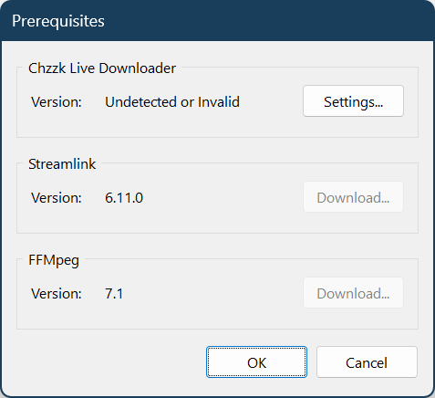
<p><i>(This image may not reflect the latest information.)</i></p>
</div>

You can click `Settings...` button to specify the location of Chzzk Live Downloader, or click `Download` button to install Streamlink or FFmpeg.

<div style='text-align: center'>

<p><i>(This image may not reflect the latest information.)</i></p>
</div>

Click `...` button to choose `ChzzkLiveDownloader.exe` file in the correct path.

<div style='text-align: center'>
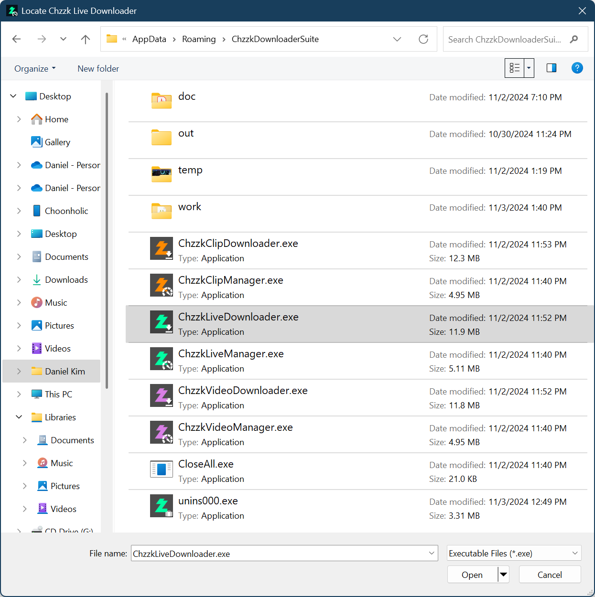
<p><i>(This image may not reflect the latest information.)</i></p>
</div>

When the correct Chzzk Live Downloader is specified, the version information will be displayed as shown in the following figure.

<div style='text-align: center'>
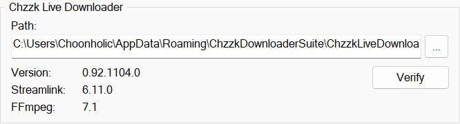
<p><i>(This image may not reflect the latest information.)</i></p>
</div>

## Opening Main Menu
Clicking the ☰ icon located at the top-left corner of the window will open the Main Menu.

<div style='text-align: center'>
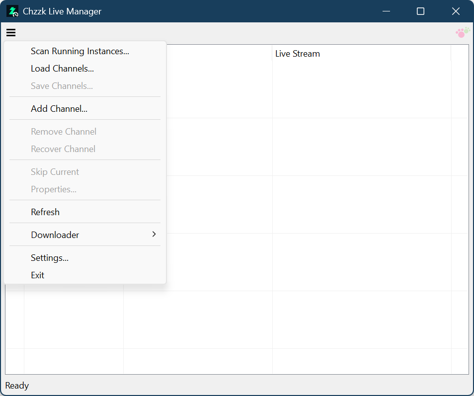
<p><i>(This image may not reflect the latest information.)</i></p>
</div>

<div style='text-align: center'>
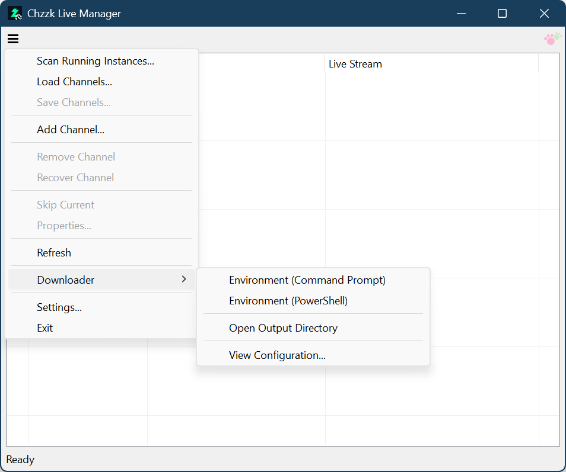
<p><i>(This image may not reflect the latest information.)</i></p>
</div>

## Adding a Channel
When selecting `Add Channel...` from the Main Menu, the Add Channel dialog box will appear. Enter the UID, URL of the channel to be added, or the live streaming URL, then click the `OK` button to add the channel.

<div style='text-align: center'>
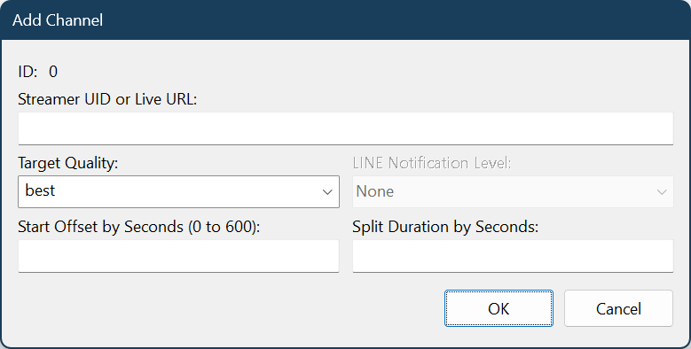
<p><i>(This image may not reflect the latest information.)</i></p>
</div>

Additionally, the following items can be specified in this dialog box:

### Streamer UID / Live URL
Streamer unique identifier will automatically recognize one of the following three values when entered:

* Stream URL - `https://chzzk.naver.com/live/UID`
* Channel URL - `https://chzzk.naver.com/UID`
* Streamer UID - `UID`

### Target Quality
You can enter values such as `best`, `1080p`, or `720p`.

As with Chzzk Live Downloader, if a non-standard resolution is used, set a quality slightly higher than the expected resolution will automatically adjust to the closest available one. (e.g., `1200p` → `1080p`)

### LINE Notification Level
You can check the download status in real time via LINE according to notification level.

* `None` - Notification will be quiet.
* `Brief information and critical errors` - Notifications of brief information and critical errors will be sent.
* `Brief information and all errors` - Notifications of brief information and all errors will be sent.
* `Verbose information and critical errors` - Notifications of verbose information and critical errors will be sent.
* `All information and all errors` - Notifications of all information and all errors will be sent.

### Start Offset
You can set amount of time to skip from the beginning of the stream. By default, the unit of time is seconds. However, you can also set through hours, minutes, seconds and milliseconds as follows.

```powershell
1:23:45.67
1h30m45.67s
```

## Duration and Split Downloading
You can set the stream duration to download and the downloaded stream will be split into the specified duration. By default, the unit of time is seconds. However, you can also set through hours, minutes, seconds and milliseconds as follows.


```powershell
1:23:45.67
1h30m45.67s
```

## Removing the Channel
To remove a channel you no longer wish to manage, select the channel from the list, click the ☰ icon, and choose `Remove Channel`, then click `OK` to confirm to remove.

<div style='text-align: center'>
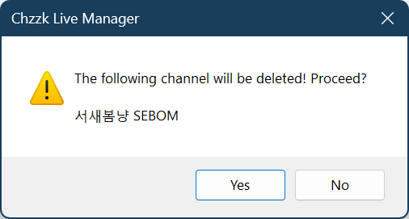
<p><i>(This image may not reflect the latest information.)</i></p>
</div>

If the removed channel was in the middle of a download, the download will stop at the time of removal, and the final processing steps will be completed before saving.

## Recovering the Channel
If the connection between Chzzk Live Downloader and Chzzk Live Manager is lost due to external factors such as abnormal termination of the process, the process can be restarted to re-establish the connection.

<div style='text-align: center'>
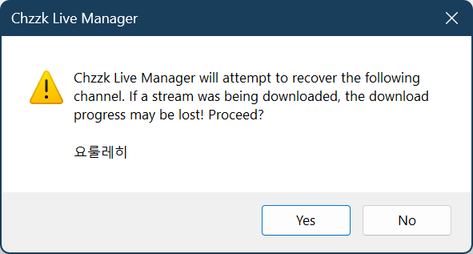
<p><i>(This image may not reflect the latest information.)</i></p>
</div>

If a download was in progress when the connection was lost, the download will be terminated at that point and then restarted.

## Skipping Current Stream
To skip the current live stream without downloading it, select the channel from the list, click the ☰ icon, and choose `Skip Current`, then click `OK` to confirm to skip.

<div style='text-align: center'>
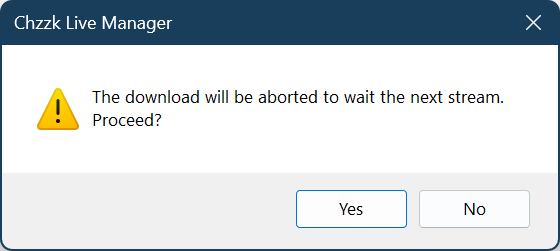
<p><i>(This image may not reflect the latest information.)</i></p>
</div>

## Browsing Channel Properties
To browse the properties of the channel, select the channel from the list, click the ☰ icon, and choose `Properties...`.

<div style='text-align: center'>
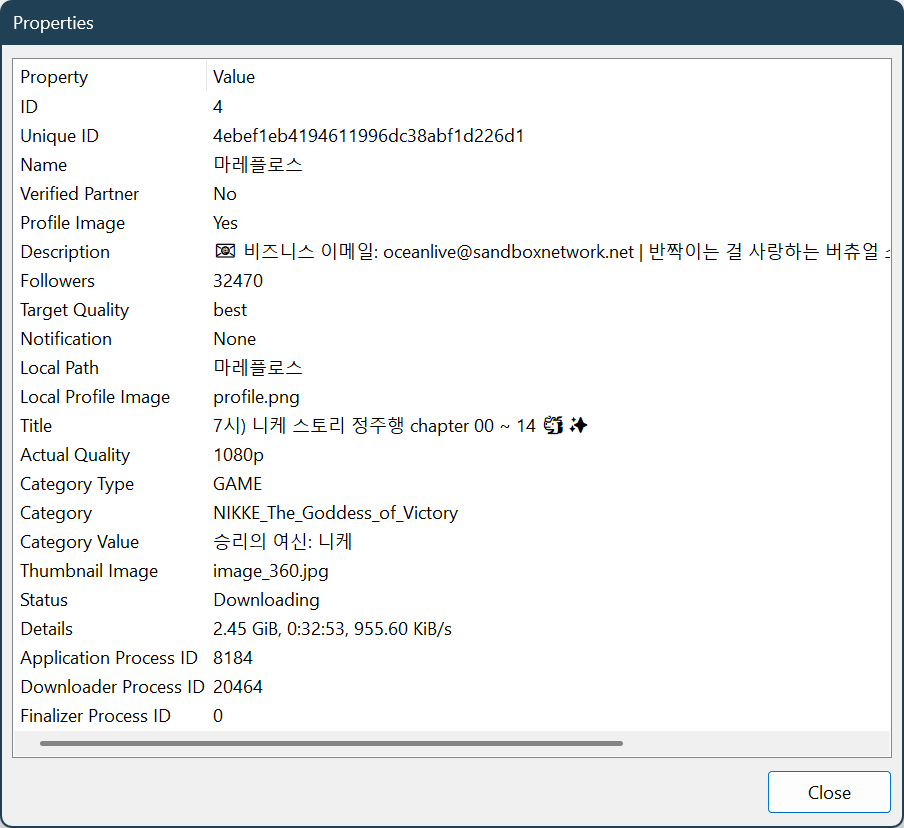
<p><i>(This image may not reflect the latest information.)</i></p>
</div>

## Context Menu
When you select a channel from the list and right-click, a context menu of the channel will appear.

<div style='text-align: center'>
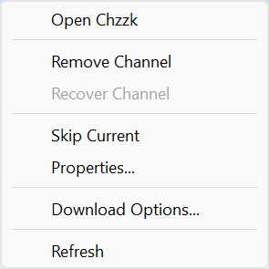
<p><i>(This image may not reflect the latest information.)</i></p>
</div>

## Changing Download Options
You can change the download options in real-time if the channel is not currently downloading.

<div style='text-align: center'>
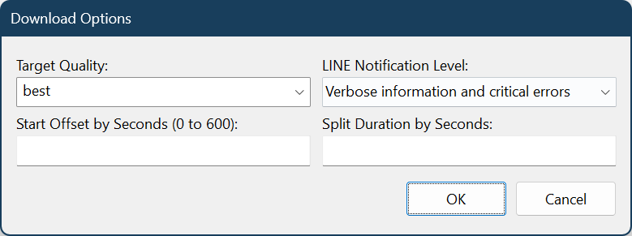
<p><i>(This image may not reflect the latest information.)</i></p>
</div>

## Saving the Channel List
The currently managed channel list can be saved to a list file and loaded later when needed.

If the list contains one or more channels, click the ☰ icon and select `Save Channels...`. A dialog box will appear, allowing you to change the directory and file name where the list will be saved.

<div style='text-align: center'>
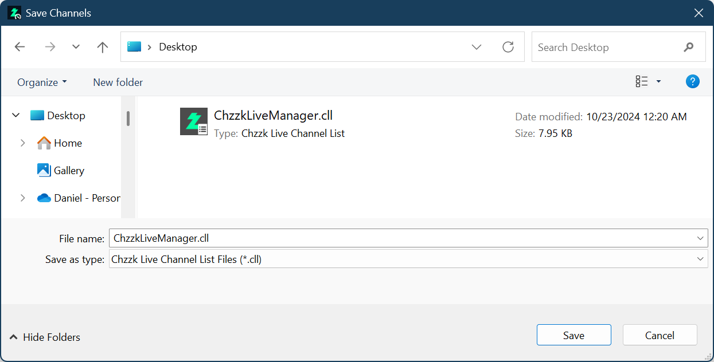
<p><i>(This image may not reflect the latest information.)</i></p>
</div>

After specifying the directory and file name for the channel list, click the **Save** button to save the list.

## Loading the Channel List
Instead of adding channels manually each time, you can load a previously saved channel list.

Click the ☰ icon and select `Load Channels...`. A dialog box will appear, allowing you to choose a channel list file.

<div style='text-align: center'>
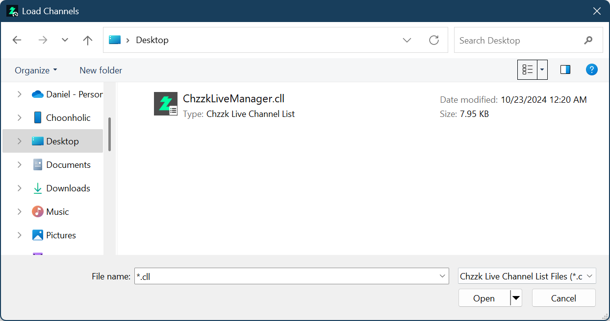
<p><i>(This image may not reflect the latest information.)</i></p>
</div>

If a channel from the loaded list already exists in the current list, it will be automatically recognized and handled accordingly.

## Refreshing List
To refresh the list immediately, click the ☰ icon, and choose `Refresh`.

## Loading the Channel List at Startup Automatically
If you frequently manage a fixed set of channels, manually loading the list each time can become tedious. By enabling the following setting, the specified channel list will be automatically loaded at startup.

* Click the ☰ icon, and choose `Settings...` to open the settings dialog box.
* In the `Startup` tab, check `Load channels at startup`. Then, click the **...** button next to the `Path:` field and select the channel list file you want to load.
* From the next startup onward, the specified channel list will be automatically loaded.

<div style='text-align: center'>
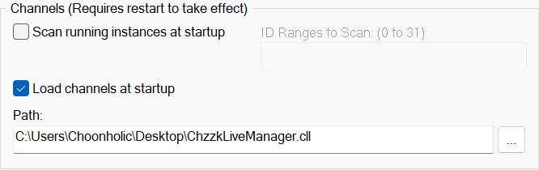
<p><i>(This image may not reflect the latest information.)</i></p>
</div>

## Managing Chzzk Live Downloader Running Externally
Since Chzzk Live Downloader can run independently without Chzzk Live Manager, it may be executed without using Chzzk Live Manager.

However, even in such cases, you can configure the following settings to automatically detect and add the running instance to the channel list for management at startup.

<div style='text-align: center'>
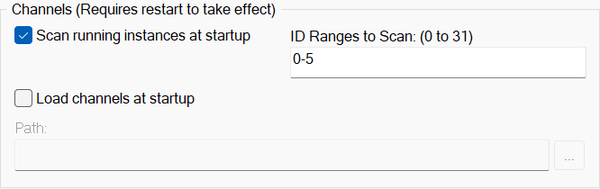
<p><i>(This image may not reflect the latest information.)</i></p>
</div>

* Check `Scan running instances at startup` in the `Startup` tab.
* Set the range of IDs to scan in the `ID Ranges to Scan` field. The ID is the value specified with the `-i` or `--id` parameter when running Chzzk Live Downloader. For example, if it was run as shown below, specify `3` in the scan range.

  ```
  ChzzkLiveDownloader -i 3
  ```

* You can specify an ID range from 0 to 31, and the IDs or ranges can be entered as follows:

  ```
  ~3, 6, 8-10, 13~15
  ```

* In the example above, the IDs scanned will be `0, 1, 2, 3, 6, 8, 9, 10, 13, 14, 15`.

* If both channel scanning and channel list loading are enabled, it will first scan for running channels and then load the channel list, filling in any gaps by adding new channels.

## Opening Chzzk Downloader Environment
To open Chzzk Downloader Environment, click the ☰ icon, and choose `Open Environment (Command Prompt)` or `Open Environment (PowerShell)` under `Downloader`.

<div style='text-align: center'>
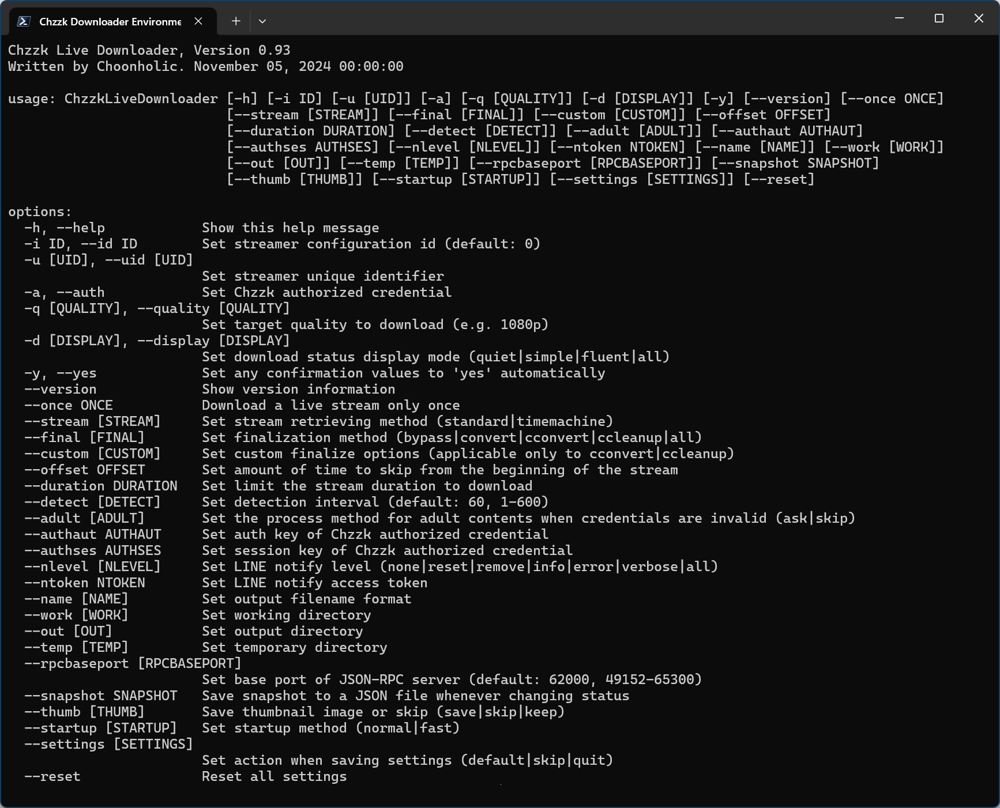
<p><i>(This image may not reflect the latest information.)</i></p>
</div>

## Opening the Output Directory
To open the output directory for downloaded streams, click the ☰ icon, and choose `Open Output Directory` under `Downloader`.

## Viewing Downloader Configuration
To view configuration of Chzzk Live Downloader, click the ☰ icon, and choose `View Configuration...` under `Downloader`.

<div style='text-align: center'>
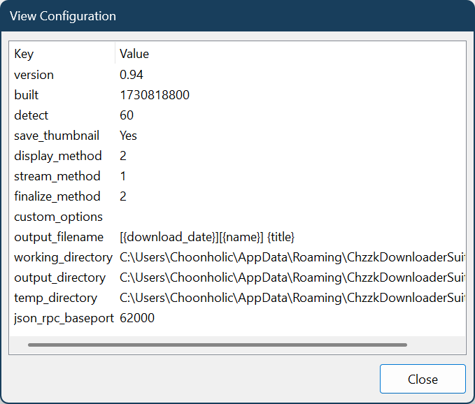
<p><i>(This image may not reflect the latest information.)</i></p>
</div>

## Chzzk Live Downloader Shutdown Method on Exit
You can choose whether to allow Chzzk Live Downloader to continue downloading in the background or to shut down all instances along with Chzzk Live Manager when exiting.

<div style='text-align: center'>
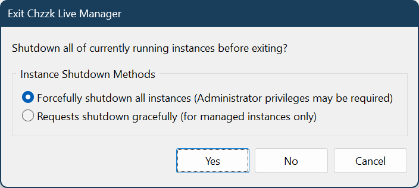
<p><i>(This image may not reflect the latest information.)</i></p>
</div>

If the confirm dialog appears upon exit, it means the following conditions are met:

* There are managed channels in the channel list.
* One or more instances of Chzzk Live Downloader are running externally.

To forcefully shutdown all instances, including those running externally:
* Choose the `Forcefully shutdown all instances (Administrator privileges may be required)`, then click **Yes**.
* This is the default shutdown method.

To quit only the channels currently managed by the list:
* Choose `Requests shutdown gracefully (for managed instances only)`, then click **Yes**.

To allow downloads to continue running in the background:
* Click **No**.

To continue using Chzzk Live Manager:
* Click **Cancel**.

You can preset this feature in the `Downloader` tab of the settings, instead of choosing it each time on exit.

## Moving to Tray on Minimize
If the `Move to tray on minimize` option is enabled in `Features` settings, Chzzk Live Manager will move to the system tray when minimized.

<div style='text-align: center'>
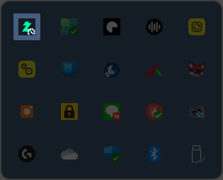
<p><i>(This image may not reflect the latest information.)</i></p>
</div>

Double-clicking tray icon will restore the window to its original state, and right-clicking on the tray icon will display a menu, as shown in the following image.

<div style='text-align: center'>
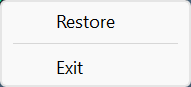
<p><i>(This image may not reflect the latest information.)</i></p>
</div>

## Set Custom Finalize Options
If extra options are set in the `Custom Finalize Options` parameter in the `Downloader` settings, those options will be passed to `FFmpeg` during the finalization process. For example, the following options enable `FFmpeg` to encode using the `H.265` codec:

```powershell
-c:v libx265 -preset medium -crf 23 -c:a aac -b:a 128k
```

Please note that custom encoding is not recommended due to its suboptimal performance. For tter results, consider using external professional encoders.

## Other Settings

### Startup

<div style='text-align: center'>
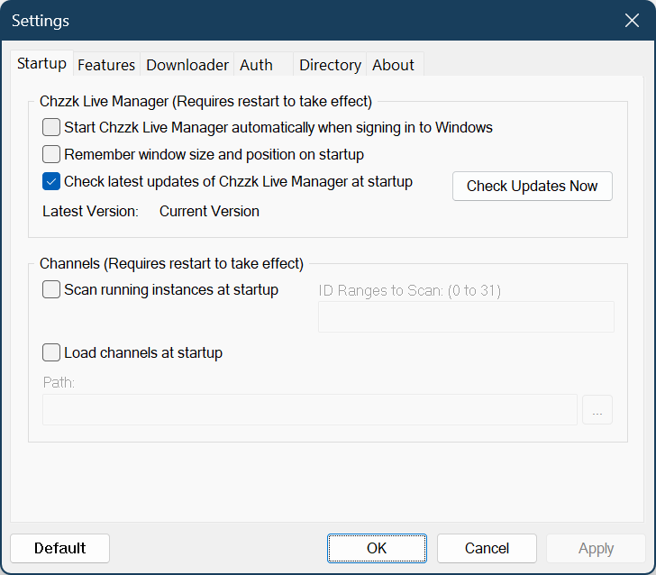
<p><i>(This image may not reflect the latest information.)</i></p>
</div>

* **Start Chzzk Live Manager automatically when signing in to Windows** - Puts Chzzk Live Manager into startup list of Windows.
* **Remember window size and position on startup** - Saves the window size and position on exit and restores them on the next launch.
* **Check latest updates of Chzzk Live Manager at startup** - Decides whether check latest updates of Chzzk Live Manager at startup or not. Otherwise, Click `Check Updates` button to check updates manually.

### Features

<div style='text-align: center'>
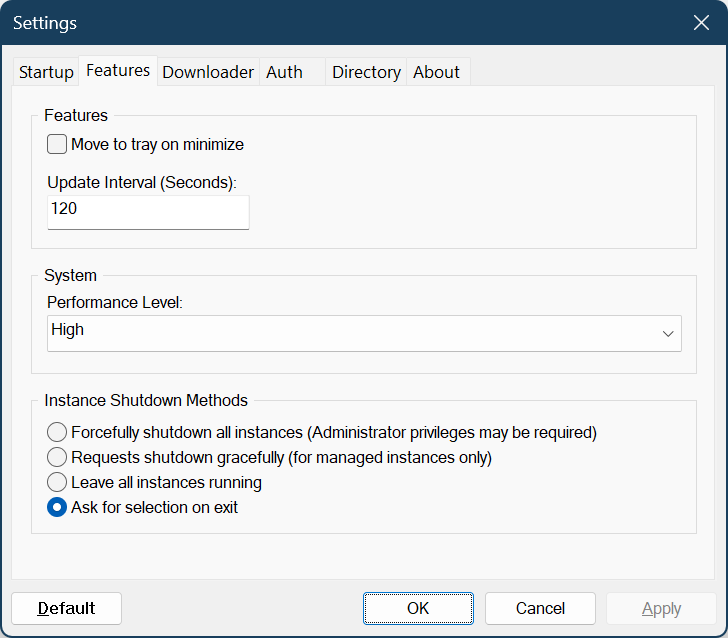
<p><i>(This image may not reflect the latest information.)</i></p>
</div>

* **Update Interval (Seconds)** - Sets the screen refresh interval for the list. This only affects the display and is not related to the download detection interval. The download detection interval of Chzzk Live Downloader is set to 10 seconds by default and is designed to avoid being impacted by API rate limits, unlike other tools.
* **Performance Level** - Specify the performance of the system where Chzzk Live Manager is currently running. If you encounter errors due to timeouts when adding or refreshing channels, try lowering the performance level by one step and attempt again.
* **Instance Shutdown Methods** - The Shutdown Method can be predefined, eliminating the need to select it each time in the Exit dialog.

### Downloader

<div style='text-align: center'>
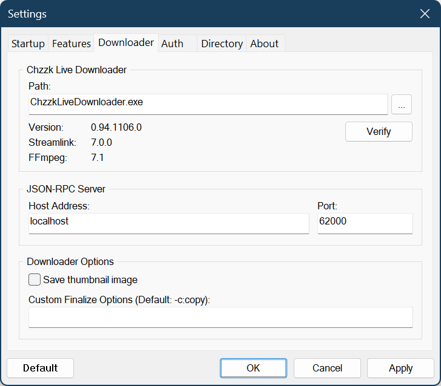
<p><i>(This image may not reflect the latest information.)</i></p>
</div>

* **JSON-RPC Server: Host Address** - Sets the host address of the JSON-RPC server.
* **JSON-RPC Server: Port** - Sets the port number for the JSON-RPC server.
* **Save thumbnail image** - Checks to save thumbnail images separately.

### Directory

<div style='text-align: center'>
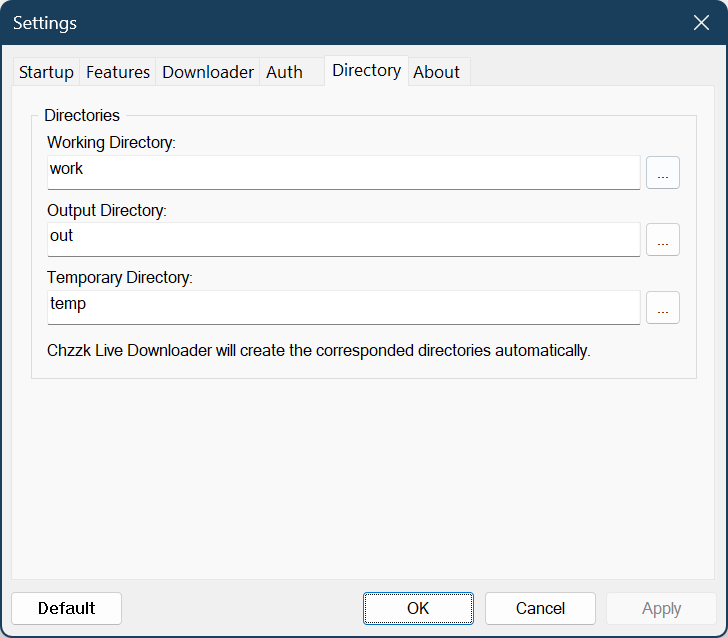
<p><i>(This image may not reflect the latest information.)</i></p>
</div>

* **Working Directory** - Specifies the directory where the configuration files of Chzzk Live Downloader are saved.
* **Output Directory** - Specifies the directory where downloaded stream files are saved.
* **Temporary Directory** - Specifies the directory where temporary files are created.

### About

<div style='text-align: center'>
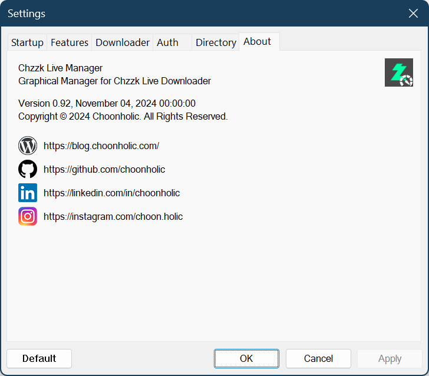
<p><i>(This image may not reflect the latest information.)</i></p>
</div>

* **Version Information** - Displays version information of Chzzk Live Manager.
* **Contact Links** - Links to contact to authors.

## Contact Us
If you have any questions, bug reports, or improvement requests regarding the Chzzk Downloader Suite, please submit them through [GitHub](https://github.com/Choonholic/ChzzkDownloader/)‘s [Issues](https://github.com/Choonholic/ChzzkDownloader/issues/new) feature. We can respond to all languages; however, the languages we directly support are Korean, English, Japanese, and Chinese. For other languages, responses may not be fully accurate due to the use of machine translation.

치지직 다운로드 도구에 대해 궁금한 사항, 제보할 오류, 개선 요청 사항 등이 있을 때는 [GitHub](https://github.com/Choonholic/ChzzkDownloader/)의 [Issues](https://github.com/Choonholic/ChzzkDownloader/issues/new) 기능을 통해 제보해 주세요. 모든 언어에 대응 가능하나, 직접 대응 가능한 언어는 한국어, 영어, 일본어, 중국어이며, 다른 언어는 기계 번역을 통하기 때문에 100% 대응이 불가능할 수 있습니다.

Chzzk Downloader Suiteに関するご質問、バグ報告、または改善要望がございましたら、[GitHub](https://github.com/Choonholic/ChzzkDownloader/)の[Issues](https://github.com/Choonholic/ChzzkDownloader/issues/new)機能を通じてお知らせください。全ての言語に対応可能ですが、直接対応可能な言語は韓国語、英語、日本語、中国語です。他の言語については、機械翻訳を通じて対応するため、100%正確に対応できない場合があります。

如果您对Chzzk Downloader Suite有任何疑问、错误报告或改进建议，请通过[GitHub](https://github.com/Choonholic/ChzzkDownloader/)的[Issues](https://github.com/Choonholic/ChzzkDownloader/issues/new)功能提交反馈。我们可以应对所有语言，但我们直接支持的语言是韩语、英语、日语和中文。对于其他语言，由于通过机器翻译处理，可能无法做到百分之百的准确响应。
