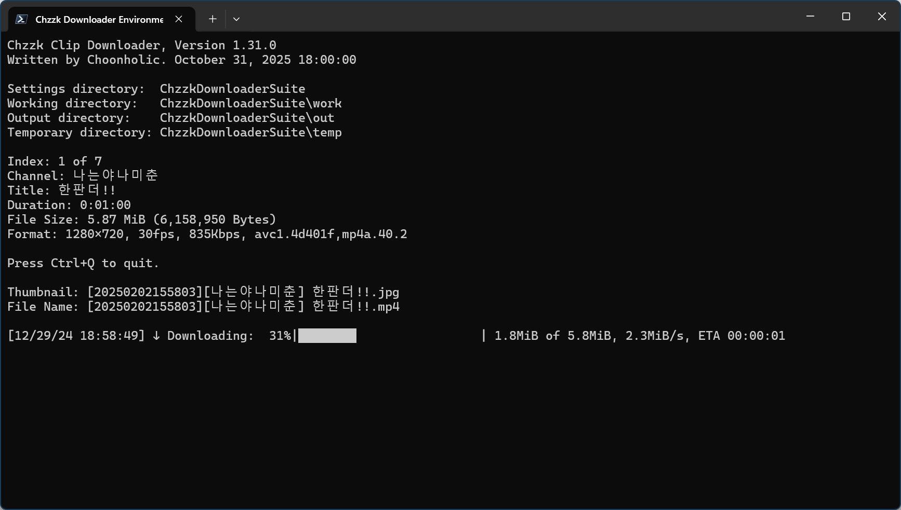

# Chzzk Clip Downloader
Downloader for Chzzk clips

<div style='text-align: center'>

<p><i>(This image may not reflect the latest information.)</i></p>
</div>

## Version
Version 1.8.0, January 18, 2025 00:00:00

## Usage
```powershell
ChzzkClipDownloader [-h] [--version] [-i INPUT] [-a [AUTH]] [--authaut AUTHAUT] [--authses AUTHSES]
                    [--adult [ADULT]] [-y] [-d [DISPLAY]] [--info INFO] [--name [NAME]] [--work [WORK]]
                    [--work-user [WORK_USER]] [--work-pass [WORK_PASS]] [--out [OUT]] [--out-user [OUT_USER]]
                    [--out-pass [OUT_PASS]] [--temp [TEMP]] [--temp-user [TEMP_USER]]
                    [--temp-pass [TEMP_PASS]] [--category [CATEGORY]] [--exist [EXIST]]
                    [--threshold [THRESHOLD]] [--rpc] [--rpcid [RPCID]] [--rpcport [RPCPORT]]
                    [--snapshot SNAPSHOT] [--download [DOWNLOAD]] [--thumb [THUMB]] [--startup [STARTUP]]
                    [--settings [SETTINGS]] [--reset]
                    [clip]
```

### Positional Arguments
```
clip                    Clip UID or URL to download
```

### Options
```
-h, --help              Show this help message
--version               Show version information
-i, --input INPUT       Set the download list file
-a, --auth [AUTH]       Set Chzzk authentication credential control method (reuse|reissue|ignore)
--authaut AUTHAUT       Set auth key of Chzzk authentication credential
--authses AUTHSES       Set session key of Chzzk authentication credential
--adult [ADULT]         Set the process method for adult contents when credentials are invalid (ask|skip)
-y, --yes               Set any confirmation values to 'yes' automatically
-d, --display [DISPLAY] Set display mode (quiet|simple|fluent|all)
--info INFO             Retrieve clip information without downloading
--name [NAME]           Set output filename format
--work [WORK]           Set working directory
--work-user [WORK_USER] Set username to use when working directory is on remote network
--work-pass [WORK_PASS] Set password to use when working directory is on remote network
--out [OUT]             Set output directory
--out-user [OUT_USER]   Set username to use when output directory is on remote network
--out-pass [OUT_PASS]   Set password to use when output directory is on remote network
--temp [TEMP]           Set temporary directory
--temp-user [TEMP_USER] Set username to use when temporary directory is on remote network
--temp-pass [TEMP_PASS] Set password to use when temporary directory is on remote network
--category [CATEGORY]   Set output categorize method (none|streamer)
--exist [EXIST]         Set how to save when the target file already exists (rename|skip|overwrite)
--threshold [THRESHOLD] Set the threshold % for stopping downloads when disk space is low (disable: -, default: 10, 3-30)
--rpc                   Activate JSON-RPC server
--rpcid [RPCID]         Set ID of JSON-RPC server (default: 50)
--rpcport [RPCPORT]     Set port of JSON-RPC server (default: 64000, 49152-65300)
--snapshot SNAPSHOT     Save snapshot to a JSON file whenever changing status
--download [DOWNLOAD]   Set download method (default|atxc|alter)
--thumb [THUMB]         Save thumbnail image or skip (save|skip)
--startup [STARTUP]     Set startup method (normal|fast)
--settings [SETTINGS]   Set action when saving settings (default|skip|quit)
--reset                 Reset all settings
```

## Example
```powershell
ChzzkClipDownloader C46IcpG11p --thumb save --work work --out out --temp temp
```

## Setup Clips to Download
The Clip UID or URL can be set directly to download a clip.

For example, Clip UID is **C46IcpG11p** if clip URL is https://chzzk.naver.com/clips/C46IcpG11p. To download this clip, use the following commands.

```powershell
ChzzkClipDownloader C46IcpG11p
ChzzkClipDownloader https://chzzk.naver.com/clips/C46IcpG11p
```

If you want to download several clips sequentially, you can create a list file as following, then save as a text file encoded as UTF-8. (e.g. `list.txt`)

```python
# List Samples
https://chzzk.naver.com/clips/YY9plBpybL
C46IcpG11p
https://chzzk.naver.com/clips/gTSq4c8HaQ
https://chzzk.naver.com/clips/nZbWU27D95
```

Then, use the following commands to download.

```powershell
ChzzkClipDownloader -i list.txt
ChzzkClipDownloader --input list.txt
```

## Resetting Authentication Credential
To download a clip that requires NAVER authentication credential, such as an adult-only clip, you must specify the following information.

* NAVER ID Authorization Key from Chzzk cookie (`NID_AUT`)
* NAVER ID Session Key from Chzzk cookie (`NID_SES`)

When the authentication credential is not found when downloading a clip that requires it, a prompt to enter your authorization will be activated.

If you enter these values, they will be set as defaults, and subsequent runs will use them without further input. For more information on how to get Chzzk authentication credential, please refer to `how_to_get_chzzk_credential.en-US.pdf`.

If your authentication credential has been changed, or if you need to reset them by logging in with a different ID, use the following commands.

```powershell
ChzzkClipDownloader clip_uid or url -a reset
ChzzkClipDownloader clip_uid or url --auth reset
```

If you need to temporarily ignore authentication credential, use the following commands.

```powershell
ChzzkClipDownloader clip_uid or url -a ignore
ChzzkClipDownloader clip_uid or url --auth ignore
```

With `-y` or `--yes` parameters, a prompt to enter the authorization will be activated automatically without any confirmation.

```powershell
ChzzkClipDownloader clip_uid or url -y
ChzzkClipDownloader clip_uid or url --yes
```

## Setting Output Filename Format
By default, the filename of clips and thumbnails to be saved will be `[{download_date}][{name}] {title}`. If you want to change this format, use the following command.

```powershell
ChzzkClipDownloader clip_uid or url --name "[{name}][{category}] {title}"
```

If you want to set this option to default, just use `--name` without format like below.

```powershell
ChzzkClipDownloader clip_uid or url --name
```

### Filename Format Tags
The following pre-defined tags can be used for filename format.

* `{name}` - Channel Name.
* `{verified}` - If channel is verified one, this tag will be `[✓]` or empty.
* `{clip_uid}` - Clip UID.
* `{title}` - Title of the clip.
* `{download_date...}` - Date-related tags when the stream started.
* `{media...}` - Media information-related tags.

For the media-related tags, the following elements are available.

* `{media_quality}` - Media Quality. (e.g. `1080p`)
* `{media_video_width}` - Video width as pixels. (e.g. `1920`)
* `{media_video_height}` - Video height as pixels. (e.g. `1080`)
* `{media_video_bitrate}` - Video bitrate as bit-per-second. (e.g. `8000000`)
* `{media_audio_bitrate}` - Audio bitrate as bit-per-second. (e.g. `192000`)
* `{media_video_codec}` - Video codec. (e.g. `H264`)

For the date-related tags, the detailed elements can be expanded as below.

* `{..._date}` - Date with `%Y%m%d%H%M%S` format. (e.g. `20240607014327`)
* `{..._date_year}` or `{..._date_year_full}` - Year with century as a decimal number. (e.g. `2024`)
* `{..._date_year_short}` - Year without century as a zero-padded decimal number. (e.g. `24`)
* `{..._date_month}` - Month as a zero-padded decimal number. (`01`, `02`, ..., `12`)
* `{..._date_month_full}` - Month as full name. (`January`, `February`, ..., `December`)
* `{..._date_month_short}` - Month as abbreviated name. (`Jan`, `Feb`, ..., `Dec`)
* `{..._date_day}` - Day of the month as a zero-padded decimal number. (`01`, `02`, ..., `31`)
* `{..._date_hour}` - Hour (24-hour clock) as a zero-padded decimal number. (`00`, `01`, ..., `23`)
* `{..._date_minute}` - Minute as a zero-padded decimal number. (`00`, `01`, ..., `59`)
* `{..._date_second}` - Second as a zero-padded decimal number. (`00`, `01`, ..., `59`)

## Handling Thumbnail Images
To save thumbnail images separately, use the following command.

```powershell
ChzzkClipDownloader clip_uid or url --thumb save
```

To turn off this feature, use the following command.

```powershell
ChzzkClipDownloader clip_uid or url --thumb skip
```

## Set Display Mode
By default, fluent details will be displayed. However, if you don't need the details, you can use the following command to supress them.

```powershell
ChzzkClipDownloader clip_uid or url -d quiet
ChzzkClipDownloader clip_uid or url --display quiet
```

The following display methods can be set with options of `--display` parameter.

* `quiet` - Suppress all details.
* `simple` - Show simplified details only.
* `fluent` - Show fluent details.
* `all` - Show all details.

If you want to set this option to default, just use `-d` or `--display` like below.

```powershell
ChzzkClipDownloader clip_uid or url -d
ChzzkClipDownloader clip_uid or url --display
```

## Set Working Directory
You can use the following command to specify the directory where required files are stored to work properly.

```powershell
ChzzkClipDownloader clip_uid or url --work work
```

If you want to set this option to default, just use `--work` without directory like below.

```powershell
ChzzkClipDownloader clip_uid or url --work
```

## Set Output Directory
You can use the following command to specify the directory where downloaded files are saved.

```powershell
ChzzkClipDownloader clip_uid or url --out out
```

By default, all files are categorized and saved in subdirectories by streamer. If you want to save files without categorizing them by streamer, use the following command.

```powershell
ChzzkClipDownloader clip_uid or url --category none
```

If you want to set this option to default, just use `--out` and `--category` without options like below.

```powershell
ChzzkClipDownloader clip_uid or url --out --category
```

## Set Temporary Directory
You can use the following command to specify the temporary directory where the files being downloaded are saved.

```powershell
ChzzkClipDownloader clip_uid or url --temp temp
```

If you want to set this option to default, just use `--temp` without like below.

```powershell
ChzzkClipDownloader clip_uid or url --temp
```

## Directory Specification
You can specify directories in several ways as follows.

```powershell
ChzzkClipDownloader clip_uid or url --temp temp
```

Specifies the `temp` directory under the current directory where the executable is located as the temporary directory. If the directory does not exist, it will be created.

```powershell
ChzzkClipDownloader clip_uid or url --work \Users\Username\Documents\chzzk_work
```

Specifies the `\Users\Username\Documents\chzzk_work` directory on current drive as the working directory. If the directory does not exist, it will be created.

```powershell
ChzzkClipDownloader clip_uid or url --work C:\Users\Username\Documents\chzzk_work
```

Of course, you can specify the drive (e.g. `C:`) directly as shown above.

```powershell
ChzzkClipDownloader clip_uid or url --out \\192.168.0.1\chzzk\out
```

Specifies the `\\192.168.0.1\chzzk\out` directory on a network storage based on a UNC path as the output directory. If the directory does not exist, it will be created.

When saving files to network storage, you may need to enter a username and password to connect to the network storage. This information can be specified as follows.

```powershell
ChzzkClipDownloader clip_uid or url --work-user username --work-pass password
ChzzkClipDownloader clip_uid or url --out-user username --out-pass password
ChzzkClipDownloader clip_uid or url --temp-user username --temp-pass password
```

## Set how to save when the target file already exists
By default, when a file with the same name already exists, the file is saved with `(n)` appended to its name. However, you can use the following command to overwrite the file or skip download itself instead.

```powershell
ChzzkClipDownloader clip_uid or url --exist overwrite
ChzzkClipDownloader clip_uid or url --exist skip
```

If you want to set this option to default, just use `--exist` without like below.

```powershell
ChzzkClipDownloader clip_uid or url --exist
```

## Set the threshold % for stopping downloads when disk space is low
By default, downloading will stop if the free space in the storage directory or temporary directory drops below 10%. To set the free disk space threshold, use the following command. The acceptable range is `3` to `30`.

```powershell
ChzzkClipDownloader clip_uid or url --threshold 20
```

To disable the feature that stops downloads based on free disk space, use the following command.

```powershell
ChzzkClipDownloader clip_uid or url --threshold -
```

If you want to set this option to default, just use `--threshold` without like below.

```powershell
ChzzkClipDownloader clip_uid or url --threshold
```

## Set Download Method
A lightweight download module was included as an alternative. To try out the alternative module, use the following command.

```powershell
ChzzkClipDownloader clip_uid or url --download alter
```

## Set Action When Saving Settings
All options are always saved to configuration files by default. If you want to apply settings to current session only without saving, use the following command.

```powershell
ChzzkClipDownloader --settings skip
```

However, the following information is always saved.

* NAVER ID Authorization key from Chzzk cookie (`NID_AUT`)
* NAVER ID Session key from Chzzk cookie (`NID_SES`)

If you want to save the settings without downloading and exit, use the following command.

```powershell
ChzzkClipDownloader --settings quit
```

## Resetting All Configurations
Over time, you may find that you've mixed things up and want to reset your settings. To reset all configurations, use the following command.

```powershell
ChzzkClipDownloader --reset
```

This will reset the following information.

* NAVER ID Authorization key from Chzzk cookie (`NID_AUT`)
* NAVER ID Session key from Chzzk cookie (`NID_SES`)
* Settings for Saving thumbnail image
* Settings for displaying download details
* Settings for output and temporary directories

## Display Version Information
You can check the version information by using the following command.

```powershell
ChzzkClipDownloader --version
```

## Getting help
You can use the following command to get simple parameter help.

```powershell
ChzzkClipDownloader -h
ChzzkClipDownloader --help
```

## Parameter precedence
Except `--reset`, `-h` and `--version`, the parameters can be used in any order as shown below. However, multiple copies of the same parameter cannot be assigned.

```powershell
ChzzkClipDownloader C46IcpG11p --out out
```

The `-h` and `--version` parameters are processed only with the first one used, and then terminated immediately afterward. Therefore, the following command will output only the version information.

```powershell
ChzzkClipDownloader --version -h
```

The `--reset` parameter resets the settings, ignoring any previously set values, then exits. Therefore, the clip UID will be ignored in the following command.

```powershell
ChzzkClipDownloader C46IcpG11p --reset
```

## Recommended Initial Settings
The following settings are recommeneded for the first use. The following command will set working directory (`--work`), output directory (`--out`), temporary directory (`--temp`) at once to making it easy to organize the downloaded clip files.

```powershell
ChzzkClipDownloader clip_uid or url --work work --out out --temp temp
```

## Controlling Externally Using JSON-RPC
Please read `how_to_control_chzzk_clip_downloader.en-US.pdf` for detailed information.

## Contact Us
If you have any questions, bug reports, or improvement requests regarding the Chzzk Downloader Suite, please submit them through [GitHub](https://github.com/Choonholic/ChzzkDownloader/)‘s [Issues](https://github.com/Choonholic/ChzzkDownloader/issues/new) feature. We can respond to all languages; however, the languages we directly support are Korean, English, Japanese, and Chinese. For other languages, responses may not be fully accurate due to the use of machine translation.
