# Chzzk Clip Manager
Graphical Manager for Chzzk Clip Downloader

<i>(This image may not reflect the latest information.)</i>

## Version
Version 1.36.0, January 15, 2026 00:00:00

## Prerequisites
Since Chzzk Clip Manager is the GUI frontend application for Chzzk Clip Downloader, Chzzk Clip Downloader must be installed as well.

If the Chzzk Clip Downloader and Chzzk Clip Manager are in the same directory, Chzzk Clip Manager will automatically recognize Chzzk Clip Downloader upon execution. Otherwise, you will need to specify the location of Chzzk Clip Downloader by referring to the **Verifying Prerequisites** section.

For portable versions, consider storing both Chzzk Clip Downloader and Chzzk Clip Manager in the same directory for convenience. If installed using the `Setup`, both will be installed in the same directory.

## How To Execute
Click `Chzzk Clip Manager` in Start menu, or execute `ChzzkClipManager.exe` in `Chzzk Downloader Environment`.

## Verifying Prerequisites
Chzzk Clip Manager requires Chzzk Clip Downloader to be properly set up for full functionality. When Chzzk Clip Manager starts, it checks whether this prerequisite is met, and if not, it will display the following dialog.

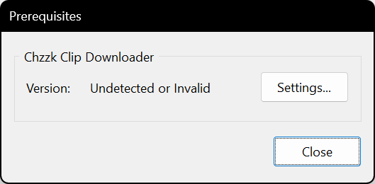

<i>(This image may not reflect the latest information.)</i>

You can click `Settings...` button to specify the location of Chzzk Clip Downloader.

<i>(This image may not reflect the latest information.)</i>

Click `...` button to choose `ChzzkClipDownloader.exe` file in the correct path. When the correct Chzzk Clip Downloader is specified, the version information will be displayed as shown in the following figure.

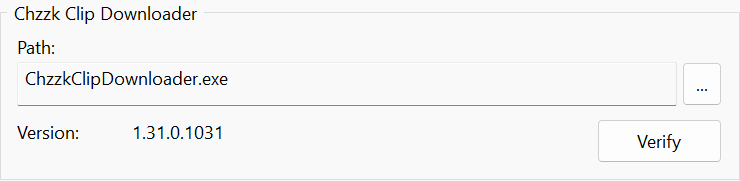

<i>(This image may not reflect the latest information.)</i>

## Opening Main Menu
Clicking the ☰ icon located at the top-left corner of the window will open the Main Menu.

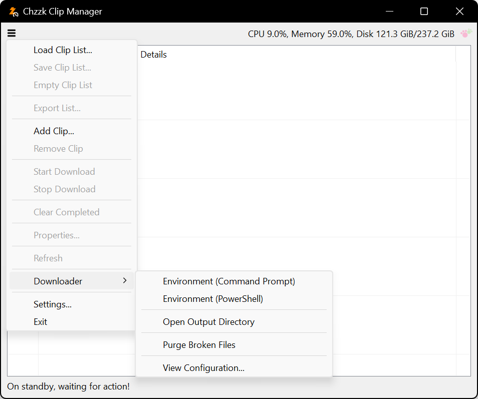

<i>(This image may not reflect the latest information.)</i>

## Adding a Clip
To add a clip, click the ☰ icon, and choose `Add Clip...`, then Add Clip dialog box will appear. Enter the clip UID or URL of the clip to be added, then click the `OK` button.

<i>(This image may not reflect the latest information.)</i>

### Clip UID / Clip URL
Clip UID will automatically recognize one of the following values when entered:

* Clip URL - `https://chzzk.naver.com/Clips/UID`
* Clip UID - `UID`

## Removing the Clip
To remove a clip, select the clip from the list, click the ☰ icon, and choose `Remove Clip`, then click `OK` to confirm to remove.

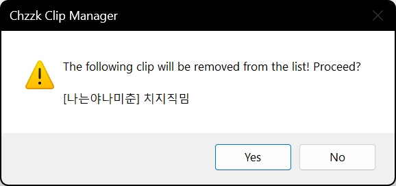

<i>(This image may not reflect the latest information.)</i>

## Starting Download
To start download the clips of the list, click the ☰ icon, and choose `Start Download`.

## Stopping Download
To stop download the clips of the list, click the ☰ icon, and choose `Stop Download`, then click 'OK' to confirm to stop.

<i>(This image may not reflect the latest information.)</i>

If a download was in progress when stopping, all remaining downloads will be aborted.

## Clearing Completed Downloads
To clear the completed downloads from the list, click the ☰ icon, and choose `Clear Completed`.

<i>(This image may not reflect the latest information.)</i>

This function is available only when the downloads are stopped midway or after it has been completed.

## Browsing Clip Properties
To browse the properties of the clip, select the clip from the list, click the ☰ icon, and choose `Properties...`.

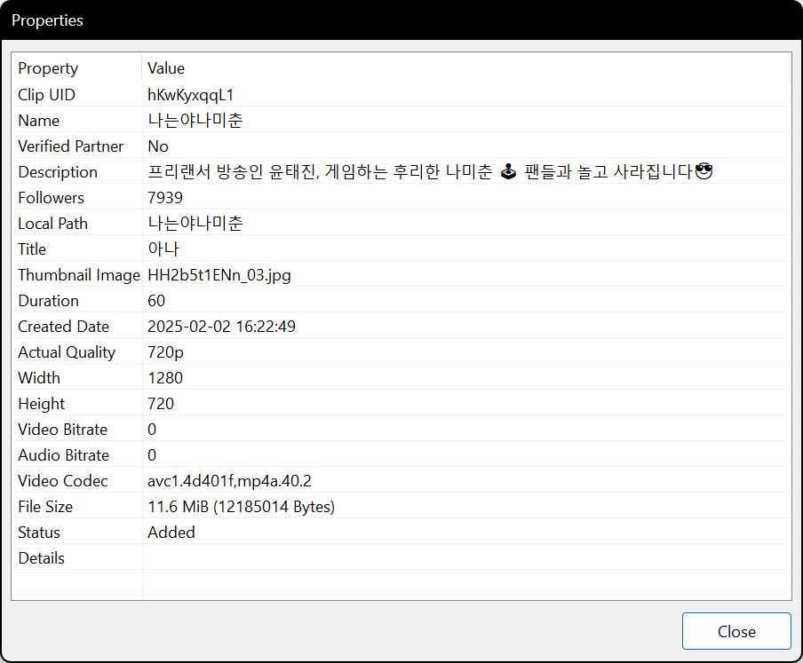

<i>(This image may not reflect the latest information.)</i>

## Context Menu
When you select a clip from the list and right-click, a context menu of the clip will appear.

<i>(This image may not reflect the latest information.)</i>

## Saving the Clip List
The clip list can be saved to a list file and loaded later when needed.

If the list contains one or more clips, click the ☰ icon and select `Save Clip List...`, then a file dialog box will appear, allowing you to change the directory and file name where the list will be saved.

## Loading the Clip List
Instead of adding clips manually each time, you can load a previously saved clip list.

Click the ☰ icon and select `Load Clip List...`. A dialog box will appear, allowing you to choose a clip list file.

If a clip from the loaded list already exists in the current list, it will be automatically recognized and handled accordingly.

## Refreshing List
To refresh the list immediately, click the ☰ icon, and choose `Refresh`.

## Opening Chzzk Downloader Environment
To open Chzzk Downloader Environment, click the ☰ icon, and choose `Open Environment (Command Prompt)` or `Open Environment (PowerShell)` under `Downloader`.

## Opening the Output Directory
To open the output directory for downloaded clips, click the ☰ icon, and choose `Open Output Directory` under `Downloader`.

## Purging Broken Files
If an abnormal situation occurs—such as a network disconnection or system shutdown during download—broken files may remain in the temporary directory.
To remove any remaining broken files, click the ☰ icon, and choose `Purge Broken Files` under `Downloader`.

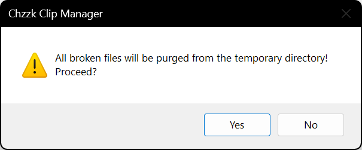

<i>(This image may not reflect the latest information.)</i>

## Viewing Downloader Configuration
To view configuration of Chzzk Clip Downloader, click the ☰ icon, and choose `View Configuration...` under `Downloader`.

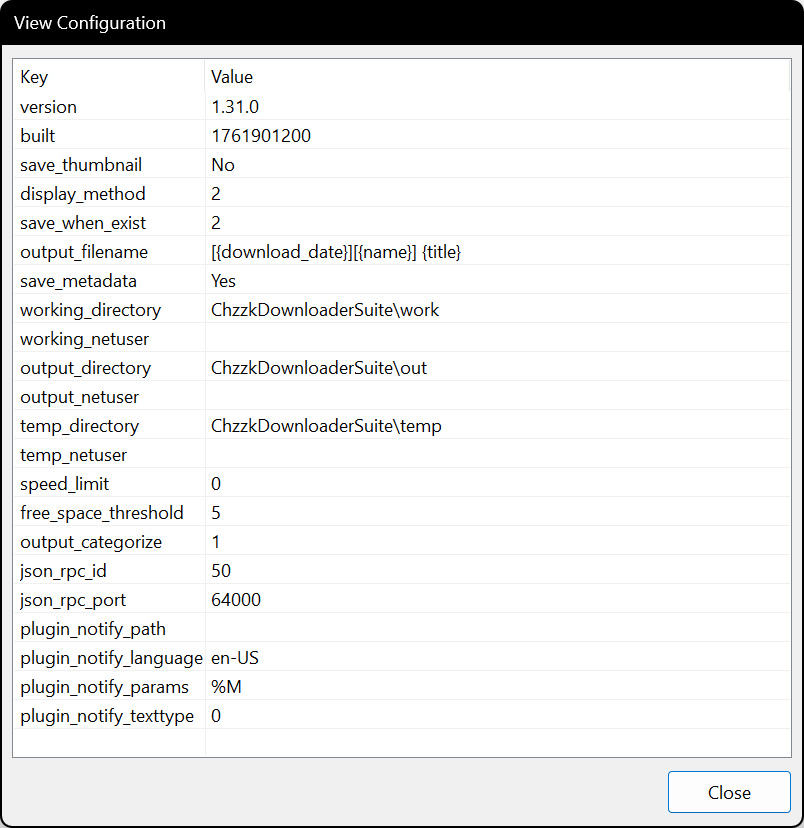

<i>(This image may not reflect the latest information.)</i>

## Moving to Tray on Minimize
If the `Move to tray on minimize` option is enabled in `Features` settings, Chzzk Clip Manager will move to the system tray when minimized.

<i>(This image may not reflect the latest information.)</i>

Double-clicking tray icon will restore the window to its original state, and right-clicking on the tray icon will display a menu, as shown in the following image.

<i>(This image may not reflect the latest information.)</i>

## Other Settings

### Startup

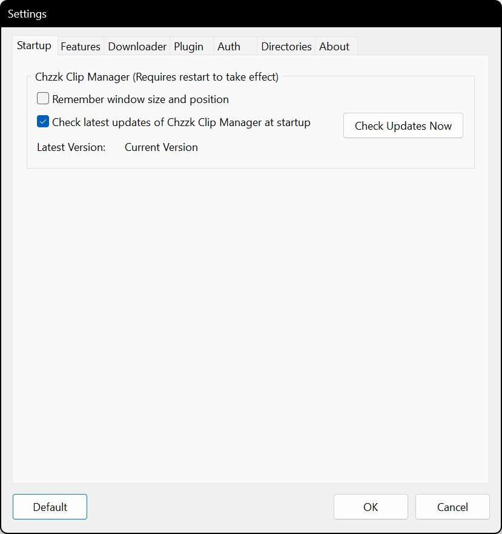

<i>(This image may not reflect the latest information.)</i>

* **Remember window size and position on startup** - Saves the window size and position on exit and restores them on the next launch.
* **Check latest updates of Chzzk Clip Manager at startup** - Decides whether check latest updates of Chzzk Clip Manager at startup or not. Otherwise, Click `Check Updates` button to check updates manually.

### Features

<i>(This image may not reflect the latest information.)</i>

* **Update Interval (Seconds)** - Sets the screen refresh interval for the list.
* **Stop downloading if free space is less than** - Sets the stop threshold when disk space is low, using either a percentage (%) or a size value. When using a size value, you can specify SI units (KB, MB, GB...) or IEC units (KiB, MiB, GiB...). You may also specify prefixes only (K, Ki, M, Mi, G, Gi...). Of course, you can also specify the value in bytes without any unit.
Sets the threshold % for stopping downloads when disk space is low.
* **Sleep Mode** - Sets the system's sleep mode while the Chzzk Clip Manager is running.
* **Performance Level** - Specify the performance of the system where Chzzk Clip Manager is currently running. If you encounter errors due to timeouts when adding or refreshing clips, try lowering the performance level by one step and attempt again.
* **Save metadata based on clip information** - Checks to save metadata based on clip information.

### Downloader

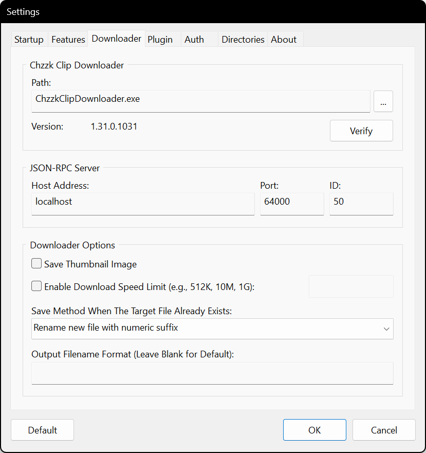

<i>(This image may not reflect the latest information.)</i>

* **JSON-RPC Server: Allow External Remote Access** - Allows remote access to the JSON-RPC server from outside the PC running the downloader.
* **JSON-RPC Server: Port** - Sets the port number for the JSON-RPC server.
* **JSON-RPC Server: ID** - Sets the ID for the JSON-RPC server.
* **Save Thumbnail Image** - Checks to save thumbnail images separately.
* **Enable Download Speed Limit** - Limits the download speed to control network bandwidth. (e.g., 500K, 10M, 1G)
* **Save Method When The Target File Already Exists** - Sets how to save when the target file already exists.
* **Output Filename Format** - Set output filename format. Please refer to `chzzk_clip_downloader_manual.en-US.pdf` for detailed information on format specifiers.

### Plugin

<i>(This image may not reflect the latest information.)</i>

* **Notifications: Path** - Sets the path to the notification plugin.
* **Notifications: Parameters** - Sets the parameters for the notification plugin.
* **Notifications: Text Type** - Sets the text format used by the notification plugin.

### Auth

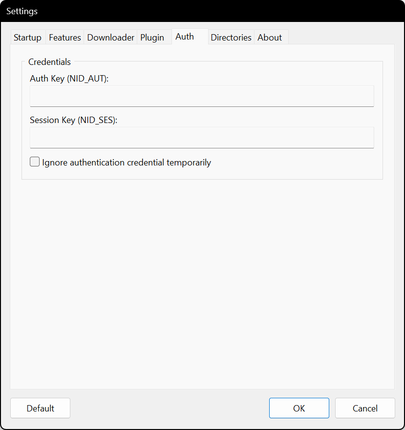

<i>(This image may not reflect the latest information.)</i>

* **Auth Key (NID_AUT)** - Specifies the authorization key of NAVER ID.
* **Session Key (NID_SES)** - Specifies the session key of NAVER ID.
* **Ignore authentication credential temporarily** - Sets whether ignore authentication credential temporarily or not.

For more information on how to get Chzzk authentication credential, please refer to `how_to_get_chzzk_credential.en-US.pdf`.

### Directories

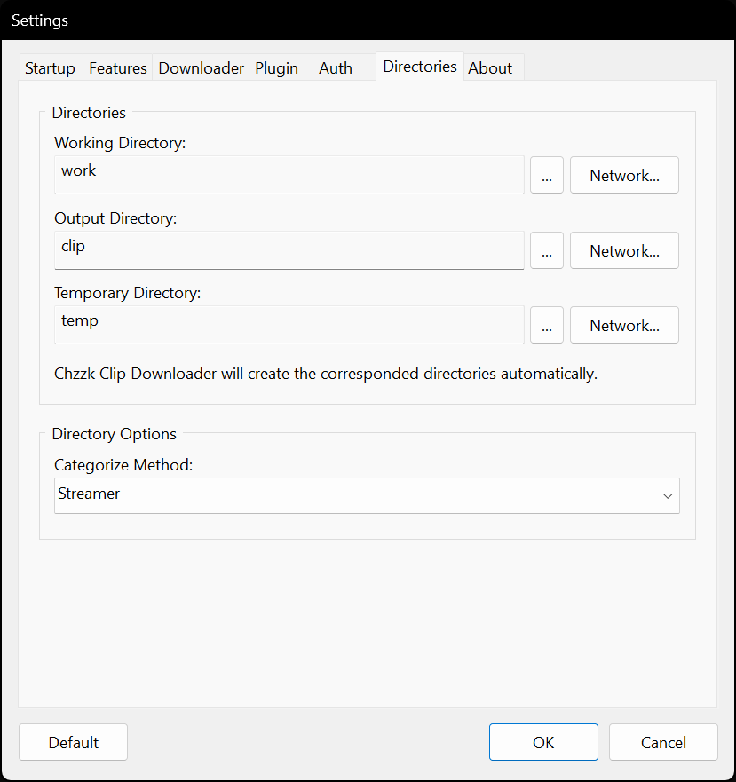

<i>(This image may not reflect the latest information.)</i>

* **Working Directory** - Specifies the directory where the configuration files of Chzzk Clip Downloader are saved.
* **Output Directory** - Specifies the directory where downloaded clip files are saved.
* **Temporary Directory** - Specifies the directory where temporary files are created.
* **Categorize Method** - Sets the categorization method for directories where downloaded clip files are saved.

<i>(This image may not reflect the latest information.)</i>

You can click the `Network...` button to enter the information required to access the network storage.

### About

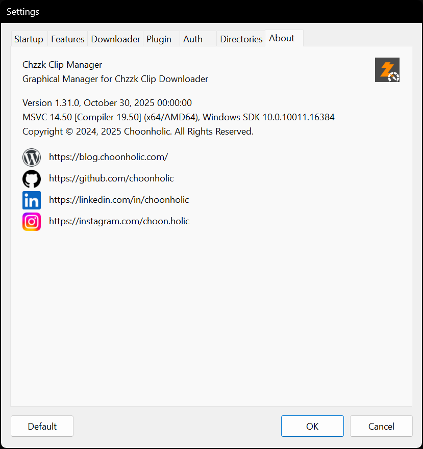

<i>(This image may not reflect the latest information.)</i>

* **Version Information** - Displays version information of Chzzk Clip Manager.
* **Contact Links** - Links to contact to authors.

## Contact Us
If you have any questions, bug reports, or improvement requests regarding the Chzzk Downloader Suite, please submit them through [GitHub](https://github.com/Choonholic/ChzzkDownloader/)‘s [Issues](https://github.com/Choonholic/ChzzkDownloader/issues/new) feature. We can respond to all languages; however, the languages we directly support are Korean, English, Japanese, and Chinese. For other languages, responses may not be fully accurate due to the use of machine translation.
