# Chzzk Live Manager
Graphical Manager for Chzzk Live Downloader

<div style='text-align: center'>

<p><i>(This image may not reflect the latest information.)</i></p>
</div>

## Version
Version 1.30.0, October 19, 2025 00:00:00

## Prerequisites
Since Chzzk Live Manager is the GUI frontend application for Chzzk Live Downloader, both of Chzzk Live Downloader and Chzzk Transport Finalizer must be installed as well.

If Chzzk Live Manager, Chzzk Live Downloader and Chzzk Transport Finalizer are in the same directory, Chzzk Live Manager will automatically recognize Chzzk Live Downloader and Chzzk Transport Finalizer upon execution. Otherwise, you will need to specify the location of Chzzk Live Downloader and Chzzk Transport Finalizer by referring to the **Verifying Prerequisites** section.

For portable versions, consider storing Chzzk Live Manager, Chzzk Live Downloader and Chzzk Transport Finalizer in the same directory for convenience. If installed using the `Setup`, all tools will be installed in the same directory.

## How To Execute
Click `Chzzk Live Manager` in Start menu, or execute `ChzzkLiveManager.exe` in `Chzzk Downloader Environment`.

## Verifying Prerequisites
Chzzk Live Manager requires Chzzk Live Downloader and Chzzk Transport Finalizer to be properly set up for full functionality. Additionally, Chzzk Live Downloader requires proper configurations of Streamlink (Version 6.8.0 or higher) and FFmpeg (Version 7.0 or higher). When Chzzk Live Manager starts, it checks whether these prerequisites are met, and if not, it will display the following dialog.

<div style='text-align: center'>
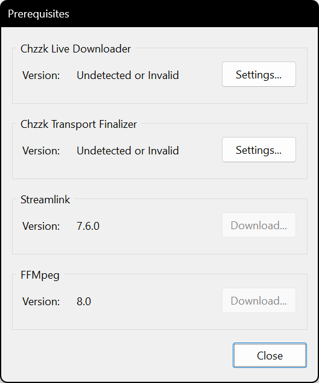
<p><i>(This image may not reflect the latest information.)</i></p>
</div>

You can click `Settings...` button to specify the location of Chzzk Live Downloader and Chzzk Transport Finalizer, or click `Download` button to install Streamlink or FFmpeg.

<div style='text-align: center'>
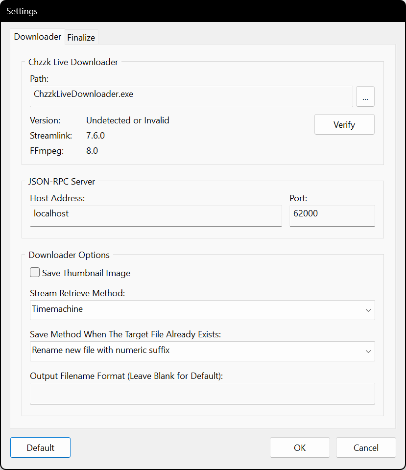
<p><i>(This image may not reflect the latest information.)</i></p>
</div>

Click `...` button to choose `ChzzkLiveDownloader.exe` file in the correct path. When the correct Chzzk Live Downloader is specified, the version information will be displayed as shown in the following figure.

<div style='text-align: center'>
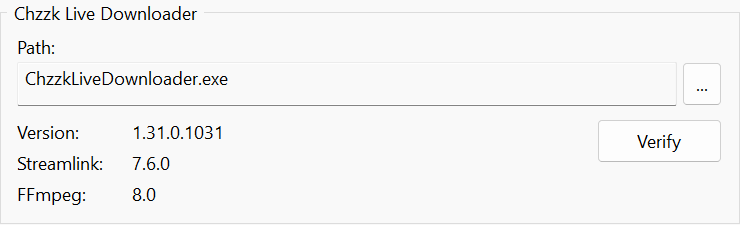
<p><i>(This image may not reflect the latest information.)</i></p>
</div>

<div style='text-align: center'>
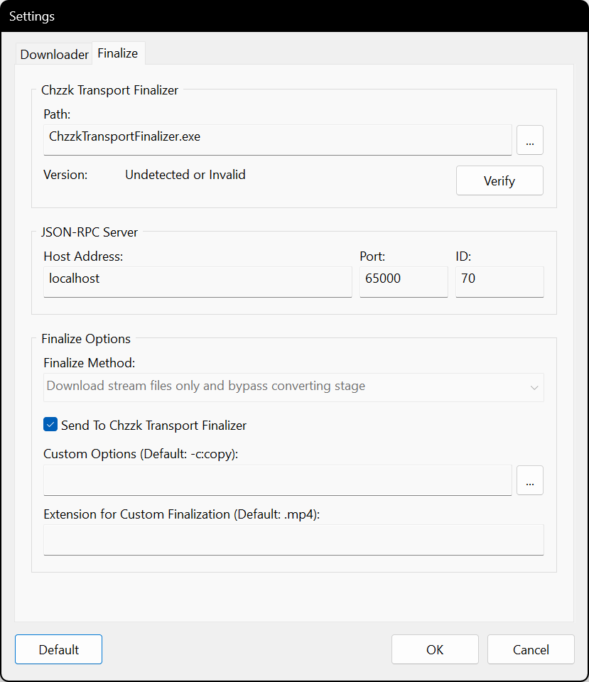
<p><i>(This image may not reflect the latest information.)</i></p>
</div>

Similarly, Click `...` button to choose `ChzzkTransportFinalizer.exe` file in the correct path. When the correct Chzzk Transport Finalizer is specified, the version information will be displayed as shown in the following figure.

<div style='text-align: center'>
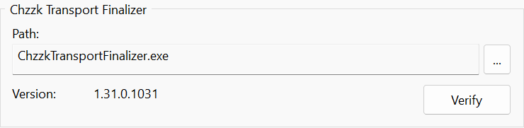
<p><i>(This image may not reflect the latest information.)</i></p>
</div>

## Opening Main Menu
Clicking the ☰ icon located at the top-left corner of the window will open the Main Menu.

<div style='text-align: center'>
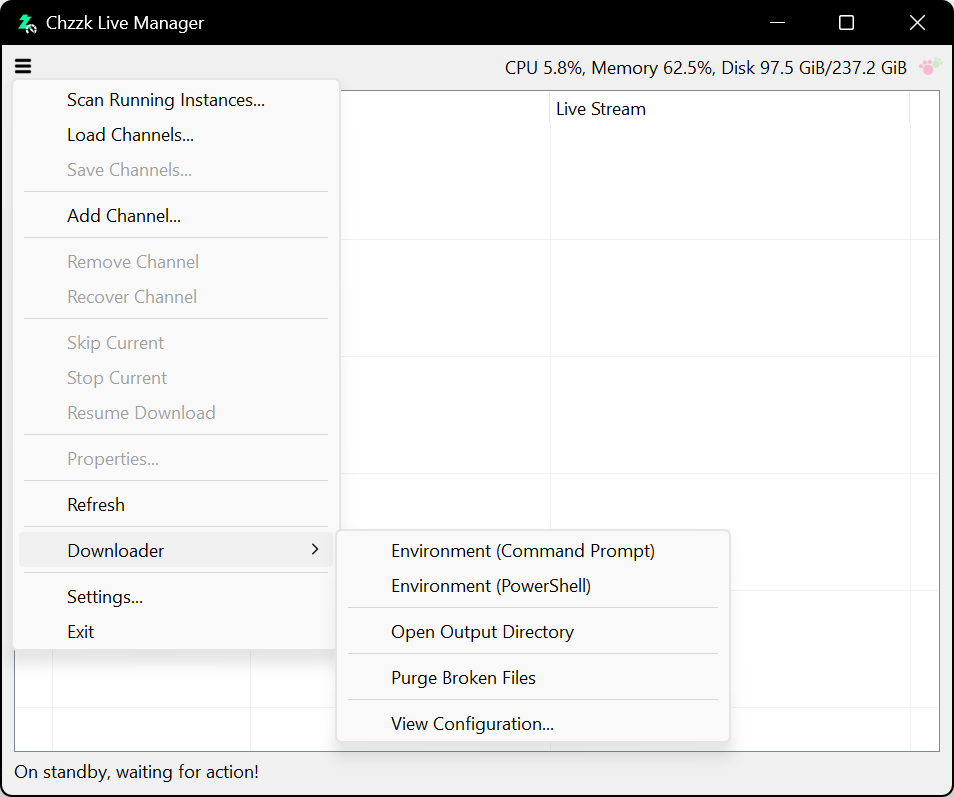
<p><i>(This image may not reflect the latest information.)</i></p>
</div>

## Adding a Channel
To add a channel, click the ☰ icon, and choose `Add Channel...`, then Add Channel dialog box will appear. Enter the UID, URL of the channel to be added, or the live streaming URL, then click the `OK` button.

<div style='text-align: center'>
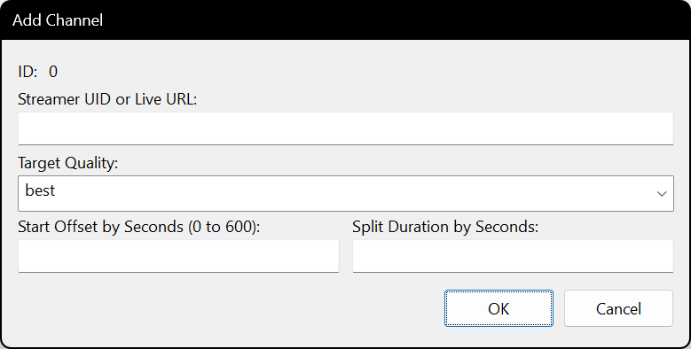
<p><i>(This image may not reflect the latest information.)</i></p>
</div>

Additionally, the following items can be specified in this dialog box.

### Streamer UID / Live URL
Streamer unique identifier will automatically recognize one of the following three values when entered.

* Stream URL - `https://chzzk.naver.com/live/UID`
* Channel URL - `https://chzzk.naver.com/UID`
* Streamer UID - `UID`

### Target Quality
You can enter values such as `best`, `1080p`, or `720p`.

As with Chzzk Live Downloader, if a non-standard resolution is used, set a quality slightly higher than the expected resolution will automatically adjust to the closest available one. (e.g., `1200p` → `1080p`)

### Start Offset
You can set amount of time to skip from the beginning of the stream. By default, the unit of time is seconds. However, you can also set through hours, minutes, seconds and milliseconds as follows.

```powershell
1:23:45.67
1h30m45.67s
```

## Duration and Split Downloading
You can set the stream duration to download and the downloaded stream will be split into the specified duration. By default, the unit of time is seconds. However, you can also set through hours, minutes, seconds and milliseconds as follows.


```powershell
1:23:45.67
1h30m45.67s
```

## Removing the Channel
To remove a channel you no longer wish to manage, select the channel from the list, click the ☰ icon, and choose `Remove Channel`, then click `OK` to confirm to remove.

<div style='text-align: center'>
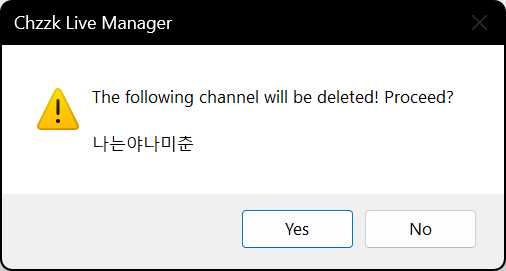
<p><i>(This image may not reflect the latest information.)</i></p>
</div>

If the removed channel was in the middle of a download, the download will stop at the time of removal, and the final processing steps will be completed before saving.

## Recovering the Channel
If the connection between Chzzk Live Downloader and Chzzk Live Manager is lost due to external factors such as abnormal termination of the process, the process can be restarted to re-establish the connection.

<div style='text-align: center'>
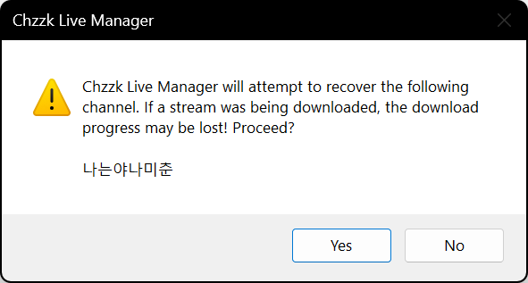
<p><i>(This image may not reflect the latest information.)</i></p>
</div>

If a download was in progress when the connection was lost, the download will be terminated at that point and then restarted.

## Skipping Downloading Current Stream
To skip downloading of the current live stream and wait for next one, select the channel from the list, click the ☰ icon, and choose `Skip Current`, then click `OK` to confirm to skip.

<div style='text-align: center'>
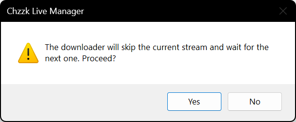
<p><i>(This image may not reflect the latest information.)</i></p>
</div>

## Stopping Downloading Current Stream
To stop downloading of the current live stream and wait for next one, select the channel from the list, click the ☰ icon, and choose `Stop Current`, then click `OK` to confirm to stop.

<div style='text-align: center'>
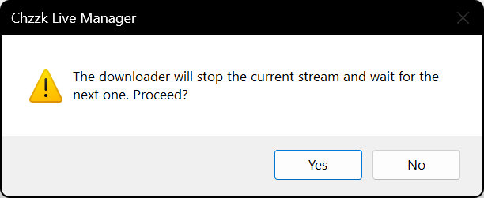
<p><i>(This image may not reflect the latest information.)</i></p>
</div>

## Resuming Stopped Live Stream Download
To resume downloading a previously stopped live stream, select the channel from the list, click the ☰ icon, and choose `Resume Download`. This feature is only available if the forcibly stopped stream has not yet ended. If the live stream has newly started, the download will begin automatically without needing to use this feature.

## Browsing Channel Properties
To browse the properties of the channel, select the channel from the list, click the ☰ icon, and choose `Properties...`.

<div style='text-align: center'>

<p><i>(This image may not reflect the latest information.)</i></p>
</div>

## Context Menu
When you select a channel from the list and right-click, a context menu of the channel will appear.

<div style='text-align: center'>
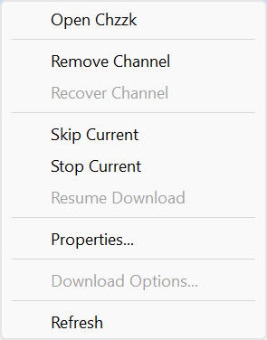
<p><i>(This image may not reflect the latest information.)</i></p>
</div>

## Changing Download Options
You can change the download options in real-time if the channel is not currently downloading.

<div style='text-align: center'>
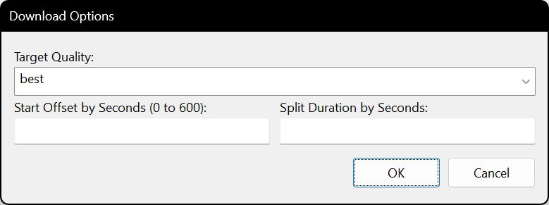
<p><i>(This image may not reflect the latest information.)</i></p>
</div>

## Saving the Channel List
The currently managed channel list can be saved to a list file and loaded later when needed.

If the list contains one or more channels, click the ☰ icon and select `Save Channels...`, then a file dialog box will appear, allowing you to change the directory and file name where the list will be saved.

## Loading the Channel List
Instead of adding channels manually each time, you can load a previously saved channel list.

Click the ☰ icon and select `Load Channels...`. A dialog box will appear, allowing you to choose a channel list file.

If a channel from the loaded list already exists in the current list, it will be automatically recognized and handled accordingly.

## Refreshing List
To refresh the list immediately, click the ☰ icon, and choose `Refresh`.

## Loading the Channel List at Startup Automatically
If you frequently manage a fixed set of channels, manually loading the list each time can become tedious. By enabling the following setting, the specified channel list will be automatically loaded at startup.

* Click the ☰ icon, and choose `Settings...` to open the settings dialog box.
* In the `Startup` tab, check `Load channels at startup`. Then, click the `...` button next to the `Path:` field and select the channel list file you want to load.
* From the next startup onward, the specified channel list will be automatically loaded.

<div style='text-align: center'>
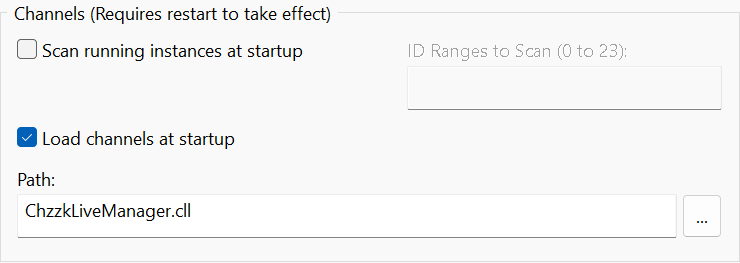
<p><i>(This image may not reflect the latest information.)</i></p>
</div>

## Managing Chzzk Live Downloader Running Externally
Since Chzzk Live Downloader can run independently without Chzzk Live Manager, it may be executed without using Chzzk Live Manager.

However, even in such cases, you can configure the following settings to automatically detect and add the running instance to the channel list for management at startup.

<div style='text-align: center'>
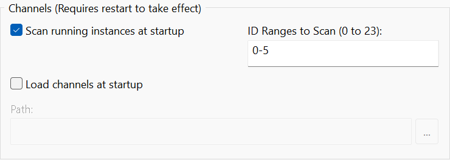
<p><i>(This image may not reflect the latest information.)</i></p>
</div>

* Check `Scan running instances at startup` in the `Startup` tab.
* Set the range of IDs to scan in the `ID Ranges to Scan` field. The ID is the value specified with the `-i` or `--id` parameter when running Chzzk Live Downloader. For example, if it was run as shown below, specify `3` in the scan range.

  ```
  ChzzkLiveDownloader -i 3
  ```

* You can specify an ID range from 0 to 31, and the IDs or ranges can be entered as follows:

  ```
  ~3, 6, 8-10, 13~15
  ```

* In the example above, the IDs scanned will be `0, 1, 2, 3, 6, 8, 9, 10, 13, 14, 15`.
* If both channel scanning and channel list loading are enabled, it will first scan for running channels and then load the channel list, filling in any gaps by adding new channels.

## Opening Chzzk Downloader Environment
To open Chzzk Downloader Environment, click the ☰ icon, and choose `Open Environment (Command Prompt)` or `Open Environment (PowerShell)` under `Downloader`.

## Opening the Output Directory
To open the output directory for downloaded streams, click the ☰ icon, and choose `Open Output Directory` under `Downloader`.

## Purging Broken Files
If an abnormal situation occurs—such as a network disconnection or system shutdown during download—broken files may remain in the temporary directory.
To remove any remaining broken files, click the ☰ icon, and choose `Purge Broken Files` under `Downloader`.

<div style='text-align: center'>
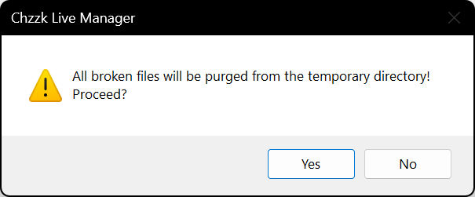
<p><i>(This image may not reflect the latest information.)</i></p>
</div>

## Viewing Downloader Configuration
To view configuration of Chzzk Live Downloader, click the ☰ icon, and choose `View Configuration...` under `Downloader`.

<div style='text-align: center'>
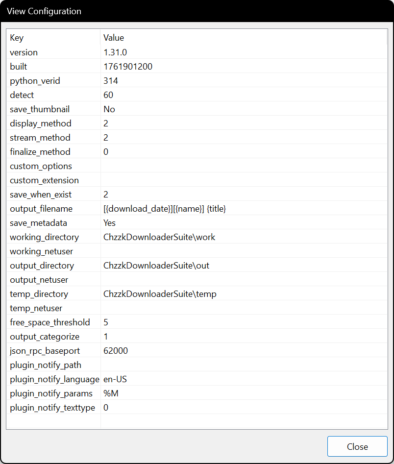
<p><i>(This image may not reflect the latest information.)</i></p>
</div>

## Moving to Tray on Minimize
If the `Move to tray on minimize` option is enabled in `Features` settings, Chzzk Live Manager will move to the system tray when minimized.

<div style='text-align: center'>
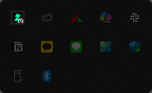
<p><i>(This image may not reflect the latest information.)</i></p>
</div>

Double-clicking tray icon will restore the window to its original state, and right-clicking on the tray icon will display a menu, as shown in the following image.

<div style='text-align: center'>
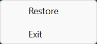
<p><i>(This image may not reflect the latest information.)</i></p>
</div>

## Set Custom Finalize Options
If extra options are set in the `Custom Finalize Options` parameter in the `Downloader` settings, those options will be passed to `FFmpeg` during the finalization process. For example, the following options enable `FFmpeg` to encode using the `HEVC` codec:

```powershell
-c:v libx265 -crf 25 -c:a aac -b:a 128k
```

Please note that custom encoding is not recommended due to its suboptimal performance. For tter results, consider using external professional encoders.

## Other Settings

### Startup

<div style='text-align: center'>
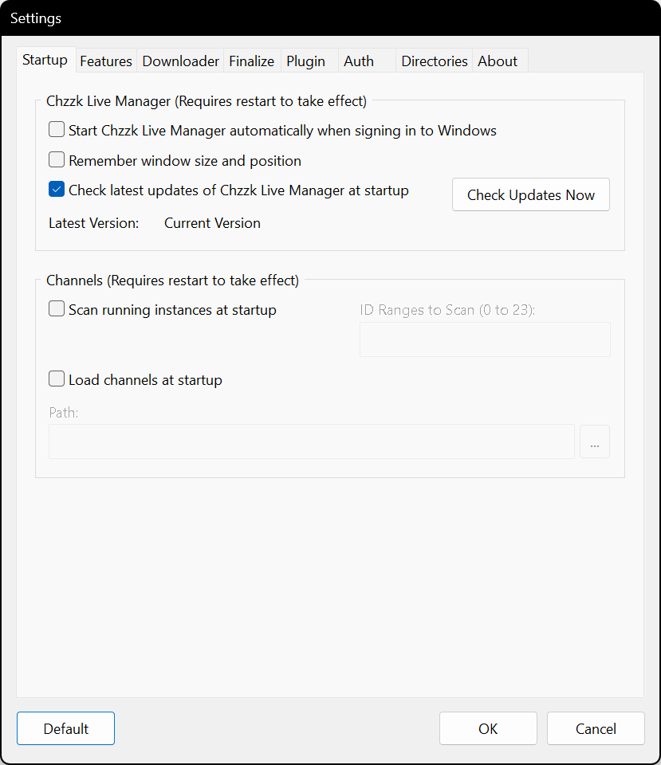
<p><i>(This image may not reflect the latest information.)</i></p>
</div>

* **Start Chzzk Live Manager automatically when signing in to Windows** - Puts Chzzk Live Manager into startup list of Windows.
* **Remember window size and position on startup** - Saves the window size and position on exit and restores them on the next launch.
* **Check latest updates of Chzzk Live Manager at startup** - Decides whether check latest updates of Chzzk Live Manager at startup or not. Otherwise, Click `Check Updates` button to check updates manually.

### Features

<div style='text-align: center'>
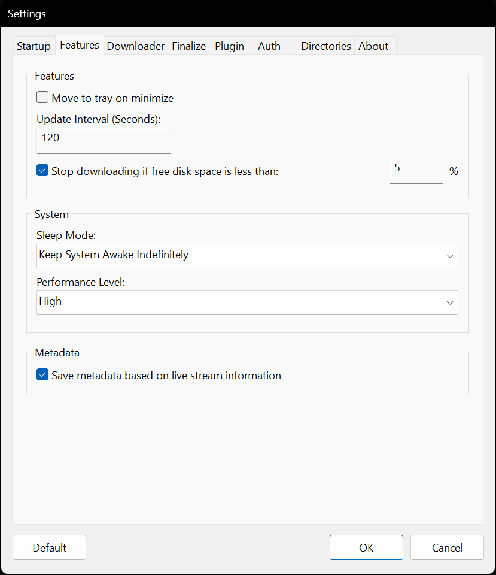
<p><i>(This image may not reflect the latest information.)</i></p>
</div>

* **Update Interval (Seconds)** - Sets the screen refresh interval for the list. This only affects the display and is not related to the download detection interval. The download detection interval of Chzzk Live Downloader is set to 10 seconds by default and is designed to avoid being impacted by API rate limits, unlike other tools.
* **Stop downloading if free disk space is less than** - Sets the threshold % for stopping downloads when disk space is low.
* **Sleep Mode** - Sets the system's sleep mode while the Chzzk Live Manager is running.
* **Performance Level** - Specify the performance of the system where Chzzk Live Manager is currently running. If you encounter errors due to timeouts when adding or refreshing channels, try lowering the performance level by one step and attempt again.
* **Save metadata based on live stream information** - Checks to save metadata based on live stream information.

### Downloader

<div style='text-align: center'>
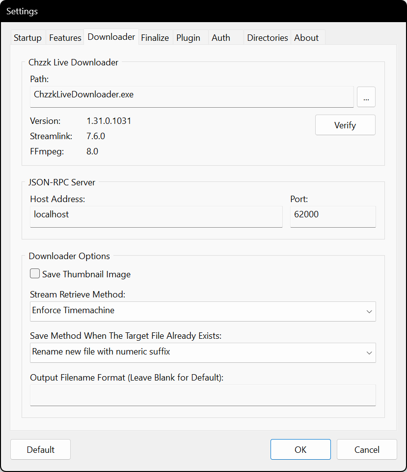
<p><i>(This image may not reflect the latest information.)</i></p>
</div>

* **JSON-RPC Server: Host Address** - Sets the host address of the JSON-RPC server.
* **JSON-RPC Server: Port** - Sets the port number for the JSON-RPC server.
* **Save Thumbnail Image** - Checks to save thumbnail images separately.
* **Stream Retrieve Method** - Sets stream retrieving method.
* **Save Method When The Target File Already Exists** - Sets how to save when the target file already exists.
* **Output Filename Format** - Set output filename format. Please refer to `chzzk_live_downloader_manual.en-US.pdf` for detailed information on format specifiers.

### Finalize

<div style='text-align: center'>
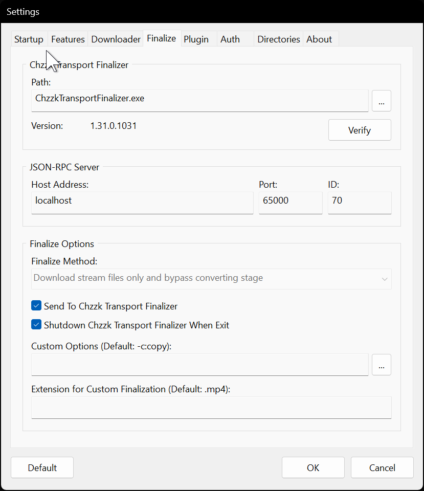
<p><i>(This image may not reflect the latest information.)</i></p>
</div>

* **JSON-RPC Server: Host Address** - Sets the host address of the JSON-RPC server.
* **JSON-RPC Server: Port** - Sets the port number for the JSON-RPC server.
* **JSON-RPC Server: ID** - Sets the ID for the JSON-RPC server.
* **Finalize Method** - Specifies the finalization method.
* **Send To Chzzk Transport Finalizer** - Delegate finalizing stage to Chzzk Transport Finalizer.
* **Custom Options** - Specifies custom options for the finalization. You can also click the `...` button to load and specify a custom option set file.
* **Extension for Custom Finalization** - Specifies file extension when the custom options require it.

### Plugin

<div style='text-align: center'>
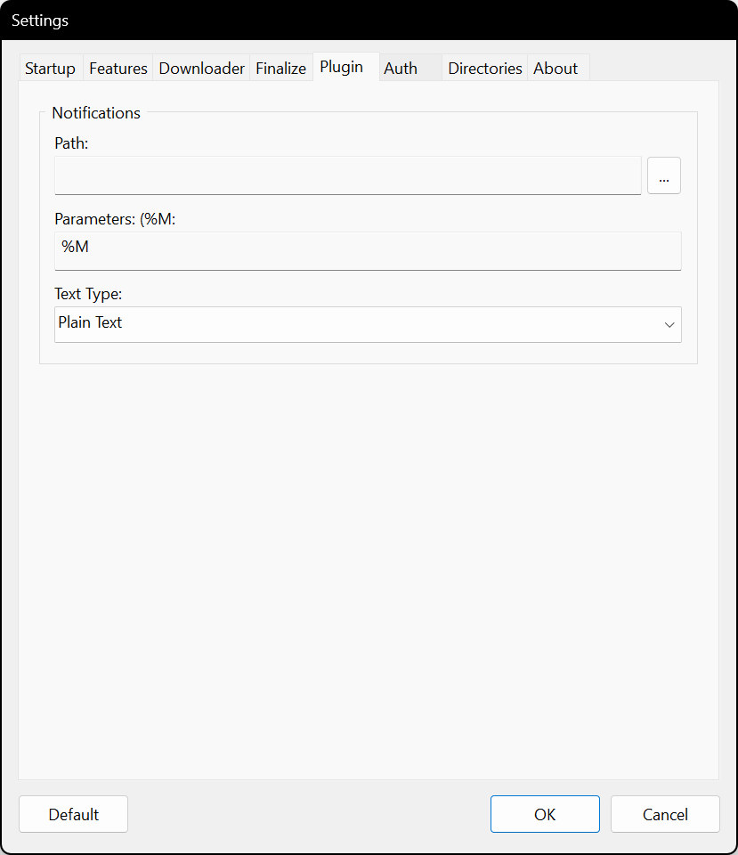
<p><i>(This image may not reflect the latest information.)</i></p>
</div>

* **Notifications: Path** - Sets the path to the notification plugin.
* **Notifications: Parameters** - Sets the parameters for the notification plugin.
* **Notifications: Text Type** - Sets the text format used by the notification plugin.

### Auth

<div style='text-align: center'>
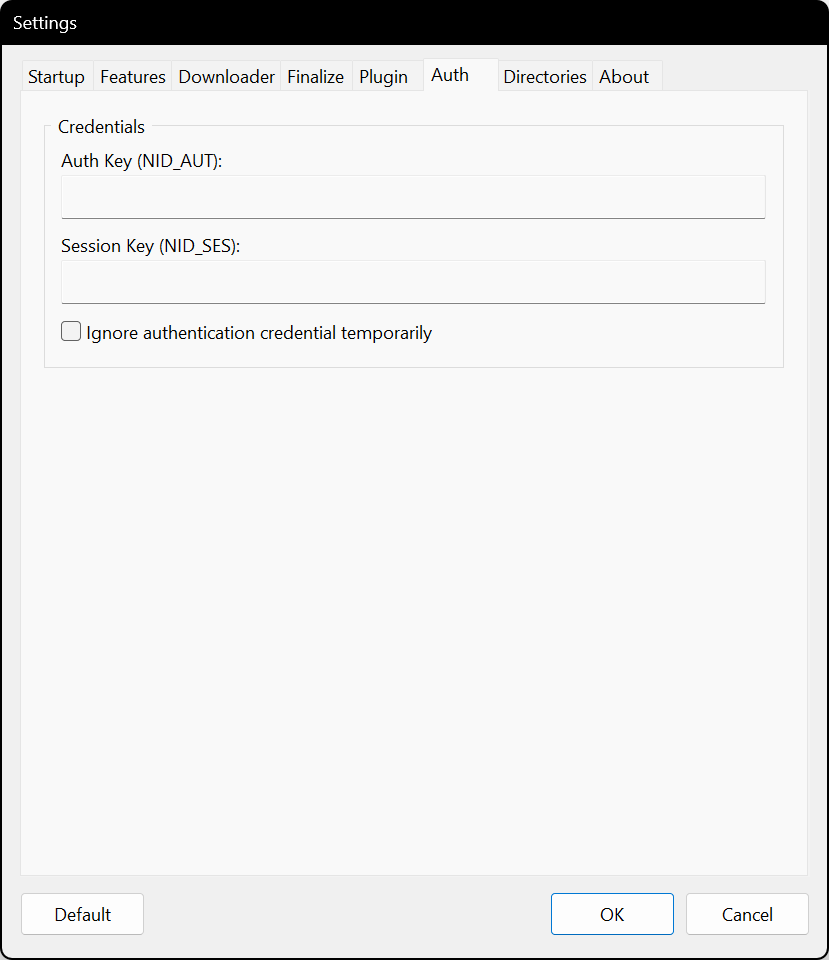
<p><i>(This image may not reflect the latest information.)</i></p>
</div>

* **Auth Key (NID_AUT)** - Specifies the authorization key of NAVER ID.
* **Session Key (NID_SES)** - Specifies the session key of NAVER ID.
* **Ignore authentication credential temporarily** - Sets whether ignore authentication credential temporarily or not.

For more information on how to get Chzzk authentication credential, please refer to `how_to_get_chzzk_credential.en-US.pdf`.

### Directories

<div style='text-align: center'>
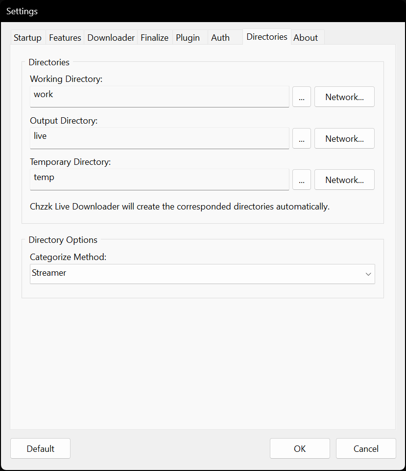
<p><i>(This image may not reflect the latest information.)</i></p>
</div>

* **Working Directory** - Specifies the directory where the configuration files of Chzzk Live Downloader are saved.
* **Output Directory** - Specifies the directory where downloaded stream files are saved.
* **Temporary Directory** - Specifies the directory where temporary files are created.
* **Categorize Method** - Sets the categorization method for directories where downloaded stream files are saved.

<div style='text-align: center'>
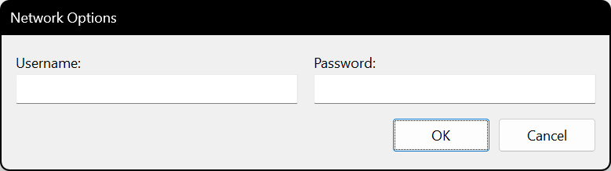
<p><i>(This image may not reflect the latest information.)</i></p>
</div>

You can click the `Network...` button to enter the information required to access the network storage.

### About

<div style='text-align: center'>
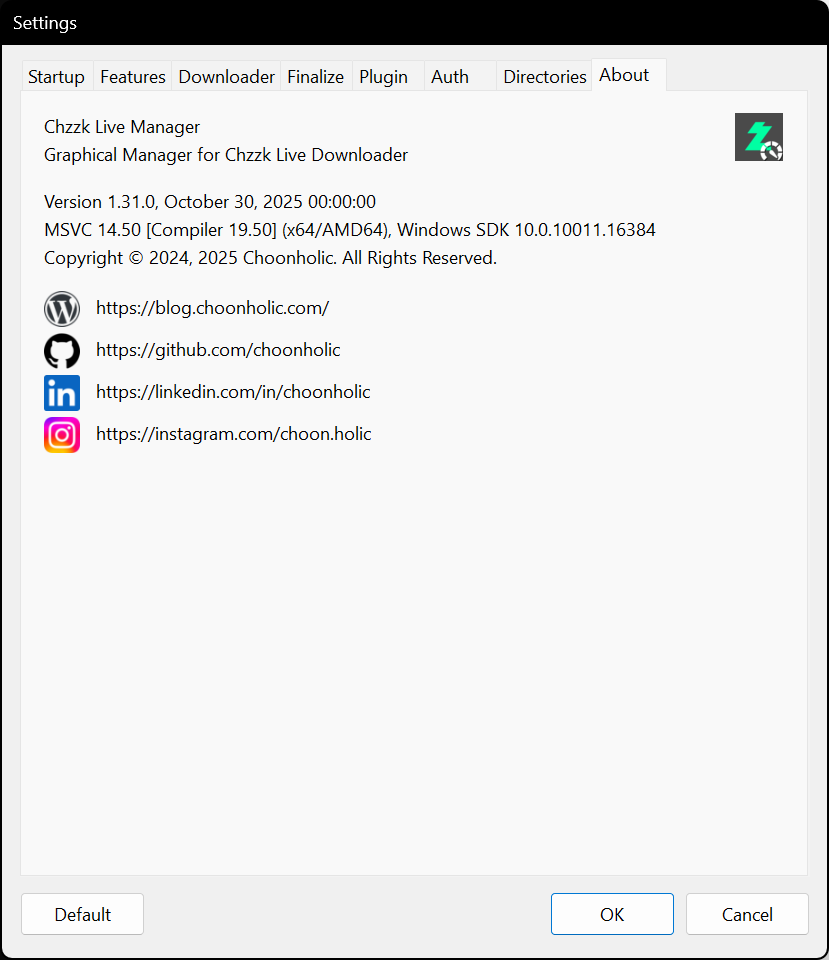
<p><i>(This image may not reflect the latest information.)</i></p>
</div>

* **Version Information** - Displays version information of Chzzk Live Manager.
* **Contact Links** - Links to contact to authors.

## Contact Us
If you have any questions, bug reports, or improvement requests regarding the Chzzk Downloader Suite, please submit them through [GitHub](https://github.com/Choonholic/ChzzkDownloader/)‘s [Issues](https://github.com/Choonholic/ChzzkDownloader/issues/new) feature. We can respond to all languages; however, the languages we directly support are Korean, English, Japanese, and Chinese. For other languages, responses may not be fully accurate due to the use of machine translation.