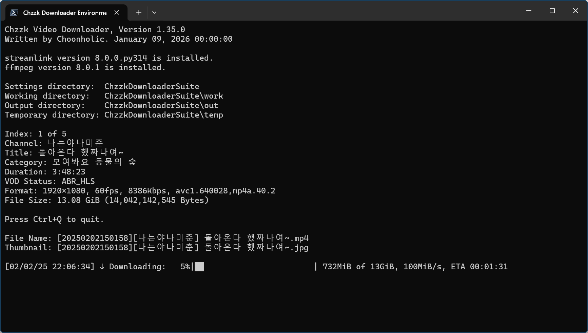

# Chzzk Video Downloader
Downloader for Chzzk replay videos

<div style='text-align: center'>

<p><i>(This image may not reflect the latest information.)</i></p>
</div>

## Version
Version 1.22.0, May 31, 2025 00:00:00

## Prerequisites
* **[Mandatory]** Latest version of Streamlink. (Requires Streamlink 6.8.0 or higher)
* **[Mandatory]** Latest version of FFmpeg. (Requires FFmpeg 7.0 or higher)

## Usage
```powershell
ChzzkVideoDownloader [-h] [--version] [-i INPUT] [-a [AUTH]] [--authaut AUTHAUT] [--authses AUTHSES]
                     [--adult [ADULT]] [-y] [-q [QUALITY]] [-d [DISPLAY]] [--final [FINAL]]
                     [--custom [CUSTOM]] [--info INFO] [--name [NAME]] [--work [WORK]]
                     [--work-user [WORK_USER]] [--work-pass [WORK_PASS]] [--out [OUT]]
                     [--out-user [OUT_USER]] [--out-pass [OUT_PASS]] [--temp [TEMP]]
                     [--temp-user [TEMP_USER]] [--temp-pass [TEMP_PASS]] [--category [CATEGORY]]
                     [--exist [EXIST]] [--threshold [THRESHOLD]] [--rpc] [--rpcid [RPCID]]
                     [--rpcport [RPCPORT]] [--snapshot SNAPSHOT] [--download [DOWNLOAD]]
                     [--limit [LIMIT]] [--thumb [THUMB]] [--startup [STARTUP]] [--pnpath [PNPATH]]
                     [--pnlanguage [PNLANGUAGE]] [--pnparams [PNPARAMS]] [--pntexttype [PNTEXTTYPE]]
                     [--settings [SETTINGS]] [--reset]
                     [video]
```

### Positional Arguments
```
video                     Video number or URL to download
```

### Options
```
-h, --help                Show this help message
--version                 Show version information
-i, --input INPUT         Set the download list file
-a, --auth [AUTH]         Set Chzzk authentication credential control method (reuse|reissue|ignore)
--authaut AUTHAUT         Set auth key of Chzzk authentication credential
--authses AUTHSES         Set session key of Chzzk authentication credential
--adult [ADULT]           Set the process method for adult contents when credentials are invalid (ask|skip)
-y, --yes                 Set any confirmation values to 'yes' automatically
-q, --quality [QUALITY]   Set target quality to download (e.g. 1080p)
-d, --display [DISPLAY]   Set display mode (quiet|simple|fluent|all)
--final [FINAL]           Set finalization method (bypass|convert|cleanup|cconvert|ccleanup, applicable only when downloading UPLOAD type)
--custom [CUSTOM]         Set custom finalize options (applicable only to cconvert|ccleanup)
--info INFO               Retrieve video information without downloading
--name [NAME]             Set output filename format
--work [WORK]             Set working directory
--work-user [WORK_USER]   Set username to use when working directory is on remote network
--work-pass [WORK_PASS]   Set password to use when working directory is on remote network
--out [OUT]               Set output directory
--out-user [OUT_USER]     Set username to use when output directory is on remote network
--out-pass [OUT_PASS]     Set password to use when output directory is on remote network
--temp [TEMP]             Set temporary directory
--temp-user [TEMP_USER]   Set username to use when temporary directory is on remote network
--temp-pass [TEMP_PASS]   Set password to use when temporary directory is on remote network
--category [CATEGORY]     Set output categorize method (none|streamer)
--exist [EXIST]           Set how to save when the target file already exists (rename|skip|overwrite)
--threshold [THRESHOLD]   Set the threshold % for stopping downloads when disk space is low (disable: -, default: 10, 3-50)
--rpc                     Activate JSON-RPC server
--rpcid [RPCID]           Set ID of JSON-RPC server (default: 30)
--rpcport [RPCPORT]       Set port of JSON-RPC server (default: 63000, 49152-65300)
--snapshot SNAPSHOT       Save snapshot to a JSON file whenever changing status
--download [DOWNLOAD]     Set download method (default|atxc|alter)
--limit [LIMIT]           Set max download speed (e.g., 512K, 10M, 1G, default: 0)
--thumb [THUMB]           Save thumbnail image or skip (save|skip)
--startup [STARTUP]       Set startup method (normal|fast)
--pnpath [PNPATH]         Set the path to the notification plugin
--pnlanguage [PNLANGUAGE] Set the language used by the notification plugin
--pnparams [PNPARAMS]     Set the parameters for the notification plugin
--pntexttype [PNTEXTTYPE] Set the text format used by the notification plugin (plain|markdown|html)
--settings [SETTINGS]     Set action when saving settings (default|skip|quit)
--reset                   Reset all settings
```

## Example
```powershell
ChzzkVideoDownloader 1602969 --thumb save --work work --out out --temp temp
```

## Setup Videos to Download
The video number or URL can be set directly to download a replay video.

For example, video number is **1602969** if video URL is https://chzzk.naver.com/video/1602969. To download this video, use the following commands.

```powershell
ChzzkVideoDownloader 1602969
ChzzkVideoDownloader https://chzzk.naver.com/video/1602969
```

If you want to download several videos sequentially, you can create a list file as following, then save as a text file encoded as UTF-8. (e.g. `list.txt`)

```python
# List Samples
https://chzzk.naver.com/video/2676946
2555164
https://chzzk.naver.com/video/2631744
https://chzzk.naver.com/video/2620211
https://chzzk.naver.com/video/2590216
2453109
```

Then, use the following commands to download.

```powershell
ChzzkVideoDownloader -i list.txt
ChzzkVideoDownloader --input list.txt
```

## Resetting Authentication Credential
To download a video that requires NAVER authentication credential, such as an adult-only video, you must specify the following information.

* NAVER ID Authorization Key from Chzzk cookie (`NID_AUT`)
* NAVER ID Session Key from Chzzk cookie (`NID_SES`)

When the authentication credential is not found when downloading a clip that requires it, a prompt to enter your authorization will be activated.

If you enter these values, they will be set as defaults, and subsequent runs will use them without further input. For more information on how to get Chzzk authentication credential, please refer to `how_to_get_chzzk_credential.en-US.pdf`.

If your authentication credential has been changed, or if you need to reset them by logging in with a different ID, use the following commands.

```powershell
ChzzkVideoDownloader video_no or url -a reset
ChzzkVideoDownloader video_no or url --auth reset
```

If you need to temporarily ignore authentication credential, use the following commands.

```powershell
ChzzkVideoDownloader video_no or url -a ignore
ChzzkVideoDownloader video_no or url --auth ignore
```

With `-y` or `--yes` parameters, a prompt to enter the authorization will be activated automatically without any confirmation.

```powershell
ChzzkVideoDownloader video_no or url -y
ChzzkVideoDownloader video_no or url --yes
```

## Specifying Target Quality to Download
By default, all videos will be downloaded in the best quality possible. However, if you want to save them in a different quality for saving storage or other reasons, use the following commands. Also, if the video is not using a standard resolution, the download will automatically choose the quality closest to the resolution you specify.

```powershell
ChzzkVideoDownloader video_no or url -q 720p
ChzzkVideoDownloader video_no or url --quality 720p
```

If you want to set this option to default, just use `-q` or `--quality` like below.

```powershell
ChzzkVideoDownloader video_no or url -q
ChzzkVideoDownloader video_no or url --quality
```

## Setting Output Filename Format
By default, the filename of videos and thumbnails to be saved will be `[{live_date}][{name}] {title}`. If you want to change this format, use the following command.

```powershell
ChzzkVideoDownloader video_no or url --name "[{name}][{category}] {title}"
```

If you want to set this option to default, just use `--name` without format like below.

```powershell
ChzzkVideoDownloader video_no or url --name
```

### Filename Format Tags
The following pre-defined tags can be used for filename format.

* `{name}` - Channel Name.
* `{verified}` - If channel is verified one, this tag will be `[✓]` or empty.
* `{video_no}` - Video Number.
* `{title}` - Title of the video.
* `{category_type}` - Category type of the video if set.
* `{category}` - Category of the video if set.
* `{category_value}` - Category value of the video if set.
* `{live_date...}` - Date-related tags when the stream started.
* `{publish_date...}` - Date-related tags when the video published.
* `{media...}` - Media information-related tags.

For the media-related tags, the following elements are available.

* `{media_quality}` - Media Quality. (e.g. `1080p`)
* `{media_video_width}` - Video width as pixels. (e.g. `1920`)
* `{media_video_height}` - Video height as pixels. (e.g. `1080`)
* `{media_video_framerate}` - Video frame rate as frame-per-second. (e.g. `60.0`)
* `{media_bitrate}` - Bitrate as bit-per-second. (e.g. `81920000`)
* `{media_video_codec}` - Video codec. (e.g. `H264`)

For the date-related tags, the detailed elements can be expanded as below.

* `{..._date}` - Date with `%Y%m%d%H%M%S` format. (e.g. `20240607014327`)
* `{..._date_year}` or `{..._date_year_full}` - Year with century as a decimal number. (e.g. `2024`)
* `{..._date_year_short}` - Year without century as a zero-padded decimal number. (e.g. `24`)
* `{..._date_month}` - Month as a zero-padded decimal number. (`01`, `02`, ..., `12`)
* `{..._date_month_full}` - Month as full name. (`January`, `February`, ..., `December`)
* `{..._date_month_short}` - Month as abbreviated name. (`Jan`, `Feb`, ..., `Dec`)
* `{..._date_day}` - Day of the month as a zero-padded decimal number. (`01`, `02`, ..., `31`)
* `{..._date_hour}` - Hour (24-hour clock) as a zero-padded decimal number. (`00`, `01`, ..., `23`)
* `{..._date_minute}` - Minute as a zero-padded decimal number. (`00`, `01`, ..., `59`)
* `{..._date_second}` - Second as a zero-padded decimal number. (`00`, `01`, ..., `59`)

## Handling Thumbnail Images
To save thumbnail images separately, use the following command.

```powershell
ChzzkVideoDownloader video_no or url --thumb save
```

To turn off this feature, use the following command.

```powershell
ChzzkVideoDownloader video_no or url --thumb skip
```

## Set Display Mode
By default, fluent details will be displayed. However, if you don't need the details, you can use the following command to supress them.

```powershell
ChzzkVideoDownloader video_no or url -d quiet
ChzzkVideoDownloader video_no or url --display quiet
```

The following display methods can be set with options of `--display` parameter.

* `quiet` - Suppress all details.
* `simple` - Show simplified details only.
* `fluent` - Show fluent details.
* `all` - Show all details.

If you want to set this option to default, just use `-d` or `--display` like below.

```powershell
ChzzkVideoDownloader video_no or url -d
ChzzkVideoDownloader video_no or url --display
```

## Finalization
When `vod_status` is `UPLOAD` or `NONE`, Chzzk Video Downloader downloads in MPEGTS format with a `.ts` extension during the live download stage and converts it to MPEG4 format with a `.mp4` extension in the finalization stage when the download is complete. However, the finalization methods can be set with `--final` option like below.

```powershell
ChzzkVideoDownloader video_no or url --final all
```

The following finalization methods can be set with options of `--final` parameter.

* `none` - Just downloads transport stream files (`.ts`) and bypass converting stage. The transport stream files must be converted with the external converters for playing properly.
* `convert` - Converts transport stream files (`.ts`) to video files (`.mp4`), but don't remove transport stream files.
* `cleanup` - Converts transport stream files (`.ts`) to video files (`.mp4`), and clean up transport stream files.
* `cconvert` - Converts transport stream files (`.ts`) to video files (`.mp4`) with custom options by `--custom`, but don't remove transport stream files.
* `ccleanup` - Converts transport stream files (`.ts`) to video files (`.mp4`) with custom options by `--custom`, and clean up transport stream files.

```powershell
ChzzkVideoDownloader video_no or url --final convert
```

If you want to set this option to default, just use `--final` like below.

```powershell
ChzzkVideoDownloader video_no or url --final
```

### Custom Encoding During Finalization
You can set custom encoding options during finalization using the `--final` option with either `cconvert` or `ccleanup`. When specifying options for the `--custom` parameter, since the option itself takes the form of a parameter, to avoid errors, please specify the option directly using the `=` operator and `"` quotes as shown below. For example, the following options enable `FFmpeg` to encode using the `H.265` codec:

```powershell
ChzzkVideoDownloader video_no or url --final cconvert --custom="-c:v libx265 -preset medium -crf 23 -c:a aac -b:a 128k"
```

Please note that custom encoding is not recommended due to its suboptimal performance. For better results, consider using a dedicated external professional encoders.

## Set Working Directory
You can use the following command to specify the directory where required files are stored to work properly.

```powershell
ChzzkVideoDownloader video_no or url --work work
```

If you want to set this option to default, just use `--work` without directory like below.

```powershell
ChzzkVideoDownloader video_no or url --work
```

## Set Output Directory
You can use the following command to specify the directory where downloaded files are saved.

```powershell
ChzzkVideoDownloader video_no or url --out out
```

By default, all files are categorized and saved in subdirectories by streamer. If you want to save files without categorizing them by streamer, use the following command.

```powershell
ChzzkVideoDownloader video_no or url --category none
```

If you want to set this option to default, just use `--out` and `--category` without options like below.

```powershell
ChzzkVideoDownloader video_no or url --out --category
```

## Set Temporary Directory
You can use the following command to specify the temporary directory where the files being downloaded are saved.

```powershell
ChzzkVideoDownloader video_no or url --temp temp
```

If you want to set this option to default, just use `--temp` without like below.

```powershell
ChzzkVideoDownloader video_no or url --temp
```

## Directory Specification
You can specify directories in several ways as follows.

```powershell
ChzzkVideoDownloader video_no or url --temp temp
```

Specifies the `temp` directory under the current directory where the executable is located as the temporary directory. If the directory does not exist, it will be created.

```powershell
ChzzkVideoDownloader video_no or url --work \Users\Username\Documents\chzzk_work
```

Specifies the `\Users\Username\Documents\chzzk_work` directory on the current drive as the working directory. If the directory does not exist, it will be created.

```powershell
ChzzkVideoDownloader video_no or url --work C:\Users\Username\Documents\chzzk_work
```

Of course, you can specify the drive (e.g. `C:`) directly as shown above.

```powershell
ChzzkVideoDownloader video_no or url --out \\192.168.0.1\chzzk\out
```

Specifies the `\\192.168.0.1\chzzk\out` directory on a network storage based on a UNC path as the output directory. If the directory does not exist, it will be created.

When saving files to network storage, you may need to enter a username and password to connect to the network storage. This information can be specified as follows.

```powershell
ChzzkVideoDownloader video_no or url --work-user username --work-pass password
ChzzkVideoDownloader video_no or url --out-user username --out-pass password
ChzzkVideoDownloader video_no or url --temp-user username --temp-pass password
```

## Set how to save when the target file already exists
By default, when a file with the same name already exists, the file is saved with `(n)` appended to its name. However, you can use the following command to overwrite the file or skip download itself instead.

```powershell
ChzzkVideoDownloader video_no or url --exist overwrite
ChzzkVideoDownloader video_no or url --exist skip
```

If you want to set this option to default, just use `--exist` without like below.

```powershell
ChzzkVideoDownloader video_no or url --exist
```

## Set max download speed to control network bandwidth
Use the following command when you need to limit the download speed to control network bandwidth. `0` means unrestricted. You can append `K`, `M` or `G`. (`1K`=`1024`, `1M`=`1024K`, `1G`=`1024M`)

```powershell
ChzzkVideoDownloader video_no or url --limit 10M
```

If you want to set this option to default, just use `--limit` without like below.

```powershell
ChzzkVideoDownloader video_no or url --limit
```

## Set the threshold % for stopping downloads when disk space is low
By default, downloading will stop if the free space in the storage directory or temporary directory drops below 10%. To set the free disk space threshold, use the following command. The acceptable range is `3` to `30`.

```powershell
ChzzkVideoDownloader video_no or url --threshold 20
```

To disable the feature that stops downloads based on free disk space, use the following command.

```powershell
ChzzkVideoDownloader video_no or url --threshold -
```

If you want to set this option to default, just use `--threshold` without like below.

```powershell
ChzzkVideoDownloader video_no or url --threshold
```

## Set Download Method
A lightweight download module was included as an alternative. To try out the alternative module, use the following command.

```powershell
ChzzkVideoDownloader video_no or url --download alter
```

## Set Action When Saving Settings
All options are always saved to configuration files by default. If you want to apply settings to current session only without saving, use the following command.

```powershell
ChzzkVideoDownloader video_no or url --settings skip
```

However, the following information is always saved.

* NAVER ID Authorization key from Chzzk cookie (`NID_AUT`)
* NAVER ID Session key from Chzzk cookie (`NID_SES`)

If you want to save the settings without downloading and exit, use the following command.

```powershell
ChzzkVideoDownloader --settings quit
```

## Plugins
Chzzk Video Downloader provides additional features tailored to the user's personal preferences and environment through plugins.

### Notification Plugins
By registering a notification plugin, you can easily monitor the operational status of Chzzk Video Downloader through an external solution. The following notification plugin is provided by default:

* `pn_slack` - Slack notification plugin
* `pn_telegram` - Telegram notification plugin

You can register a notification plugin using `--pnpath` parameter as shown below. Since only one plugin can be active at a time, if multiple registrations are made, only the last one will be active. After the plugin is registered, it applies to all future runs of Chzzk Video Downloader.

```powershell
ChzzkVideoDownloader video_no or url --pnpath=pn_...
```

You can specify the language for the notification messages using `--pnlanguage` parameter as shown below.

```powershell
ChzzkVideoDownloader video_no or url --pnpath=pn_... --pnlanguage=ko-KR
```

If the notification plugin supports Markdown or HTML formats, you can specify the text format of the notification messages using `--pntexttype` parameter as shown below.

```powershell
ChzzkVideoDownloader video_no or url --pnpath=pn_... --pntexttype=html
```

You can also specify custom plugins as notification plugins. If additional parameters need to be passed to the plugin, use `--pnparams` parameter. In this case, `%M` should be used to indicate where the message should be inserted.

```powershell
ChzzkVideoDownloader video_no or url --pnpath=userpn_... --pnparams="--user --message %M"
```

To unregister a notification plugin, just use `--pnpath` without specifying a plugin like below.

```powershell
ChzzkVideoDownloader video_no or url --pnpath
```

## Resetting All Configurations
Over time, you may find that you've mixed things up and want to reset your settings. To reset all configurations, use the following command.

```powershell
ChzzkVideoDownloader --reset
```

This will reset the following information.

* NAVER ID Authorization key from Chzzk cookie (`NID_AUT`)
* NAVER ID Session key from Chzzk cookie (`NID_SES`)
* Settings for target quality to download
* Settings for Saving thumbnail image
* Settings for displaying download details
* Settings for output and temporary directories

## Display Version Information
You can check the version information by using the following command.

```powershell
ChzzkVideoDownloader --version
```

## Getting help
You can use the following command to get simple parameter help.

```powershell
ChzzkVideoDownloader -h
ChzzkVideoDownloader --help
```

## Parameter precedence
Except `--reset`, `-h` and `--version`, the parameters can be used in any order as shown below. However, multiple copies of the same parameter cannot be assigned.

```powershell
ChzzkVideoDownloader 1602969 --out out
```

The `-h` and `--version` parameters are processed only with the first one used, and then terminated immediately afterward. Therefore, the following command will output only the version information.

```powershell
ChzzkVideoDownloader --version -h
```

The `--reset` parameter resets the settings, ignoring any previously set values, then exits. Therefore, the video number will be ignored in the following command.

```powershell
ChzzkVideoDownloader 1602969 --reset
```

## Recommended Initial Settings
The following settings are recommeneded for the first use. The following command will set working directory (`--work`), output directory (`--out`), temporary directory (`--temp`) at once to making it easy to organize the downloaded video files.

```powershell
ChzzkVideoDownloader video_no or url --work work --out out --temp temp
```

## Controlling Externally Using JSON-RPC
Please read `how_to_control_chzzk_video_downloader.en-US.pdf` for detailed information.

## Contact Us
If you have any questions, bug reports, or improvement requests regarding the Chzzk Downloader Suite, please submit them through [GitHub](https://github.com/Choonholic/ChzzkDownloader/)‘s [Issues](https://github.com/Choonholic/ChzzkDownloader/issues/new) feature. We can respond to all languages; however, the languages we directly support are Korean, English, Japanese, and Chinese. For other languages, responses may not be fully accurate due to the use of machine translation.