# Chzzk Video Manager
Graphical Manager for Chzzk Video Downloader

<i>(This image may not reflect the latest information.)</i>

## Version
Version 0.99.0, November 25, 2024 00:00:00

## Prerequisites
Since Chzzk Video Manager is the GUI frontend application for Chzzk Video Downloader, Chzzk Video Downloader must be installed as well.

If the Chzzk Video Downloader and Chzzk Video Manager are in the same directory, Chzzk Video Manager will automatically recognize Chzzk Video Downloader upon execution. Otherwise, you will need to specify the location of Chzzk Video Downloader by referring to the **Verifying Prerequisites** section.

For portable versions, consider storing both Chzzk Video Downloader and Chzzk Video Manager in the same directory for convenience. If installed using the `Setup`, both will be installed in the same directory.

## How To Execute
Click `Chzzk Video Manager` in Start menu, or execute `ChzzkVideoManager.exe` in `Chzzk Downloader Environment`.

## Verifying Prerequisites
Chzzk Video Manager requires Chzzk Video Downloader to be properly set up for full functionality Additionally. When Chzzk Video Manager starts, it checks whether this prerequisite is met, and if not, it will display the following dialog.

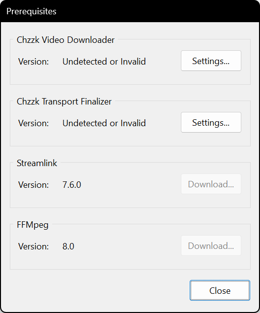

<i>(This image may not reflect the latest information.)</i>

You can click `Settings...` button to specify the location of Chzzk Video Downloader.

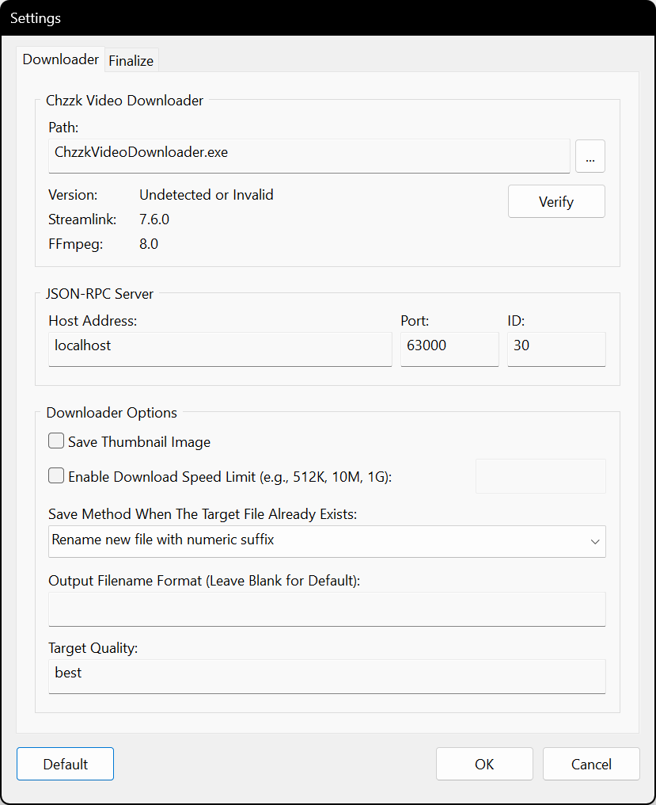

<i>(This image may not reflect the latest information.)</i>

Click `...` button to choose `ChzzkVideoDownloader.exe` file in the correct path. When the correct Chzzk Video Downloader is specified, the version information will be displayed as shown in the following figure.

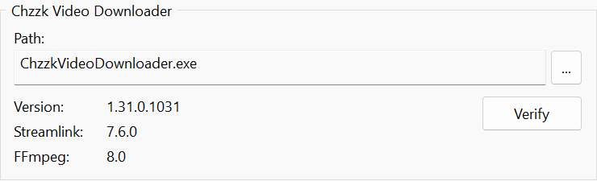

<i>(This image may not reflect the latest information.)</i>

## Opening Main Menu
Clicking the ☰ icon located at the top-left corner of the window will open the Main Menu.

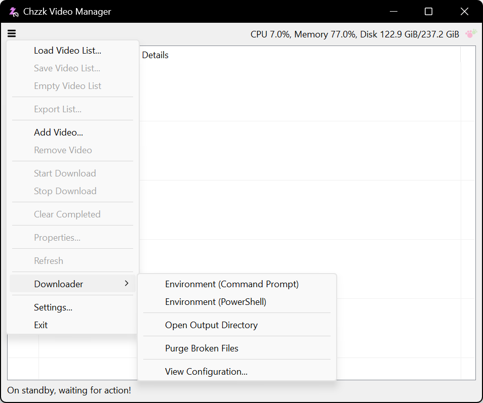

<i>(This image may not reflect the latest information.)</i>

## Adding a Video
To add a video, click the ☰ icon, and choose `Add Video...`, then Add Video dialog box will appear. Enter the video number or URL of the video to be added, then click the `OK` button.

<i>(This image may not reflect the latest information.)</i>

### Video Number / Video URL
Video number will automatically recognize one of the following values when entered:

* Video URL - `https://chzzk.naver.com/video/Number`
* Video Number - `Number`

## Removing the Video
To remove a video, select the video from the list, click the ☰ icon, and choose `Remove Video`, then click `OK` to confirm to remove.

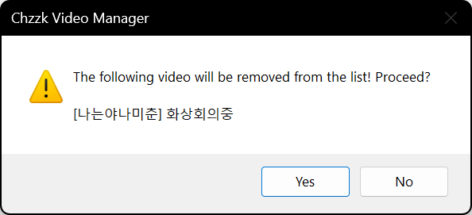

<i>(This image may not reflect the latest information.)</i>

## Starting Download
To start download the videos of the list, click the ☰ icon, and choose `Start Download`.

## Stopping Download
To stop download the videos of the list, click the ☰ icon, and choose `Stop Download`, then click 'OK' to confirm to stop.

<i>(This image may not reflect the latest information.)</i>

If a download was in progress when stopping, all remaining downloads will be aborted.

## Browsing Video Properties
To browse the properties of the video, select the video from the list, click the ☰ icon, and choose `Properties...`.

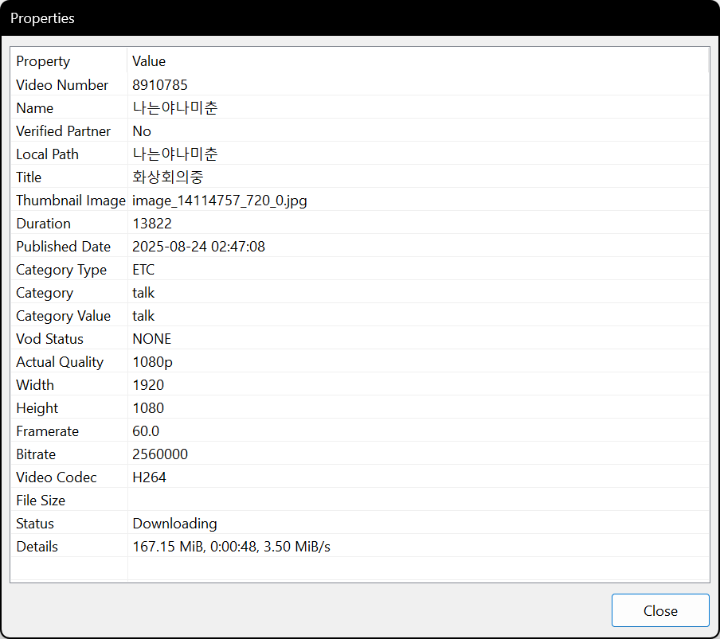

<i>(This image may not reflect the latest information.)</i>

## Context Menu
When you select a video from the list and right-click, a context menu of the video will appear.

<i>(This image may not reflect the latest information.)</i>

## Saving the Video List
The video list can be saved to a list file and loaded later when needed.

If the list contains one or more videos, click the ☰ icon and select `Save Video List...`, then a file dialog box will appear, allowing you to change the directory and file name where the list will be saved.

## Loading the Video List
Instead of adding videos manually each time, you can load a previously saved video list.

Click the ☰ icon and select `Load Video List...`. A dialog box will appear, allowing you to choose a video list file.

If a video from the loaded list already exists in the current list, it will be automatically recognized and handled accordingly.

## Refreshing List
To refresh the list immediately, click the ☰ icon, and choose `Refresh`.

## Opening Chzzk Downloader Environment
To open Chzzk Downloader Environment, click the ☰ icon, and choose `Open Environment (Command Prompt)` or `Open Environment (PowerShell)` under `Downloader`.

<i>(This image may not reflect the latest information.)</i>

## Opening the Output Directory
To open the output directory for downloaded videos, click the ☰ icon, and choose `Open Output Directory` under `Downloader`.

## Viewing Downloader Configuration
To view configuration of Chzzk Video Downloader, click the ☰ icon, and choose `View Configuration...` under `Downloader`.

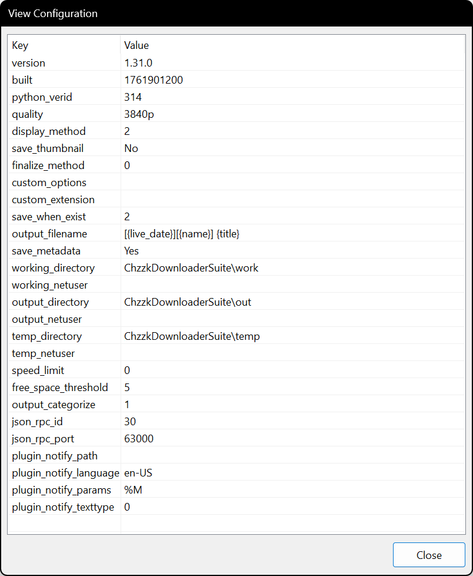

<i>(This image may not reflect the latest information.)</i>

## Moving to Tray on Minimize
If the `Move to tray on minimize` option is enabled in `Features` settings, Chzzk Video Manager will move to the system tray when minimized.

<i>(This image may not reflect the latest information.)</i>

Double-clicking tray icon will restore the window to its original state, and right-clicking on the tray icon will display a menu, as shown in the following image.

<i>(This image may not reflect the latest information.)</i>

## Other Settings

### Startup

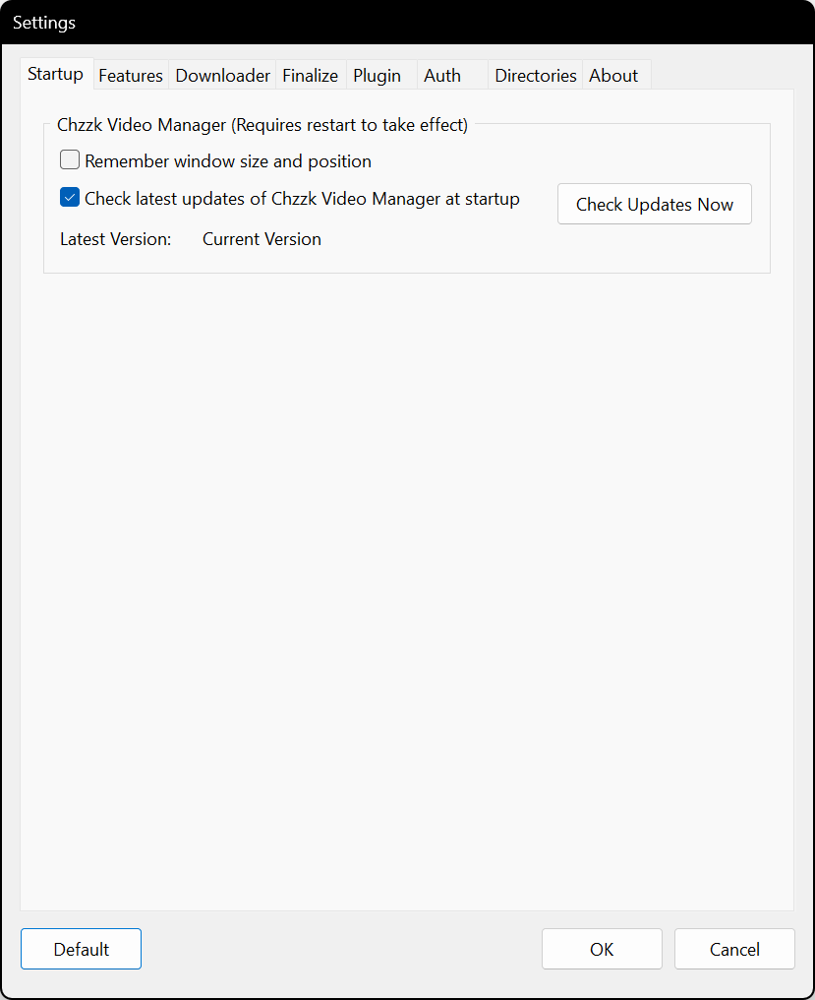

<i>(This image may not reflect the latest information.)</i>

* **Remember window size and position on startup** - Saves the window size and position on exit and restores them on the next launch.
* **Check latest updates of Chzzk Video Manager at startup** - Decides whether check latest updates of Chzzk Video Manager at startup or not. Otherwise, Click `Check Updates` button to check updates manually.

### Features

<i>(This image may not reflect the latest information.)</i>

* **Update Interval (Seconds)** - Sets the screen refresh interval for the list.
* **Performance Level** - Specify the performance of the system where Chzzk Video Manager is currently running. If you encounter errors due to timeouts when adding or refreshing videos, try lowering the performance level by one step and attempt again.

### Downloader

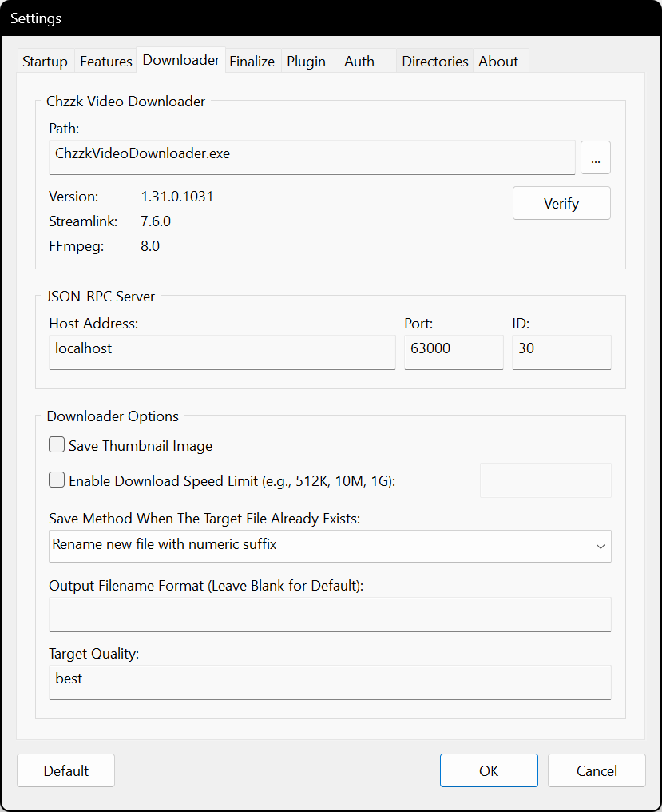

<i>(This image may not reflect the latest information.)</i>

* **JSON-RPC Server: Host Address** - Sets the host address of the JSON-RPC server.
* **JSON-RPC Server: Port** - Sets the port number for the JSON-RPC server.
* **JSON-RPC Server: ID** - Sets the ID for the JSON-RPC server.
* **Save thumbnail image** - Checks to save thumbnail images separately.
* **Target Quality** - Sets target quality to download.

### Auth

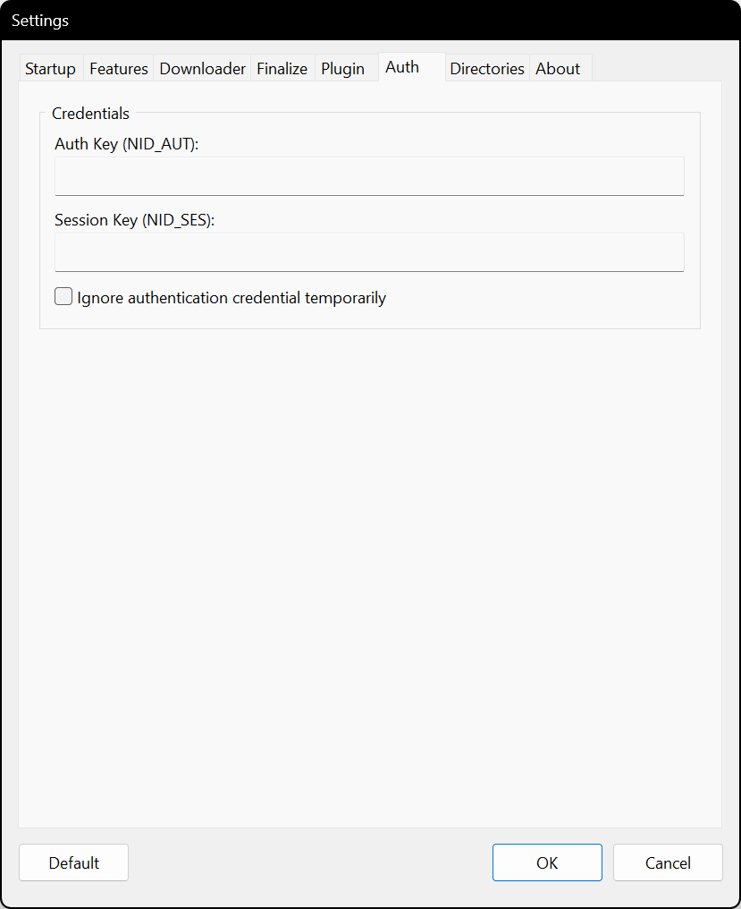

<i>(This image may not reflect the latest information.)</i>

* **Auth Key (NID_AUT)** - Specifies the authorization key of NAVER ID.
* **Session Key (NID_SES)** - Specifies the session key of NAVER ID.

For more information on how to get Chzzk authorized credential, please refer to `how_to_get_chzzk_credential.en-US.pdf`.

### Directories

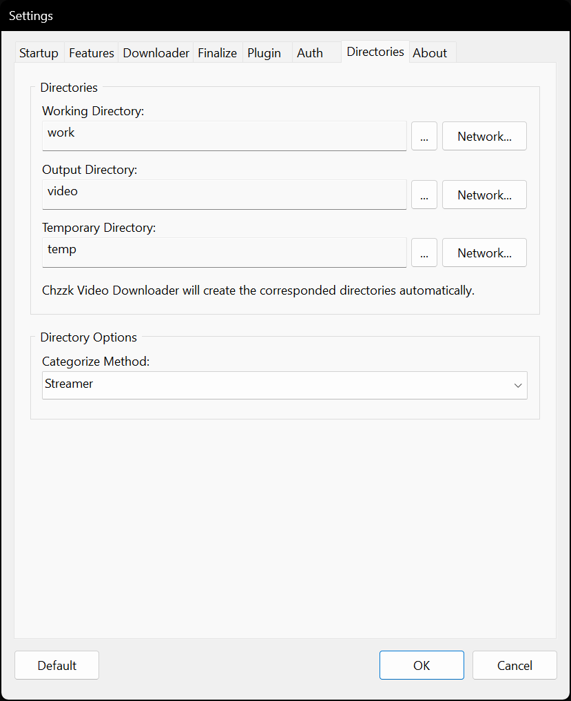

<i>(This image may not reflect the latest information.)</i>

* **Working Directory** - Specifies the directory where the configuration files of Chzzk Video Downloader are saved.
* **Output Directory** - Specifies the directory where downloaded video files are saved.
* **Temporary Directory** - Specifies the directory where temporary files are created.
* **Categorize Method** - Sets the categorization method for directories where downloaded video files are saved.

### About

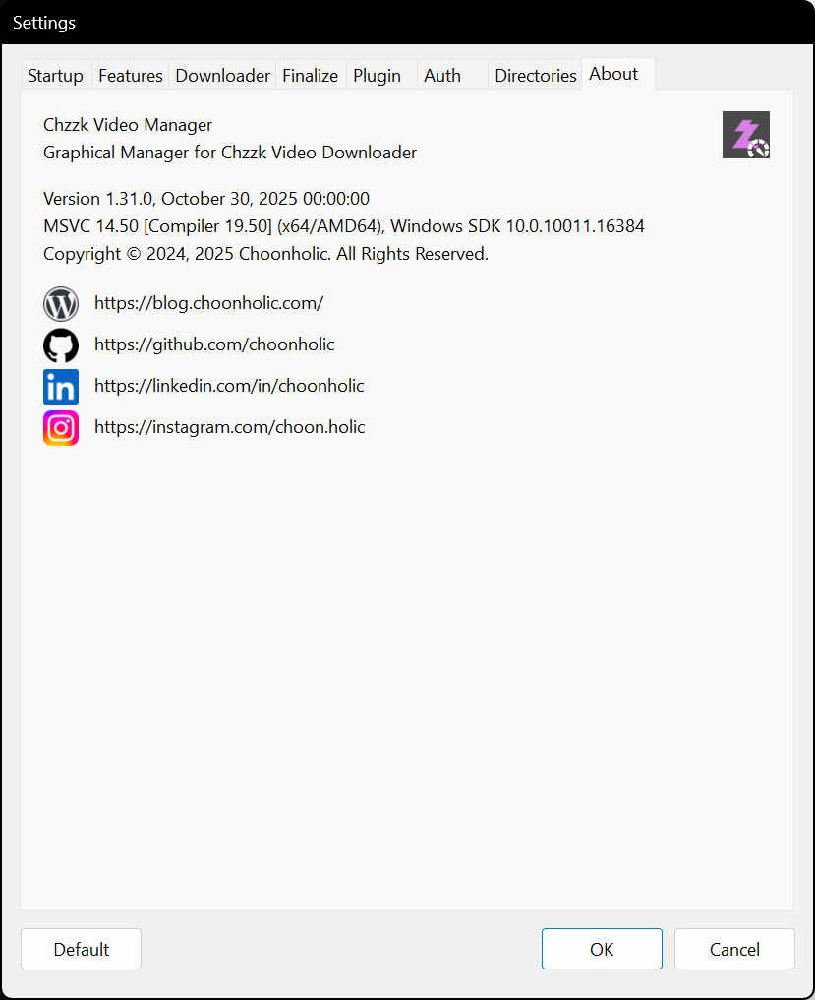

<i>(This image may not reflect the latest information.)</i>

* **Version Information** - Displays version information of Chzzk Video Manager.
* **Contact Links** - Links to contact to authors.

## Contact Us
If you have any questions, bug reports, or improvement requests regarding the Chzzk Downloader Suite, please submit them through [GitHub](https://github.com/Choonholic/ChzzkDownloader/)‘s [Issues](https://github.com/Choonholic/ChzzkDownloader/issues/new) feature. We can respond to all languages; however, the languages we directly support are Korean, English, Japanese, and Chinese. For other languages, responses may not be fully accurate due to the use of machine translation.
