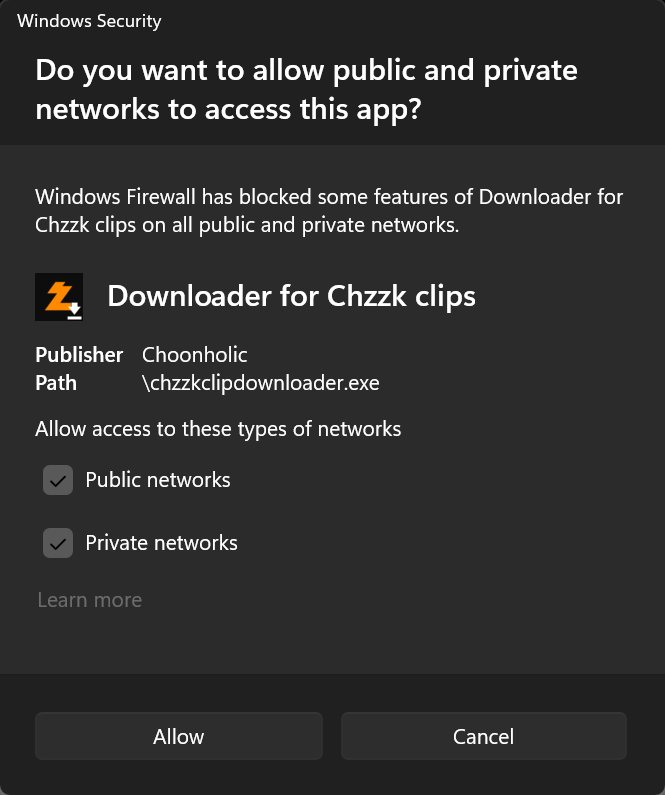

# How To Control Chzzk Clip Downloader Externally Using JSON-RPC

## Chzzk Downloader Suite JSON-RPC Specifications
Chzzk Downloader Suite supports single request of [JSON-RPC 2.0 Specifications](https://www.jsonrpc.org/specification) to control externally.

## How To Activate Server
Execute Chzzk Clip Downloader with `--rpc` option.

## How To Connect To Server
Internal JSON-RPC server accepts socket connections.

* **Host IP Address** - Default address is `localhost`. If you want to allow connections from outside the local PC, set the `--rpcexpose` option to `open` to expose the server externally. In this case, you may need to modify the Windows Defender Firewall settings as shown in the following image.
* **Port Number** - Default port number is `64000`. Use `--rpcport` option to change. (available range: `49152`~`65300`)
* **RPC ID** - Default ID is `50`. Use `--rpcid` option to change.

<div style='text-align: center'>

<p><i>(This image may vary depending on the operating system or system environment.)</i></p>
</div>

## How To Request
To request action from Chzzk Clip Downloader, send the object like below through the TCP socket.

```json
{
    "jsonrpc": "2.0",
    "method": "get_status",
    "id": 50
}
```

### Method List
* `get_info` - Retrieves all information at once.
* `get_version` – Retrieves the application version.
* `get_settings` – Retrieves the application settings.
* `get_channel` – Retrieves channel information.
* `get_clip` – Retrieves clip information if a clip is currently being downloaded.
* `get_status` – Retrieves the current status.
* `set_settings` – Changes the application settings.
* `reload_settings` – Reloads the application settings from configuration file.
* `quit_app` – Stops the current download (if in progress) and exits the application.

## Responses
Chzzk Clip Downloader returns responses in the following format.

```json
{
    "jsonrpc": "2.0",
    "result": "Success",
    "id": 50
}
```

### When The Request was Processed Successfully
* `result` - Results of the requested method.

### When The Request was not Processed Properly
* `error` - Indicates response is error.
* `code` - Error code.
* `message` - Error message.

## Sample Codes
Please refer to [samples](https://github.com/Choonholic/ChzzkDownloader/blob/main/samples/) in GitHub repository.
