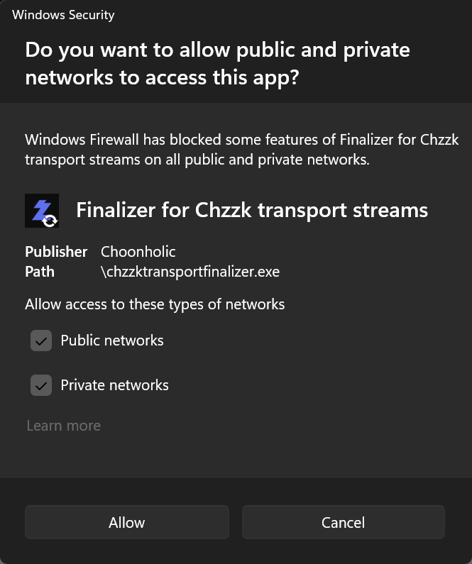

# How To Control Chzzk Transport Finalizer Externally Using JSON-RPC

## Chzzk Downloader Suite JSON-RPC Specifications
Chzzk Downloader Suite supports single request of [JSON-RPC 2.0 Specifications](https://www.jsonrpc.org/specification) to control externally.

## How To Activate Server
Execute Chzzk Transport Finalizer with `--rpc` option.

## How To Connect To Server
Internal JSON-RPC server accepts socket connections.

* **Host IP Address** - Default address is `localhost`. If you want to allow connections from outside the local PC, set the `--rpcexpose` option to `open` to expose the server externally. In this case, you may need to modify the Windows Defender Firewall settings as shown in the following image.
* **Port Number** - Default port number is `65000`. Use `--rpcport` option to change. (available range: `49152`~`65300`)
* **RPC ID** - Default ID is `70`. Use `--rpcid` option to change.

<div style='text-align: center'>

<p><i>(This image may vary depending on the operating system or system environment.)</i></p>
</div>

## How To Request
To request action from Chzzk Transport Finalizer, send the object like below through the TCP socket.

```json
{
    "jsonrpc": "2.0",
    "method": "get_status",
    "id": 70
}
```

### Method List
* `add_item` - Adds a file to the finalization queue.
* `get_info` - Retrieves all information at once.
* `get_settings` – Retrieves the application settings.
* `get_status` – Retrieves the current status.
* `get_version` – Retrieves the application version.
* `quit_app` – Stops the current download (if in progress) and exits the application.
* `quit_empty` – Exits the application when the finalization queue is empty.
* `reload_settings` – Reloads the application settings from configuration file.
* `remove_item` - Remove the file from the finalization queue.
* `set_settings` – Changes the application settings.
* `skip_current` - Stops finalizing the current file and skips to the next one.

## Responses
Chzzk Transport Finalizer returns responses in the following format.

```json
{
    "jsonrpc": "2.0",
    "result": {
        "timestamp": "2026-01-01T00:00:00.000Z",
        "...": "...",
    },
    "id": 70
}
```

### When The Request was Processed Successfully
* `result` - The results of the requested method.
* `timestamp` - The response time based on UTC.

### When The Request was not Processed Properly
* `error` - Indicates response is error.
* `code` - The error code.
* `message` - The error message.

## Sample Codes
Please refer to [samples](https://github.com/Choonholic/ChzzkDownloader/blob/main/samples/) in GitHub repository.
