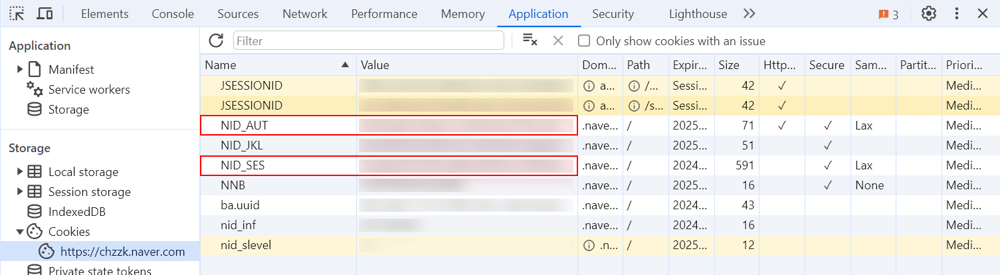

# How To Get Chzzk Authorized Credential

1. Open [Chzzk](https://chzzk.naver.com/) in desktop web browsers such as Microsoft Edge, Google Chrome or Mozilla Firefox.
2. Login with NAVER id.
3. Press **Ctrl+Shift+I** to open Developer Tools.
4. Open to **Application** tab.
5. Select https://chzzk.naver.com under **Cookies** item from the categories.
6. Copy values of **NID_AUT** and **NID_SES**.
7. Paste the values into the corresponding fields when requested.

<i>(This image may not reflect the latest information.)</i>

**[Notice]**
The `NID_SES` value will be changed whenever you logged into Chzzk. However, As long as the `NID_AUT` value is valid, the `NID_SES` value does not need to be reset each time.
