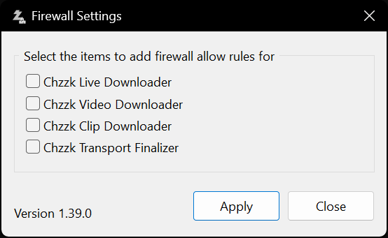

# Windows Defender Firewall Settings

To control Chzzk Downloader Suite from a device other than the one it is installed on (for example, a smartphone or an external network), you must change the **Windows Defender Firewall** settings.

## Configuring the Firewall via System UI
By default, when each downloader attempts an external connection for the first time, a **Windows Firewall dialog** like the one shown below appears. You can allow or block external connections using this dialog.

<i>(This image may vary depending on the operating system or system environment.)</i>

However, if the connection is already blocked by the firewall, this dialog may not appear, and the downloaders  may fail to run properly.

# Using Firewall Settings App
In this case, you can use **Firewall Settings** app provided with Chzzk Downloader Suite.

<i>(This image may not reflect the latest information.)</i>

- Check the current firewall configuration
- Allow or block external remote access at once
