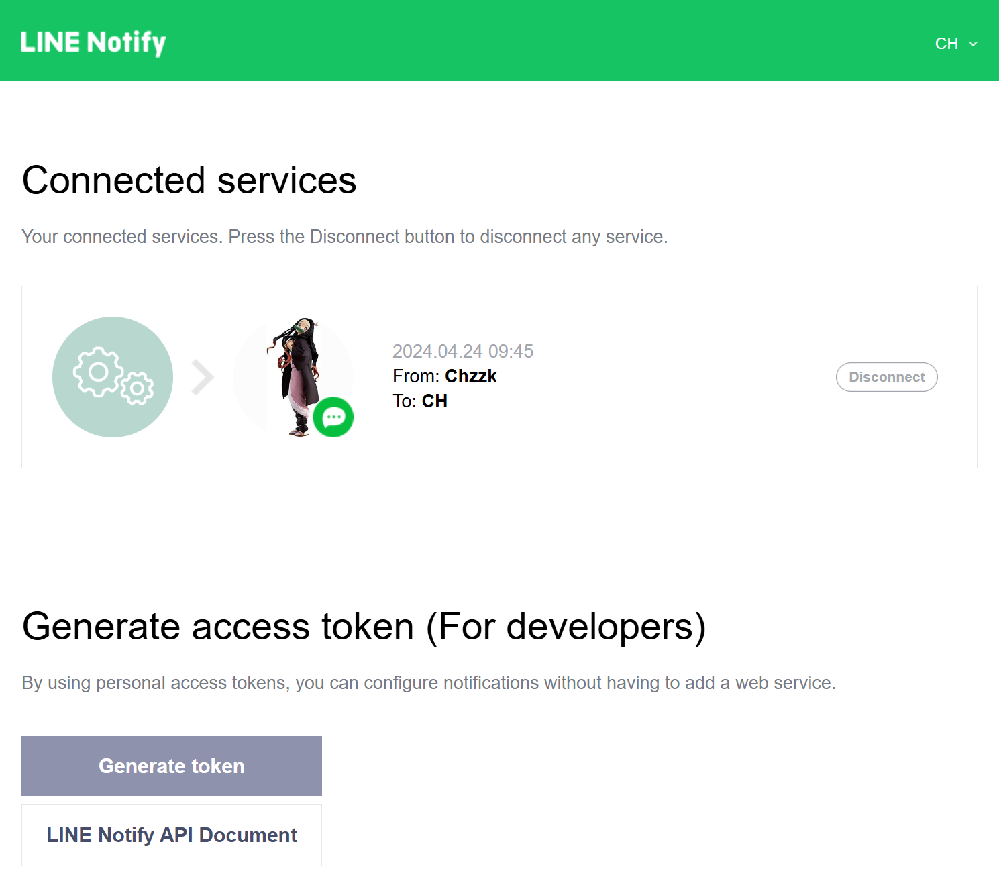

# How to issue access token for LINE notification

1. Sign up for LINE account if you haven't already.
2. Add E-mail to LINE account if you haven't already.
3. Open [LINE Notify](https://notify-bot.line.me/) in desktop web browsers such as Microsoft Edge, Google Chrome or Mozilla Firefox.
4. Log in to LINE Notify.
5. Click on your nickname and open [My page](https://notify-bot.line.me/my/).
6. Click **Generate token** in Generate access token (For developers) section.
7. Enter a token name. (e.g. Chzzk)
8. Select **1 on 1 chat with LINE Notify** and click **Generate token**.
9. When token is displayed click **Copy** to copy token.
10. Paste copied token into safe place (e.g. Microsoft OneNote).
11. Run **ChzzkLiveDownloader** with `-n` option to register token.

<i>(This image may not reflect the latest information.)</i>

