# Chzzk Clip Manager
Chzzk Clip Downloader用のGUIマネージャー

<i>(この画像は最新の情報と異なる場合があります。)</i>

## バージョン
Version 0.96, November 15, 2024 00:00:00

## 必要条件
Chzzk Clip Managerは、Chzzk Clip DownloaderのGUIフロントエンドアプリケーションであるため、Chzzk Clip Downloaderもインストールされている必要があります。

Chzzk Clip DownloaderとChzzk Clip Managerが同じディレクトリにある場合、Chzzk Clip Managerは起動時に自動的にChzzk Clip Downloaderを認識します。そうでない場合は、**必要条件の確認**を参照して、Chzzk Clip Downloaderの場所を指定してください。

ポータブル版の場合は、Chzzk Clip DownloaderとChzzk Clip Managerを同じディレクトリに保存することをお勧めします。`セットアップ`を使用してインストールした場合、両方が同じディレクトリにインストールされます。

## 実行方法
スタートメニューから`Chzzk Clip Manager`をクリックするか、`Chzzk Downloader Environment`で`ChzzkClipManager.exe`を実行します。

## 必要条件の確認
Chzzk Clip Managerが正常に機能するためには、Chzzk Clip Downloaderが正しく設定されている必要があります。Chzzk Clip Managerの起動時に、この必要条件が満たされているかチェックし、満たされていない場合は、以下のダイアログが表示されます。

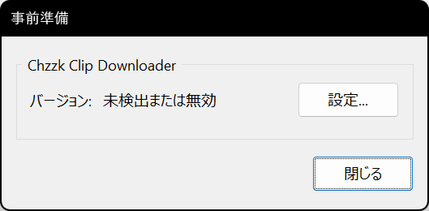

<i>(この画像は最新の情報と異なる場合があります。)</i>

`設定...`ボタンをクリックしてChzzk Clip Downloaderの場所を指定できます。

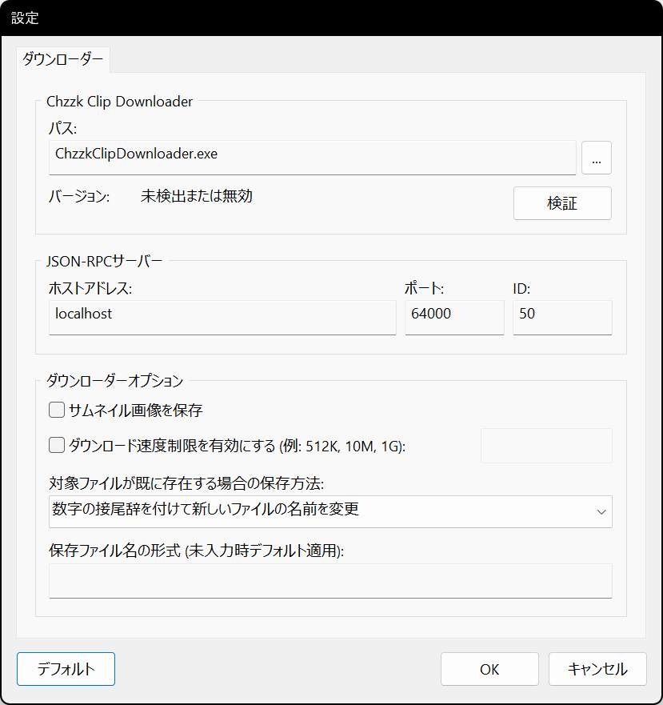

<i>(この画像は最新の情報と異なる場合があります。)</i>

`...`ボタンをクリックして、正しいパスにある`ChzzkClipDownloader.exe`ファイルを選択してください。正しいChzzk Clip Downloaderが指定されると、以下の図のようにバージョン情報が表示されます。

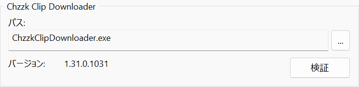

<i>(この画像は最新の情報と異なる場合があります。)</i>

## メインメニューを開く
ウィンドウの左上にある☰アイコンをクリックすると、メインメニューが開きます。

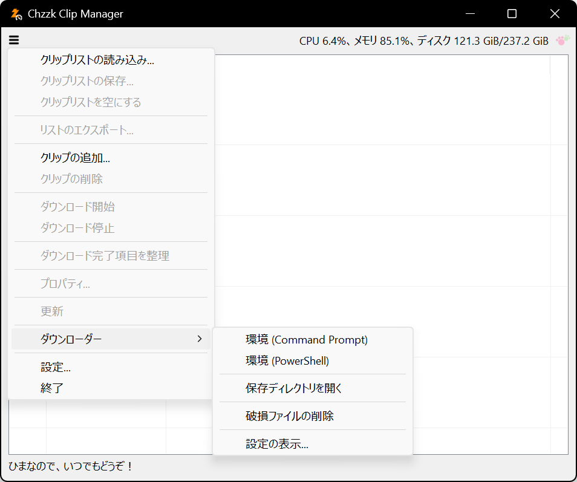

<i>(この画像は最新の情報と異なる場合があります。)</i>

## クリップの追加
メインメニューから`クリップの追加...`を選択すると、クリップ追加ダイアログが表示されます。追加するクリップUIDまたはURLを入力し、`OK`ボタンをクリックしてクリップを追加します。

<i>(この画像は最新の情報と異なる場合があります。)</i>

### クリップUIDまたはURL
入力されたクリップUIDは、次のいずれかの形式として自動的に認識されます。

* クリップURL - `https://chzzk.naver.com/Clips/UID`
* クリップUID - `UID`

## クリップの削除
クリップを削除するには、リストからクリップを選択し、☰アイコンをクリックして`クリップの削除`を選択し、確認のため`OK`をクリックします。

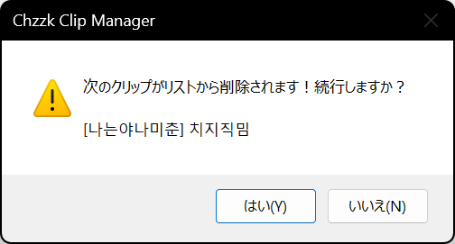

<i>(この画像は最新の情報と異なる場合があります。)</i>

## ダウンロードの開始
リストのクリップのダウンロードを開始するには、☰アイコンをクリックし、`ダウンロード開始`を選択します。

## ダウンロードの停止
リストのクリップのダウンロードを停止するには、☰アイコンをクリックし、`ダウンロード停止`を選択し、確認のため`OK`をクリックします。

<i>(この画像は最新の情報と異なる場合があります。)</i>

ダウンロードを停止すると、進行中のすべてのダウンロードが中断されます。

## クリップのプロパティの表示
クリップのプロパティを参照するには、リストからクリップを選択し、☰アイコンをクリックして`プロパティ...`を選択します。

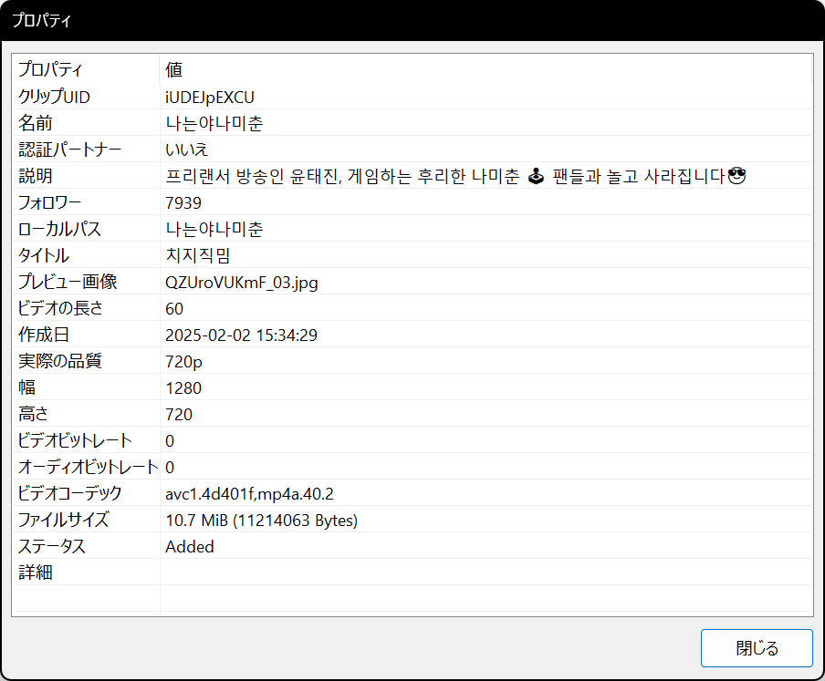

<i>(この画像は最新の情報と異なる場合があります。)</i>

## コンテキストメニュー
リストからクリップを選択して右クリックすると、クリップのコンテキストメニューが表示されます。

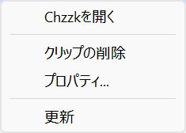

<i>(この画像は最新の情報と異なる場合があります。)</i>

## クリップリストの保存
クリップリストは、リストファイルに保存し、後で必要に応じて読み込むことができます。

リストに1つ以上のクリップが含まれている場合、☰アイコンをクリックし、`クリップリストの保存...`を選択します。ダイアログが表示され、保存するディレクトリとファイル名を変更できます。

## クリップリストの読み込み
毎回クリップを追加する代わりに、以前に保存したクリップリストを読み込むことができます。

☰アイコンをクリックし、`クリップリストの読み込み...`を選択します。ダイアログが表示され、クリップリストファイルを選択できます。

読み込んだリストにあるクリップが現在のリストに既に存在する場合、それが自動的に認識され、適切に処理されます。

## リストの更新
リストをすぐに更新するには、☰アイコンをクリックし、`更新`を選択します。

## Chzzk Downloader Suiteの環境を開く
Chzzk Downloader Suiteの環境を開くには、☰アイコンをクリックし、`ダウンローダー`の下にある`環境（Command Prompt）`または`環境（PowerShell）`を選択します。

<i>(この画像は最新の情報と異なる場合があります。)</i>

## 保存ディレクトリを開く
ダウンロードしたクリップの保存ディレクトリを開くには、☰アイコンをクリックし、`ダウンローダー`の下にある`保存ディレクトリを開く`を選択します。

## Chzzk Clip Downloaderの設定の表示
Chzzk Clip Downloaderの設定を表示するには、☰アイコンをクリックし、`ダウンローダー`の下にある`設定を表示...`を選択します。

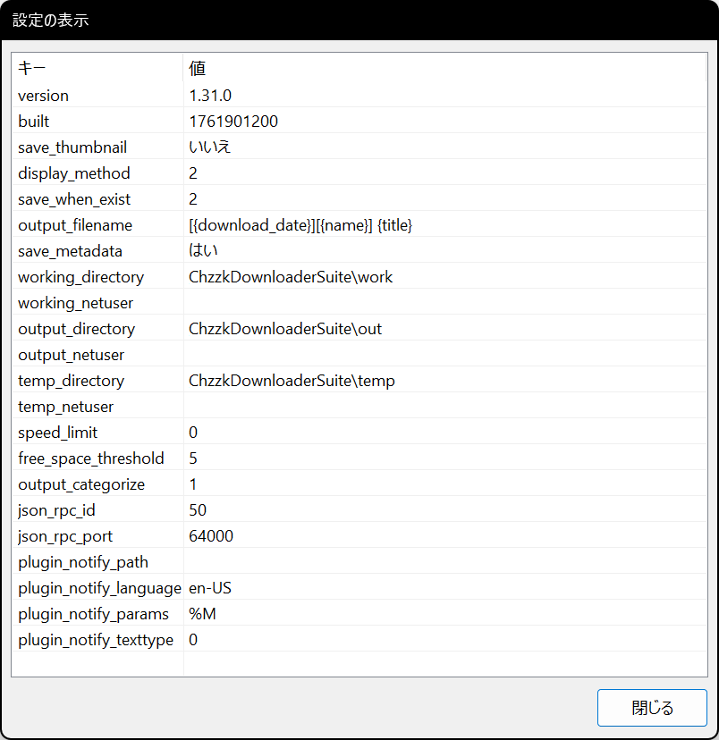

<i>(この画像は最新の情報と異なる場合があります。)</i>

## 最小化時にトレイに移動
`機能`設定で`最小化時にトレイに移動`オプションが有効になっている場合、Chzzk Clip Managerが最小化されるとシステムトレイに移動します。

<i>(この画像は最新の情報と異なる場合があります。)</i>

トレイのアイコンをダブルクリックするとウィンドウが元の状態に戻り、トレイのアイコンを右クリックすると、以下の画像のようなメニューが表示されます。

<i>(この画像は最新の情報と異なる場合があります。)</i>

## その他の設定

### 起動

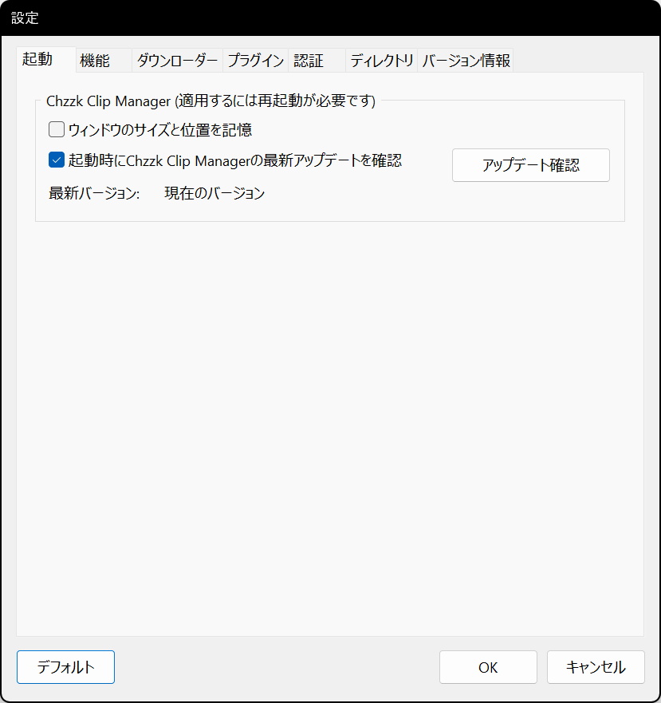

<i>(この画像は最新の情報と異なる場合があります。)</i>

* **起動時にウィンドウのサイズと位置を記憶** - 終了時にウィンドウのサイズと位置を保存し、次回起動時に復元します。
* **起動時にChzzk Clip Managerの最新アップデートを確認** - 起動時にChzzk Clip Managerの最新アップデートを確認するかどうかを設定します。手動で確認する場合は、`アップデート確認`ボタンをクリックします。

### 機能

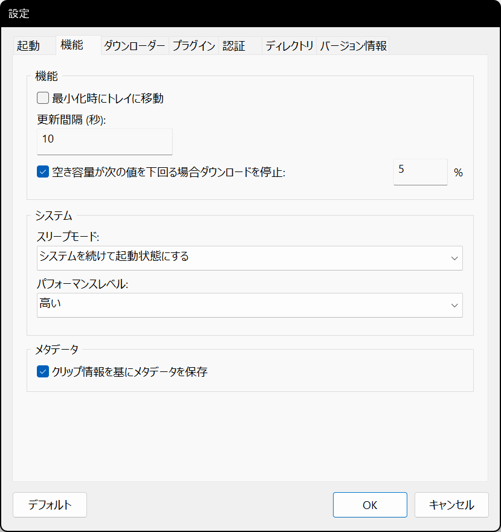

<i>(この画像は最新の情報と異なる場合があります。)</i>

* **更新間隔 (秒)** - リストの画面更新間隔を設定します。
* **パフォーマンスレベル** - Chzzk Clip Managerが現在実行されているシステムのパフォーマンスを指定します。クリップの追加や更新時にタイムアウトによるエラーが発生する場合、パフォーマンスレベルを1段階下げて再試行してください。

### ダウンローダー

<i>(この画像は最新の情報と異なる場合があります。)</i>

* **JSON-RPCサーバー: ホストアドレス** - JSON-RPCサーバーのホストアドレスを設定します。
* **JSON-RPCサーバー: ポート** - JSON-RPCサーバーのポート番号を設定します。
* **JSON-RPCサーバー: ID** - JSON-RPCサーバーのIDを設定します。
* **サムネイル画像を保存** - サムネイル画像を別途保存するかどうかを設定します。

### 認証

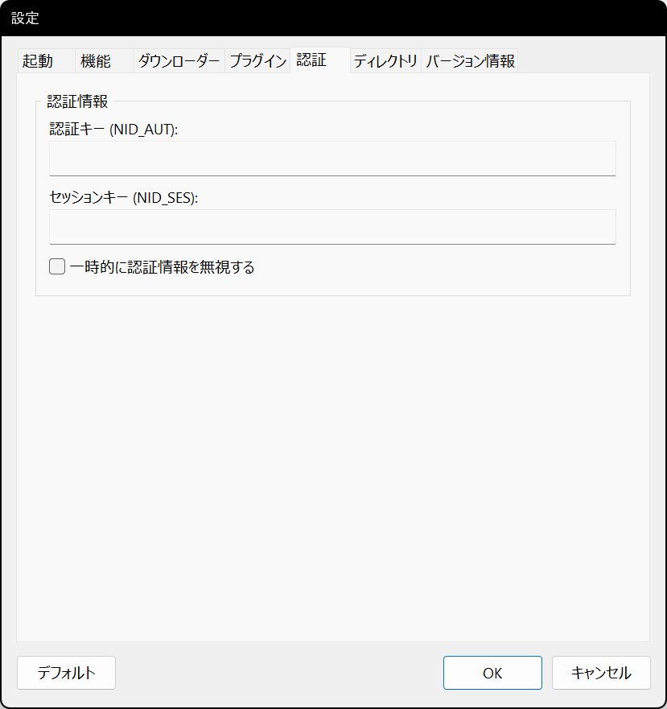

<i>(この画像は最新の情報と異なる場合があります。)</i>

* **認証キー (NID_AUT)** - * NAVER IDの認証キーを指定します。
* **セッションキー (NID_SES)** - NAVER IDのセッションキーを指定します。

Chzzk認証資格情報の取得方法については、`how_to_get_chzzk_credential.ja-JP.pdf`を参照してください。

### ディレクトリ

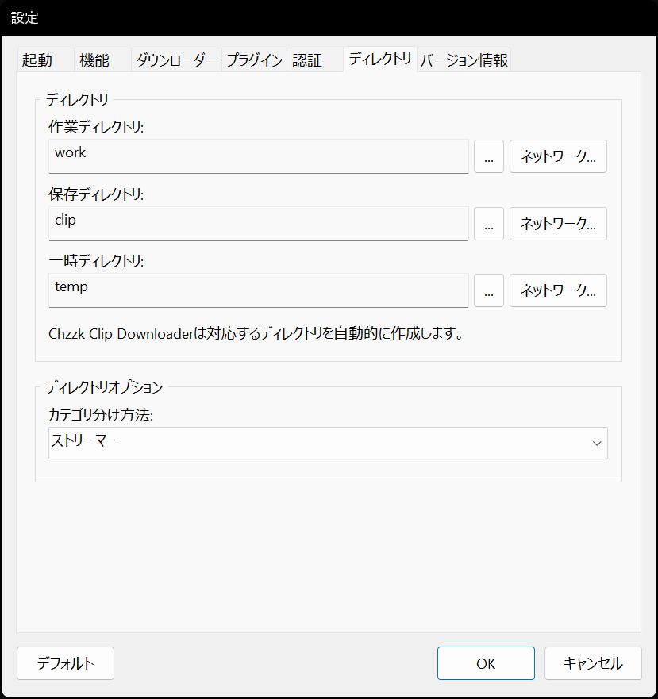

<i>(この画像は最新の情報と異なる場合があります。)</i>

* **作業ディレクトリ** - Chzzk Clip Downloaderの設定ファイルが保存されるディレクトリを指定します。
* **保存ディレクトリ** - ダウンロードしたクリップファイルが保存されるディレクトリを指定します。
* **一時ディレクトリ** - 一時ファイルが作成されるディレクトリを指定します。

### バージョン情報

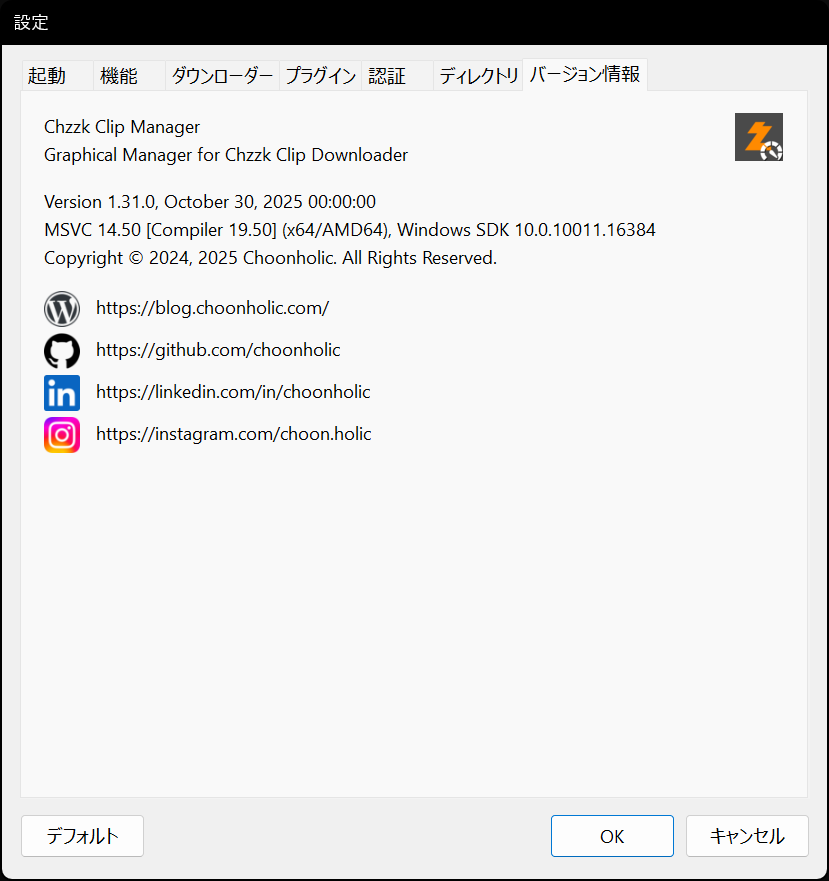

<i>(この画像は最新の情報と異なる場合があります。)</i>

* **バージョン情報** - Chzzk Clip Managerのバージョン情報を表示します。
* **お問い合わせリンク** - 作成者への連絡先リンクです。

## お問い合わせ
Chzzk Downloader Suiteに関するご質問、バグ報告、または改善要望がございましたら、[GitHub](https://github.com/Choonholic/ChzzkDownloader/)の[Issues](https://github.com/Choonholic/ChzzkDownloader/issues/new)機能を通じてお知らせください。全ての言語に対応可能ですが、直接対応可能な言語は韓国語、英語、日本語、中国語です。他の言語については、機械翻訳を通じて対応するため、100%正確に対応できない場合があります。
