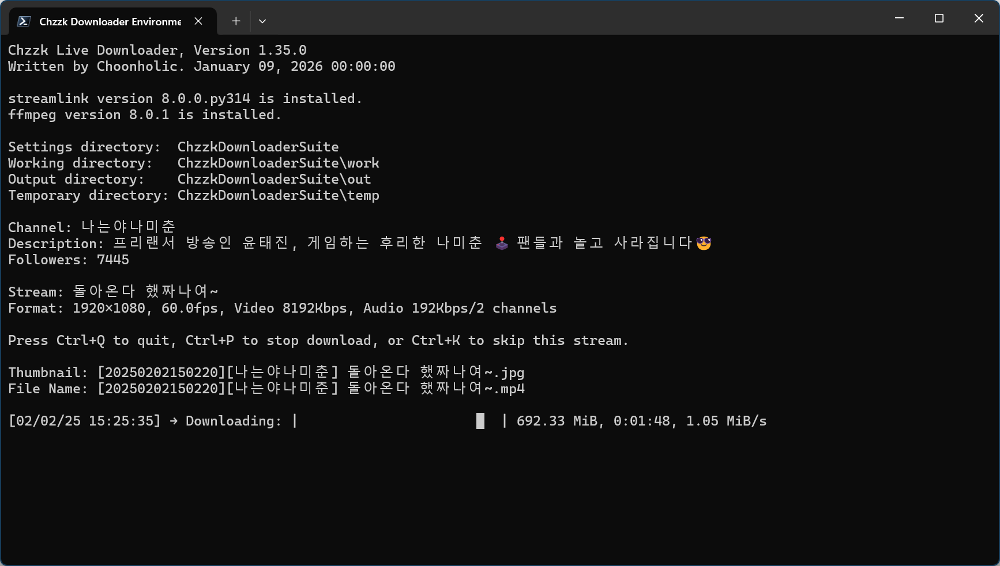

# Chzzk Live Downloader
Chzzkのストリーム用のダウンローダー

<div style='text-align: center'>

<p><i>(この画像は最新の情報と異なる場合があります。)</i></p>
</div>

## バージョン
Version 1.5.0, December 24, 2024 00:00:00

## 必須事項
* **[必須]** 最新バージョンのFFmpeg（FFmpeg 7.0またはそれ以上が必要）
* **[必須]** 最新バージョンのStreamlink（Streamlink 6.7.3またはそれ以上が必要）

## 使用法
```powershell
ChzzkLiveDownloader [-h] [--version] [-i ID] [-u [UID]] [-a] [--authaut AUTHAUT] [--authses AUTHSES]
                    [--adult [ADULT]] [-y] [-q [QUALITY]] [-d [DISPLAY]] [--once ONCE]
                    [--stream [STREAM]] [--final [FINAL]] [--custom [CUSTOM]] [--offset OFFSET]
                    [--duration DURATION] [--detect [DETECT]] [--name [NAME]] [--work [WORK]]
                    [--work-user [WORK_USER]] [--work-pass [WORK_PASS]] [--out [OUT]]
                    [--out-user [OUT_USER]] [--out-pass [OUT_PASS]] [--temp [TEMP]]
                    [--temp-user [TEMP_USER]] [--temp-pass [TEMP_PASS]] [--category [CATEGORY]]
                    [--exist [EXIST]] [--threshold [THRESHOLD]] [--rpcbaseport [RPCPORT]]
                    [--snapshot SNAPSHOT] [--thumb [THUMB]] [--startup [STARTUP]]
                    [--settings [SETTINGS]] [--reset]
```

### オプション
```
-h, --help              このヘルプメッセージを表示
--version               バージョン情報を表示
-i, --id ID             ストリーマーのIDを設定（デフォルト: 0）
-u, --uid [UID]         ストリーマーの一意の識別子を設定
-a, --auth              Chzzk認証資格情報を設定
--authaut AUTHAUT       Chzzk認証資格情報の認証キーを設定
--authses AUTHSES       Chzzk認証資格情報のセッションキーを設定
--adult [ADULT]         認証情報が無効な場合のアダルトコンテンツ処理方法を設定（ask|skip）
-y, --yes               すべての確認値を自動的に「はい」に設定
-q, --quality [QUALITY] ダウンロードする目標画質を設定（例: 1080p）
-d, --display [DISPLAY] ダウンロードステータス表示モードを設定（quiet|simple|fluent|all）
--once ONCE             ストリームを一度だけダウンロード
--stream [STREAM]       ストリーム取得方法を設定（standard|timemachine）
--final [FINAL]         最終処理方法を設定（bypass|convert|cleanup|cconvert|ccleanup）
--custom [CUSTOM]       最終処理のカスタムオプションを設定（cconvert|ccleanupのみ適用可能）
--offset OFFSET         ストリームの冒頭からスキップする時間を設定
--duration DURATION     ダウンロードするストリームの最大持続時間を設定
--detect [DETECT]       検出間隔を設定（デフォルト: 60、1-600）
--name [NAME]           保存ファイル名の形式を設定
--work [WORK]           作業ディレクトリを設定
--work-user [WORK_USER] 作業ディレクトリがリモートネットワーク上にある場合に使用するユーザー名を設定
--work-pass [WORK_PASS] 作業ディレクトリがリモートネットワーク上にある場合に使用するパスワードを設定
--out [OUT]             保存ディレクトリを設定
--out-user [WORK_USER]  保存ディレクトリがリモートネットワーク上にある場合に使用するユーザー名を設定
--out-pass [WORK_PASS]  保存ディレクトリがリモートネットワーク上にある場合に使用するパスワードを設定
--temp [TEMP]           一時ディレクトリを設定
--temp-user [WORK_USER] 一時ディレクトリがリモートネットワーク上にある場合に使用するユーザー名を設定
--temp-pass [WORK_PASS] 一時ディレクトリがリモートネットワーク上にある場合に使用するパスワードを設定
--category [CATEGORY]   保存時のカテゴリ分け方法を設定 (none|streamer)
--exist [EXIST]         対象ファイルが既に存在する場合の保存方法を設定 (rename|skip|overwrite)
--threshold [THRESHOLD] 空き容量が少ない場合に停止する閾値(%)を設定 (無効化: -, デフォルト: 10, 3-30)
--rpcbaseport [RPCPORT] JSON-RPCサーバーのベースポートを設定（デフォルト: 62000、49152-65300）
--snapshot SNAPSHOT     ステータスが変更されるたびにJSONファイルにスナップショットを保存
--thumb [THUMB]         サムネイル画像を保存またはスキップ（save|skip）
--startup [STARTUP]     起動方法を設定（normal|fast）
--settings [SETTINGS]   設定保存時の動作を設定（default|skip|quit）
--reset                 すべての設定をリセット
```

### 使用例
```powershell
ChzzkLiveDownloader -i 2 --thumb save --detect 30 --work work --out out --temp temp
```

## 初期設定
初期設定には、以下の項目を準備してください。

* ストリーマーのチャンネルUID

初回使用時にはパラメータなしで実行します。

```powershell
ChzzkLiveDownloader
```

推奨初期設定については、後の[推奨初期設定]（#recommended-initial-settings）を参照してください。

## 複数のチャンネルを同時にダウンロード
複数のチャンネルを同時にダウンロードするには、新しいコマンドプロンプトまたはPowerShellコンソールを開き、Chzzk Live Downloaderを実行します。ただし、パラメータを指定せずに実行すると、Chzzk Live Downloaderは常に最初に登録したUIDのダウンロードを行います。新しいUIDを指定する場合、以下のコマンドで新しい構成を指定できます。

```powershell
ChzzkLiveDownloader -i n
ChzzkLiveDownloader --id n
```

指定したUIDは以下回以降も同じパラメータで設定すると再利用され、そのUIDのストリームを自動で検索してダウンロードします。

## 特定IDのUID設定またはリセット

### UID設定

特定のIDに割り当てるUIDを設定するには、以下のコマンドを使用します。

```powershell
ChzzkLiveDownloader -i n -u uid または url
ChzzkLiveDownloader --id n --uid uid または url
```

デフォルトIDに割り当てられたUIDを変更するには、`-i`（または`--id`）パラメータに`0`を指定するか、`-u`（または`--uid`）パラメータのみを指定して、以下のように実行します。

```powershell
ChzzkLiveDownloader -u uid または url
ChzzkLiveDownloader --uid uid または url
```

### UIDリセット
特定のIDに割り当てられたUIDをリセットするには、以下のコマンドを使用します。このコマンドは、該当するIDにUIDが以前に割り当てられていなくても動作します。

デフォルトIDの場合:

```powershell
ChzzkLiveDownloader -u
ChzzkLiveDownloader --uid
```

特定IDの場合:

```powershell
ChzzkLiveDownloader -i n -u
ChzzkLiveDownloader --id n --uid
```

## 一度だけ情報を保存せずにストリームをダウンロード
URLを指定してストリーマー情報を保存せずに一度だけストリームをダウンロードする場合、以下のコマンドを使用します。

```powershell
ChzzkLiveDownloader --once uid または url
```

## 認証資格情報のリセット
成人限定ストリームなど、NAVER認証資格情報が必要なストリームをダウンロードするには、以下の情報を指定する必要があります。

* ChzzkクッキーからのNAVER IDの認証キー（`NID_AUT`）
* ChzzkクッキーからのNAVER IDのセッションキー（`NID_SES`）

認証資格情報が必要なクリップをダウンロードする際に、認証資格情報が見つからない場合は、認証情報の入力プロンプトが自動的に表示されます。

一度入力すると、デフォルトとして設定され、以後の実行では再入力の必要はありません。Chzzk認証資格情報の取得方法については、`how_to_get_chzzk_credential.ja-JP.pdf`を参照してください。

認証資格情報が変更された場合や、別のIDでログインしてリセットする必要がある場合は、以下のコマンドを使用してください。

```powershell
ChzzkLiveDownloader -a
ChzzkLiveDownloader --auth
```

`-y`または`--yes`パラメータを使用すると、確認なしで認証情報の入力プロンプトが自動的に表示されます。

```powershell
ChzzkLiveDownloader -y
ChzzkLiveDownloader --yes
```

## ダウンロードする目標画質の指定
デフォルトでは、可能な限り最高の画質でダウンロードが行われます。ただし、ストレージ節約やその他の理由で異なる画質で保存したい場合、以下のコマンドを使用します。また、ストリームが標準解像度を使用していない場合は、指定した解像度に最も近い画質が自動的に選択されます。

```powershell
ChzzkLiveDownloader -q 720p
ChzzkLiveDownloader --quality 720p
```

このオプションをデフォルトに設定したい場合は、以下のように`-q`または`--quality`のみを使用してください。

```powershell
ChzzkLiveDownloader -q
ChzzkLiveDownloader --quality
```

## 保存ファイル名の形式設定
デフォルトでは、保存されるビデオとサムネイルのファイル名は`[{download_date}][{name}] {title}`の形式になります。この形式を変更したい場合は、以下のコマンドを使用してください。

```powershell
ChzzkLiveDownloader --name "[{name}][{category}] {title}"
```

このオプションをデフォルトに設定したい場合は、以下のように`--name`のみを使用してください。

```powershell
ChzzkLiveDownloader --name
```

### ファイル名形式タグ
ファイル名形式には以下の定義済みタグを使用できます。

* `{name}` - チャンネル名。
* `{verified}` - チャンネルが認証済みの場合、このタグは`[✓]`になります（認証されていない場合は空）。
* `{channel_uid}` - チャンネルUID。
* `{title}` - ストリームのタイトル。
* `{category_type}` - ストリームのカテゴリタイプ（設定されている場合）。
* `{category}` - ストリームのカテゴリ（設定されている場合）。
* `{category_value}` - ストリームのカテゴリの値（設定されている場合）。
* `{live_date...}` - ストリーム開始時の日付関連タグ。
* `{download_date...}` - ダウンロード開始時の日付関連タグ。
* `{media...}` - メディア情報関連のタグ。

メディア関連タグでは以下の要素が利用できます。

* `{media_quality}` - メディア品質（例: `1080p`）。
* `{media_encoding_track_id}` - エンコーディングトラックID（例: `1080p`）。
* `{media_video_profile}` - ビデオプロファイル（例: `high`）。
* `{media_audio_profile}` - オーディオプロファイル（例: `LC`）。
* `{media_video_codec}` - ビデオコーデック（例: `H264`）。
* `{media_video_bitrate}` - ビデオビットレート（ビット/秒, 例: `8000000`）。
* `{media_audio_bitrate}` - オーディオビットレート（ビット/秒, 例: `192000`）。
* `{media_video_framerate}` - ビデオフレームレート（フレーム/秒, 例: `60.0`）。
* `{media_video_width}` - ビデオの幅（ピクセル, 例: `1920`）。
* `{media_video_height}` - ビデオの高さ（ピクセル, 例: `1080`）。
* `{media_audio_sampling_rate}` - オーディオサンプリングレート（ヘルツ, 例: `48000`）。
* `{media_audio_channel}` - オーディオチャンネル（例: `2`）。
* `{media_video_dynamic_range}` - ビデオダイナミックレンジ（例: `SDR`）。

日付関連タグでは、以下の詳細要素を展開できます。

* `{..._date}` - 日付（`%Y%m%d%H%M%S` 形式, 例: `20240607014327`）。
* `{..._date_year}` または `{..._date_year_full}` - 世紀を含む年（例: `2024`）。
* `{..._date_year_short}` - 世紀を含まない年（ゼロ埋め形式, 例: `24`）。
* `{..._date_month}` - 月（ゼロ埋め形式, `01`, `02`, ..., `12`）。
* `{..._date_month_full}` - 月の完全な名称（`January`, `February`, ..., `December`）。
* `{..._date_month_short}` - 月の略称（`Jan`, `Feb`, ..., `Dec`）。
* `{..._date_day}` - 日（ゼロ埋め形式, `01`, `02`, ..., `31`）。
* `{..._date_hour}` - 時（24時間表記, ゼロ埋め形式, `00`, `01`, ..., `23`）。
* `{..._date_minute}` - 分（ゼロ埋め形式, `00`, `01`, ..., `59`）。
* `{..._date_second}` - 秒（ゼロ埋め形式, `00`, `01`, ..., `59`）。

## ストリーム検出間隔の設定
デフォルトでは、ストリームの検出間隔は60秒に設定されています。これを変更するには、以下のコマンドを使用します。`n`は`1`から`600`の範囲で指定できます。したがって、検出間隔は1秒から最大10分まで設定できます。

```powershell
ChzzkLiveDownloader --detect n
```

このオプションをデフォルトに設定したい場合は、以下のように`--detect`のみを使用してください。

```powershell
ChzzkLiveDownloader --detect
```

## サムネイル画像の処理
サムネイル画像を別途保存するには、以下のコマンドを使用します。

```powershell
ChzzkLiveDownloader --thumb save
```

この機能をオフにするには、以下のコマンドを使用します。

```powershell
ChzzkLiveDownloader --thumb skip
```

## ダウンロード詳細の表示方法を設定
デフォルトでは、詳細なダウンロード情報が表示されます。ただし、詳細が不要な場合は、以下のコマンドで表示を抑制できます。

```powershell
ChzzkLiveDownloader -d quiet
ChzzkLiveDownloader --display quiet
```

`--display`パラメータで設定可能な表示方法は以下の通りです。

* `quiet` - すべてのダウンロード詳細を非表示にします。
* `fluent` - 詳細なダウンロード情報をすべて表示します。
* `default` - `fluent`と同じです。

このオプションをデフォルトに設定したい場合は、以下のように`-d`または`--display`のみを使用してください。

```powershell
ChzzkLiveDownloader -d
ChzzkLiveDownloader --display
```

## 最終処理
デフォルトでは、Chzzk Live Downloaderはライブダウンロード中に`.ts`拡張子のMPEGTS形式でダウンロードし、ダウンロード完了時に最終処理段階で`.mp4`拡張子のMPEG4形式に変換します。ただし、最終処理方法は`--final`オプションで以下のように設定できます。

```powershell
ChzzkLiveDownloader --final all
```

`--final`パラメータで設定可能な最終処理方法は以下の通りです。

* `none` - トランスポートストリームファイル（`.ts`）をダウンロードするだけで、変換ステージをスキップします。トランスポートストリームファイルは再生には外部コンバータでの変換が必要です。
* `convert` - トランスポートストリームファイル（`.ts`）をビデオファイル（`.mp4`）に変換しますが、トランスポートストリームファイルは削除しません。
* `cleanup` - トランスポートストリームファイル（`.ts`）をビデオファイル（`.mp4`）に変換し、トランスポートストリームファイルを削除します。
* `cconvert` - `--custom`によるカスタムオプションでトランスポートストリームファイル（`.ts`）をビデオファイル（`.mp4`）に変換しますが、トランスポートストリームファイルは削除しません。
* `ccleanup` - `--custom`によるカスタムオプションでトランスポートストリームファイル（`.ts`）をビデオファイル（`.mp4`）に変換し、トランスポートストリームファイルを削除します。

```powershell
ChzzkLiveDownloader --final convert
```

このオプションをデフォルトに設定したい場合は、以下のように`--final`のみを使用してください。

```powershell
ChzzkLiveDownloader --final
```

### 最終処理中のカスタムエンコード
`--final`オプションで`cconvert`または`ccleanup`を使用して、最終処理中にカスタムエンコードオプションを設定できます。例えば、以下のオプションで`FFmpeg`を使用して`H.265`コーデックでエンコードできます。

```powershell
ChzzkLiveDownloader --final cconvert --custom "-c:v libx265 -preset medium -crf 23 -c:a aac -b:a 128k"
```

カスタムエンコードはパフォーマンスが最適でないため推奨されません。より良い結果を得るには、外部のプロフェッショナルエンコーダーの使用を検討してください。

## 開始オフセットの設定
ストリームの冒頭からスキップする時間を設定するには、以下のコマンドを使用します。

```powershell
ChzzkLiveDownloader --offset 30
```

デフォルトでは時間の単位は秒です。しかし、以下のように時間、分、秒、ミリ秒で設定することも可能です。

```powershell
ChzzkLiveDownloader --offset 1:23:45.67
ChzzkLiveDownloader --offset 1h30m45.67s
```

## ダウンロードする持続時間の設定および分割ダウンロード
ストリームのダウンロード持続時間を設定するには、以下のコマンドを使用します。`--once`パラメータが指定されていない場合、ダウンロードされたストリームは指定された持続時間で分割されます。

```powershell
ChzzkLiveDownloader --duration 3600
```

デフォルトでは時間の単位は秒です。しかし、以下のように時間、分、秒、ミリ秒で設定することも可能です。

```powershell
ChzzkLiveDownloader --duration 1:23:45.67
ChzzkLiveDownloader --duration 1h30m45.67s
```

## ストリーム取得方法の設定
デフォルトでは、Chzzk Live DownloaderはChzzkのタイムマシンAPIからストリーム情報を取得し、可能な限り早くストリームをダウンロードします。しかし、お好みに応じて以下のコマンドでストリーム取得方法を設定することができます。

```powershell
ChzzkLiveDownloader --stream standard
```

`--stream`パラメータで設定可能なストリーム方法は以下の通りです。

* `standard` - Chzzkの基本APIからストリーム情報を取得します。
* `timemachine` - ChzzkのタイムマシンAPIからストリーム情報を取得します。

このオプションをデフォルトに設定したい場合は、以下のように`--stream`のみを使用してください。

```powershell
ChzzkLiveDownloader --stream
```

## 作業ディレクトリの設定
作業に必要なファイルが保存されるディレクトリを指定するには、以下のコマンドを使用します。

```powershell
ChzzkLiveDownloader --work work
```

このオプションをデフォルトに設定したい場合は、以下のように`--work`のみを使用してください。

```powershell
ChzzkLiveDownloader --work
```

## 保存ディレクトリの設定
ダウンロードしたファイルが最終的に保存されるディレクトリを指定するには、以下のコマンドを使用します。

```powershell
ChzzkLiveDownloader --out out
```

デフォルトでは、すべてのファイルはストリーマーごとのサブディレクトリに分類して保存されます。ストリーマーごとに分類せずに保存する場合は、次のコマンドを使用してください。

```powershell
ChzzkLiveDownloader --category none
```

このオプションをデフォルトに設定したい場合は、以下のように`--out`または`--category`のみを使用してください。

```powershell
ChzzkLiveDownloader --out --category
```

## 一時ディレクトリの設定
ダウンロード中のファイルが保存される一時ディレクトリを指定するには、以下のコマンドを使用します。

```powershell
ChzzkLiveDownloader --temp temp
```

このオプションをデフォルトに設定したい場合は、以下のように`--temp`のみを使用してください。

```powershell
ChzzkLiveDownloader --temp
```

## ディレクトリ指定方法
ディレクトリは次のように指定できます。

```powershell
ChzzkLiveDownloader --temp temp
```

実行ファイルが存在するディレクトリのサブディレクトリである`temp`ディレクトリを一時ディレクトリとして指定します。このディレクトリが存在しない場合は、新しく作成されます。

```powershell
ChzzkLiveDownloader --work \Users\Username\Documents\chzzk_work
```

現在のドライブ上の`\Users\Username\Documents\chzzk_work`ディレクトリを作業ディレクトリとして指定します。このディレクトリが存在しない場合は、新しく作成されます。

```powershell
ChzzkLiveDownloader --work C:\Users\Username\Documents\chzzk_work
```

もちろん、上記のようにドライブ(例:`C:`)を直接指定することもできます。

```powershell
ChzzkLiveDownloader --out \\192.168.0.1\chzzk\out
```

`\\192.168.0.1\chzzk\out`のUNCパスを基盤としたネットワークストレージのディレクトリを保存ディレクトリとして指定します。このディレクトリが存在しない場合は、新しく作成されます。

ネットワークストレージにファイルを保存する際、接続するためにユーザー名とパスワードを入力する必要があります。この情報は次のように指定できます。

```powershell
ChzzkLiveDownloader --work-user username --work-pass password
ChzzkLiveDownloader --out-user username --out-pass password
ChzzkLiveDownloader --temp-user username --temp-pass password
```

## 対象ファイルが既に存在する場合の保存方法の設定
デフォルトでは、同じ名前のファイルが既に存在する場合、ファイル名の後ろに`(n)`を付けて保存します。ただし、次のコマンドを使用してファイルを上書きするか、ダウンロード自体をスキップするよう設定できます。

```powershell
ChzzkLiveDownloader --exist overwrite
ChzzkLiveDownloader --exist skip
```

このオプションをデフォルトに設定したい場合は、以下のように`--exist`のみを使用してください。

```powershell
ChzzkLiveDownloader --exist
```

## 空き容量が閾値を下回った場合にダウンロードを停止する設定
デフォルトでは、保存ディレクトリまたは一時ディレクトリの空き容量が10%を下回ると、ダウンロードが停止します。空き容量の閾値を設定するには、以下のコマンドを使用してください。設定可能な値の範囲は`3`から`30`です。

```powershell
ChzzkLiveDownloader --threshold 20
```

空き容量に応じたダウンロード停止機能を無効化するには、以下のコマンドを使用してください。

```powershell
ChzzkLiveDownloader --threshold -
```

このオプションをデフォルト値にリセットするには、引数なしで --threshold を使用してください。

```powershell
ChzzkLiveDownloader --threshold
```

## 設定保存時の動作を設定
すべてのオプションはデフォルトで設定ファイルに保存されますが、現在のセッションにのみ適用し、保存しない場合は以下のコマンドを使用してください。

```powershell
ChzzkLiveDownloader --settings skip
```

ただし、以下の情報は常に保存されます。

* 保存されたストリーマーチャンネルUIDの設定
* 各ストリーマーのダウンロード対象の画質設定
* ChzzkクッキーからのNAVER IDの認証キー（`NID_AUT`）
* ChzzkクッキーからのNAVER IDのセッションキー（`NID_SES`）

ダウンロードせずに設定を保存して終了したい場合は、以下のコマンドを使用してください。

```powershell
ChzzkLiveDownloader --settings quit
```

## すべての設定をリセット
長期使用の間に設定が複雑になった場合、すべての設定をリセットするには以下のコマンドを使用してください。

```powershell
ChzzkLiveDownloader --reset
```

これにより、以下の情報がリセットされます。

* 保存されたストリーマーチャンネルUIDの設定
* 各ストリーマーのダウンロード対象の画質設定
* ChzzkクッキーからのNAVER IDの認証キー（`NID_AUT`）
* ChzzkクッキーからのNAVER IDのセッションキー（`NID_SES`）
* ストリーム検出間隔の設定
* サムネイル画像の保存設定
* ダウンロード詳細の表示設定
* 最終処理の設定
* 保存ディレクトリと一時ディレクトリの設定

## バージョン情報の表示
バージョン情報を確認するには、以下のコマンドを使用します。

```powershell
ChzzkLiveDownloader --version
```

## ヘルプの表示
簡単なパラメータヘルプを表示するには、以下のコマンドを使用します。

```powershell
ChzzkLiveDownloader -h
ChzzkLiveDownloader --help
```

## パラメータの優先順位
`--reset`、`-h`、`--version`以外のパラメータは、以下のように任意の順序で使用できますが、同じパラメータを複数使用することはできません。

```powershell
ChzzkLiveDownloader -i 1 -u --detect 30 --bypass -s
```

`-h`および`--version`パラメータは、最初に使用されたもののみが処理され、その後すぐに終了します。したがって、以下のコマンドはバージョン情報のみを出力します。

```powershell
ChzzkLiveDownloader --version -h
```

`--reset`パラメータは設定をリセットし、以前に設定された値を無視して終了します。したがって、以下のコマンドでは`--detect`パラメータが無視されます。

```powershell
ChzzkLiveDownloader --detect 30 --reset
```

## 推奨初期設定
初回使用時には、以下の設定をお勧めします。このコマンドは、作業ディレクトリ（`--work`）、出力ディレクトリ（`--out`）、一時ディレクトリ（`--temp`）を一度に設定し、ダウンロードしたビデオファイルを整理しやすくします。

```powershell
ChzzkLiveDownloader --work work --out out --temp temp
```

## JSON-RPCを使用した外部からの制御
詳細な情報については、`how_to_control_chzzk_live_downloader.ja-JP.pdf` をご参照ください。

## お問い合わせ
Chzzk Downloader Suiteに関するご質問、バグ報告、または改善要望がございましたら、[GitHub]（https://github.com/Choonholic/ChzzkDownloader/）の[Issues]（https://github.com/Choonholic/ChzzkDownloader/issues/new）機能を通じてお知らせください。全ての言語に対応可能ですが、直接対応可能な言語は韓国語、英語、日本語、中国語です。他の言語については、機械翻訳を通じて対応するため、100%正確に対応できない場合があります。
