# Chzzk Live Manager
Chzzk Live Downloader用のGUIマネージャー

<div style='text-align: center'>

<p><i>(この画像は最新の情報と異なる場合があります。)</i></p>
</div>

## バージョン
Version 1.24.0, June 28, 2025 00:00:00

## 必要条件
Chzzk Live Managerは、Chzzk Live DownloaderのGUIフロントエンドアプリケーションであるため、Chzzk Live DownloaderとChzzk Transport Finalizerもインストールされている必要があります。

Chzzk Live Manager、Chzzk Live Downloader、Chzzk Transport Finalizerがすべて同じディレクトリにある場合、Chzzk Live Managerは起動時に自動的に認識します。そうでない場合は、**必要条件の確認**を参照して、Chzzk Live DownloaderとChzzk Transport Finalizerのパスを指定してください。

ポータブル版の場合は、Chzzk Live Manager、Chzzk Live Downloader、Chzzk Transport Finalizerをすべて同じディレクトリに保存することをお勧めします。`セットアップ`を使用してインストールした場合、すべてのツールが同じディレクトリにインストールされます。

## 実行方法
スタートメニューから`Chzzk Live Manager`をクリックするか、`Chzzk Downloader Environment`で`ChzzkLiveManager.exe`を実行します。

## 必要条件の確認
Chzzk Live Managerが正常に機能するためには、Chzzk Live DownloaderとChzzk Transport Finalizerが正しく設定されている必要があります。また、Chzzk Live DownloaderはStreamlink（バージョン6.8.0またはそれ以上）とFFmpeg（バージョン7.0またはそれ以上）の設定が必要です。Chzzk Live Managerの起動時に、これらの必要条件が満たされているかチェックし、満たされていない場合は、以下のダイアログが表示されます。

<div style='text-align: center'>
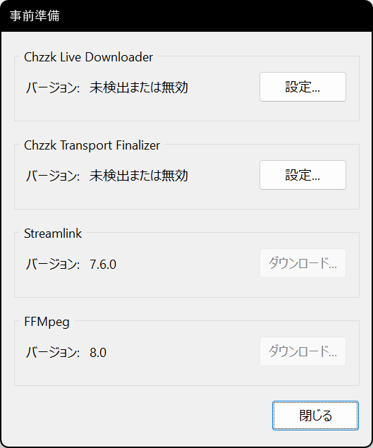
<p><i>(この画像は最新の情報と異なる場合があります。)</i></p>
</div>

`設定...`ボタンをクリックしてChzzk Live DownloaderとChzzk Transport Finalizerのパスを指定するか、`ダウンロード`ボタンをクリックしてStreamlinkまたはFFmpegをインストールできます。

<div style='text-align: center'>
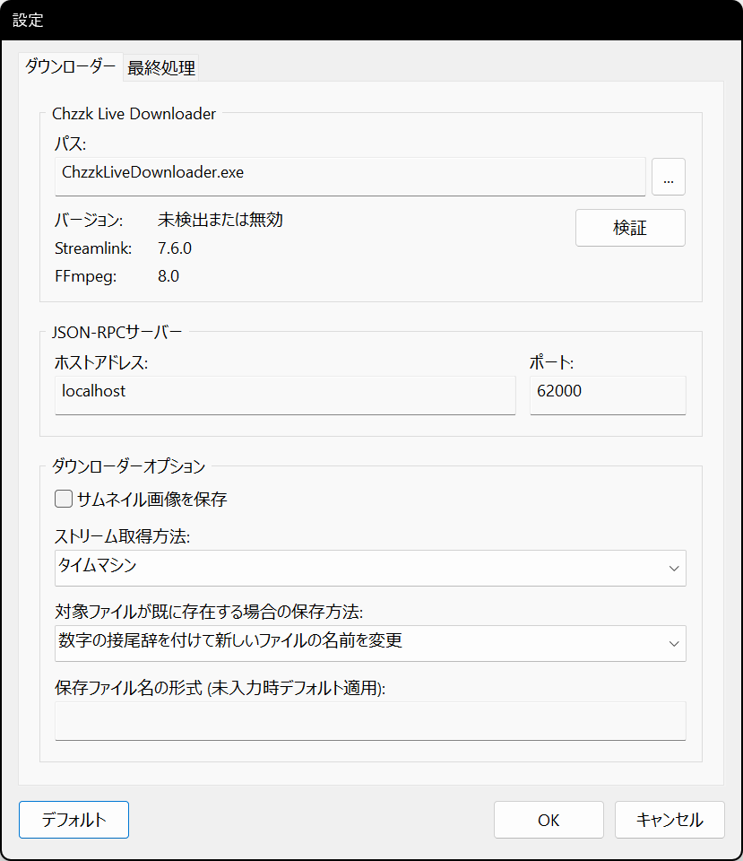
<p><i>(この画像は最新の情報と異なる場合があります。)</i></p>
</div>

`...`ボタンをクリックして、正しいパスにある`ChzzkLiveDownloader.exe`ファイルを選択してください。正しいChzzk Live Downloaderが指定されると、以下の図のようにバージョン情報が表示されます。

<div style='text-align: center'>
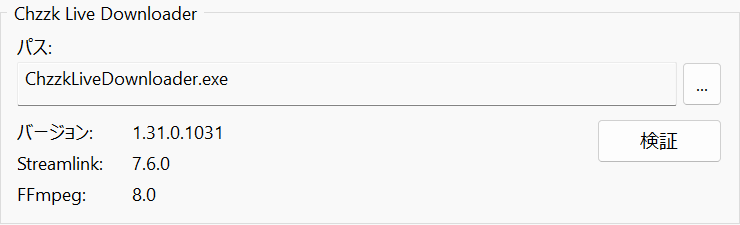
<p><i>(この画像は最新の情報と異なる場合があります。)</i></p>
</div>

<div style='text-align: center'>
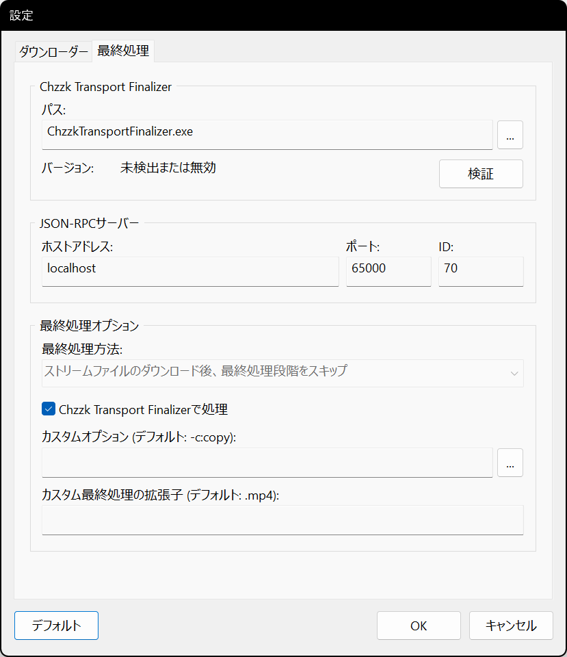
<p><i>(この画像は最新の情報と異なる場合があります。)</i></p>
</div>

同様に、`...`ボタンをクリックして、正しいパスにある`ChzzkTransportFinalizer.exe`ファイルを選択してください。正しいChzzk Transport Finalizerが指定されると、以下の図のようにバージョン情報が表示されます。

<div style='text-align: center'>
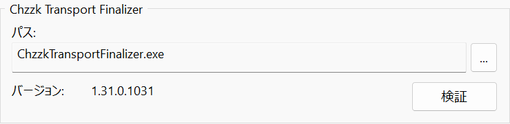
<p><i>(この画像は最新の情報と異なる場合があります。)</i></p>
</div>

## メインメニューを開く
ウィンドウの左上にある☰アイコンをクリックすると、メインメニューが開きます。

<div style='text-align: center'>
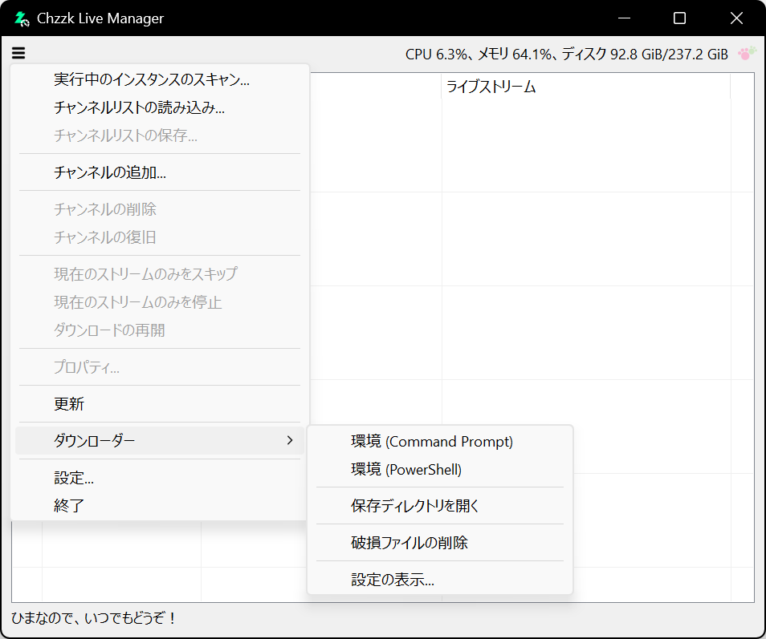
<p><i>(この画像は最新の情報と異なる場合があります。)</i></p>
</div>

## チャンネルの追加
メインメニューから`チャンネルの追加...`を選択すると、チャンネル追加ダイアログが表示されます。追加するチャンネルUID、URL、またはストリームURLを入力し、`OK` ボタンをクリックしてチャンネルを追加します。

<div style='text-align: center'>

<p><i>(この画像は最新の情報と異なる場合があります。)</i></p>
</div>

さらに、このダイアログでは以下の項目を指定できます。

### ストリーマーUIDまたはライブURL
ストリーマーの識別子として、以下の3つの値のいずれかを自動的に認識します。

* ストリームURL - `https://chzzk.naver.com/live/UID`
* チャンネルURL - `https://chzzk.naver.com/UID`
* ストリーマーUID - `UID`

### 目標画質
`best`、`1080p`、`720p`などの値を入力できます。

Chzzk Live Downloaderと同様に、非標準の解像度が使用されている場合、想定される解像度よりやや高めの画質を設定すると、最も近い画質が自動的に選択されます（例：`1200p`→`1080p`）。

### 開始オフセット
ストリームの開始からスキップする時間を設定できます。デフォルトでは、時間の単位は秒ですが、以下のように時間、分、秒、ミリ秒で設定することもできます。

```powershell
1:23:45.67
1h30m45.67s
```

## ダウンロード時間と分割
ダウンロードするストリームの継続時間を設定し、指定した継続時間でストリームを分割してダウンロードすることができます。デフォルトでは、時間の単位は秒ですが、以下のように時間、分、秒、ミリ秒で設定することもできます。

```powershell
1:23:45.67
1h30m45.67s
```

## チャンネルの削除
管理を終了したいチャンネルを削除するには、リストからチャンネルを選択し、☰アイコンをクリックして`チャンネルの削除`を選択し、確認のため`OK`をクリックします。

<div style='text-align: center'>
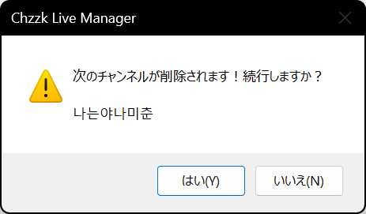
<p><i>(この画像は最新の情報と異なる場合があります。)</i></p>
</div>

削除されたチャンネルがダウンロード中の場合、削除時点でダウンロードが停止し、最終処理ステップが完了した後に保存されます。

## チャンネルの復旧
Chzzk Live DownloaderとChzzk Live Managerの接続が、プロセスの異常終了など外的要因で失われた場合、プロセスを再起動して接続を再確立できます。

<div style='text-align: center'>
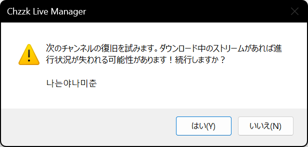
<p><i>(この画像は最新の情報と異なる場合があります。)</i></p>
</div>

接続が失われた時点でダウンロードが進行中だった場合、その時点で終了し、再度ダウンロードが開始されます。

## 現在のストリームのみのダウンロードをスキップ
現在のストリームのダウンロードをスキップし、次のストリームを待つには、リストからチャンネルを選択し、☰アイコンをクリックして`現在のストリームのみをスキップ`を選択し、確認のため`OK`をクリックします。

<div style='text-align: center'>

<p><i>(この画像は最新の情報と異なる場合があります。)</i></p>
</div>

## 現在のストリームのみのダウンロードを停止
現在のストリームのダウンロードを停止し、次のストリームを待つには、リストからチャンネルを選択し、☰アイコンをクリックして`現在のストリームのみを停止`を選択し、確認のため`OK`をクリックします。

<div style='text-align: center'>

<p><i>(この画像は最新の情報と異なる場合があります。)</i></p>
</div>

## 中断したストリームのダウンロードを再開
中断したストリームのダウンロードを再開するには、リストからチャンネルを選択し、☰アイコンをタップして`ダウンロードの再開`を選択します。この機能は、強制的に中断したストリームがまだ終了していない場合にのみ利用できます。新しく開始されたストリームの場合は、この機能を使用しなくても自動的にダウンロードが開始されます。

## チャンネルプロパティの表示
チャンネルのプロパティを参照するには、リストからチャンネルを選択し、☰アイコンをクリックして`プロパティ...`を選択します。

<div style='text-align: center'>
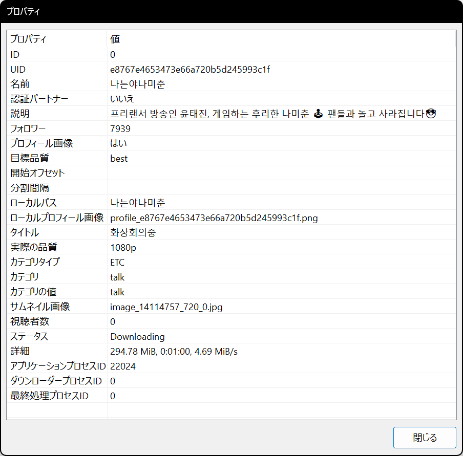
<p><i>(この画像は最新の情報と異なる場合があります。)</i></p>
</div>

## コンテキストメニュー
リストからチャンネルを選択して右クリックすると、チャンネルのコンテキストメニューが表示されます。

<div style='text-align: center'>

<p><i>(この画像は最新の情報と異なる場合があります。)</i></p>
</div>

## ダウンロードオプションの変更
チャンネルが現在ダウンロード中でない場合、ダウンロードオプションをリアルタイムで変更できます。

<div style='text-align: center'>

<p><i>(この画像は最新の情報と異なる場合があります。)</i></p>
</div>

## チャンネルリストの保存
現在管理しているチャンネルリストは、リストファイルに保存し、後で必要に応じて読み込むことができます。

リストに1つ以上のチャンネルが含まれている場合、☰アイコンをクリックし`チャンネルリストの保存...`を選択します。ダイアログが表示され、保存するディレクトリとファイル名を変更できます。

## チャンネルリストの読み込み
毎回チャンネルを手動で追加する代わりに、以前に保存したチャンネルリストを読み込むことができます。

☰アイコンをクリックし、`チャンネルリストの読み込み...`を選択します。ダイアログが表示され、チャンネルリストファイルを選択できます。

読み込んだリストにあチャンネルが現在のリストに既に存在する場合、それが自動的に認識され、適切に処理されます。

## リストの更新
リストをすぐに更新するには、☰アイコンをクリックし、`更新`を選択します。

## 起動時にチャンネルリストを自動的に読み込む
頻繁に同じセットのチャンネルを管理する場合、毎回手動でリストを読み込むのは面倒です。以下の設定を有効にすると、指定されたチャンネルリストが起動時に自動的に読み込まれます。

* ☰アイコンをクリックし、`設定...`を選択して設定ダイアログを開きます。
* `起動`タブで`起動時にチャンネルを読み込む`にチェックを入れます。その後、`パス:`フィールド横の`...`ボタンをクリックして、読み込みたいチャンネルリストファイルを選択します。
* 次回以降の起動時には、指定されたチャンネルリストが自動的に読み込まれます。

<div style='text-align: center'>

<p><i>(この画像は最新の情報と異なる場合があります。)</i></p>
</div>

## 外部で実行されているChzzk Live Downloaderの管理
Chzzk Live Downloaderは、Chzzk Live Managerを使用せずに独立して実行することができます。

ただし、そのような場合でも、以下の設定を構成することで、実行中のインスタンスを起動時にスキャンし、管理のためにチャンネルリストに自動追加できます。

<div style='text-align: center'>

<p><i>(この画像は最新の情報と異なる場合があります。)</i></p>
</div>

* `起動時に実行中のインスタンスをスキャン`にチェックを入れます。
* `スキャンするID範囲`フィールドでスキャンするIDの範囲を設定します。IDはChzzk Live Downloaderを実行する際に`-i`または`--id`パラメータで指定した値です。例えば、以下のように実行した場合は、スキャン範囲に`3`を指定します。

  ```
  ChzzkLiveDownloader -i 3
  ```

* IDは0から23までの範囲で指定でき、以下のようにIDまたは範囲を入力できます。

  ```
  ~3, 6, 8-10, 13~15
  ```

* 上記の例では、スキャン対象のIDは`0, 1, 2, 3, 6, 8, 9, 10, 13, 14, 15`です。
* チャンネルスキャンとチャンネルリストの読み込みの両方が有効になっている場合、最初に実行中のチャンネルをスキャンし、その後にチャンネルリストを読み込み、新しいチャンネルを追加してギャップを埋めます。

## Chzzk Downloader Suiteの環境を開く
Chzzk Downloader Suiteの環境を開くには、☰アイコンをクリックし、`ダウンローダー`の下にある`環境（Command Prompt）`または`環境（PowerShell）`を選択します。

## 保存ディレクトリを開く
ダウンロードしたストリームの保存ディレクトリを開くには、☰アイコンをクリックし、`ダウンローダー`の下にある`保存ディレクトリを開く`を選択します。

## 破損ファイルの削除
ダウンロード中にネットワーク接続が切れたり、システムがシャットダウンされるなどの異常な状況が発生すると、一時ディレクトリに破損したファイルが残る場合があります。
残っている破損ファイルを削除するには、☰アイコンをタップし、`ダウンローダー`の下にある`破損ファイルの削除`を選択します。

<div style='text-align: center'>
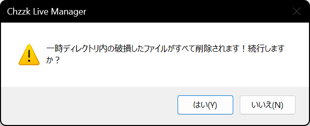
<p><i>(この画像は最新の情報と異なる場合があります。)</i></p>
</div>

## Chzzk Live Downloaderの設定の表示
Chzzk Live Downloaderの設定を表示するには、☰アイコンをクリックし、`ダウンローダー`の下にある`設定を表示...`を選択します。

<div style='text-align: center'>

<p><i>(この画像は最新の情報と異なる場合があります。)</i></p>
</div>

## 終了時のChzzk Live Downloaderの終了方法の選択
Chzzk Live Managerの終了時に、Chzzk Live Downloaderをバックグラウンドで続行するか、すべてのインスタンスを一緒に終了させるかを選択できます。

<div style='text-align: center'>

<p><i>(この画像は最新の情報と異なる場合があります。)</i></p>
</div>

終了時に確認ダイアログが表示される場合、以下の条件が満たされています。

* チャンネルリストに管理中のチャンネルが存在する。
* Chzzk Live Downloaderが外部で実行されているインスタンスが1つ以上存在する。

すべてのインスタンスを強制的に終了する場合。

* `すべてのインスタンスを強制終了 (管理者権限が必要な場合あります)`を選択し、`はい`をクリックします。
* これがデフォルトの終了方法です。

リストで管理されているチャンネルのみを終了する場合。

* `管理されたインスタンスに対して優先的に終了をリクエスト`を選択し、`はい`をクリックします。

ダウンロードをバックグラウンドで続行させる場合。

* `いいえ`をクリックします。

Chzzk Live Managerの使用を続行する場合。

* `キャンセル`をクリックします。

この機能は、毎回選択する代わりに、設定の`ダウンローダー`タブで事前に設定できます。

## 最小化時にトレイに移動
`機能`設定で`最小化時にトレイに移動`オプションが有効になっている場合、Chzzk Live Managerが最小化されるとシステムトレイに移動します。

<div style='text-align: center'>
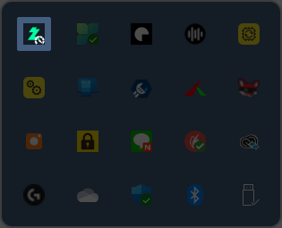
<p><i>(この画像は最新の情報と異なる場合があります。)</i></p>
</div>

トレイのアイコンをダブルクリックするとウィンドウが元の状態に戻り、トレイのアイコンを右クリックすると、以下の画像のようなメニューが表示されます。

<div style='text-align: center'>

<p><i>(この画像は最新の情報と異なる場合があります。)</i></p>
</div>

## 最終処理のカスタム設定
`ダウンローダー`設定の`最終処理カスタムオプション`パラメータに追加オプションを設定すると、最終処理中にそのオプションが`FFmpeg`に渡されます。例えば、以下のオプションを指定すると、`FFmpeg`で`H.265`コーデックを使用してエンコードできます。

```powershell
-c:v libx265 -preset medium -crf 23 -c:a aac -b:a 128k
```

ただし、カスタムエンコードはパフォーマンスが最適でないため推奨されません。より良い結果を得るには、外部のプロフェッショナルエンコーダーの使用を検討してください。

## その他の設定

### 起動

<div style='text-align: center'>
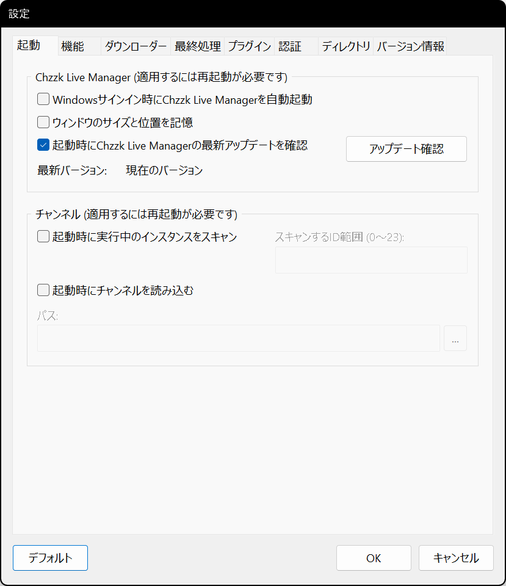
<p><i>(この画像は最新の情報と異なる場合があります。)</i></p>
</div>

* **Windowsサインイン時にChzzk Live Managerを自動起動** - Chzzk Live ManagerをWindowsのスタートアップリストに追加します。
* **起動時にウィンドウのサイズと位置を記憶** - 終了時にウィンドウのサイズと位置を保存し、次回起動時に復元します。
* **起動時にChzzk Live Managerの最新アップデートを確認** - 起動時にChzzk Live Managerの最新アップデートを確認するかどうかを設定します。手動で確認する場合は、`アップデート確認`ボタンをクリックします。

### 機能

<div style='text-align: center'>

<p><i>(この画像は最新の情報と異なる場合があります。)</i></p>
</div>

* **更新間隔 (秒)** - リストの画面更新間隔を設定します。これは表示にのみ影響し、ダウンロード検出間隔とは関係ありません。Chzzk Live Downloaderのダウンロード検出間隔はデフォルトで10秒に設定されており、APIレート制限の影響を回避するように設計されています。
* **空き容量が次の値を下回る場合ダウンロードを停止** - 空き容量が少ない場合に停止する閾値(%)を設定します。
* **スリープモード** - Chzzk Live Managerが動作している間のシステムのスリープモードを設定します。
* **パフォーマンスレベル** - Chzzk Live Managerが現在実行されているシステムのパフォーマンスを指定します。チャンネル追加や更新時にタイムアウトによるエラーが発生する場合、パフォーマンスレベルを1段階下げて再試行してください。
* **インスタンス管理** - インスタンスの終了方法を事前に定義することで、終了ダイアログで毎回選択する必要がなくなります。
* **ライブストリーム情報を基にメタデータを保存** - ライブストリーム情報を基にメタデータを保存するかどうかを設定します。

### ダウンローダー

<div style='text-align: center'>
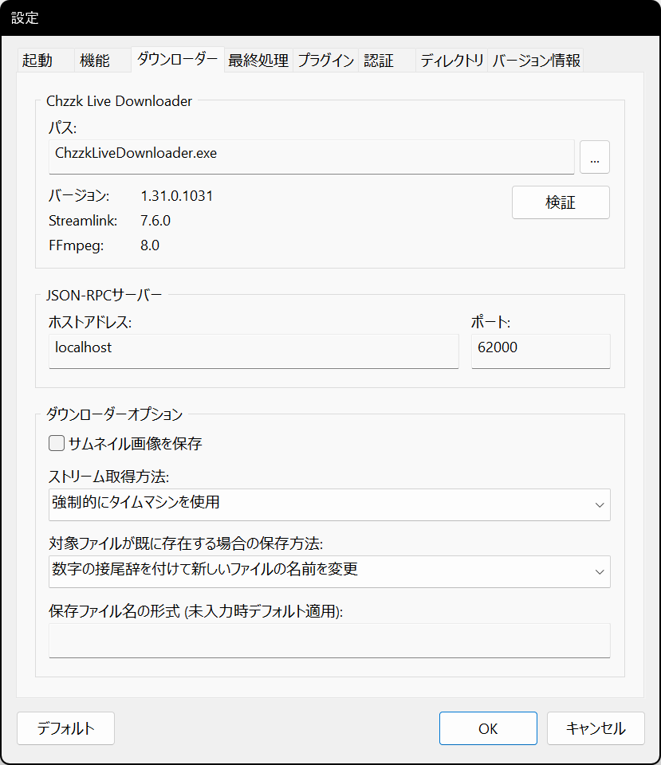
<p><i>(この画像は最新の情報と異なる場合があります。)</i></p>
</div>

* **JSON-RPCサーバー: ホストアドレス** - JSON-RPCサーバーのホストアドレスを設定します。
* **JSON-RPCサーバー: ポート** - JSON-RPCサーバーのポート番号を設定します。
* **サムネイル画像を保存** - サムネイル画像を別途保存するかどうかを設定します。
* **ストリーム取得方法** - ストリームの取得方法を設定します。
* **対象ファイルが既に存在する場合の保存方法** - 対象ファイルが既に存在する場合の保存方法を設定します。
* **保存ファイル名の形式** - 保存ファイル名の形式を指定します。フォーマット指定子の詳細については、`chzzk_live_downloader_manual.ja-JP.pdf`をご参照ください。

### 最終処理

<div style='text-align: center'>
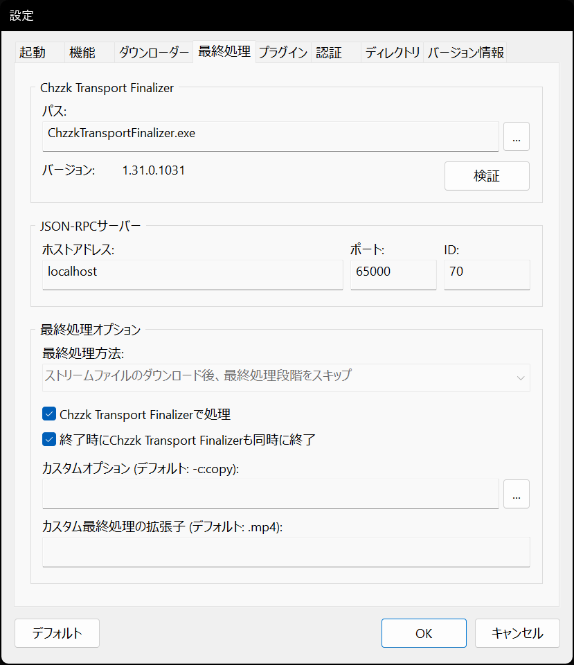
<p><i>(この画像は最新の情報と異なる場合があります。)</i></p>
</div>

* **JSON-RPCサーバー: ホストアドレス** - JSON-RPCサーバーのホストアドレスを設定します。
* **JSON-RPCサーバー: ポート** - JSON-RPCサーバーのポート番号を設定します。
* **JSON-RPCサーバー: ID** - JSON-RPCサーバーのIDを設定します。
* **最終処理方法** - 最終処理方法を設定します。
* **Chzzk Transport Finalizerで処理** - 最終処理をChzzk Transport Finalizerに任せます。
* **カスタムオプション** - 最終処理のカスタムオプションを設定します。

### プラグイン

<div style='text-align: center'>
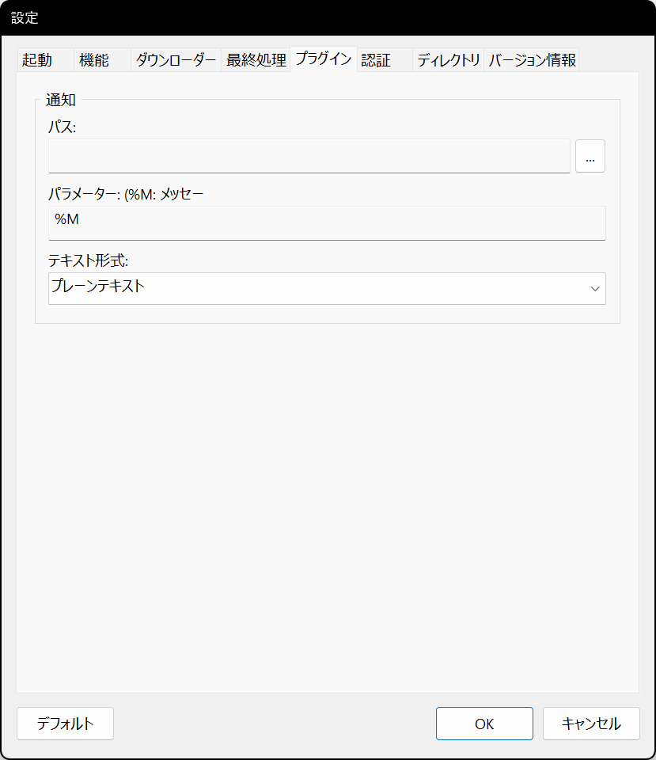
<p><i>(この画像は最新の情報と異なる場合があります。)</i></p>
</div>

* **通知: パス** - 通知プラグインのパスを設定します。
* **通知: パラメーター** - 通知プラグインのパラメーターを設定します。
* **通知: テキスト形式** - 通知プラグインのテキスト形式を設定します。

### 認証

<div style='text-align: center'>
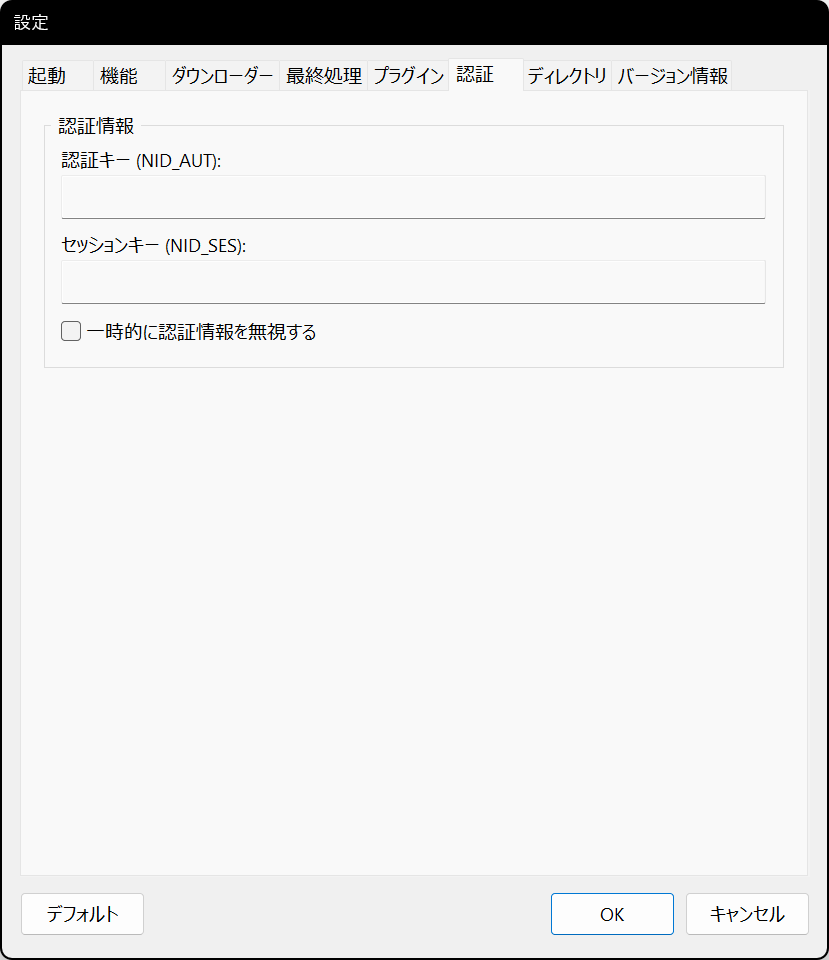
<p><i>(この画像は最新の情報と異なる場合があります。)</i></p>
</div>

* **認証キー (NID_AUT)** - NAVER IDの認証キーを指定します。
* **セッションキー (NID_SES)** - NAVER IDのセッションキーを指定します。
* **一時的に認証情報を無視する** - 一時的に認証情報を無視するかどうかを設定します。

Chzzk認証資格情報の取得方法については、`how_to_get_chzzk_credential.ja-JP.pdf`を参照してください。

### ディレクトリ

<div style='text-align: center'>
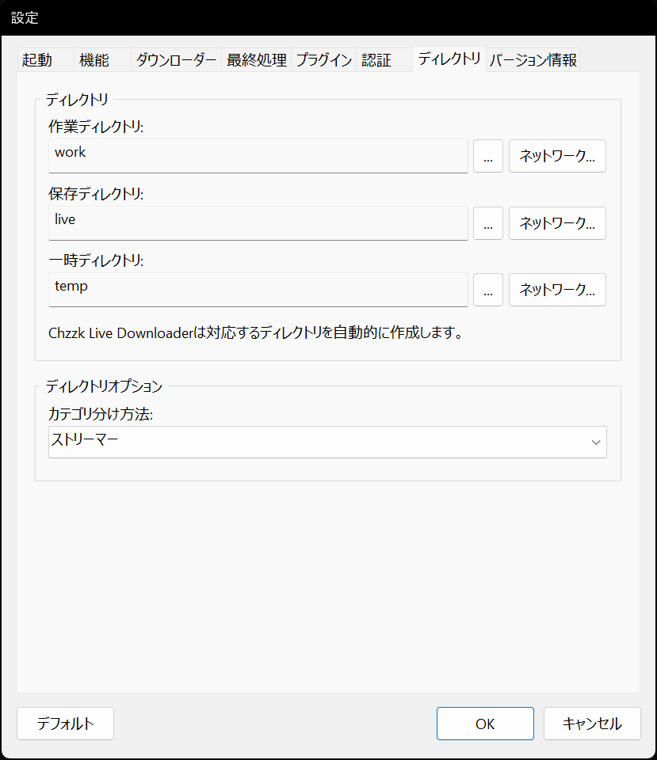
<p><i>(この画像は最新の情報と異なる場合があります。)</i></p>
</div>

* **作業ディレクトリ** - Chzzk Live Downloaderの設定ファイルが保存されるディレクトリを指定します。
* **保存ディレクトリ** - ダウンロードしたストリームファイルが保存されるディレクトリを指定します。
* **一時ディレクトリ** - 一時ファイルが作成されるディレクトリを指定します。
* **カテゴリ分け方法** - ダウンロードしたストリームファイルが保存されるディレクトリのカテゴリ分け方法を設定します。

<div style='text-align: center'>

<p><i>(この画像は最新の情報と異なる場合があります。)</i></p>
</div>

`ネットワーク...`ボタンをクリックして、ネットワークストレージにアクセスするための情報を入力できます。

### バージョン情報

<div style='text-align: center'>
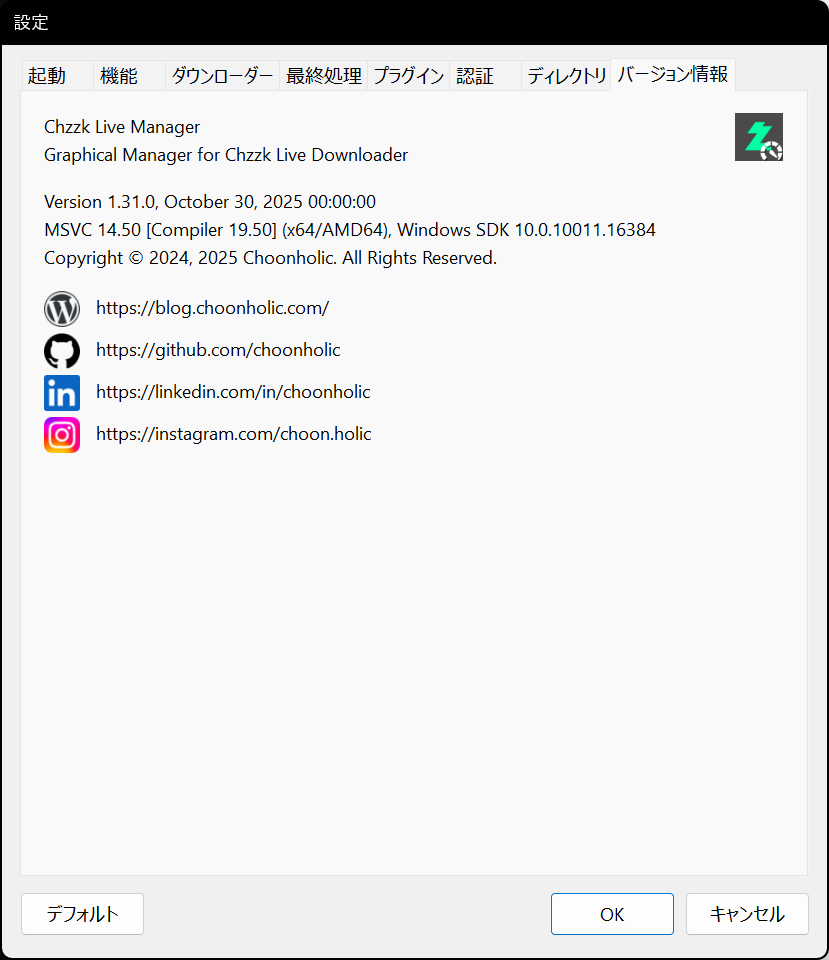
<p><i>(この画像は最新の情報と異なる場合があります。)</i></p>
</div>

* **バージョン情報** - Chzzk Live Managerのバージョン情報を表示します。
* **お問い合わせリンク** - 作成者への連絡先リンクです。

## お問い合わせ
Chzzk Downloader Suiteに関するご質問、バグ報告、または改善要望がございましたら、[GitHub](https://github.com/Choonholic/ChzzkDownloader/)の[Issues](https://github.com/Choonholic/ChzzkDownloader/issues/new)機能を通じてお知らせください。全ての言語に対応可能ですが、直接対応可能な言語は韓国語、英語、日本語、中国語です。他の言語については、機械翻訳を通じて対応するため、100%正確に対応できない場合があります。
