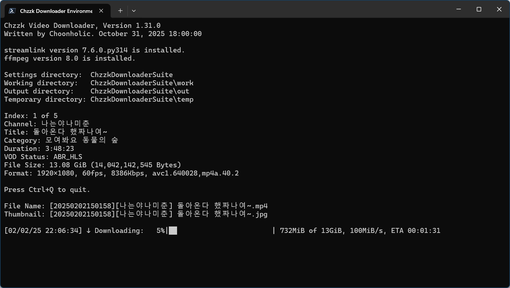

# Chzzk Video Downloader
Chzzkのリプレイビデオ用のダウンローダー

<div style='text-align: center'>

<p><i>(この画像は最新の情報と異なる場合があります。)</i></p>
</div>

## バージョン
Version 0.99.1, November 26, 2024 00:00:00

## 使用法
```powershell
ChzzkVideoDownloader [-h] [-i INPUT] [-a] [-q [QUALITY]] [-d [DISPLAY]] [-y] [--version]
                     [--adult [ADULT]] [--authaut AUTHAUT] [--authses AUTHSES]
                     [--name [NAME]] [--work [WORK]] [--out [OUT]] [--temp [TEMP]]
                     [--category [CATEGORY]] [--exist [EXIST]] [--rpcid [RPCID]]
                     [--rpcport [RPCPORT]] [--snapshot SNAPSHOT] [--download [DOWNLOAD]]
                     [--thumb [THUMB]] [--startup [STARTUP]] [--settings [SETTINGS]]
                     [--reset]
                     [video]
```

### 位置引数
```
video                   ダウンロードするビデオ番号またはURL
```

### オプション
```
-h, --help              このヘルプメッセージを表示
-i, --input INPUT       ダウンロードリストファイルを設定
-a, --auth              Chzzk認証資格情報を設定
-q, --quality [QUALITY] ダウンロードする目標画質を設定（例: 1080p）
-d, --display [DISPLAY] ダウンロードステータス表示モードを設定（quiet|simple|fluent|all）
-y, --yes               すべての確認値を自動的に「はい」に設定
--version               バージョン情報を表示
--adult [ADULT]         認証情報が無効な場合のアダルトコンテンツ処理方法を設定（ask|skip）
--authaut AUTHAUT       Chzzk認証資格情報の認証キーを設定
--authses AUTHSES       Chzzk認証資格情報のセッションキーを設定
--name [NAME]           保存ファイル名の形式を設定
--work [WORK]           作業ディレクトリを設定
--out [OUT]             保存ディレクトリを設定
--temp [TEMP]           一時ディレクトリを設定
--category [CATEGORY]   保存時のカテゴリ分け方法を設定 (none|streamer)
--exist [EXIST]         ファイルが既に存在する場合に上書きするか、名前を変更するかを設定 (overwrite|rename)
--rpcid [RPCID]         JSON-RPCサーバーのIDを設定 （デフォルト: 30）
--rpcport [RPCPORT]     JSON-RPCサーバーのポートを設定 （デフォルト: 63000, 49152-65300）
--snapshot SNAPSHOT     ステータスが変更されるたびにJSONファイルにスナップショットを保存
--download [DOWNLOAD]   ダウンロード方法を設定（default|atxc|alter）
--thumb [THUMB]         サムネイル画像を保存またはスキップ（save|skip|keep）
--startup [STARTUP]     起動方法を設定（normal|fast）
--settings [SETTINGS]   設定保存時の動作を設定（default|skip|quit）
--reset                 すべての設定をリセット
```

### 使用例
```powershell
ChzzkVideoDownloader 1602969 --thumb --work work --out out --temp temp
```

## ダウンロードするビデオの設定
ビデオ番号またはURLを直接指定してリプレイビデオをダウンロードできます。

例えば、ビデオURLがhttps://chzzk.naver.com/video/1602969の場合、ビデオ番号は**1602969**です。このビデオをダウンロードするには、以下のコマンドを使用します。

```powershell
ChzzkVideoDownloader 1602969
ChzzkVideoDownloader https://chzzk.naver.com/video/1602969
```

複数のビデオを順番にダウンロードしたい場合は、以下のようにリストファイルを作成し、UTF-8形式のテキストファイルとして保存してください。（例: `list.txt`）

```python
# リストサンプル
https://chzzk.naver.com/video/2676946
2555164
https://chzzk.naver.com/video/2631744
https://chzzk.naver.com/video/2620211
https://chzzk.naver.com/video/2590216
2453109
```

その後、以下のコマンドを使用してダウンロードします。

```powershell
ChzzkVideoDownloader -i list.txt
ChzzkVideoDownloader --input list.txt
```

## 認証資格情報のリセット
成人限定ビデオなど、NAVER認証資格情報が必要なビデオをダウンロードするには、以下の情報を指定する必要があります。

* ChzzkクッキーからのNAVER IDの認証キー（`NID_AUT`）
* ChzzkクッキーからのNAVER IDのセッションキー（`NID_SES`）

認証資格情報が必要なビデオをダウンロードする際に、認証資格情報が見つからない場合は、認証情報の入力プロンプトが自動的に表示されます。

一度入力すると、デフォルトとして設定され、以後の実行では再入力の必要はありません。Chzzk認証資格情報の取得方法については、`how_to_get_chzzk_credential.ja-JP.pdf`を参照してください。

認証資格情報が変更された場合や、別のIDでログインしてリセットする必要がある場合は、以下のコマンドを使用してください。

```powershell
ChzzkVideoDownloader video_no または url -a
ChzzkVideoDownloader video_no または url --auth
```

`-y`または`--yes`パラメータを使用すると、確認なしで認証情報の入力プロンプトが自動的に表示されます。

```powershell
ChzzkVideoDownloader video_no または url -y
ChzzkVideoDownloader video_no または url --yes
```

## ダウンロードする目標画質の指定
デフォルトでは、すべてのストリームは可能な限り最高の画質でダウンロードされます。ただし、ストレージ節約などの理由で別の画質で保存したい場合は、以下のコマンドを使用してください。また、ストリームが標準解像度を使用していない場合、指定した解像度に最も近い画質が自動的に選択されます。

```powershell
ChzzkVideoDownloader video_no または url -q 720p
ChzzkVideoDownloader video_no または url --quality 720p
```

このオプションをデフォルトに設定したい場合は、以下のように`-q`または`--quality`のみを使用してください。

```powershell
ChzzkVideoDownloader video_no または url -q
ChzzkVideoDownloader video_no または url --quality
```

## 保存ファイル名の形式設定
デフォルトでは、保存されるビデオとサムネイルのファイル名は`[{live_date}][{name}] {title}`の形式になります。この形式を変更したい場合は、以下のコマンドを使用してください。

```powershell
ChzzkVideoDownloader video_no または url --name "[{name}][{category}] {title}"
```

このオプションをデフォルトに設定したい場合は、以下のように`--name`のみを使用してください。

```powershell
ChzzkVideoDownloader video_no または url --name
```

### ファイル名形式タグ
ファイル名形式には以下の定義済みタグを使用できます。

* `{name}` - チャンネル名。
* `{verified}` - チャンネルが認証済みの場合、このタグは`[✓]`になります（認証されていない場合は空）。
* `{video_no}` - ビデオ番号。
* `{title}` - ビデオのタイトル。
* `{category_type}` - ビデオのカテゴリタイプ（設定されている場合）。
* `{category}` - ビデオのカテゴリ（設定されている場合）。
* `{category_value}` - ビデオのカテゴリの値（設定されている場合）。
* `{live_date...}` - ストリーム開始時の日付関連タグ。
* `{publish_date...}` - ビデオ公開時の日付関連タグ。
* `{media...}` - メディア情報関連のタグ。

メディア関連タグでは以下の要素が利用できます。

* `{media_quality}` - メディア品質（例: `1080p`）。
* `{media_video_width}` - ビデオの幅（ピクセル, 例: `1920`）。
* `{media_video_height}` - ビデオの高さ（ピクセル, 例: `1080`）。
* `{media_video_framerate}` - ビデオのフレームレート（fps, 例: `60.0`）。
* `{media_bitrate}` - ビットレート（bps, 例: `81920000`）。
* `{media_video_codec}` - ビデオコーデック（例: `H264`）。

日付関連タグでは、以下の詳細要素を展開できます。

* `{..._date}` - 日付（`%Y%m%d%H%M%S` 形式, 例: `20240607014327`）。
* `{..._date_year}` または `{..._date_year_full}` - 世紀を含む年（例: `2024`）。
* `{..._date_year_short}` - 世紀を含まない年（ゼロ埋め形式, 例: `24`）。
* `{..._date_month}` - 月（ゼロ埋め形式, `01`, `02`, ..., `12`）。
* `{..._date_month_full}` - 月の完全な名称（`January`, `February`, ..., `December`）。
* `{..._date_month_short}` - 月の略称（`Jan`, `Feb`, ..., `Dec`）。
* `{..._date_day}` - 日（ゼロ埋め形式, `01`, `02`, ..., `31`）。
* `{..._date_hour}` - 時（24時間表記, ゼロ埋め形式, `00`, `01`, ..., `23`）。
* `{..._date_minute}` - 分（ゼロ埋め形式, `00`, `01`, ..., `59`）。
* `{..._date_second}` - 秒（ゼロ埋め形式, `00`, `01`, ..., `59`）。

## サムネイル画像の処理
サムネイル画像を別途保存するには、以下のコマンドを使用します。

```powershell
ChzzkVideoDownloader video_no または url --thumb save
```

この機能をオフにするには、以下のコマンドを使用します。

```powershell
ChzzkVideoDownloader video_no または url --thumb skip
```

## ダウンロード詳細の表示方法を設定
デフォルトでは、詳細なダウンロード情報が表示されます。ただし、詳細が不要な場合は、以下のコマンドで表示を抑制できます。

```powershell
ChzzkVideoDownloader video_no または url -d quiet
ChzzkVideoDownloader video_no または url --display quiet
```

`--display`パラメータで設定可能な表示方法は以下の通りです。

* `quiet` - すべてのダウンロード詳細を非表示にします。
* `fluent` - 詳細なダウンロード情報をすべて表示します。
* `default` - `fluent`と同じです。

このオプションをデフォルトに設定したい場合は、以下のように`-d`または`--display`のみを使用してください。

```powershell
ChzzkVideoDownloader video_no または url -d
ChzzkVideoDownloader video_no または url --display
```

## 作業ディレクトリの設定
作業に必要なファイルが保存されるディレクトリを指定するには、以下のコマンドを使用します。

```powershell
ChzzkVideoDownloader video_no または url --work work
```

このオプションをデフォルトに設定したい場合は、以下のように`--work`のみを使用してください。

```powershell
ChzzkVideoDownloader video_no または url --work
```

## 保存ディレクトリの設定
ダウンロードしたファイルが保存されるディレクトリを指定するには、以下のコマンドを使用します。

```powershell
ChzzkVideoDownloader video_no または url --out out
```

デフォルトでは、すべてのファイルはストリーマーごとのサブディレクトリに分類して保存されます。ストリーマーごとに分類せずに保存する場合は、次のコマンドを使用してください。

```powershell
ChzzkVideoDownloader video_no または url --category none
```

このオプションをデフォルトに設定したい場合は、以下のように`--out`または`--category`のみを使用してください。

```powershell
ChzzkVideoDownloader video_no または url --out --category
```

## 一時ディレクトリの設定
ダウンロード中のファイルが保存される一時ディレクトリを指定するには、以下のコマンドを使用します。

```powershell
ChzzkVideoDownloader video_no または url --temp temp
```

このオプションをデフォルトに設定したい場合は、以下のように`--temp`のみを使用してください。

```powershell
ChzzkVideoDownloader video_no または url --temp
```

## ファイルが既に存在する場合に上書きするか、名前を変更するかを設定
デフォルトでは、同じ名前のファイルが既に存在する場合、ファイル名の後ろに`(n)`を付けて保存します。ただし、次のコマンドを使用してファイルを上書きするように指定できます。

```powershell
ChzzkVideoDownloader video_no または url --exist overwrite
```

このオプションをデフォルトに設定したい場合は、以下のように`--exist`のみを使用してください。

```powershell
ChzzkVideoDownloader video_no または url --exist
```

## ダウンロード方法の設定
軽量なダウンロードモジュールが代替として含まれています。代替モジュールを試すには、以下のコマンドを使用してください。

```powershell
ChzzkVideoDownloader video_no または url --download alter
```

## 設定保存時の動作を設定
すべてのオプションはデフォルトで設定ファイルに保存されますが、現在のセッションにのみ適用し、保存しない場合は以下のコマンドを使用してください。

```powershell
ChzzkVideoDownloader video_no または url --settings skip
```

ただし、以下の情報は常に保存されます。

* ChzzkクッキーからのNAVER IDの認証キー（`NID_AUT`）
* ChzzkクッキーからのNAVER IDのセッションキー（`NID_SES`）

ダウンロードせずに設定を保存して終了したい場合は、以下のコマンドを使用してください。

```powershell
ChzzkVideoDownloader --settings quit
```

## すべての設定をリセット
長期使用の間に設定が複雑になった場合、すべての設定をリセットするには以下のコマンドを使用してください。

```powershell
ChzzkVideoDownloader --reset
```

これにより、以下の情報がリセットされます。

* ChzzkクッキーからのNAVER IDの認証キー（`NID_AUT`）
* ChzzkクッキーからのNAVER IDのセッションキー（`NID_SES`）
* ダウンロードする目標画質の設定
* サムネイル画像の保存設定
* ダウンロード詳細の表示設定
* 保存ディレクトリと一時ディレクトリの設定

## バージョン情報の表示
バージョン情報を確認するには、以下のコマンドを使用します。

```powershell
ChzzkVideoDownloader --version
```

## ヘルプの表示
簡単なパラメータヘルプを表示するには、以下のコマンドを使用します。

```powershell
ChzzkVideoDownloader -h
ChzzkVideoDownloader --help
```

## パラメータの優先順位
`--reset`、`-h`、`--version`以外のパラメータは、以下のように任意の順序で使用できますが、同じパラメータを複数使用することはできません。

```powershell
ChzzkVideoDownloader 1602969 --out out
```

`-h`および`--version`パラメータは、最初に使用されたもののみが処理され、その後すぐに終了します。したがって、以下のコマンドはバージョン情報のみを出力します。

```powershell
ChzzkVideoDownloader --version -h
```

`--reset`パラメータは設定をリセットし、以前に設定された値を無視して終了します。したがって、以下のコマンドではビデオ番号が無視されます。

```powershell
ChzzkVideoDownloader 1602969 --reset
```

## 推奨初期設定
初回使用時には、以下の設定をお勧めします。このコマンドは、作業ディレクトリ（`--work`）、出力ディレクトリ（`--out`）、一時ディレクトリ（`--temp`）を一度に設定し、ダウンロードしたビデオファイルを整理しやすくします。

```powershell
ChzzkVideoDownloader video_no または url --work work --out out --temp temp
```

## JSON-RPCを使用した外部からの制御
詳細な情報については、`how_to_control_chzzk_video_downloader.ja-JP.pdf`をご参照ください。

## お問い合わせ
Chzzk Downloader Suiteに関するご質問、バグ報告、または改善要望がございましたら、[GitHub]（https://github.com/Choonholic/ChzzkDownloader/）の[Issues]（https://github.com/Choonholic/ChzzkDownloader/issues/new）機能を通じてお知らせください。全ての言語に対応可能ですが、直接対応可能な言語は韓国語、英語、日本語、中国語です。他の言語については、機械翻訳を通じて対応するため、100%正確に対応できない場合があります。
