# Chzzk Video Manager
Chzzk Video Downloader用のGUIマネージャー

<div style='text-align: center'>

<p><i>(この画像は最新の情報と異なる場合があります。)</i></p>
</div>

## バージョン
Version 1.19.2, May 05, 2025 21:00:00

## 必要条件
Chzzk Video Managerは、Chzzk Video DownloaderのGUIフロントエンドアプリケーションであるため、Chzzk Video DownloaderとChzzk Transport Finalizerもインストールされている必要があります。

Chzzk Video Manager、Chzzk Video Downloader、Chzzk Transport Finalizerがすべて同じディレクトリにある場合、Chzzk Video Managerは起動時に自動的に認識します。そうでない場合は、**必要条件の確認**を参照して、Chzzk Video DownloaderとChzzk Transport Finalizerのパスを指定してください。

ポータブル版の場合は、Chzzk Video Manager、Chzzk Video Downloader、Chzzk Transport Finalizerをすべて同じディレクトリに保存することをお勧めします。`セットアップ`を使用してインストールした場合、すべてのツールが同じディレクトリにインストールされます。

## 実行方法
スタートメニューから`Chzzk Video Manager`をクリックするか、`Chzzk Downloader Environment`で`ChzzkVideoManager.exe`を実行します。

## 必要条件の確認
Chzzk Video Managerが正常に機能するためには、Chzzk Video DownloaderとChzzk Transport Finalizerが正しく設定されている必要があります。また、Chzzk Video DownloaderはStreamlink（バージョン6.8.0またはそれ以上）とFFmpeg（バージョン7.0またはそれ以上）の設定が必要です。Chzzk Video Managerの起動時に、この必要条件が満たされているかチェックし、満たされていない場合は、以下のダイアログが表示されます。

<div style='text-align: center'>

<p><i>(この画像は最新の情報と異なる場合があります。)</i></p>
</div>

`設定...`ボタンをクリックしてChzzk Video DownloaderとChzzk Transport Finalizerのパスを指定するか、`ダウンロード`ボタンをクリックしてStreamlinkまたはFFmpegをインストールできます。

<div style='text-align: center'>
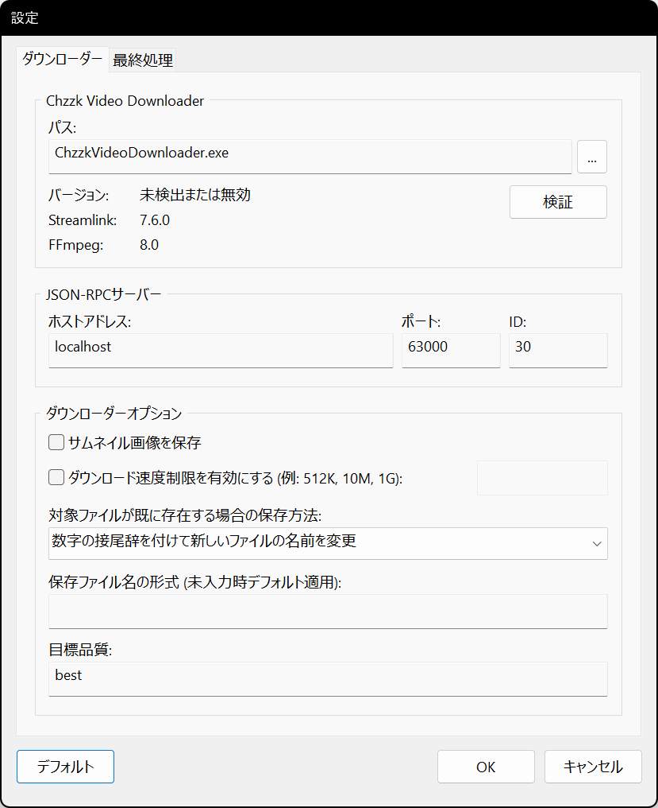
<p><i>(この画像は最新の情報と異なる場合があります。)</i></p>
</div>

`...`ボタンをクリックして、正しいパスにある`ChzzkVideoDownloader.exe`ファイルを選択してください。正しいChzzk Video Downloaderが指定されると、以下の図のようにバージョン情報が表示されます。

<div style='text-align: center'>
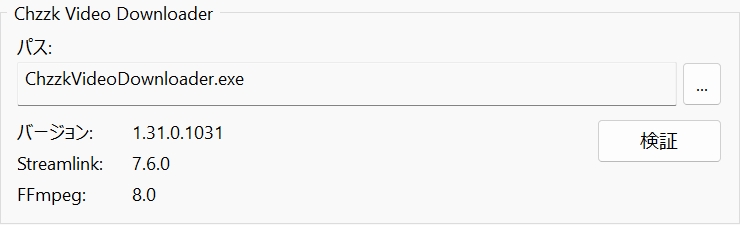
<p><i>(この画像は最新の情報と異なる場合があります。)</i></p>
</div>

## メインメニューを開く
ウィンドウの左上にある☰アイコンをクリックすると、メインメニューが開きます。

<div style='text-align: center'>
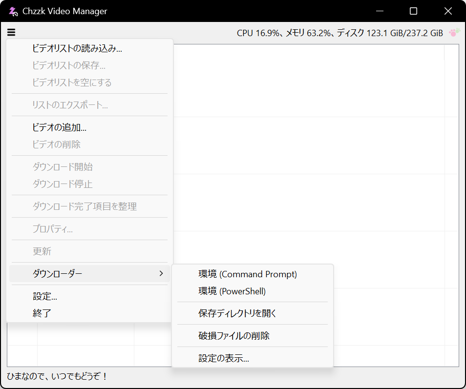
<p><i>(この画像は最新の情報と異なる場合があります。)</i></p>
</div>

<div style='text-align: center'>
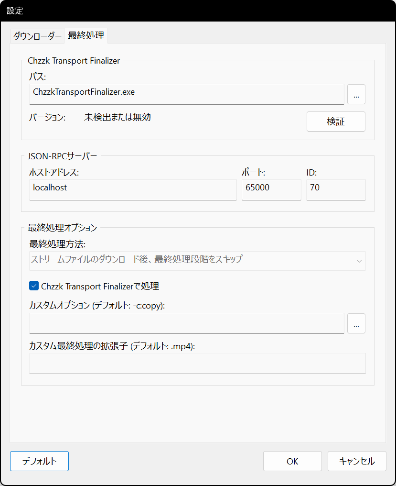
<p><i>(この画像は最新の情報と異なる場合があります。)</i></p>
</div>

同様に、`...`ボタンをクリックして、正しいパスにある`ChzzkTransportFinalizer.exe`ファイルを選択してください。正しいChzzk Transport Finalizerが指定されると、以下の図のようにバージョン情報が表示されます。

<div style='text-align: center'>

<p><i>(この画像は最新の情報と異なる場合があります。)</i></p>
</div>

## ビデオの追加
メインメニューから`ビデオの追加...`を選択すると、ビデオ追加ダイアログが表示されます。追加するビデオ番号またはURLを入力し、`OK`ボタンをクリックしてビデオを追加します。

<div style='text-align: center'>
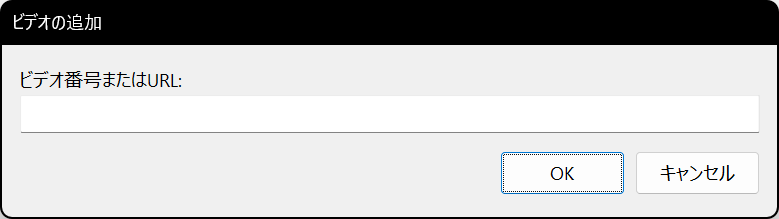
<p><i>(この画像は最新の情報と異なる場合があります。)</i></p>
</div>

### ビデオ番号またはURL
入力されたビデオ番号は、次のいずれかの形式として自動的に認識されます。

* ビデオURL - `https://chzzk.naver.com/video/number`
* ビデオ番号 - `number`

## ビデオの削除
ビデオを削除するには、リストからビデオを選択し、☰アイコンをクリックして`ビデオの削除`を選択し、確認のため`OK`をクリックします。

<div style='text-align: center'>
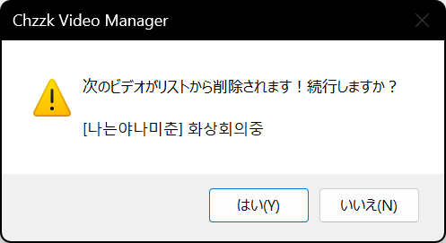
<p><i>(この画像は最新の情報と異なる場合があります。)</i></p>
</div>

## ダウンロードの開始
リストのビデオのダウンロードを開始するには、☰アイコンをクリックし、`ダウンロード開始`を選択します。

## ダウンロードの停止
リストのビデオのダウンロードを停止するには、☰アイコンをクリックし、`ダウンロード停止`を選択し、確認のため`OK`をクリックします。

<div style='text-align: center'>

<p><i>(この画像は最新の情報と異なる場合があります。)</i></p>
</div>

ダウンロードを停止すると、進行中のすべてのダウンロードが中断されます。

## ビデオのプロパティの表示
ビデオのプロパティを参照するには、リストからビデオを選択し、☰アイコンをクリックして`プロパティ...`を選択します。

<div style='text-align: center'>
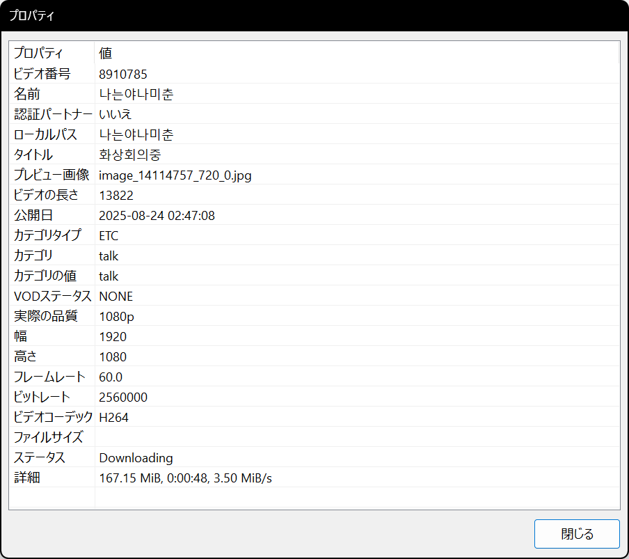
<p><i>(この画像は最新の情報と異なる場合があります。)</i></p>
</div>

## コンテキストメニュー
リストからビデオを選択して右クリックすると、ビデオのコンテキストメニューが表示されます。

<div style='text-align: center'>
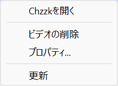
<p><i>(この画像は最新の情報と異なる場合があります。)</i></p>
</div>

## ビデオリストの保存
ビデオリストは、リストファイルに保存し、後で必要に応じて読み込むことができます。

リストに1つ以上のビデオが含まれている場合、☰アイコンをクリックし、`ビデオリストの保存...`を選択します。ダイアログが表示され、保存するディレクトリとファイル名を変更できます。

## ビデオリストの読み込み
毎回ビデオを追加する代わりに、以前に保存したビデオリストを読み込むことができます。

☰アイコンをクリックし、`ビデオリストの読み込み...`を選択します。ダイアログが表示され、ビデオリストファイルを選択できます。

読み込んだリストにあるビデオが現在のリストに既に存在する場合、それが自動的に認識され、適切に処理されます。

## リストの更新
リストをすぐに更新するには、☰アイコンをクリックし、`更新`を選択します。

## Chzzk Downloader Suiteの環境を開く
Chzzk Downloader Suiteの環境を開くには、☰アイコンをクリックし、`ダウンローダー`の下にある`環境（Command Prompt）`または`環境（PowerShell）`を選択します。

## 保存ディレクトリを開く
ダウンロードしたビデオの保存ディレクトリを開くには、☰アイコンをクリックし、`ダウンローダー`の下にある`保存ディレクトリを開く`を選択します。

## Chzzk Video Downloaderの設定の表示
Chzzk Video Downloaderの設定を表示するには、☰アイコンをクリックし、`ダウンローダー`の下にある`設定を表示...`を選択します。

<div style='text-align: center'>

<p><i>(この画像は最新の情報と異なる場合があります。)</i></p>
</div>

## 最小化時にトレイに移動
`機能`設定で`最小化時にトレイに移動`オプションが有効になっている場合、Chzzk Video Managerが最小化されるとシステムトレイに移動します。

<div style='text-align: center'>

<p><i>(この画像は最新の情報と異なる場合があります。)</i></p>
</div>

トレイのアイコンをダブルクリックするとウィンドウが元の状態に戻り、トレイのアイコンを右クリックすると、以下の画像のようなメニューが表示されます。

<div style='text-align: center'>
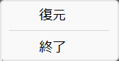
<p><i>(この画像は最新の情報と異なる場合があります。)</i></p>
</div>

## 最終処理のカスタム設定
ダウンロードするファイルのVOD形式が`UPLOAD`である場合、`最終処理`設定の`カスタムオプション`パラメータに追加オプションを設定すると、最終処理中にそのオプションが`FFmpeg`に渡されます。例えば、以下のオプションを指定すると、`FFmpeg`で`H.265`コーデックを使用してエンコードできます。

```powershell
-c:v libx265 -preset medium -crf 23 -c:a aac -b:a 128k
```

ただし、カスタムエンコードはパフォーマンスが最適でないため推奨されません。より良い結果を得るには、外部のプロフェッショナルエンコーダーの使用を検討してください。

## その他の設定

### 起動

<div style='text-align: center'>
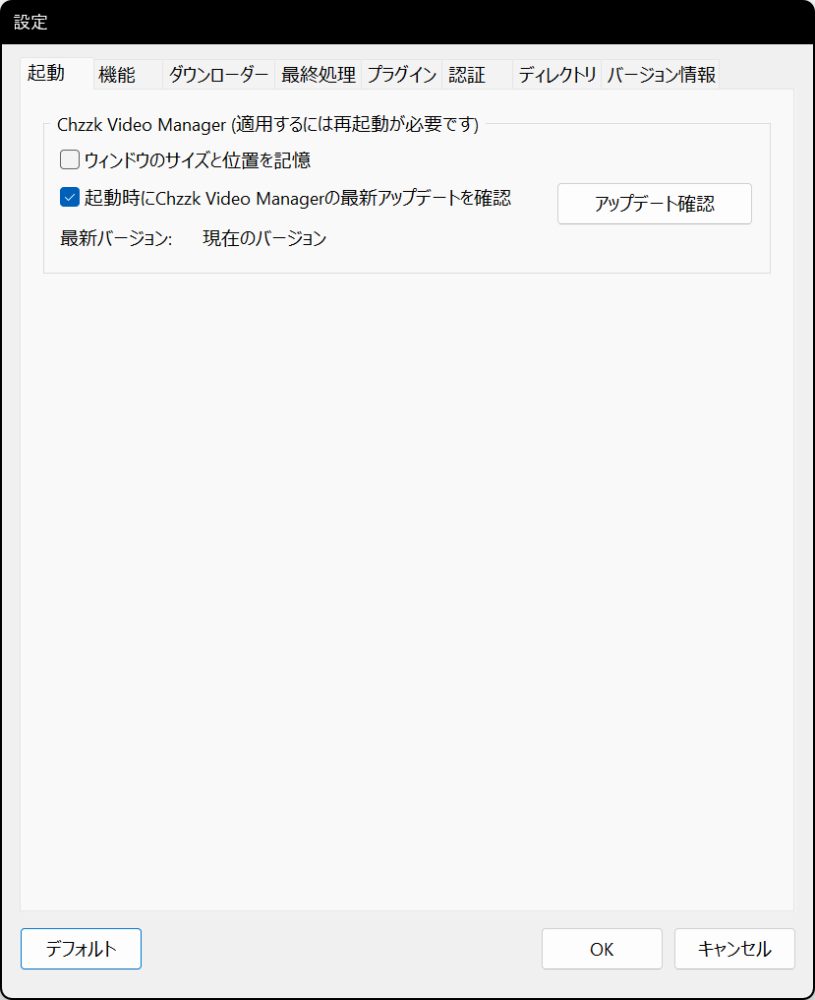
<p><i>(この画像は最新の情報と異なる場合があります。)</i></p>
</div>

* **起動時にウィンドウのサイズと位置を記憶** - 終了時にウィンドウのサイズと位置を保存し、次回起動時に復元します。
* **起動時にChzzk Video Managerの最新アップデートを確認** - 起動時にChzzk Video Managerの最新アップデートを確認するかどうかを設定します。手動で確認する場合は、`アップデート確認`ボタンをクリックします。

### 機能

<div style='text-align: center'>
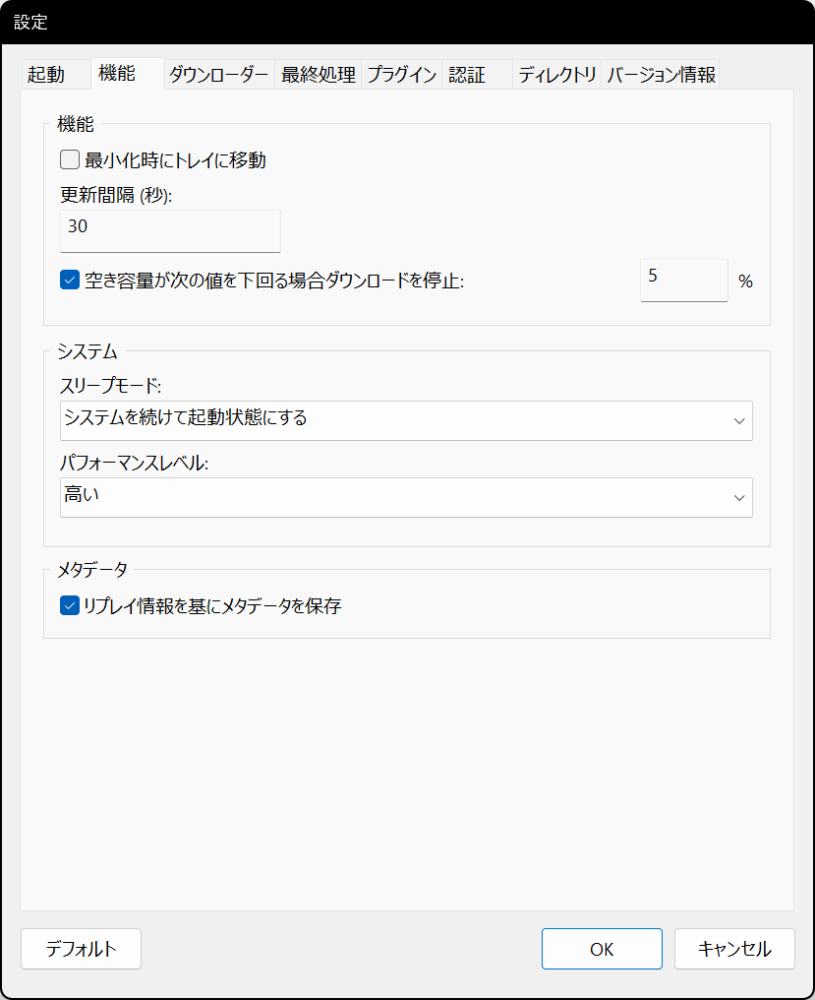
<p><i>(この画像は最新の情報と異なる場合があります。)</i></p>
</div>

* **更新間隔 (秒)** - リストの画面更新間隔を設定します。
* **空き容量が次の値を下回る場合ダウンロードを停止** - 空き容量が少ない場合に停止する閾値(%)を設定します。
* **スリープモード** - Chzzk Video Managerが動作している間のシステムのスリープモードを設定します。
* **パフォーマンスレベル** - Chzzk Video Managerが現在実行されているシステムのパフォーマンスを指定します。ビデオの追加や更新時にタイムアウトによるエラーが発生する場合、パフォーマンスレベルを1段階下げて再試行してください。

### ダウンローダー

<div style='text-align: center'>

<p><i>(この画像は最新の情報と異なる場合があります。)</i></p>
</div>

* **JSON-RPCサーバー: ホストアドレス** - JSON-RPCサーバーのホストアドレスを設定します。
* **JSON-RPCサーバー: ポート** - JSON-RPCサーバーのポート番号を設定します。
* **JSON-RPCサーバー: ID** - JSON-RPCサーバーのIDを設定します。
* **サムネイル画像を保存** - サムネイル画像を別途保存するかどうかを設定します。
* **ダウンロード速度制限を有効にする** - ネットワーク帯域幅を調整するためにダウンロード速度を制限します。(例: 500K, 10M, 1G)
* **対象ファイルが既に存在する場合の保存方法** - 対象ファイルが既に存在する場合の保存方法を設定します。
* **保存ファイル名の形式** - 保存ファイル名の形式を指定します。フォーマット指定子の詳細については、`chzzk_video_downloader_manual.ja-JP.pdf`をご参照ください。
* **目標画質** - ダウンロードする際の画質を設定します。

### 最終処理

<div style='text-align: center'>
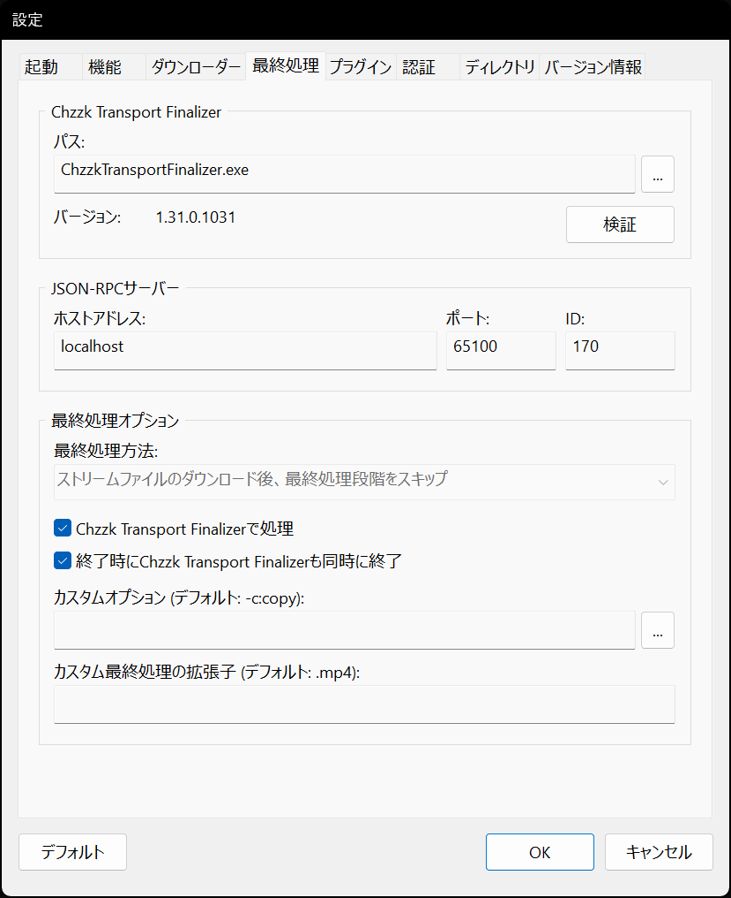
<p><i>(この画像は最新の情報と異なる場合があります。)</i></p>
</div>

* **JSON-RPCサーバー: ホストアドレス** - JSON-RPCサーバーのホストアドレスを設定します。
* **JSON-RPCサーバー: ポート** - JSON-RPCサーバーのポート番号を設定します。
* **JSON-RPCサーバー: ID** - JSON-RPCサーバーのIDを設定します。
* **最終処理方法** - 最終処理方法を設定します。
* **Chzzk Transport Finalizerで処理** - 最終処理をChzzk Transport Finalizerに任せます。
* **カスタムオプション** - 最終処理のカスタムオプションを設定します。

### 認証

<div style='text-align: center'>
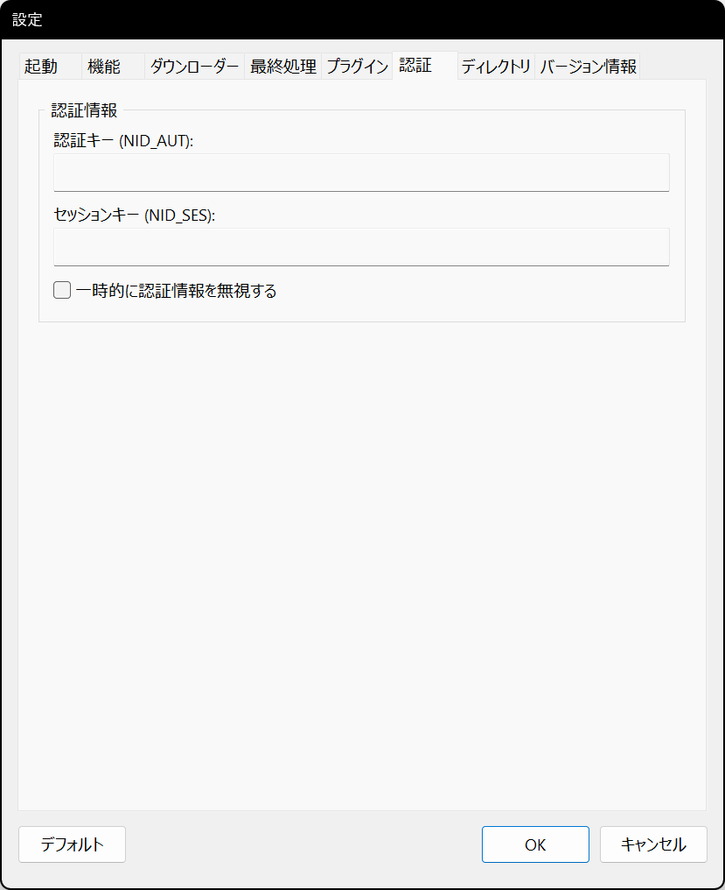
<p><i>(この画像は最新の情報と異なる場合があります。)</i></p>
</div>

* **認証キー (NID_AUT)** - * NAVER IDの認証キーを指定します。
* **セッションキー (NID_SES)** - NAVER IDのセッションキーを指定します。
* **一時的に認証情報を無視する** - 一時的に認証情報を無視するかどうかを設定します。

Chzzk認証資格情報の取得方法については、`how_to_get_chzzk_credential.ja-JP.pdf`を参照してください。

### ディレクトリ

<div style='text-align: center'>

<p><i>(この画像は最新の情報と異なる場合があります。)</i></p>
</div>

* **作業ディレクトリ** - Chzzk Video Downloaderの設定ファイルが保存されるディレクトリを指定します。
* **保存ディレクトリ** - ダウンロードしたビデオファイルが保存されるディレクトリを指定します。
* **一時ディレクトリ** - 一時ファイルが作成されるディレクトリを指定します。
* **カテゴリ分け方法** - ダウンロードしたビデオファイルが保存されるディレクトリのカテゴリ分け方法を設定します。

<div style='text-align: center'>

<p><i>(この画像は最新の情報と異なる場合があります。)</i></p>
</div>

`ネットワーク...`ボタンをクリックして、ネットワークストレージにアクセスするための情報を入力できます。

### バージョン情報

<div style='text-align: center'>
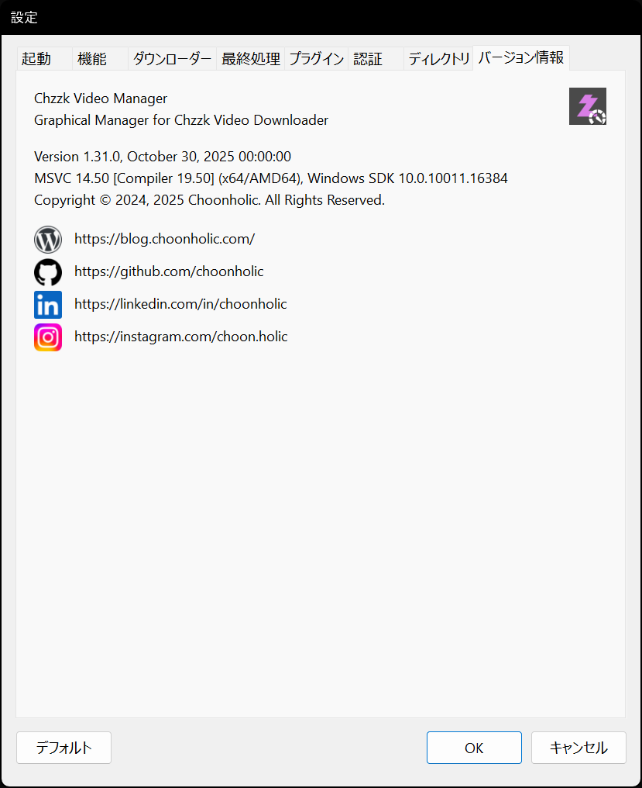
<p><i>(この画像は最新の情報と異なる場合があります。)</i></p>
</div>

* **バージョン情報** - Chzzk Video Managerのバージョン情報を表示します。
* **お問い合わせリンク** - 作成者への連絡先リンクです。

## お問い合わせ
Chzzk Downloader Suiteに関するご質問、バグ報告、または改善要望がございましたら、[GitHub](https://github.com/Choonholic/ChzzkDownloader/)の[Issues](https://github.com/Choonholic/ChzzkDownloader/issues/new)機能を通じてお知らせください。全ての言語に対応可能ですが、直接対応可能な言語は韓国語、英語、日本語、中国語です。他の言語については、機械翻訳を通じて対応するため、100%正確に対応できない場合があります。
