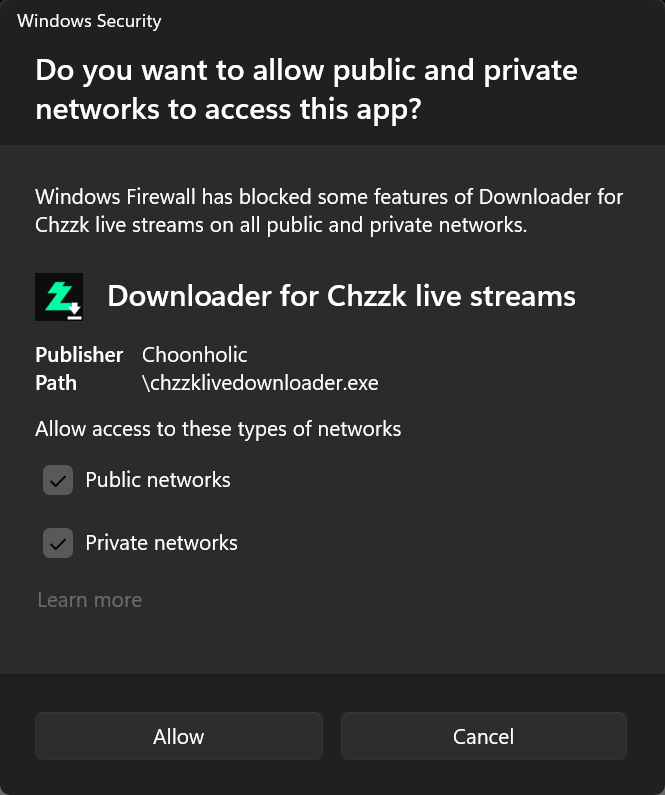

# Chzzk Live Downloaderを外部からJSON-RPCで制御する方法

## Chzzk Downloader Suite JSON-RPC 仕様
Chzzk Downloader Suiteは、外部からの制御を可能にするために、[JSON-RPC 2.0 仕様](https://www.jsonrpc.org/specification)に準拠した単一リクエストをサポートしています。

## サーバーの有効化方法
Chzzk Live Downloaderを起動する際に、`--rpc` オプションを指定します。

## サーバーへの接続方法
内部JSON-RPCサーバーはソケット接続を受け付けます。

- **ホストIPアドレス** - デフォルトのアドレスは`localhost`です。単一のPC内ではなく外部から接続する場合は、`--rpcexpose`オプションに`open`を指定して、サーバーを外部に公開する必要があります。この場合、次の図に示すように、Windows Defender ファイアウォールの設定変更が必要になることがあります。
- **ポート番号** - 基本ポート番号（デフォルト: `62000`）+チャンネルIDです。`--rpcbaseport`オプションで変更可能です。（有効範囲: `49152`〜`65300`）
- **RPC ID** - チャンネルIDを自動的に使用します。`-i`オプションで変更可能です。（デフォルト: `0`）

例えば、ベースポートが`62000`でチャンネルIDが`3`の場合、実際のポート番号は`62003`に設定されます。

<div style='text-align: center'>

<p><i>(この画像は、オペレーティングシステムまたはシステム環境によって異なる場合があります。)</i></p>
</div>

## リクエストの方法
Chzzk Live Downloaderにアクションをリクエストするには、次のようなオブジェクトをTCPソケット経由で送信します。

```json
{
    "jsonrpc": "2.0",
    "method": "get_status",
    "id": 0
}
```

### メソッド一覧
- `get_channel` – チャンネル情報を取得します。
- `get_info` - 全情報を一括で取得します。
- `get_live` – ストリームが現在ダウンロード中の場合、ストリーム情報を取得します。
- `get_settings` – アプリケーションの設定を取得します。
- `get_status` – 現在のステータスを取得します。
- `get_version` – アプリケーションのバージョンを取得します。
- `quit_app` – 現在のダウンロード（進行中の場合）を停止し、アプリケーションを終了します。
- `reload_settings` – 設定ファイルからアプリケーションの設定を再読み込みします。
- `resume_download` - 中断したストリームのダウンロードを再開します。
- `set_settings` – アプリケーションの設定を変更します。
- `skip_current` - 現在のストリームのダウンロードをスキップして、次のストリームを待ちます。
- `stop_current` - 現在のストリームのダウンロードを停止して、次のストリームを待ちます。

## レスポンス
Chzzk Live Downloaderは、以下の形式でレスポンスを返します。

```json
{
    "jsonrpc": "2.0",
    "result": {
        "timestamp": "2026-01-01T00:00:00.000Z",
        "...": "...",
    },
    "id": 0
}
```

### リクエストが正常に処理された場合
- `result` - リクエストされたメソッドの結果。
- `timestamp` - UTCを基準とした応答時間。

### リクエストが正しく処理されなかった場合
- `error` - レスポンスがエラーであることを示します。
- `code` - エラーコード。
- `message` - エラーメッセージ。

## サンプル
GitHubリポジトリ内の[samples](https://github.com/Choonholic/ChzzkDownloader/blob/main/samples/)を参照してください。
