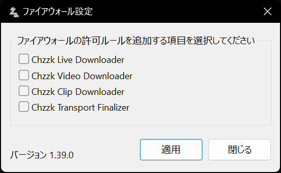

# Windows Defenderファイアウォールの設定

Chzzk Downloader Suiteを、インストールされているPC以外の端末（例：スマートフォン、外部ネットワーク）から操作するには、**Windows Defenderファイアウォール**の設定変更が必要です。

## システムUIからのファイアウォール設定
通常、各ダウンローダーが初めて外部接続を試みる際、以下のような**Windowsファイアウォールの設定ダイアログ**が表示されます。このダイアログから、外部接続の許可またはブロックを設定できます。

<i>(この画像は、オペレーティングシステムまたはシステム環境によって異なる場合があります。)</i>

ただし、すでにファイアウォールでブロックされている場合、このダイアログが表示されず、ダウンローダーが正常に起動できないことがあります。

## ファイアウォール設定アプリの使用
このような場合は、Chzzk Downloader Suiteに付属している**ファイアウォール設定**アプリをご利用ください。

<i>(この画像は最新の情報と異なる場合があります。)</i>

このアプリを使用すると、次の操作が可能です。

- 現在のファイアウォール設定状態を確認
- 外部からのリモート接続を一括で許可またはブロック
