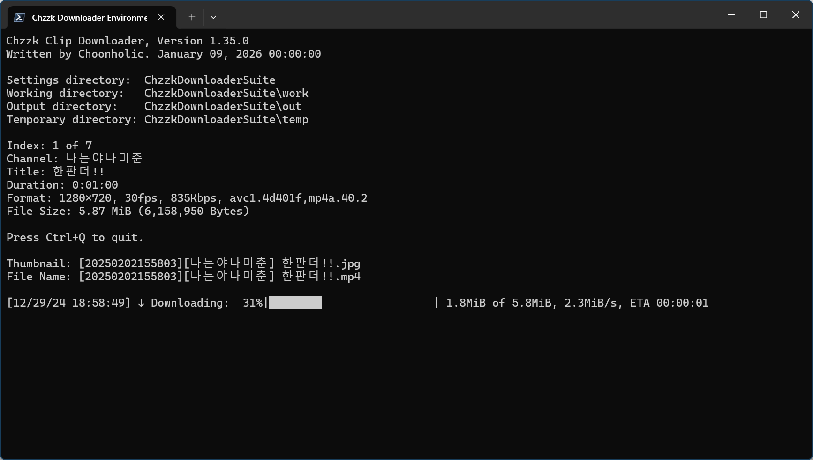

# Chzzk Clip Downloader
치지직 클립 다운로드 도구

<div style='text-align: center'>

<p><i>(이 이미지는 최신 정보와 다를 수 있습니다.)</i></p>
</div>

## 버전
Version 1.38.1, February 01, 2026 00:00:00

## 사용법
```
ChzzkClipDownloader
  [-h] [--version] [-i INPUT] [-a [AUTH]] [--authaut AUTHAUT] [--authses AUTHSES]
  [--authcookie AUTHCOOKIE] [--adult [ADULT]] [-y] [-d [DISPLAY]] [--name [NAME]] [--work [WORK]]
  [--work-user [WORK_USER]] [--work-pass [WORK_PASS]] [--out [OUT]] [--out-user [OUT_USER]]
  [--out-pass [OUT_PASS]] [--temp [TEMP]] [--temp-user [TEMP_USER]] [--temp-pass [TEMP_PASS]]
  [--category [CATEGORY]] [--exist [EXIST]] [--threshold [THRESHOLD]] [--rpc]
  [--rpcexpose [RPCEXPOSE]] [--rpcport [RPCPORT]] [--rpcid [RPCID]] [--snapshot SNAPSHOT]
  [--download [DOWNLOAD]] [--limit [LIMIT]] [--thumb [THUMB]] [--metadata [METADATA]]
  [--startup [STARTUP]] [--pnpath [PNPATH]] [--pnlanguage [PNLANGUAGE]] [--pnparams [PNPARAMS]]
  [--pntexttype [PNTEXTTYPE]] [--settings [SETTINGS]] [--reset]
  [clip]
```

### 위치 매개 변수
```
clip                      다운로드할 클립 UID 또는 URL
```

### 선택적 매개 변수
```
-h, --help                도움말 메시지를 표시합니다
--version                 버전 정보를 표시합니다
-i, --input INPUT         다운로드 목록 파일을 설정합니다
-a, --auth [AUTH]         치지직 인증 자격 증명 처리 방법을 설정합니다 (reuse|reissue|ignore)
--authaut AUTHAUT         치지직 인증 자격 증명의 인증 키를 설정합니다
--authses AUTHSES         치지직 인증 자격 증명의 세션 키를 설정합니다
--authcookie AUTHCOOKIE   치지직 인증 자격 증명을 가져올 Netscape 형식의 쿠키 파일을 설정합니다
--adult [ADULT]           자격 증명이 유효하지 않을 때 성인 콘텐츠 처리 방법을 설정합니다 (ask|skip)
-y, --yes                 모든 확인 값을 자동으로 '예'로 설정합니다
-d, --display [DISPLAY]   표시 형식을 설정합니다 (quiet|simple|fluent|all)
--info INFO               다운로드 없이 클립 정보룰 획득합니다
--name [NAME]             저장되는 파일 이름 형식을 설정합니다
--work [WORK]             작업 디렉터리를 설정합니다
--work-user [WORK_USER]   작업 디렉터리가 네트워크 공간에 있을 떄 사용할 사용자 이름을 설정합니다
--work-pass [WORK_PASS]   작업 디렉터리가 네트워크 공간에 있을 떄 사용할 비밀번호를 설정합니다
--out [OUT]               저장 디렉터리를 설정합니다
--out-user [OUT_USER]     저장 디렉터리가 네트워크 공간에 있을 떄 사용할 사용자 이름을 설정합니다
--out-pass [OUT_PASS]     저장 디렉터리가 네트워크 공간에 있을 떄 사용할 비밀번호를 설정합니다
--temp [TEMP]             임시 디렉터리를 설정합니다
--temp-user [TEMP_USER]   임시 디렉터리가 네트워크 공간에 있을 떄 사용할 사용자 이름을 설정합니다
--temp-pass [TEMP_PASS]   임시 디렉터리가 네트워크 공간에 있을 떄 사용할 비밀번호를 설정합니다
--category [CATEGORY]     저장 시 분류 방법을 설정합니다 (none|streamer)
--exist [EXIST]           파일이 이미 존재할 때 파일 저장 방법을 설정합니다 (rename|skip|overwrite)
--threshold [THRESHOLD]   디스크 공간 부족 시 중지 임계값을 크기 또는 퍼센트(%)로 설정합니다 (비활성화: -, 기본값: 5%, 유효 범위: 디스크 총 용량의 1–50%)
--rpc                     JSON-RPC 서버를 활성화합니다
--rpcexpose [RPCEXPOSE]   JSON-RPC 서버 노출 방식을 설정합니다. (close|open)
--rpcport [RPCPORT]       JSON-RPC 서버 포트를 설정합니다 (기본값: 64000, 49152-65300)
--rpcid [RPCID]           JSON-RPC 서버 ID를 설정합니다 (기본값: 50)
--snapshot SNAPSHOT       상태 변경 시 스냅샷을 JSON 파일로 저장합니다
--download [DOWNLOAD]     다운로드 방법을 설정합니다 (default|atxc|alter)
--limit [LIMIT]           최대 다운로드 속도를 설정합니다 (예: 512K, 10M, 1G, 기본값: 0)
--thumb [THUMB]           미리보기 이미지의 저장 여부를 설정합니다 (save|skip)
--metadata [METADATA]     메타데이터의 저장 여부를 설정합니다（save|skip）
--startup [STARTUP]       시작 방법을 설정합니다 (normal|fast)
--pnpath [PNPATH]         알림 플러그인의 경로를 설정합니다
--pnlanguage [PNLANGUAGE] 알림 플러그인이 사용할 언어를 설정합니다
--pnparams [PNPARAMS]     알림 플러그인의 매개 변수를 설정합니다
--pntexttype [PNTEXTTYPE] 알림 플러그인이 사용할 텍스트 형식을 설정합니다 (plain|markdown|html)
--settings [SETTINGS]     설정 저장 시 동작을 설정합니다 (default|update|show|skip|quit)
--reset                   모든 설정을 초기화합니다
```

## 사용 예시
```powershell
ChzzkClipDownloader C46IcpG11p --thumb save --work work --out out --temp temp
```

## 다운로드할 클립 설정
클립 UID 또는 URL을 직접 설정하여 클립을 다운로드할 수 있습니다.

예를 들어, 클립 URL이 https://chzzk.naver.com/clips/C46IcpG11p인 경우, 해당 클립의 UID는 **C46IcpG11p**입니다. 이 클립을 다운로드하려면 아래 명령어를 사용하세요.

```powershell
ChzzkClipDownloader C46IcpG11p
ChzzkClipDownloader https://chzzk.naver.com/clips/C46IcpG11p
```

여러 클립을 순차적으로 다운로드하려면 아래와 같이 목록 파일을 작성한 후, UTF-8로 인코딩된 텍스트 파일로 저장합니다. (예: `list.txt`)

```python
# 목록 예시
https://chzzk.naver.com/clips/YY9plBpybL
C46IcpG11p
https://chzzk.naver.com/clips/gTSq4c8HaQ
https://chzzk.naver.com/clips/nZbWU27D95
```

그런 다음, 아래 명령어를 사용하여 다운로드합니다.

```powershell
ChzzkClipDownloader -i list.txt
ChzzkClipDownloader --input list.txt
```

## 인증 자격 증명 초기화
성인 전용 클립과 같이 NAVER 인증 자격 증명이 필요한 클립을 다운로드하려면 다음 정보를 지정해야 합니다.

* 치지직 쿠키에서 얻은 NAVER ID 인증 키 (`NID_AUT`)
* 치지직 쿠키에서 얻은 NAVER ID 세션 키 (`NID_SES`)

다운로드 시 인증 자격 증명을 찾을 수 없을 경우, 인증 정보를 입력하라는 메시지가 활성화됩니다.

이 값을 입력하면 기본값으로 설정되며, 이후 실행 시 추가 입력 없이 사용됩니다. 치지직 인증 자격 증명 획득 방법에 대한 자세한 정보는 `how_to_get_chzzk_credential.ko-KR.pdf`를 참고하세요.

인증 자격 증명이 변경되었거나 다른 ID로 로그인하여 인증 정보를 초기화해야 할 경우, 다음 명령어를 사용하세요.

```powershell
ChzzkClipDownloader clip_uid 또는 url -a reset
ChzzkClipDownloader clip_uid 또는 url --auth reset
```

만약 임시로 인증 정보를 무시해야 한다면 다음 명령어를 사용하세요.

```powershell
ChzzkClipDownloader clip_uid 또는 url -a ignore
ChzzkClipDownloader clip_uid 또는 url --auth ignore
```

`-y` 또는 `--yes` 매개 변수를 사용하면 확인 없이 인증 입력 메시지가 자동으로 활성화됩니다.

```powershell
ChzzkClipDownloader clip_uid 또는 url -y
ChzzkClipDownloader clip_uid 또는 url --yes
```

## 저장 파일 이름 형식 설정
기본적으로 클립과 미리보기 파일 이름은 `[{download_date}][{name}] {title}` 형식으로 저장됩니다. 이 형식을 변경하려면 다음 명령어를 사용하세요.

```powershell
ChzzkClipDownloader clip_uid 또는 url --name "[{name}][{category}] {title}"
```

이 선택 사항을 기본값으로 되돌리려면 형식 없이 `--name`만 사용하세요.

```powershell
ChzzkClipDownloader clip_uid 또는 url --name
```

### 파일 이름 형식 태그
다음과 같은 미리 정의된 태그를 파일 이름 형식에 사용할 수 있습니다.

* `{name}` - 채널 이름.
* `{verified}` - 채널이 인증된 경우 `[✓]`이며, 그렇지 않은 경우 빈 값.
* `{clip_uid}` - 클립 UID.
* `{title}` - 클립 제목.
* `{download_date...}` - 스트리밍 시작 시점의 날짜 관련 태그.
* `{media...}` - 미디어 정보 관련 태그.

미디어 관련 태그에는 다음 요소들이 포함됩니다.

* `{media_quality}` - 미디어 화질. (예: `1080p`)
* `{media_video_width}` - 비디오 폭 (픽셀 단위). (예: `1920`)
* `{media_video_height}` - 비디오 높이 (픽셀 단위). (예: `1080`)
* `{media_video_bitrate}` - 비디오 비트레이트 (bps). (예: `8000000`)
* `{media_audio_bitrate}` - 오디오 비트레이트 (bps). (예: `192000`)
* `{media_video_codec}` - 비디오 코덱. (예: `H264`)

날짜 관련 태그의 세부 요소는 아래와 같이 확장할 수 있습니다.

* `{..._date}` - `%Y%m%d%H%M%S` 형식의 날짜. (예: `20240607014327`)
* `{..._date_year}` 또는 `{..._date_year_full}` - 세기를 포함한 연도. (예: `2024`)
* `{..._date_year_short}` - 세기를 제외한 두 자리 수 연도. (예: `24`)
* `{..._date_month}` - 두 자리 수 월. (`01`, `02`, ..., `12`)
* `{..._date_month_full}` - 월의 전체 이름. (`January`, `February`, ..., `December`)
* `{..._date_month_short}` - 월의 약어. (`Jan`, `Feb`, ..., `Dec`)
* `{..._date_day}` - 두 자리 수 일. (`01`, `02`, ..., `31`)
* `{..._date_hour}` - 두 자리 수 시 (24시간제). (`00`, `01`, ..., `23`)
* `{..._date_minute}` - 두 자리 수 분. (`00`, `01`, ..., `59`)
* `{..._date_second}` - 두 자리 수 초. (`00`, `01`, ..., `59`)

## 미리보기 이미지 저장
미리보기 이미지를 별도로 저장하려면 다음 명령어를 사용하세요.

```powershell
ChzzkClipDownloader clip_uid 또는 url --thumb save
```

미리보기 이미지를 저장하지 않으려면 다음 명령어를 사용하세요.

```powershell
ChzzkClipDownloader clip_uid 또는 url --thumb skip
```

## 메타데이터 저장
클립 정보를 기반으로 메타데이터를 저장하려면 다음 명령어를 사용하세요.

```powershell
ChzzkClipDownloader clip_uid 또는 url --metadata save
```

메타데이터를 저장하지 않으려면 다음 명령어를 사용하세요.

```powershell
ChzzkClipDownloader clip_uid 또는 url --metadata skip
```

## 표시 형식 설정
기본적으로 상세 정보가 표시됩니다. 하지만 정보가 필요하지 않은 경우, 다음 명령어를 사용하여 표시하지 않을 수 있습니다.

```powershell
ChzzkClipDownloader clip_uid 또는 url -d quiet
ChzzkClipDownloader clip_uid 또는 url --display quiet
```

`--display` 매개 변수의 선택 사항을 사용하여 다음과 같이 표시 형식을 설정할 수 있습니다.

* `quiet` - 정보 표시를 하지 않습니다.
* `simple` - 간단 정보만 표시합니다.
* `fluent` - 상세 정보를 표시합니다.
* `all` - 모든 정보를 표시합니다.

이 선택 사항을 기본값으로 되돌리려면 형식 없이 `-d` 또는 `--display`만 사용하세요.

```powershell
ChzzkClipDownloader clip_uid 또는 url -d
ChzzkClipDownloader clip_uid 또는 url --display
```

## 작업 디렉터리 설정
올바르게 작동하는데 필요한 파일을 저장할 디렉터리를 지정하려면 다음 명령어를 사용하세요.

```powershell
ChzzkClipDownloader clip_uid 또는 url --work work
```

이 선택 사항을 기본값으로 되돌리려면 디렉터리 없이 `--work`만 사용하세요.

```powershell
ChzzkClipDownloader clip_uid 또는 url --work
```

## 저장 디렉터리 설정
다운로드한 파일을 저장할 디렉터리를 지정하려면 다음 명령어를 사용하세요.

```powershell
ChzzkClipDownloader clip_uid 또는 url --out out
```

기본적으로 모든 파일은 스트리머별 하위 디렉터리에 분류하여 저장됩니다. 만약 스트리머별로 분류하지 않고 저장하려면 다음 명령어를 사용하세요.

```powershell
ChzzkClipDownloader clip_uid 또는 url --category none
```

이 선택 사항을 기본값으로 되돌리려면 디렉터리 없이 `--out`과 `-category`만 사용하세요.

```powershell
ChzzkClipDownloader clip_uid 또는 url --out --category
```

## 임시 디렉터리 설정
다운로드 중인 파일을 저장할 임시 디렉터리를 지정하려면 다음 명령어를 사용하세요.

```powershell
ChzzkClipDownloader clip_uid 또는 url --temp temp
```

이 선택 사항을 기본값으로 되돌리려면 디렉터리 없이 `--temp`만 사용하세요.

```powershell
ChzzkClipDownloader clip_uid 또는 url --temp
```

## 디렉터리 지정 방법
디렉터리는 다음과 같이 여러 가지 방법으로 지정할 수 있습니다.

```powershell
ChzzkClipDownloader clip_uid 또는 url --temp temp
```

실행 파일이 있는 디렉터리의 하위 디렉터리인 `temp`를 임시 디렉터리로 지정합니다. 해당 디렉터리가 존재하지 않으면 새로 생성됩니다.

```powershell
ChzzkClipDownloader clip_uid 또는 url --work \Users\Username\Documents\chzzk_work
```

현재 드라이브의 `\Users\Username\Documents\chzzk_work`를 작업 디렉터리로 지정합니다. 해당 디렉터리가 존재하지 않으면 새로 생성됩니다.

```powershell
ChzzkClipDownloader clip_uid 또는 url --work C:\Users\Username\Documents\chzzk_work
```

물론 위와 같이 직접 드라이브(예: `C:`)를 지정할 수도 있습니다.

```powershell
ChzzkClipDownloader clip_uid 또는 url --out \\192.168.0.1\chzzk\out
```

UNC 경로 기반인 `\\192.168.0.1\chzzk\out` 네트워크 저장 공간을 출력 디렉터리로 지정합니다. 해당 디렉터리가 존재하지 않으면 새로 생성됩니다.

네트워크 저장 공간에 파일을 저장할 때는 사용자 이름과 비밀번호를 입력해야 할 수 있습니다. 이 정보는 다음과 같이 지정할 수 있습니다.

```powershell
ChzzkClipDownloader clip_uid 또는 url --work-user username --work-pass password
ChzzkClipDownloader clip_uid 또는 url --out-user username --out-pass password
ChzzkClipDownloader clip_uid 또는 url --temp-user username --temp-pass password
```

## 파일이 이미 존재할 때 파일 저장 방법 설정
기본적으로 저장하려는 파일과 동일한 이름의 파일이 이미 존재할 때, 파일 이름 뒤에 `(n)`을 붙여 저장합니다. 하지만 다음 명령어를 사용하여 파일을 덮어쓰거나 다운로드 자체를 건너뛰도록 지정할 수 있습니다.

```powershell
ChzzkClipDownloader clip_uid 또는 url --exist overwrite
ChzzkClipDownloader clip_uid 또는 url --exist skip
```

이 선택 사항을 기본값으로 되돌리려면 설정 없이 `--exist`만 사용하세요.

```powershell
ChzzkClipDownloader clip_uid 또는 url --exist
```

## 최대 다운로드 속도 설정 (네트워크 대역폭 제어)
네트워크 대역폭을 제어하기 위해 다운로드 속도를 제한할 필요가 있을 때는 다음 명령어를 사용하세요. `0`을 지정하면 제한하지 않음을 뜻합니다. `K`, `M`, `G` 단위를 사용할 수도 있습니다. (`1K`=`1024`, `1M`=`1024K`, `1G`=`1024M`)

```powershell
ChzzkClipDownloader clip_uid 또는 url --limit 10M
```

이 선택 사항을 기본값으로 되돌리려면 설정 없이 `--limit`만 사용하세요.

```powershell
ChzzkClipDownloader clip_uid 또는 url --limit
```

## 여유 저장 공간이 임계점 이하로 낮아질 때 다운로드 중지 설정
기본적으로, 저장 디렉터리와 임시 디렉터리의 여유 공간이 5% 이하로 낮아질 때 다운로드를 중지합니다. 여유 저장 공간의 임계값을 다르게 설정하려면 다음 명령어를 사용하세요. 임계값은 실제 크기 또는 % 단위로 지정할 수 있으며, 범위는 디스크 전체 용량의 1~50%의 범위 내애서 지정할 수 있습니다.

```powershell
ChzzkClipDownloader clip_uid 또는 url --threshold 20%
ChzzkClipDownloader clip_uid 또는 url --threshold 1GB
ChzzkClipDownloader clip_uid 또는 url --threshold 100M
ChzzkClipDownloader clip_uid 또는 url --threshold 800MiB
```

실제 크기로 임계점을 지정할 때는 SI 단위(KB, MB, GB...), IEC 단위(KiB, MiB, GiB...)를 사용할 수 있으며, 접두사(K, Ki, M, Mi, G, Gi...)만 사용할 수도 있습니다. 물론 단위 없이 바이트 단위로 지정할 수도 있습니다.

여유 저장 공간에 따른 다운로드 중지 기능을 비활성화하려면 다음 명령어를 사용하세요.

```powershell
ChzzkClipDownloader clip_uid 또는 url --threshold -
```

이 선택 사항을 기본값으로 되돌리려면 설정 없이 `--threshold`만 사용하세요.

```powershell
ChzzkClipDownloader clip_uid 또는 url --threshold
```

## 다운로드 방법 설정
대체 다운로드 모듈이 포함되어 있습니다. 대체 모듈을 사용해 보려면 다음 명령어를 사용하세요.

```powershell
ChzzkClipDownloader clip_uid 또는 url --download alter
```

## 설정 저장 시 동작 설정
모든 선택 사항은 기본적으로 설정 파일에 자동으로 저장됩니다.

하지만 `--settings` 매개 변수 뒤에 다음과 같이 선택 사항을 지정하면 설정 저장 여부를 지정하거나 설정 내용을 확인할 수 있습니다.

```powershell
ChzzkClipDownloader clip_uid 또는 url --settings skip
```

* `default` - 선택 사항을 설정 파일에 저장한 후 다운로드를 진행합니다.
* `skip` - 선택 사항을 설정 파일에 저장하는 대신 현재 세션에만 적용한 후 다운로드를 진행합니다.
* `update` - 선택 사항을 설정 파일에 저장한 후 변경된 설정 내용을 표시하고 종료합니다.
* `show` - 선택 사항을 모두 무시하고 기존 설정 내용을 표시하고 종료합니다.
* `quit` - 선택 사항을 설정 파일에 저장한 후 종료합니다.

단, 다음 정보는 따로 관리되며 `--settings` 매개 변수의 선택 사항과 관계 없이 항상 저장됩니다.

* 치지직 쿠키에서 얻은 NAVER ID 인증 키 (`NID_AUT`)
* 치지직 쿠키에서 얻은 NAVER ID 세션 키 (`NID_SES`)

## 플러그인 기능
Chzzk Clip Downloader는 플러그인을 통해 사용자의 개인 성향과 환경에 맞춘 부가 기능을 제공합니다.

### 알림 플러그인
알림 플러그인을 등록하면 Chzzk Clip Downloader의 동작 상태를 외부 솔루션을 통해 쉽게 확인할 수 있습니다. 기본적으로 제공하는 알림 플러그인은 다음과 같습니다.

* `pn_slack` - Slack 알림 플러그인
* `pn_telegram` - Telegram 알림 플러그인

다음과 같이 `--pnpath` 매개 변수를 사용하면 알림 플러그인을 등록할 수 있습니다. 알림 플러그인은 한 번에 하나만 활성화되기 때문에 여러 번 등록할 경우, 가장 마지막에 등록된 플러그인만 활성화됩니다. 플러그인이 한 번 등록되면 이후 실행되는 모든 Chzzk Clip Downloader에 모두 적용됩니다.

```powershell
ChzzkClipDownloader clip_uid 또는 url --pnpath=pn_...
```

이 때, 다음과 같이 `--pnlanguage` 매개 변수를 이용하여 알림 메시지의 언어를 지정할 수 있습니다.

```powershell
ChzzkClipDownloader clip_uid 또는 url --pnpath=pn_... --pnlanguage=ko-KR
```

만약 알림 플러그인이 마크다운 형식이나 HTML 형식을 지원한다면 다음과 같이 `--pntexttype` 매개 변수를 이용하여 텍스트 형식을 지정할 수 있습니다.

```powershell
ChzzkClipDownloader clip_uid 또는 url --pnpath=pn_... --pntexttype=html
```

알림 플러그인에는 사용자 플러그인도 지정할 수 있으며, 이 때 별도로 플러그인에 전달해야 하는 매개 변수가 있다면 `--pnparams` 매개 변수를 이용해 지정할 수 있습니다. 이 때 메시지가 들어갈 위치에는 반드시 `%M`을 지정해야 합니다.

```powershell
ChzzkClipDownloader clip_uid 또는 url --pnpath=userpn_... --pnparams="--user --message %M"
```

알림 플러그인의 등록을 해제하려면 플러그인 지정 없이 `--pnpath`만 사용하세요.

```powershell
ChzzkClipDownloader clip_uid 또는 url --pnpath
```

## 모든 설정 초기화
사용 시간이 길어질수록 설정이 꼬일 수 있습니다. 모든 설정을 초기화하려면 다음 명령어를 사용하세요.

```powershell
ChzzkClipDownloader --reset
```

다음 정보가 초기화됩니다.

* Chzzk 쿠키에서 얻은 NAVER ID 인증 키 (`NID_AUT`)
* Chzzk 쿠키에서 얻은 NAVER ID 세션 키 (`NID_SES`)
* 미리보기 이미지 저장 설정
* 다운로드 세부 정보 표시 설정
* 출력 및 임시 디렉터리 설정

## 버전 정보 표시
다음 명령어를 사용하여 버전 정보를 확인할 수 있습니다.

```powershell
ChzzkClipDownloader --version
```

## 도움말 확인
간단한 매개 변수 도움말을 확인하려면 다음 명령어를 사용하세요.

```powershell
ChzzkClipDownloader -h
ChzzkClipDownloader --help
```

## 매개 변수 우선 순위
`--reset`, `-h`, `--version`을 제외한 매개 변수는 아래 예시와 같이 순서에 상관없이 사용할 수 있습니다. 단, 동일한 매개 변수를 중복으로 지정할 수는 없습니다.

```powershell
ChzzkClipDownloader C46IcpG11p --out out
```

`-h`와 `--version` 매개 변수는 첫 번째로 사용된 것만 처리되고 즉시 종료됩니다. 따라서 아래 명령어는 버전 정보만 출력됩니다.

```powershell
ChzzkClipDownloader --version -h
```

`--reset` 매개 변수는 설정을 초기화하고 이전에 설정된 값을 무시한 후 종료됩니다. 따라서 다음 명령어에서 클립 UID는 무시됩니다.

```powershell
ChzzkClipDownloader C46IcpG11p --reset
```

## 권장 초기 설정
처음 사용할 때는 다음 설정을 권장합니다. 다음 명령어를 사용하면 작업 디렉터리(`--work`), 저장 디렉터리(`--out`), 임시 디렉터리(`--temp`)를 한 번에 설정하여 다운로드한 클립 파일을 정리하기 쉽게 만듭니다.

```powershell
ChzzkClipDownloader clip_uid 또는 url --work work --out out --temp temp
```

## JSON-RPC를 사용한 외부 제어
자세한 정보는 `how_to_control_chzzk_clip_downloader.ko-KR.pdf` 파일을 참조하세요.

## 문의하기
치지직 다운로드 도구에 대해 궁금한 사항, 제보할 오류, 개선 요청 사항 등이 있을 때는 [GitHub](https://github.com/Choonholic/ChzzkDownloader/)의 [Issues](https://github.com/Choonholic/ChzzkDownloader/issues/new) 기능을 통해 제보해 주세요. 모든 언어에 대응 가능하나, 직접 대응 가능한 언어는 한국어, 영어, 일본어, 중국어이며, 다른 언어는 기계 번역을 통하기 때문에 100% 대응이 불가능할 수 있습니다.
