# Chzzk Live Manager
그래픽 사용자 인터페이스 기반의 Chzzk Live Downloader 관리자

<div style='text-align: center'>

<p><i>(이 이미지는 최신 정보와 다를 수 있습니다.)</i></p>
</div>

## 버전
Version 1.33.0, December 14, 2025 00:00:00

## 선행 요건
Chzzk Live Manager는 Chzzk Live Downloader의 그래픽 사용자 인터페이스 프론트엔드 애플리케이션으로서, 반드시 Chzzk Live Downloader와 Chzzk Transport Finalizer가 함께 설치되어 있어야 합니다.

Chzzk Live Manager, Chzzk Live Downloader, Chzzk Transport Finalizer가 모두 같은 디렉터리에 있으면 실행 시 자동으로 인식히며, 그렇지 않으면 **선행 요건 확인** 항목의 내용을 따라 Chzzk Live Downloader와 Chzzk Transport Finalizer의 위치를 지정해 주어야 합니다.

무설치 버전의 파일을 사용할 경우, 편의를 위해 Chzzk Live Manager, Chzzk Live Downloader, Chzzk Transport Finalizer를 모두 같은 디렉터리에 저장하시는 것을 권장합니다. `설치 프로그램`을 사용하면 자동으로 자동으로 같은 디렉터리에 설치됩니다.

## 실행
시작 메뉴에서 `Chzzk Live Manager`를 실행하거나, `Chzzk Downloader Environment`에서 `ChzzkLiveManager.exe`를 실행합니다.

## 선행 요건 확인
Chzzk Live Manager의 모든 기능을 활용하려면, Chzzk Live Downloader와 Chzzk Transport Finalizer가 올바르게 설정되어 있어야 하며, Chzzk Live Downloader를 실행하려면 Streamlink(버전 7.0.0 이상)와 FFmpeg의 공식 메이저 버전(버전 7.0 이상)이 올바르게 설정되어 있어야 합니다. Chzzk Live Manager가 처음 실행될 때 이와 같은 선행 요건을 모두 확인하는 과정을 거치며, 이를 만족하지 못할 경우 다음 그림과 같은 대화 상자가 표시됩니다.

<div style='text-align: center'>
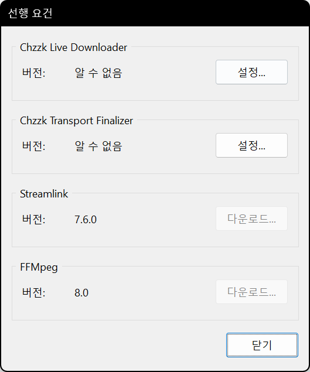
<p><i>(이 이미지는 최신 정보와 다를 수 있습니다.)</i></p>
</div>

`설정...` 버튼을 누르면 Chzzk Live Downloader와 Chzzk Transport Finalizer의 위치를 지정할 수 있으며, `다운로드` 버튼을 눌러 Streamlink와 FFmpeg을 설치할 수 있습니다.

<div style='text-align: center'>
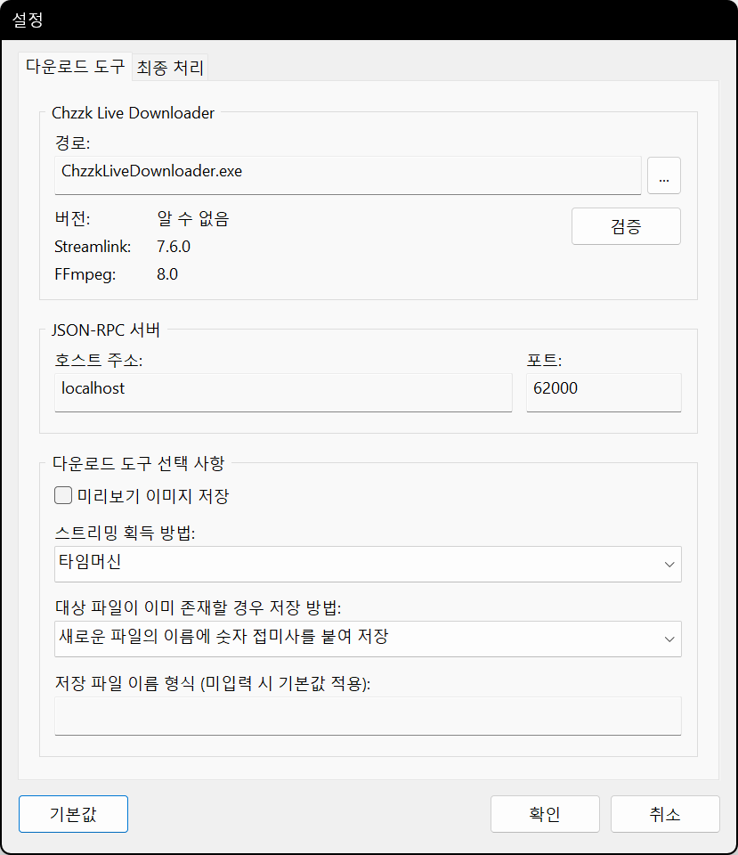
<p><i>(이 이미지는 최신 정보와 다를 수 있습니다.)</i></p>
</div>

`...` 버튼을 눌러 올바른 위치에서 `ChzzkLiveDownloader.exe` 파일을 찾아 선택합니다. 올바른 Chzzk Live Downloader가 지정되면, 다음 그림과 같이 인식된 버전 정보가 표시됩니다.

<div style='text-align: center'>
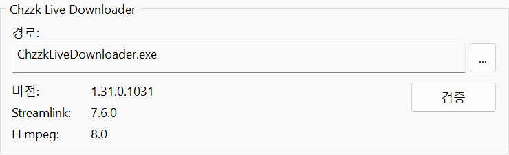
<p><i>(이 이미지는 최신 정보와 다를 수 있습니다.)</i></p>
</div>

<div style='text-align: center'>
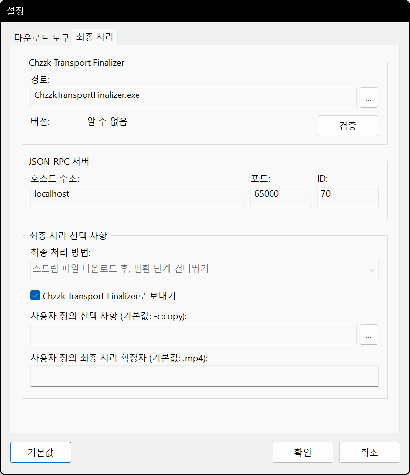
<p><i>(이 이미지는 최신 정보와 다를 수 있습니다.)</i></p>
</div>

마찬가지로 `...` 버튼을 눌러 올바른 위치에서 `ChzzkTransportFinalizer.exe` 파일을 찾아 선택합니다. 올바른 Chzzk Transport Finalizer가 지정되면, 다음 그림과 같이 인식된 버전 정보가 표시됩니다.

<div style='text-align: center'>
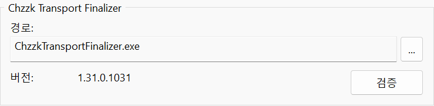
<p><i>(이 이미지는 최신 정보와 다를 수 있습니다.)</i></p>
</div>

## 주 메뉴
창의 왼쪽 위에 있는 ☰ 아이콘을 누르면 주 메뉴가 열립니다.

<div style='text-align: center'>
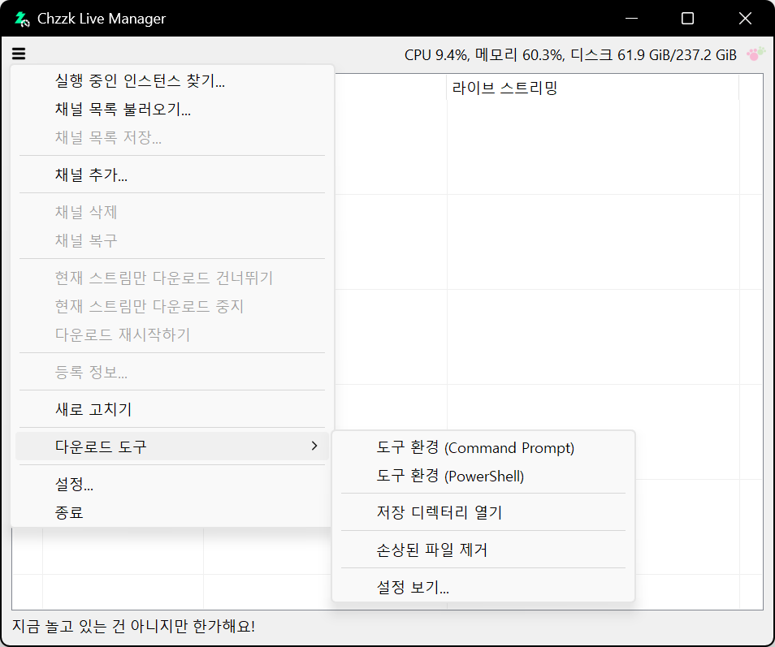
<p><i>(이 이미지는 최신 정보와 다를 수 있습니다.)</i></p>
</div>

## 채널 추가
채널을 추가하려면 ☰ 아이콘을 누르고 `채널 추가` 항목을 선택하면 채널 추가 대화 상자가 열립니다. 추가할 채널의 UID, URL 또는 라이브 스트리밍 URL을 입력하고 `확인` 버튼을 누릅니다.

<div style='text-align: center'>
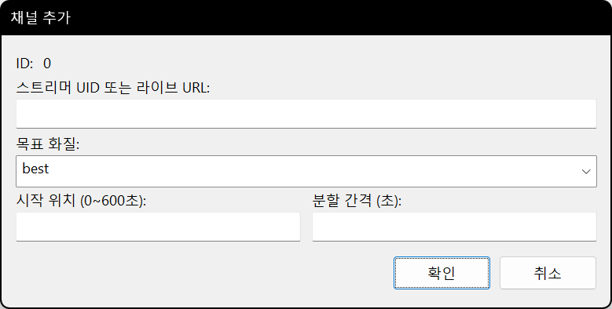
<p><i>(이 이미지는 최신 정보와 다를 수 있습니다.)</i></p>
</div>

추가로 이 대화 상자에서 다음 항목을 지정할 수 있습니다.

### 스트리머 UID 또는 라이브 URL
다음과 같은 세 가지 정보 중 하나를 입력하면 자동으로 스트리머 UID를 인식합니다.

* 라이브 스트리밍 URL - `https://chzzk.naver.com/live/UID`
* 채널 URL - `https://chzzk.naver.com/UID`
* 스트리머 UID - `UID`

### 목표 화질
`best`, `1080p`, `720p`와 같은 값을 입력할 수 있습니다.

변형된 해상도를 사용하는 경우, 예상되는 해상도보다 큰 값을 입력해 두면 Chzzk Live Downloader와 마찬가지로 자동으로 가장 가까운 해상도로 설정됩니다. (예: `1200p` → `1080p`)

### 시작 지점
라이브 스트리밍의 다운로드 시작점에서 건너뛸 시간을 지정할 수 있습니다. 기본적으로 지정되는 시간은 초 단위입니다. 하지만 다음과 같이 시, 분, 초, 밀리초를 사용하여 지정할 수도 있습니다.

```powershell
1:23:45.67
1h30m45.67s
```

## 다운로드 길이 설정 및 분할 다운로드
다운로드할 스트리밍의 길이를 지정하면 지정된 길이마다 분할되어 다운로드됩니다. 기본적으로 지정되는 시간은 초 단위입니다. 하지만 다음과 같이 시, 분, 초, 밀리초를 사용하여 지정할 수도 있습니다.

```powershell
1:23:45.67
1h30m45.67s
```

## 채널 삭제
더 이상 관리할 필요가 없는 채널을 삭제하려면, 목록에서 삭제할 채널을 선택한 다음 ☰ 아이콘을 누르고 `채널 삭제` 항목을 선택합니다. 채널 삭제 여부를 확인하는 대화 상자에서 `OK` 버튼을 누르면 채널이 삭제됩니다.

<div style='text-align: center'>
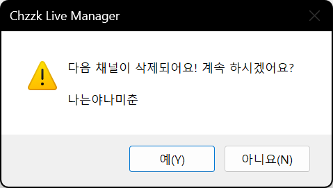
<p><i>(이 이미지는 최신 정보와 다를 수 있습니다.)</i></p>
</div>

삭제한 채널이 다운로드 중이었을 경우, 다운로드는 삭제 시점에서 중단되며, 최종 처리까지 완료된 후 저장됩니다.

## 채널 복구
만약 프로세스의 비정상 종료와 같은 이유로 Chzzk Live Downloader와 Chzzk Live Manager 사이의 연결이 끊어졌을 경우, 프로세스를 다시 시작하여 연결할 수 있습니다.

<div style='text-align: center'>
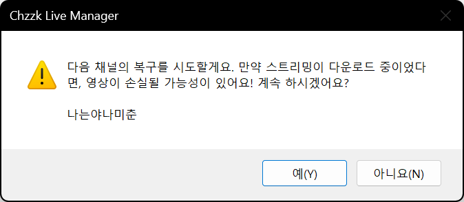
<p><i>(이 이미지는 최신 정보와 다를 수 있습니다.)</i></p>
</div>

만약 연결이 끊어진 상태에서 다운로드가 계속 이루어지고 있었을 경우, 다운로드가 해당 시점에서 일단 종료된 후 다시 시작됩니다.

## 현재 라이브 스트리밍만 다운로드 건너뛰기
현재 스트리밍의 다운로드를 건너뛰고 다음 스트리밍을 기다리려면, 목록에서 채널을 선택한 다음 ☰ 아이콘을 누르고 `현재 스트림만 다운로드 건너뛰기` 항목을 선택합니다. 건너뛸지 여부를 확인하는 대화 상자에서 `OK` 버튼을 누르면 현재 스트리밍의 다운로드를 건너뛰고 다음 스트리밍을 기다립니다.

<div style='text-align: center'>

<p><i>(이 이미지는 최신 정보와 다를 수 있습니다.)</i></p>
</div>

## 현재 라이브 스트리밍만 다운로드 중지하기
현재 스트리밍의 다운로드를 중지하고 다음 스트리밍을 기다리려면, 목록에서 채널을 선택한 다음 ☰ 아이콘을 누르고 `현재 스트림만 다운로드 중지하기` 항목을 선택합니다. 중지 여부를 확인하는 대화 상자에서 `OK` 버튼을 누르면 현재 스트리밍의 다운로드를 중지하고 다음 스트리밍을 기다립니다.

<div style='text-align: center'>

<p><i>(이 이미지는 최신 정보와 다를 수 있습니다.)</i></p>
</div>

## 중지했던 라이브 스트리밍 다운로드 재시작하기
중지했던 라이브 스트리밍의 다운로드를 다시 시작하려면, 목록에서 채널을 선택한 다음 ☰ 아이콘을 누르고 `다운로드 재시작하기` 항목을 선택합니다. 이 기능은 강제로 중지한 스트리밍이 아직 종료되지 않은 경우에만 사용할 수 있으며, 만약 새롭게 시작된 스트리밍이라면 이 기능을 사용하지 않아도 자동으로 다운로드를 시작합니다.

## 채널 등록 정보 확인
채널의 등록 정보를 확인하려면, 목록에서 등록 정보를 확인할 채널을 선택한 다음 ☰ 아이콘을 누르고 `등록 정보...` 항목을 선택합니다.

<div style='text-align: center'>

<p><i>(이 이미지는 최신 정보와 다를 수 있습니다.)</i></p>
</div>

## 상황에 따른 메뉴
목록에서 채널을 선택한 후 마우스 오른쪽 버튼을 누르면 해당 채널의 상황에 따른 메뉴가 열립니다.

<div style='text-align: center'>
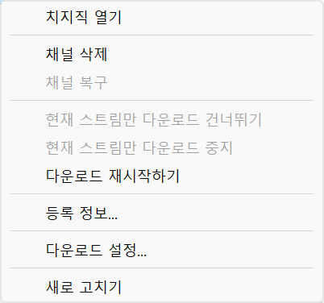
<p><i>(이 이미지는 최신 정보와 다를 수 있습니다.)</i></p>
</div>

## 다운로드 선택 사항 변경
채널이 현재 다운로드 상태가 아닌 경우, 다운로드 선택 사항을 실시간으로 변경할 수 있습니다.

<div style='text-align: center'>
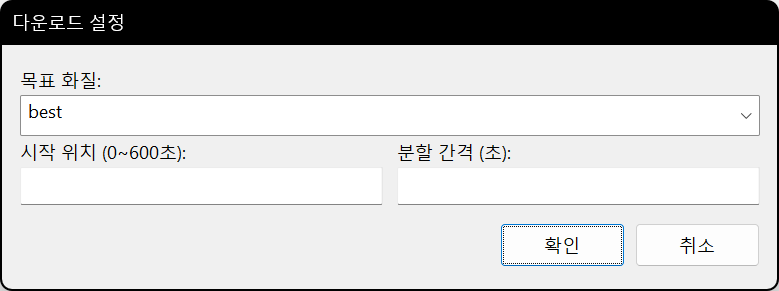
<p><i>(이 이미지는 최신 정보와 다를 수 있습니다.)</i></p>
</div>

## 채널 목록 저장
현재 관리 중인 채널 목록은 목록 파일로 저장했다가 다음에 필요할 때 불러올 수 있습니다.

목록에 채널이 하나 이상 존재하는 상태에서 ☰ 아이콘을 누르고 `채널 목록 저장...` 항목을 선택하면, 파일을 저장할 디렉터리와 이름을 변경할 수 있는 대화 상자가 열립니다.

## 채널 목록 불러오기
매번 채널을 추가하는 대신 저장했던 채널 목록을 불러올 수 있습니다.

☰ 아이콘을 누르고 `채널 목록 불러오기...` 항목을 선택하면, 채널 목록 파일을 선택할 수 있는 대화 상자가 열립니다.

불러 온 목록에 있는 채널이 아미 현재 목록에 있더라도 자동으로 인식되어 처리됩니다.

## 목록 갱신
목록을 즉시 갱신하려면, ☰ 아이콘을 누르고, `새로 고치기` 항목을 선택합니다.

## 시작할 때 채널 목록 자동으로 불러오기
주로 관리하는 채널이 고정되어 있는 경우 매번 불러오는 작업이 번거로울 수 있습니다. 설정에서 다음 항목을 설정하면 시작할 때 지정된 채널 목록을 자동으로 불러옵니다.

* ☰ 아이콘을 누르고 `설정...` 항목을 선택해 설정 대화 상자를 엽니다.
* `시작` 탭에서 `시작 시 채널 목록 읽어오기` 항목을 활성화한 다음 `경로:` 항목 옆의 `...` 버튼을 눌러 불러올 채널 목록 파일을 선택합니다.
* 다음 시작 시부터 지정된 채널 목록을 자동으로 불러옵니다.

<div style='text-align: center'>

<p><i>(이 이미지는 최신 정보와 다를 수 있습니다.)</i></p>
</div>

## 외부에서 실행 중인 Chzzk Live Downloader 관리하기
Chzzk Live Downloader는 Chzzk Live Manager 없이도 단독 실행이 가능한 도구이기 때문에, Chzzk Live Manager를 통하지 않고 실행하는 경우가 있을 수 있습니다.

하지만 이렇게 별도로 실행 중인 경우에도 다음 설정을 통해 시작 시에 실행 여부를 확인하여 채널 목록에 자동으로 추가하여 관리할 수 있습니다.

<div style='text-align: center'>

<p><i>(이 이미지는 최신 정보와 다를 수 있습니다.)</i></p>
</div>

* `시작` 탭에서 `시작 시 실행 중인 인스턴스 찾기` 항목을 활성화합니다.
* `찾을 ID 범위` 항목에 탐색할 ID의 범위를 지정합니다. 이 때 ID는 Chzzk Live Downloader를 실행할 때 다음과 같이 `-i` 또는 `--id` 매개 변수를 통해 지정하는 값으로, 아래와 같이 실행했다면 탐색 범위에 `3`을 지정하면 됩니다.

  ```
  ChzzkLiveDownloader -i 3
  ```

* 탐색할 ID의 범위에는 0부터 23까지의 값을 지정할 수 있으며 ID 또는 ID의 범위를 다음과 같이 입력할 수 있습니다.

  ```
  ~3, 6, 8-10, 13~15
  ```

* 위의 예와 같이 지정했을 경우 탐색하는 ID의 범위는 `0, 1, 2, 3, 6, 8, 9, 10, 13, 14, 15`입니다.
* 채널 탐색과 채널 목록 불러오기 기능을 함께 설정했을 경우에는, 먼저 채널을 탐색한 다음 채널 목록을 불러와 빈 자리를 채우면서 추가됩니다.

## 도구 환경 열기
도구 환경을 열려면, ☰ 아이콘을 누르고 `다운로드 도구` 항목에서 `도구 환경 (Command Prompt)` 또는 `도구 환경 (PowerShell)` 항목을 선택합니다.

## 저장 디렉터리 열기
다운로드한 스트리밍이 저장된 디렉터리를 열려면, ☰ 아이콘을 누르고 `다운로드 도구` 항목에서 `저장 디렉터리 열기` 항목을 선택합니다.

## 손상된 파일 제거하기
다운로드 도중에 네트워크 연결이 끊어지거나 시스템이 종료되는 등 비정상 상황이 발생하면, 임시 디렉터리에 손상된 파일이 남을 수 있습니다.
남아 있는 손상된 파일을 제거하려면, ☰ 아이콘을 누르고 `다운로드 도구` 항목에서 `손상된 파일 제거` 항목을 선택합니다.

<div style='text-align: center'>
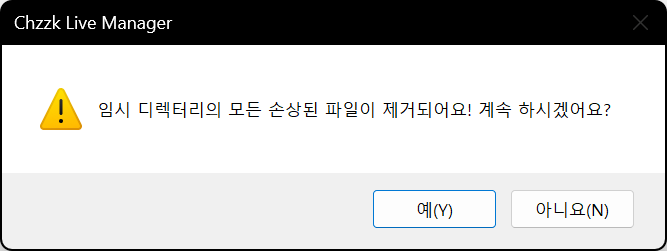
<p><i>(이 이미지는 최신 정보와 다를 수 있습니다.)</i></p>
</div>

## 다운로드 도구 설정 보기
Chzzk Live Downloader의 설정을 보려면, ☰ 아이콘을 누르고 `다운로드 도구` 항목에서 `설정 보기...` 항목을 선택합니다.

<div style='text-align: center'>
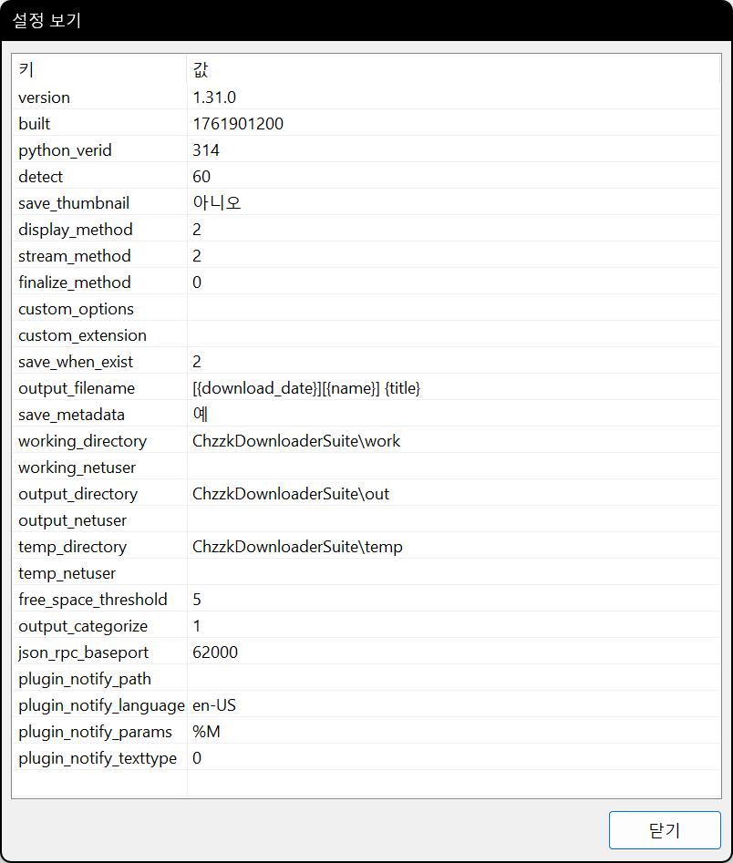
<p><i>(이 이미지는 최신 정보와 다를 수 있습니다.)</i></p>
</div>

## 최소화 시 트레이로 이동
`기능` 설정에서 `최소화 시 트레이로 이동` 항목을 활성화하면, Chzzk Live Manager가 최소화될 때 트레이로 이동합니다.

<div style='text-align: center'>

<p><i>(이 이미지는 최신 정보와 다를 수 있습니다.)</i></p>
</div>

트레이 아이콘을 두 번 누르면 창이 원래 상태로 복원되며, 트레이 아이콘을 마우스 오른쪽 버튼으로 누르면 다음 그림과 같은 메뉴가 열립니다.

<div style='text-align: center'>
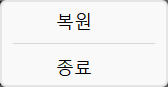
<p><i>(이 이미지는 최신 정보와 다를 수 있습니다.)</i></p>
</div>

### 최종 처리 단계 사용자 정의 설정
`최종 처리` 설정의 `사용자 정의 선택 사항`에 매개 변수를 지정하면, 최종 처리 시에 이 매개 변수가 `FFmpeg`에 전달됩니다. 예를 들어, 다음 설정은 `FFmpeg`을 사용하여 `HEVC` 코덱으로 인코딩하도록 설정합니다:

```powershell
-c:v libx265 -crf 25 -c:a aac -b:a 128k
```

참고로 사용자 지정 인코딩은 성능이 최적화되지 않아 권장되지 않습니다. 더 나은 결과를 위해 외부의 전용 인코더를 사용하는 것을 고려하세요.

## 기타 설정

### 시작

<div style='text-align: center'>
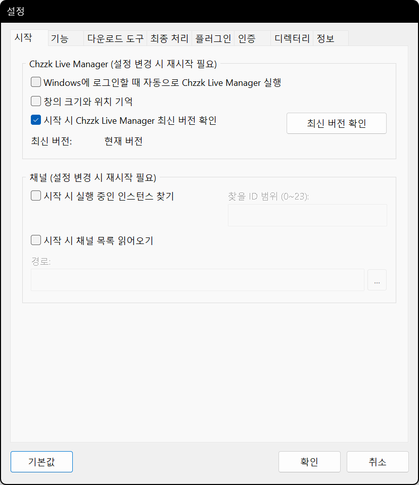
<p><i>(이 이미지는 최신 정보와 다를 수 있습니다.)</i></p>
</div>

* **Windows에 로그인할 때 자동으로 Chzzk Live Manager 실행** - Windows 시작 시 Chzzk Live Manager를 자동으로 실행합니다.
* **창의 크기와 위치 기억** - 종료 시점의 창의 크기와 위치를 기억하고, 다음 실행 시 이를 복원합니다.
* **시작 시 Chzzk Live Manager 최신 버전 확인** - Chzzk Live Manager를 시작할 때 최신 버전 확인 여부를 결정합니다. 또는 `최신 버전 확인` 버튼을 눌러 수동으로 최신 버전을 확인할 수도 있습니다.

### 기능

<div style='text-align: center'>
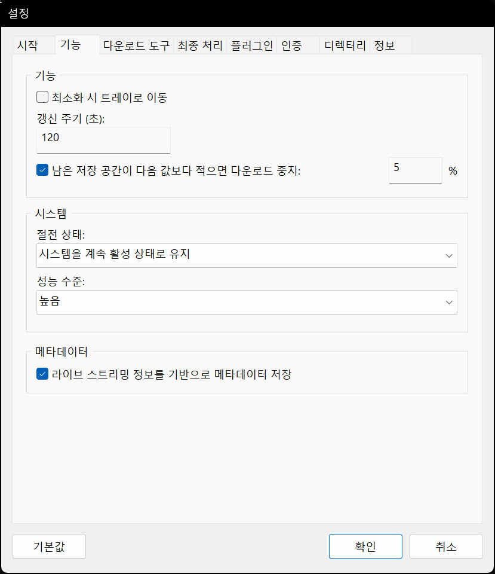
<p><i>(이 이미지는 최신 정보와 다를 수 있습니다.)</i></p>
</div>

* **갱신 주기 (초)** - 목록의 화면 갱신 주기를 설정합니다. 이는 화면에만 영향을 미치며, 다운로드 확인 주기와는 관계가 없습니다. Chzzk Live Downloader의 다운로드 확인 주기는 기본적으로 60초로 설정되어 있으며, 다른 도구와 달리 API의 호출 제한에 영향받지 않도록 설계되어 있습니다.
* **남은 저장 공간이 다음 값보다 적으면 다운로드 중지** - 디스크 공간 부족 시 중지 임계값(%)을 설정합니다.
* **절전 상태** - Chzzk Live Manager가 실행되는 동안 사용될 시스템의 절전 상태를 설정합니다.
* **성능 수준** - Chzzk Live Manager가 실행 중인 시스템의 성능을 지정합니다. 채널을 추가하거나 새로 고칠 때 시간 초과로 인한 오류가 발생한다면, 이 설정을 한 단계 아래로 낮추는 것을 고려해 볼 수 있습니다.
* **라이브 스트리밍 정보를 기반으로 메타데이터 저장** - 라이브 스트리밍 정보를 기반으로 메타데이터를 저장합니다.

### 다운로드 도구

<div style='text-align: center'>
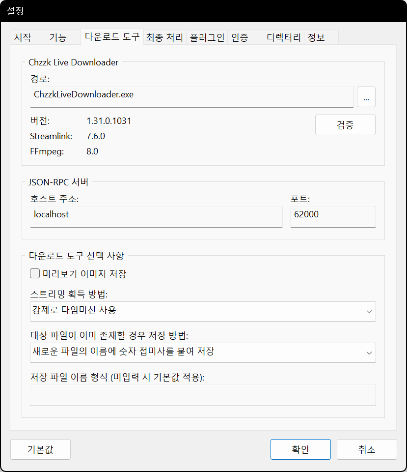
<p><i>(이 이미지는 최신 정보와 다를 수 있습니다.)</i></p>
</div>

* **JSON-RPC 서버: 호스트 주소** - JSON-RPC 서버의 호스트 주소를 설정합니다.
* **JSON-RPC 서버: 포트** - JSON-RPC 서버의 포트 번호를 설정합니다.
* **미리보기 이미지 저장** - 미리보기 이미지를 함께 저장합니다.
* **스트리밍 획득 방식** - 스트리밍 획득 방식을 설정합니다.
* **대상 파일이 이미 존재할 경우 저장 방법** - 파일이 이미 존재할 때 파일 저장 방법을 설정합니다.
* **저장 파일 이름 형식** - 저장 파일 이름 형식을 지정합니다. 형식 지정자에 대한 자세한 내용은 `chzzk_live_downloader_manual.ko-KR.pdf`를 참조하세요.

### 최종 처리

<div style='text-align: center'>
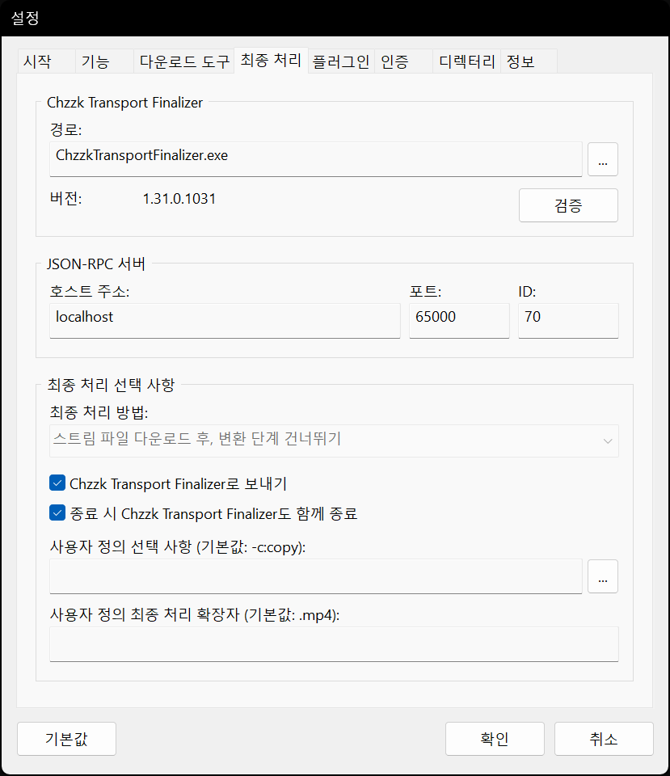
<p><i>(이 이미지는 최신 정보와 다를 수 있습니다.)</i></p>
</div>

* **JSON-RPC 서버: 호스트 주소** - JSON-RPC 서버의 호스트 주소를 설정합니다.
* **JSON-RPC 서버: 포트** - JSON-RPC 서버의 포트 번호를 설정합니다.
* **JSON-RPC 서버: ID** - JSON-RPC 서버의 ID를 설정합니다.
* **최종 처리 방법** - 최종 처리 방법을 설정합니다.
* **Chzzk Transport Finalizer로 보내기** - 최종 처리를 Chzzk Transport Finalizer에게 맡깁니다.
* **종료 시 Chzzk Transport Finalizer도 함께 종료** - 종료 시 Chzzk Transport Finalizer도 함께 종료할 것인지 설정합니다.
* **사용자 정의 선택 사항** - 최종 처리의 사용자 정의 선택 사항을 설정합니다. `...` 버튼을 클릭하여 사용자 정의 선택 사항 파일을 불러와서 지정할 수도 있습니다.
* **사용자 정의 최종 처리 확장자** - 확장자를 변경해야 할 경우에는 이곳에서 파일의 확장자를 지정할 수 있습니다.

### 플러그인

<div style='text-align: center'>

<p><i>(이 이미지는 최신 정보와 다를 수 있습니다.)</i></p>
</div>

* **알림: 경로** - 알림 플러그인의 경로를 설정합니다.
* **알림: 매개 변수** - 알림 플러그인의 매개 변수를 설정합니다.
* **알림: 텍스트 형식** - 알림 플러그인에 전달할 텍스트의 형식을 설정합니다.

### 인증

<div style='text-align: center'>

<p><i>(이 이미지는 최신 정보와 다를 수 있습니다.)</i></p>
</div>

* **인증 키 (NID_AUT)** - 네이버 ID에서 생성되는 인증 키를 설정합니다.
* **세션 키 (NID_SES)** - 네이버 ID에서 생성되는 세션 키를 설정합니다.
* **임시로 인증 정보 무시** - 임시로 인증 정보를 무시합니다.

치지직 인증 자격 증명 획득 방법에 대한 자세한 정보는 `how_to_get_chzzk_credential.ko-KR.pdf`를 참고하세요.

### 디렉터리

<div style='text-align: center'>

<p><i>(이 이미지는 최신 정보와 다를 수 있습니다.)</i></p>
</div>

* **작업 디렉터리** - Chzzk Live Downloader의 작업 설정 파일이 저장되는 디렉터리를 지정합니다.
* **저장 디렉터리** - 다운로드가 완료된 영상 파일이 저장되는 디렉터리를 지정합니다.
* **임시 디렉터리** - 임시로 생성되는 파일이 저장되는 디렉터리를 지정합니다.
* **분류 방법** - 다운로드가 완료된 영상 파일이 저장되는 디렉터리의 분류 방법을 설정합니다.

<div style='text-align: center'>
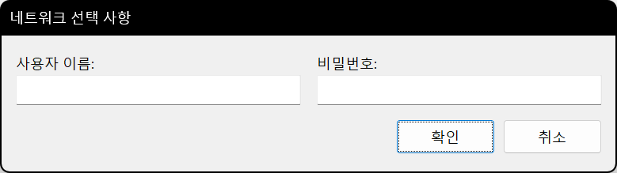
<p><i>(이 이미지는 최신 정보와 다를 수 있습니다.)</i></p>
</div>

`네트워크...` 버튼을 클릭해 네트워크 저장 공간의 접근에 필요한 정보를 입력할 수 있습니다.

### 정보

<div style='text-align: center'>
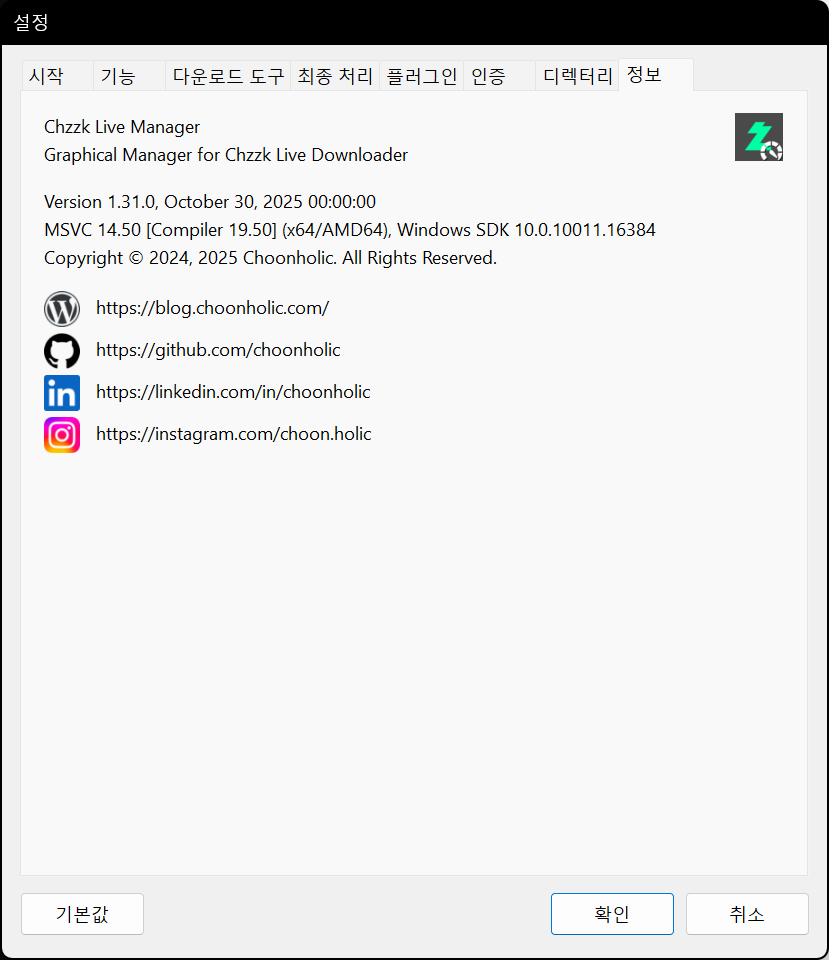
<p><i>(이 이미지는 최신 정보와 다를 수 있습니다.)</i></p>
</div>

* **버전 정보** - Chzzk Live Manager의 버전 정보를 표시합니다.
* **연락처** - 제작자의 연락처 링크입니다.

## 문의하기
치지직 다운로드 도구에 대해 궁금한 사항, 제보할 오류, 개선 요청 사항 등이 있을 때는 [GitHub](https://github.com/Choonholic/ChzzkDownloader/)의 [Issues](https://github.com/Choonholic/ChzzkDownloader/issues/new) 기능을 통해 제보해 주세요. 모든 언어에 대응 가능하나, 직접 대응 가능한 언어는 한국어, 영어, 일본어, 중국어이며, 다른 언어는 기계 번역을 통하기 때문에 100% 대응이 불가능할 수 있습니다.
