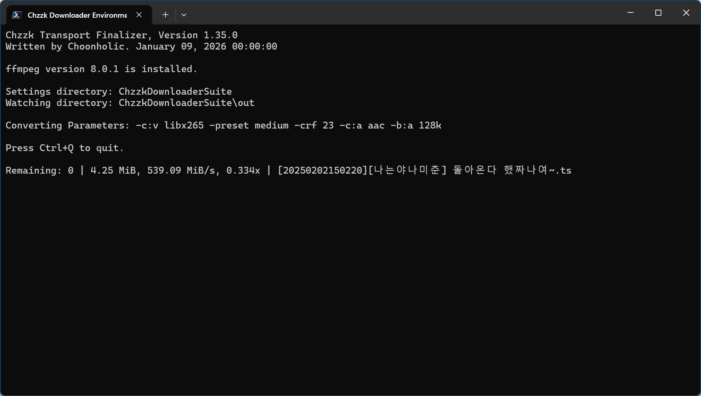

# Chzzk Transport Finalizer
치지직 라이브 스트리밍 최종 처리 도구

<div style='text-align: center'>

<p><i>(이 이미지는 최신 정보와 다를 수 있습니다.)</i></p>
</div>

## 버전
Version 1.36.0, January 15, 2026 00:00:00

## 선행 요건
* **[필수]** FFmpeg 공식 메이저 버전 (FFmpeg 7.0 또는 상위 버전 필요)

## 사용법
```
ChzzkTransportFinalizer
  [-h] [--version] [-d [DISPLAY]] [--work [WORK]]
  [--work-user [WORK_USER]] [--work-pass [WORK_PASS]] [--watch [WATCH]]
  [--watch-trav [WATCH_TRAV]] [--watch-user [WATCH_USER]]
  [--watch-pass [WATCH_PASS]] [--exclude [EXCLUDE]]
  [--exclude-trav [EXCLUDE_TRAV]] [--exclude-user [EXCLUDE_USER]]
  [--exclude-pass [EXCLUDE_PASS]] [--convert [CONVERT]] [--ext [EXT]]
  [--exist [EXIST]] [--threshold [THRESHOLD]] [--rpc]
  [--rpcexpose [RPCEXPOSE]] [--rpcport [RPCPORT]] [--rpcid [RPCID]]
  [--snapshot SNAPSHOT] [--metadata [METADATA]] [--startup [STARTUP]]
  [--pnpath [PNPATH]] [--pnlanguage [PNLANGUAGE]] [--pnparams [PNPARAMS]]
  [--pntexttype [PNTEXTTYPE]] [--settings [SETTINGS]] [--reset]
```

## 선택적 매개 변수
```
-h, --help                    도움말 페이지를 표시합니다
--version                     버전 정보를 표시합니다
-d, --display [DISPLAY]       표시 형식을 설정합니다 (quiet|simple|fluent|all)
--work [WORK]                 작업 디렉터리를 설정합니다
--work-user [WORK_USER]       작업 디렉터리가 네트워크 공간에 있을 떄 사용할 사용자 이름을 설정합니다
--work-pass [WORK_PASS]       작업 디렉터리가 네트워크 공간에 있을 떄 사용할 비밀번호를 설정합니다
--watch [WATCH]               감시 디렉터리를 설정합니다
--watch-trav [WATCH_TRAV]     감시 디렉터리의 탐색 방식을 설정합니다 (direct|recursive)
--watch-user [WATCH_USER]     감시 디렉터리가 네트워크 공간에 있을 떄 사용할 사용자 이름을 설정합니다
--watch-pass [WATCH_PASS]     감시 디렉터리가 네트워크 공간에 있을 떄 사용할 비밀번호를 설정합니다
--exclude [EXCLUDE]           감시에서 제외할 디렉터리를 설정합니다
--exclude-trav [EXCLUDE_TRAV] 제외 디렉터리의 탐색 방식을 설정합니다 (direct|recursive)
--exclude-user [EXCLUDE_USER] 제외 디렉터리가 네트워크 공간에 있을 떄 사용할 사용자 이름을 설정합니다
--exclude-pass [EXCLUDE_PASS] 제외 디렉터리가 네트워크 공간에 있을 떄 사용할 비밀번호를 설정합니다
--convert [CONVERT]           변환 매개 변수를 설정합니다
--ext [EXT]                   저장되는 파일의 확장자를 설정합니다
--exist [EXIST]               파일이 이미 존재할 때 파일 저장 방법을 설정합니다 (rename|skip|overwrite)
--threshold [THRESHOLD]       디스크 공간 부족 시 중지 임계값을 크기 또는 퍼센트(%)로 설정합니다 (비활성화: -, 기본값: 5%, 유효 범위: 디스크 총 용량의 1–50%)
--rpc                         JSON-RPC 서버를 활성화합니다
--rpcexpose [RPCEXPOSE]       JSON-RPC 서버 노출 방식을 설정합니다. (close|open)
--rpcport [RPCPORT]           JSON-RPC 서버 포트를 설정합니다 (기본값: 65000, 49152-65300)
--rpcid [RPCID]               JSON-RPC 서버 ID를 설정합니다 (기본값: 70)
--snapshot SNAPSHOT           상태 변경 시 스냅샷을 JSON 파일로 저장합니다
--metadata [METADATA]         메타데이터의 저장 여부를 설정합니다（save|skip）
--startup [STARTUP]           시작 방법을 설정합니다 (normal|fast)
--pnpath [PNPATH]             알림 플러그인의 경로를 설정합니다
--pnlanguage [PNLANGUAGE]     알림 플러그인이 사용할 언어를 설정합니다
--pnparams [PNPARAMS]         알림 플러그인의 매개 변수를 설정합니다
--pntexttype [PNTEXTTYPE]     알림 플러그인이 사용할 텍스트 형식을 설정합니다 (plain|markdown|html)
--settings [SETTINGS]         설정 저장 시 동작을 설정합니다 (default|update|show|skip|quit)
--reset                       모든 설정을 초기화합니다
```

## 사용 예시
```powershell
ChzzkTransportFinalizer --work work --watch out
```

## 설명
Chzzk Transport Finalizer는 Chzzk Live Downloader와 Chzzk Video Downloader가 직접 최종 처리를 진행하는 대신, 별도 프로세스에서 순차적으로 최종 처리를 진행하도록 설계된 도구입니다. Chzzk Transport Finalizer를 사용하면 라이브 스트림이 짧은 간격으로 방송되더라도 영향 없이 다운로드할 수 있도록 도와 줍니다.

## 작업 디렉터리 설정
올바르게 작동하는데 필요한 파일을 저장할 디렉터리를 지정하려면 다음 명령어를 사용하세요.

```powershell
ChzzkTransportFinalizer --work work
```

이 선택 사항을 기본값으로 되돌리려면 디렉터리 없이 `--work`만 사용하세요.

```powershell
ChzzkTransportFinalizer --work
```

## 감시 디렉터리 설정
Chzzk Transport Finalizer는 스트림 파일이 저장되는 디렉터리를 감시하다가, 파일이 새로 추가되면 자동으로 최종 변환을 진행합니다. 다음 명령어를 사용하면 감시 디렉터리를 지정할 수 있습니다.

```powershell
ChzzkTransportFinalizer --watch out
```

이 선택 사항을 기본값으로 되돌리려면 디렉터리 지정 없이 `--watch`만 사용하세요.

```powershell
ChzzkTransportFinalizer --watch
```

## 감시 디렉터리 탐색 방법 설정
Chzzk Transport Finalizer는 디렉터리를 감시할 때 기본적으로 지정한 디렉터리와 하위 디렉터리를 모두 탐색합니다. 만약 지정한 디렉터리만 감시하고 싶을 때는 다음 명령어를 사용하세요.

```powershell
ChzzkTransportFinalizer --watch out --watch-trav direct
```

이 선택 사항을 기본값으로 되돌리려면 디렉터리 지정 없이 `--watch-trav`만 사용하세요.

```powershell
ChzzkTransportFinalizer --watch out --watch-trav
```

## 감시 제외 디렉터리 설정
Chzzk Transport Finalizer는 선택 사항에 따라 감시 디렉터리 전부 또는 최상위 디렉터리를 감시합니다. 이 때 다음 명령어를 사용하면 감시 디렉터리의 하위 디렉터리나 다른 디렉터리가 감시되지 않도록 지정할 수 있습니다.

```powershell
ChzzkTransportFinalizer --watch out --exclude out\exc
```

감시 제외 디렉터리를 해제하려면 디렉터리 지정 없이 `--exclude`만 사용하세요.

```powershell
ChzzkTransportFinalizer --watch out --exclude
```

## 제외 디렉터리 탐색 방법 설정
Chzzk Transport Finalizer는 감시 제외 디렉터리가 지정되면 기본적으로 지정한 디렉터리만 탐색합니다. 만약 지정한 디렉터리의 하위 디렉터리도 모두 제외하고 싶을 때는 다음 명령어를 사용하세요.

```powershell
ChzzkTransportFinalizer --watch out --excluded out\exc --exclude-trav recursive
```

이 선택 사항을 기본값으로 되돌리려면 디렉터리 지정 없이 `--exclude-trav`만 사용하세요.

```powershell
ChzzkTransportFinalizer --watch out --excluded out\exc --exclude-trav
```

## 디렉터리 지정 방법
`--work`, `--watch`, `--exclude` 선택 사항에서 디렉터리를 지정할 때 다음과 같이 여러 가지 방법을 사용할 수 있습니다.

```powershell
ChzzkTransportFinalizer --work work
```

실행 파일이 있는 디렉터리의 하위 디렉터리인 `work`를 작업 디렉터리로 지정합니다. 해당 디렉터리가 존재하지 않으면 새로 생성됩니다.

```powershell
ChzzkTransportFinalizer --watch \Users\Username\Documents\chzzk
```

현재 드라이브의 `C:\Users\Username\Documents\chzzk`을 감시 디렉터리로 지정합니다. 해당 디렉터리가 존재하지 않으면 새로 생성됩니다.

```powershell
ChzzkTransportFinalizer --watch C:\Users\Username\Documents\chzzk
```

물론 위와 같이 직접 드라이브(예: `C:`)를 지정할 수도 있습니다.

```powershell
ChzzkTransportFinalizer --watch \\192.168.0.1\chzzk
```

UNC 경로 기반인 `\\192.168.0.1\chzzk\chzzk` 네트워크 저장 공간을 감시 디렉터리로 지정합니다. 해당 디렉터리가 존재하지 않으면 새로 생성됩니다.

네트워크 저장 공간에 파일을 저장할 때는 사용자 이름과 비밀번호를 입력해야 할 수 있습니다. 이 정보는 다음과 같이 지정할 수 있습니다.

```powershell
ChzzkTransportFinalizer --work-user username --work-pass password
ChzzkTransportFinalizer --watch-user username --watch-pass password
```

### 최종 처리 인코딩 매개 변수 설정
`--convert` 매개 변수를 사용하여 최종 처리에 사용할 인코딩 선택 사항을 지정할 수 있습니다. 인코딩 선택 사항 자체가 일종의 매개 변수 형태를 취하고 있기 때문에 오류를 방지하기 위해 다음과 같이 `=` 연산자와 `"` 따옴표로 인코딩 선택 사항을 묶어 주어야 합니다. 예를 들어, 다음 설정은 `HEVC` 코덱으로 인코딩하도록 설정합니다:

```powershell
ChzzkTransportFinalizer --convert="-c:v libx265 -crf 25 -c:a aac -b:a 128k"
```

설정 내용을 사용자 정의 선택 사항 파일로 저장해 두었다가 실행 시에 해당 내용을 읽어 처리할 수도 있습니다.

```text
-c:v libx265 -crf 25 -c:a aac -b:a 128k
```

만약 `hevc_sw_128k.set` 파일의 내용이 위와 같다면, 다음과 같이 파일 이름을 지정할 수 있습니다.

```powershell
ChzzkTransportFinalizer --convert=hevc_sw_128k.set
```

이 선택 사항을 기본값으로 되돌리려면 다음과 같이 `--convert`만 사용하세요.

```powershell
ChzzkTransportFinalizer --convert
```

또한 인코딩 매개 변수에 따라 확장자를 변경해야 할 경우에는 `--ext` 매개 변수를 사용하여 지정할 수 있습니다.

```powershell
ChzzkTransportFinalizer --convert=av1_nvenc_128k.set --ext=.av1
```

## 메타데이터 저장
스트림 정보를 기반으로 메타데이터를 저장하려면 다음 명령어를 사용하세요. Chzzk Transport Finalizer는 Chzzk Live Downloader 또는 Chzzk Video Downloader에서 스트림 파일과 함께 JSON 형식의 파일로 내보낸 스트림 정보를 사용하며, 이 파일이 생성되지 않았거나 삭제되었을 경우 메타데이터를 저장하지 않습니다.

```powershell
ChzzkTransportFinalizer --metadata save
```

메타데이터를 저장하지 않으려면 다음 명령어를 사용하세요.

```powershell
ChzzkTransportFinalizer --metadata skip
```

## 표시 형식 설정
기본적으로 상세 정보가 표시됩니다. 하지만 정보가 필요하지 않은 경우, 다음 명령어를 사용하여 표시하지 않을 수 있습니다.

```powershell
ChzzkTransportFinalizer -d quiet
ChzzkTransportFinalizer --display quiet
```

`--display` 매개 변수의 선택 사항을 사용하여 다음과 같이 표시 형식을 설정할 수 있습니다.

* `quiet` - 정보 표시를 하지 않습니다.
* `simple` - 간단 정보만 표시합니다.
* `fluent` - 상세 정보를 표시합니다.
* `all` - 모든 정보를 표시합니다.

이 선택 사항을 기본값으로 되돌리려면 형식 없이 `-d` 또는 `--display`만 사용하세요.

```powershell
ChzzkTransportFinalizer -d
ChzzkTransportFinalizer --display
```

## 파일이 이미 존재할 때 파일 저장 방법 설정
기본적으로 저장하려는 파일과 동일한 이름의 파일이 이미 존재할 때, 파일 이름 뒤에 `(n)`을 붙여 저장합니다. 하지만 다음 명령어를 사용하여 파일을 덮어쓰거나 최종 처리 자체를 건너뛰도록 지정할 수 있습니다.

```powershell
ChzzkTransportFinalizer --exist overwrite
ChzzkTransportFinalizer --exist skip
```

이 선택 사항을 기본값으로 되돌리려면 설정 없이 `--exist`만 사용하세요.

```powershell
ChzzkTransportFinalizer --exist
```

## 여유 저장 공간이 임계점 이하로 낮아질 때 최종 변환 중지 설정
기본적으로, 저장 디렉터리와 임시 디렉터리의 여유 공간이 5% 이하로 낮아질 때 최종 변환을 중지합니다. 여유 저장 공간의 임계값을 다르게 설정하려면 다음 명령어를 사용하세요. 임계값은 실제 크기 또는 % 단위로 지정할 수 있으며, 범위는 디스크 전체 용량의 1~50%의 범위 내애서 지정할 수 있습니다.

```powershell
ChzzkTransportFinalizer --threshold 20%
ChzzkTransportFinalizer --threshold 1GB
ChzzkTransportFinalizer --threshold 100M
ChzzkTransportFinalizer --threshold 800MiB
```

실제 크기로 임계점을 지정할 때는 SI 단위(KB, MB, GB...), IEC 단위(KiB, MiB, GiB...)를 사용할 수 있으며, 접두사(K, Ki, M, Mi, G, Gi...)만 사용할 수도 있습니다. 물론 단위 없이 바이트 단위로 지정할 수도 있습니다.

여유 저장 공간에 따른 최종 처리 중지 기능을 비활성화하려면 다음 명령어를 사용하세요.

```powershell
ChzzkTransportFinalizer --threshold -
```

이 선택 사항을 기본값으로 되돌리려면 설정 없이 `--threshold`만 사용하세요.

```powershell
ChzzkTransportFinalizer --threshold
```

## 설정 저장 시 동작 설정
모든 선택 사항은 기본적으로 설정 파일에 자동으로 저장됩니다.

하지만 `--settings` 매개 변수 뒤에 다음과 같이 선택 사항을 지정하면 설정 저장 여부를 지정하거나 설정 내용을 확인할 수 있습니다.

```powershell
ChzzkTransportFinalizer --settings skip
```

* `default` - 선택 사항을 설정 파일에 저장한 후 최종 변환을 실행합니다.
* `skip` - 선택 사항을 설정 파일에 저장하는 대신 현재 세션에만 적용한 후 최종 변환을 실행합니다.
* `update` - 선택 사항을 설정 파일에 저장한 후 변경된 설정 내용을 표시하고 종료합니다.
* `show` - 선택 사항을 모두 무시하고 기존 설정 내용을 표시하고 종료합니다.
* `quit` - 선택 사항을 설정 파일에 저장한 후 종료합니다.

## 설정 저장 시 동작 설정
모든 선택 사항은 기본적으로 항상 설정 파일에 저장됩니다. 현재 세션에만 설정을 적용하고 저장하지 않으려면 다음 명령어를 사용하세요.

```powershell
ChzzkTransportFinalizer --settings skip
```

다운로드 없이 설정만 저장하고 종료하려면 다음 명령어를 사용하세요.

```powershell
ChzzkTransportFinalizer --settings quit
```

## 플러그인 기능
Chzzk Transport Finalizer는 플러그인을 통해 사용자의 개인 성향과 환경에 맞춘 부가 기능을 제공합니다.

### 알림 플러그인
알림 플러그인을 등록하면 Chzzk Transport Finalizer의 동작 상태를 외부 솔루션을 통해 쉽게 확인할 수 있습니다. 기본적으로 제공하는 알림 플러그인은 다음과 같습니다.

* `pn_slack` - Slack 알림 플러그인
* `pn_telegram` - Telegram 알림 플러그인

다음과 같이 `--pnpath` 매개 변수를 사용하면 알림 플러그인을 등록할 수 있습니다. 알림 플러그인은 한 번에 하나만 활성화되기 때문에 여러 번 등록할 경우, 가장 마지막에 등록된 플러그인만 활성화됩니다. 플러그인이 한 번 등록되면 이후 실행되는 모든 Chzzk Transport Finalizer에 모두 적용됩니다.

```powershell
ChzzkTransportFinalizer --pnpath=pn_...
```

이 때, 다음과 같이 `--pnlanguage` 매개 변수를 이용하여 알림 메시지의 언어를 지정할 수 있습니다.

```powershell
ChzzkTransportFinalizer --pnpath=pn_... --pnlanguage=ko-KR
```

만약 알림 플러그인이 마크다운 형식이나 HTML 형식을 지원한다면 다음과 같이 `--pntexttype` 매개 변수를 이용하여 텍스트 형식을 지정할 수 있습니다.

```powershell
ChzzkTransportFinalizer --pnpath=pn_... --pntexttype=html
```

알림 플러그인에는 사용자 플러그인도 지정할 수 있으며, 이 때 별도로 플러그인에 전달해야 하는 매개 변수가 있다면 `--pnparams` 매개 변수를 이용해 지정할 수 있습니다. 이 때 메시지가 들어갈 위치에는 반드시 `%M`을 지정해야 합니다.

```powershell
ChzzkTransportFinalizer --pnpath=userpn_... --pnparams="--user --message %M"
```

알림 플러그인의 등록을 해제하려면 플러그인 지정 없이 `--pnpath`만 사용하세요.

```powershell
ChzzkTransportFinalizer --pnpath
```

## 모든 설정 초기화
사용 시간이 길어질수록 설정이 꼬일 수 있습니다. 모든 설정을 초기화하려면 다음 명령어를 사용하세요.

```powershell
ChzzkTransportFinalizer --reset
```

다음 정보가 초기화됩니다.

* 세부 처리 정보 표시 설정
* 감시할 디렉터리 설정
* 변환 매개 변수 설정

## 버전 정보 표시
다음 명령어를 사용하여 버전 정보를 확인할 수 있습니다.

```powershell
ChzzkTransportFinalizer --version
```

## 도움말 확인
간단한 매개 변수 도움말을 확인하려면 다음 명령어를 사용하세요.

```powershell
ChzzkTransportFinalizer -h
ChzzkTransportFinalizer --help
```

## 매개 변수 우선 순위
`--reset`, `-h`, `--version`을 제외한 매개 변수는 아래 예시와 같이 순서에 상관없이 사용할 수 있습니다. 단, 동일한 매개 변수를 중복으로 지정할 수는 없습니다.

```powershell
ChzzkTransportFinalizer -d quiet --watch out
```

`-h`와 `--version` 매개 변수는 첫 번째로 사용된 것만 처리되고 즉시 종료됩니다. 따라서 아래 명령어는 버전 정보만 출력됩니다.

```powershell
ChzzkTransportFinalizer --version -h
```

`--reset` 매개 변수는 설정을 초기화하고 이전에 설정된 값을 무시한 후 종료됩니다. 따라서 다음 명령어에서 `--watch` 매개 변수는 무시됩니다.

```powershell
ChzzkTransportFinalizer --watch out --reset
```

## JSON-RPC를 사용한 외부 제어
자세한 정보는 `how_to_control_chzzk_transport_finalizer.ko-KR.pdf` 파일을 참조하세요.

## 문의하기
치지직 다운로드 도구에 대해 궁금한 사항, 제보할 오류, 개선 요청 사항 등이 있을 때는 [GitHub](https://github.com/Choonholic/ChzzkDownloader/)의 [Issues](https://github.com/Choonholic/ChzzkDownloader/issues/new) 기능을 통해 제보해 주세요. 모든 언어에 대응 가능하나, 직접 대응 가능한 언어는 한국어, 영어, 일본어, 중국어이며, 다른 언어는 기계 번역을 통하기 때문에 100% 대응이 불가능할 수 있습니다.
