# Chzzk Video Manager
그래픽 사용자 인터페이스 기반의 Chzzk Video Downloader 관리자

<div style='text-align: center'>

<p><i>(이 이미지는 최신 정보와 다를 수 있습니다.)</i></p>
</div>

## 버전
Version 1.13.0, February 10, 2025 00:00:00

## 선행 요건
Chzzk Video Manager는 Chzzk Video Downloader의 그래픽 사용자 인터페이스 프론트엔드 애플리케이션으로서, 반드시 Chzzk Video Downloader와 Chzzk Transport Finalizer가 함께 설치되어 있어야 합니다.

Chzzk Video Manager, Chzzk Video Downloader, Chzzk Transport Finalizer가 모두 같은 디렉터리에 있으면 실행 시 자동으로 인식히며, 그렇지 않으면 **선행 요건 확인** 항목의 내용을 따라 Chzzk Video Downloader와 Chzzk Transport Finalizer의 위치를 지정해 주어야 합니다.

무설치 버전의 파일을 사용할 경우, 편의를 위해 Chzzk Video Manager, Chzzk Video Downloader, Chzzk Transport Finalizer를 모두 같은 디렉터리에 저장하시는 것을 권장합니다. `설치 프로그램`을 사용하면 자동으로 자동으로 같은 디렉터리에 설치됩니다.

## 실행
시작 메뉴에서 `Chzzk Video Manager`를 실행하거나, `Chzzk Downloader Environment`에서 `ChzzkVideoManager.exe`를 실행합니다.

## 선행 요건 확인
Chzzk Video Manager의 모든 기능을 활용하려면, Chzzk Video Downloader와 Chzzk Transport Finalizer가 올바르게 설정되어 있어야 하며, Chzzk Video Downloader를 실행하려면 Streamlink(버전 6.8.0 이상)와 FFmpeg(버전 7.0 이상)이 올바르게 설정되어 있어야 합니다. Chzzk Video Manager가 처음 실행될 때 이와 같은 선행 요건을 모두 확인하는 과정을 거치며, 이를 만족하지 못할 경우 다음 그림과 같은 대화 상자가 표시됩니다.

<div style='text-align: center'>
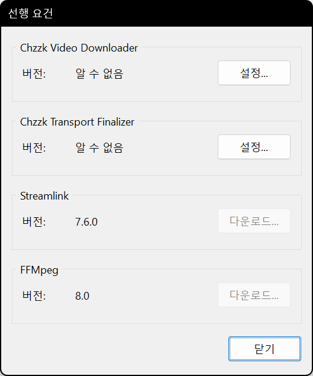
<p><i>(이 이미지는 최신 정보와 다를 수 있습니다.)</i></p>
</div>

`설정...` 버튼을 누르면 Chzzk Video Downloader와 Chzzk Transport Finalizer의 위치를 지정할 수 있으며, `다운로드` 버튼을 눌러 Streamlink와 FFmpeg을 설치할 수 있습니다.

<div style='text-align: center'>
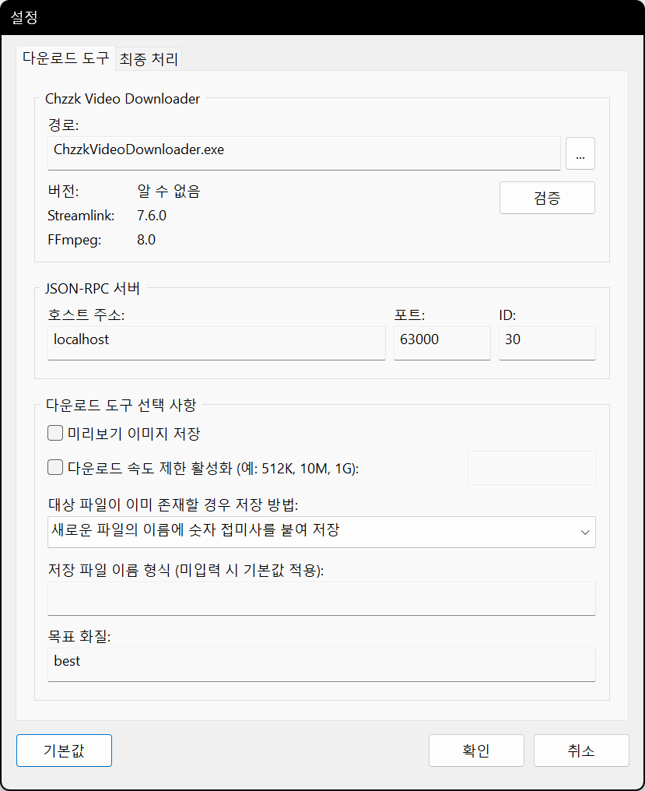
<p><i>(이 이미지는 최신 정보와 다를 수 있습니다.)</i></p>
</div>

`...` 버튼을 눌러 올바른 위치에서 `ChzzkVideoDownloader.exe` 파일을 찾아 선택합니다. 올바른 Chzzk Video Downloader가 지정되면, 다음 그림과 같이 인식된 버전 정보가 표시됩니다.

<div style='text-align: center'>
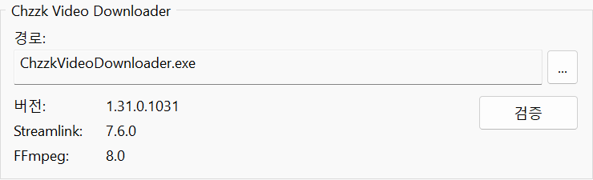
<p><i>(이 이미지는 최신 정보와 다를 수 있습니다.)</i></p>
</div>

<div style='text-align: center'>
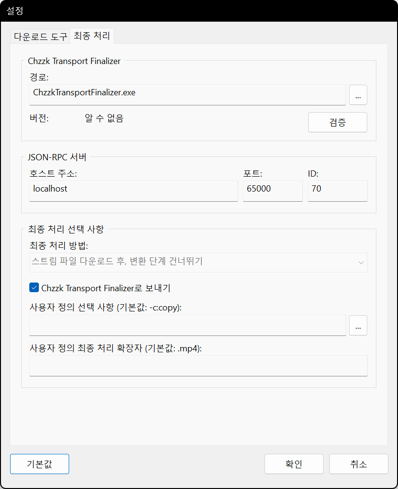
<p><i>(이 이미지는 최신 정보와 다를 수 있습니다.)</i></p>
</div>

마찬가지로 `...` 버튼을 눌러 올바른 위치에서 `ChzzkTransportFinalizer.exe` 파일을 찾아 선택합니다. 올바른 Chzzk Transport Finalizer가 지정되면, 다음 그림과 같이 인식된 버전 정보가 표시됩니다.

<div style='text-align: center'>

<p><i>(이 이미지는 최신 정보와 다를 수 있습니다.)</i></p>
</div>

## 주 메뉴
창의 왼쪽 위에 있는 ☰ 아이콘을 누르면 주 메뉴가 열립니다.

<div style='text-align: center'>

<p><i>(이 이미지는 최신 정보와 다를 수 있습니다.)</i></p>
</div>

## 비디오 추가
다운로드할 비디오를 추가하려면 ☰ 아이콘을 누르고 `비디오 추가` 항목을 선택하면 비디오 추가 대화 상자가 열립니다. 추가할 비디오 번호 또는 비디오 URL을 입력하고 `확인` 버튼을 누릅니다.

<div style='text-align: center'>

<p><i>(이 이미지는 최신 정보와 다를 수 있습니다.)</i></p>
</div>

### 비디오 번호 또는 URL
다음과 같은 두 가지 정보 중 하나를 입력하면 자동으로 비디오 번호를 인식합니다.

* 비디오 URL - `https://chzzk.naver.com/video/Number`
* 비디오 번호 - `Number`

## 비디오 삭제
비디오를 삭제하려면, 목록에서 삭제할 비디오를 선택한 다음 ☰ 아이콘을 누르고 `비디오 삭제` 항목을 선택합니다. 비디오 삭제 여부를 확인하는 대화 상자에서 `OK` 버튼을 누르면 비디오가 삭제됩니다.

<div style='text-align: center'>
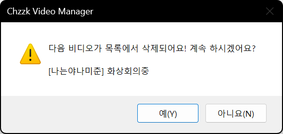
<p><i>(이 이미지는 최신 정보와 다를 수 있습니다.)</i></p>
</div>

## 다운로드 시작
다운로드를 시작하려면, ☰ 아이콘을 누르고 `다운로드 시작` 항목을 선택합니다.

## 다운로드 중지
다운로드를 중지하려면, ☰ 아이콘을 누르고 `다운로드 중지` 항목을 선택합니다.

<div style='text-align: center'>

<p><i>(이 이미지는 최신 정보와 다를 수 있습니다.)</i></p>
</div>

현재 다운로드 중인 비디오를 포함한 아직 다운로드되지 않은 비디오의 다운로드 작업이 모두 중지됩니다.

## 비디오 등록 정보 확인
비디오의 등록 정보를 확인하려면, 목록에서 등록 정보를 확인할 비디오를 선택한 다음 ☰ 아이콘을 누르고 `등록 정보...` 항목을 선택합니다.

<div style='text-align: center'>

<p><i>(이 이미지는 최신 정보와 다를 수 있습니다.)</i></p>
</div>

## 상황에 따른 메뉴
목록에서 비디오를 선택한 후 마우스 오른쪽 버튼을 누르면 해당 비디오의 상황에 따른 메뉴가 열립니다.

<div style='text-align: center'>

<p><i>(이 이미지는 최신 정보와 다를 수 있습니다.)</i></p>
</div>

## 비디오 목록 저장
비디오 목록은 목록 파일로 저장했다가 다음에 필요할 때 불러올 수 있습니다.

목록에 비디오가 하나 이상 존재하는 상태에서 ☰ 아이콘을 누르고 `비디오 목록 저장...` 항목을 선택하면, 파일을 저장할 디렉터리와 이름을 변경할 수 있는 대화 상자가 열립니다.

## 비디오 목록 불러오기
매번 비디오를 추가하는 대신 저장했던 비디오 목록을 불러와서 추가할 수 있습니다.

☰ 아이콘을 누르고 `비디오 목록 불러오기...` 항목을 선택하면, 비디오 목록 파일을 선택할 수 있는 대화 상자가 열립니다.

불러 온 목록에 있는 비디오가 아미 현재 목록에 있더라도 자동으로 인식되어 처리됩니다.

## 목록 갱신
목록을 즉시 갱신하려면, ☰ 아이콘을 누르고, `새로 고치기` 항목을 선택합니다.

## 도구 환경 열기
도구 환경을 열려면, ☰ 아이콘을 누르고 `다운로드 도구` 항목에서 `도구 환경 (Command Prompt)` 또는 `도구 환경 (PowerShell)` 항목을 선택합니다.

## 저장 디렉터리 열기
다운로드한 비디오가 저장된 디렉터리를 열려면, ☰ 아이콘을 누르고 `다운로드 도구` 항목에서 `저장 디렉터리 열기` 항목을 선택합니다.

## 다운로드 도구 설정 보기
Chzzk Video Downloader의 설정을 보려면, ☰ 아이콘을 누르고 `다운로드 도구` 항목에서 `설정 보기...` 항목을 선택합니다.

<div style='text-align: center'>

<p><i>(이 이미지는 최신 정보와 다를 수 있습니다.)</i></p>
</div>

## 최소화 시 트레이로 이동
`기능` 설정에서 `최소화 시 트레이로 이동` 항목을 활성화하면, Chzzk Video Manager가 최소화될 때 트레이로 이동합니다.

<div style='text-align: center'>

<p><i>(이 이미지는 최신 정보와 다를 수 있습니다.)</i></p>
</div>

트레이 아이콘을 두 번 누르면 창이 원래 상태로 복원되며, 트레이 아이콘을 마우스 오른쪽 버튼으로 누르면 다음 그림과 같은 메뉴가 열립니다.

<div style='text-align: center'>

<p><i>(이 이미지는 최신 정보와 다를 수 있습니다.)</i></p>
</div>

### 최종 처리 단계 사용자 정의 설정
다운로드 하는 파일의 VOD 형식이 `UPLOAD`일 경우, `최종 처리` 설정의 `사용자 정의 선택 사항`에 매개 변수를 지정하면, 최종 처리 시에 이 매개 변수가 `FFmpeg`에 전달됩니다. 예를 들어, 다음 설정은 `FFmpeg`을 사용하여 `H.265` 코덱으로 인코딩하도록 설정합니다:

```powershell
-c:v libx265 -preset medium -crf 23 -c:a aac -b:a 128k
```

참고로 사용자 지정 인코딩은 성능이 최적화되지 않아 권장되지 않습니다. 더 나은 결과를 위해 외부의 전용 인코더를 사용하는 것을 고려하세요.

## 기타 설정

### 시작

<div style='text-align: center'>
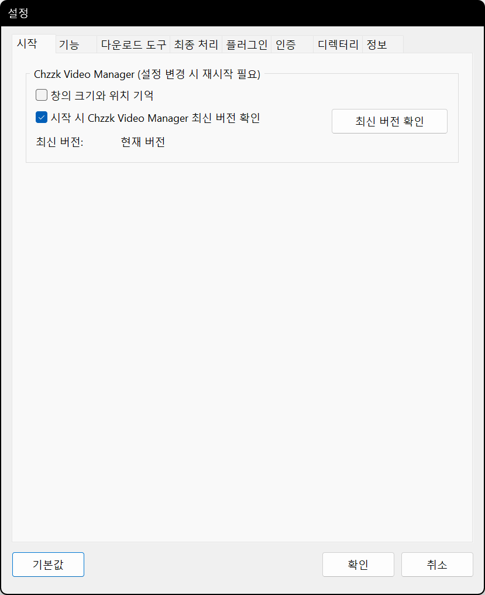
<p><i>(이 이미지는 최신 정보와 다를 수 있습니다.)</i></p>
</div>

* **시작 시 창의 크기와 위치 기억** - 종료 시점의 창의 크기와 위치를 기억하고, 다음 실행 시 이를 복원합니다.
* **시작 시 Chzzk Video Manager 최신 버전 확인** - Chzzk Video Manager를 시작할 때 최신 버전 확인 여부를 결정합니다. 또는 `최신 버전 확인` 버튼을 눌러 수동으로 최신 버전을 확인할 수도 있습니다.

### 기능

<div style='text-align: center'>
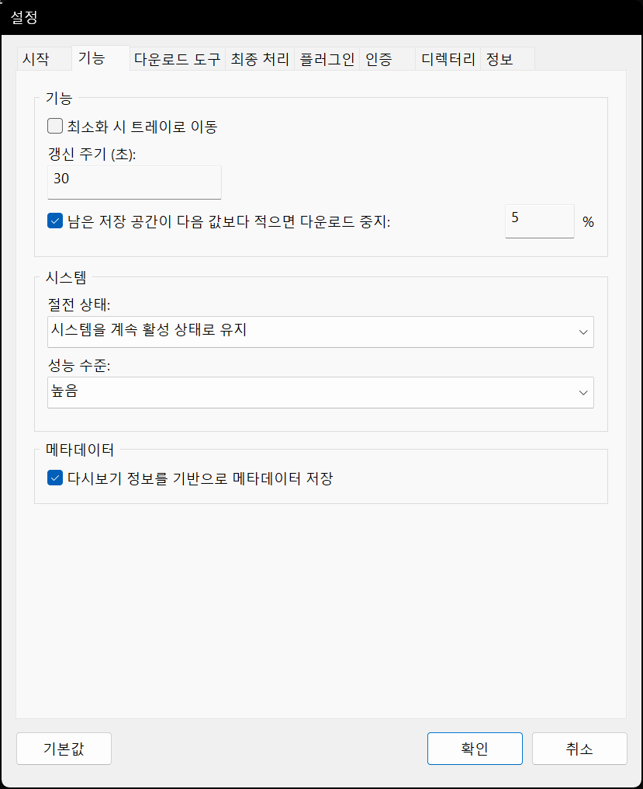
<p><i>(이 이미지는 최신 정보와 다를 수 있습니다.)</i></p>
</div>

* **갱신 주기 (초)** - 목록의 화면 갱신 주기를 설정합니다.
* **남은 저장 공간이 다음 값보다 적으면 다운로드 중지** - 디스크 공간 부족 시 중지 임계값(%)을 설정합니다.
* **절전 상태** - Chzzk Video Manager가 실행되는 동안 사용될 시스템의 절전 상태를 설정합니다.
* **성능 수준** - Chzzk Video Manager가 실행 중인 시스템의 성능을 지정합니다. 비디오를 다운로드할 때 시간 초과로 인한 오류가 발생한다면, 이 설정을 한 단계 아래로 낮추는 것을 고려해 볼 수 있습니다.

### 다운로드 도구

<div style='text-align: center'>

<p><i>(이 이미지는 최신 정보와 다를 수 있습니다.)</i></p>
</div>

* **JSON-RPC 서버: 호스트 주소** - JSON-RPC 서버의 호스트 주소를 설정합니다.
* **JSON-RPC 서버: 포트** - JSON-RPC 서버의 포트 번호를 설정합니다.
* **JSON-RPC 서버: ID** - JSON-RPC 서버의 ID를 설정합니다.
* **미리보기 이미지 저장** - 미리보기 이미지를 함께 저장합니다.
* **다운로드 속도 제한 활성화** – 네트워크 대역폭을 제어하기 위해 다운로드 속도를 제한합니다. (예: 500K, 10M, 1G)
* **대상 파일이 이미 존재할 경우 저장 방법** - 파일이 이미 존재할 때 파일 저장 방법을 설정합니다.
* **저장 파일 이름 형식** - 저장 파일 이름 형식을 지정합니다. 형식 지정자에 대한 자세한 내용은 `chzzk_video_downloader_manual.ko-KR.pdf`를 참조하세요.
* **목표 화질** - 다운로드 시 목표 화질을 설정합니다.

### 최종 처리

<div style='text-align: center'>
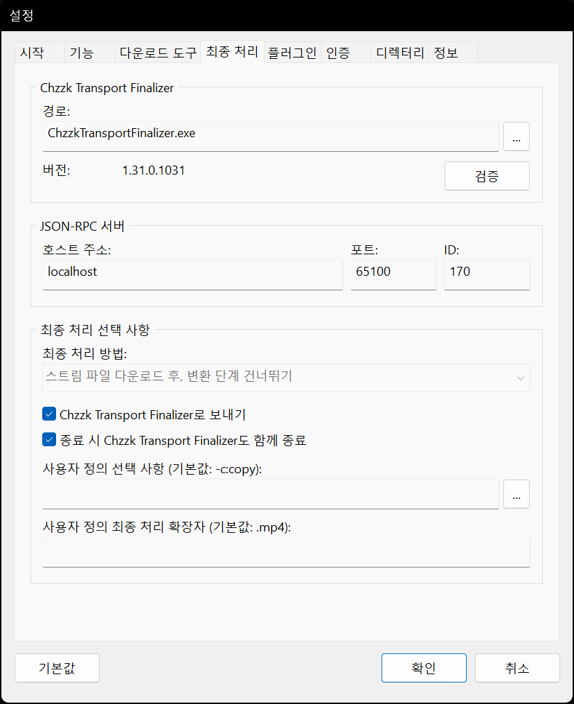
<p><i>(이 이미지는 최신 정보와 다를 수 있습니다.)</i></p>
</div>

* **JSON-RPC 서버: 호스트 주소** - JSON-RPC 서버의 호스트 주소를 설정합니다.
* **JSON-RPC 서버: 포트** - JSON-RPC 서버의 포트 번호를 설정합니다.
* **JSON-RPC 서버: ID** - JSON-RPC 서버의 ID를 설정합니다.
* **최종 처리 방법** - 최종 처리 방법을 설정합니다.
* **Chzzk Transport Finalizer로 보내기** - 최종 처리를 Chzzk Transport Finalizer에게 맡깁니다.
* **사용자 정의 선택 사항** - 최종 처리의 사용자 정의 선택 사항을 설정합니다.

### 인증

<div style='text-align: center'>
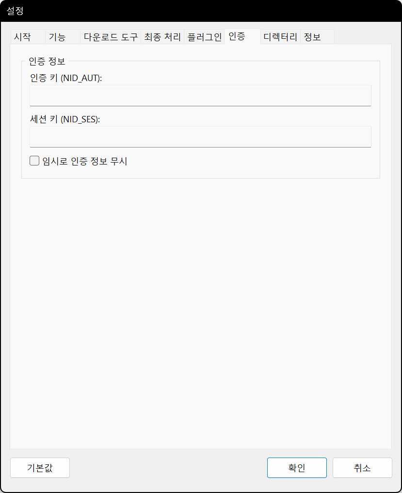
<p><i>(이 이미지는 최신 정보와 다를 수 있습니다.)</i></p>
</div>

* **인증 키 (NID_AUT)** - 네이버 ID에서 생성되는 인증 키를 설정합니다.
* **세션 키 (NID_SES)** - 네이버 ID에서 생성되는 세션 키를 설정합니다.
* **임시로 인증 정보 무시** - 임시로 인증 정보를 무시합니다.

치지직 인증 자격 증명 획득 방법에 대한 자세한 정보는 `how_to_get_chzzk_credential.ko-KR.pdf`를 참고하세요.

### 디렉터리

<div style='text-align: center'>
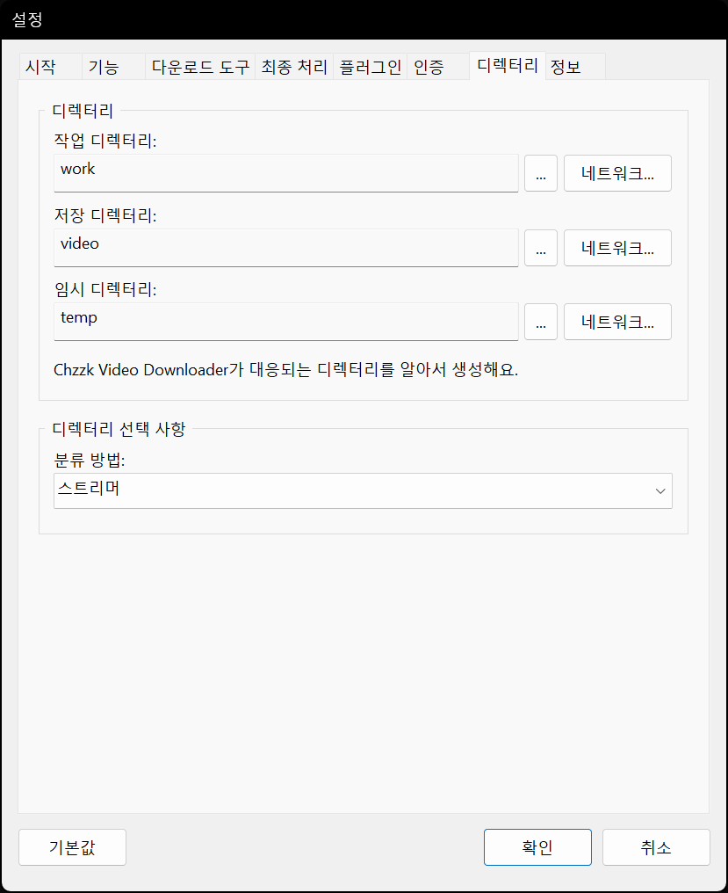
<p><i>(이 이미지는 최신 정보와 다를 수 있습니다.)</i></p>
</div>

* **작업 디렉터리** - Chzzk Video Downloader의 작업 설정 파일이 저장되는 디렉터리를 지정합니다.
* **저장 디렉터리** - 다운로드가 완료된 영상 파일이 저장되는 디렉터리를 지정합니다.
* **임시 디렉터리** - 임시로 생성되는 파일이 저장되는 디렉터리를 지정합니다.
* **분류 방법** - 다운로드가 완료된 영상 파일이 저장되는 디렉터리의 분류 방법을 설정합니다.

<div style='text-align: center'>

<p><i>(이 이미지는 최신 정보와 다를 수 있습니다.)</i></p>
</div>

`네트워크...` 버튼을 클릭해 네트워크 저장 공간의 접근에 필요한 정보를 입력할 수 있습니다.

### 정보

<div style='text-align: center'>
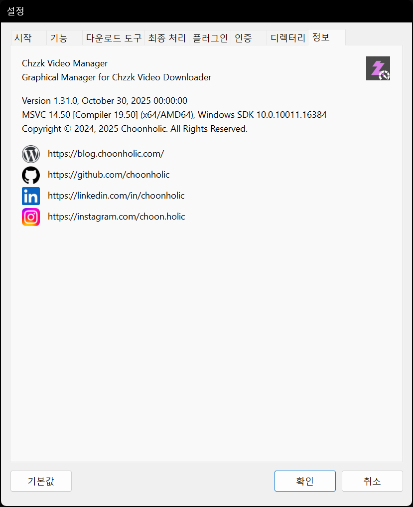
<p><i>(이 이미지는 최신 정보와 다를 수 있습니다.)</i></p>
</div>

* **버전 정보** - Chzzk Video Manager의 버전 정보를 표시합니다.
* **연락처** - 제작자의 연락처 링크입니다.

## 문의하기
치지직 다운로드 도구에 대해 궁금한 사항, 제보할 오류, 개선 요청 사항 등이 있을 때는 [GitHub](https://github.com/Choonholic/ChzzkDownloader/)의 [Issues](https://github.com/Choonholic/ChzzkDownloader/issues/new) 기능을 통해 제보해 주세요. 모든 언어에 대응 가능하나, 직접 대응 가능한 언어는 한국어, 영어, 일본어, 중국어이며, 다른 언어는 기계 번역을 통하기 때문에 100% 대응이 불가능할 수 있습니다.
