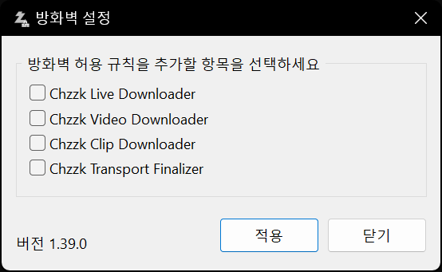

# Windows Defender 방화벽 설정

Chzzk Downloader Suite를 설치된 PC 외부의 다른 장치(예: 스마트폰, 외부 네트워크)에서 제어하려면 **Windows Defender 방화벽**의 설정을 변경해야 합니다.

## 시스템 UI를 통한 방화벽 설정
기본적으로 각 다운로드 도구가 처음 외부 연결을 시도할 때 아래와 같은 **Windows 방화벽 설정 대화 상자**가 표시됩니다. 이 대화 상자를 통해 외부 연결 허용 여부를 설정할 수 있습니다.

<i>(이 이미지는 운영 체제 또는 시스템 환경에 따라 다를 수 있습니다.)</i>

다만 이미 방화벽에서 차단된 상태로 설정되어 있는 경우 해당 대화 상자가 표시되지 않아 다운로드 도구를 정상적으로 실행하지 못할 수 있습니다.

## 방화벽 설정 앱 사용하기
이 경우 Chzzk Downloader Suite에서 제공하는 **방화벽 설정** 앱을 사용할 수 있습니다.

<i>(이 이미지는 최신 정보와 다를 수 있습니다.)</i>

이 앱을 통해 다음과 같은 작업을 할 수 있습니다.

- 현재 방화벽 설정 상태 확인
- 외부 원격 접속을 한 번에 허용 또는 차단
